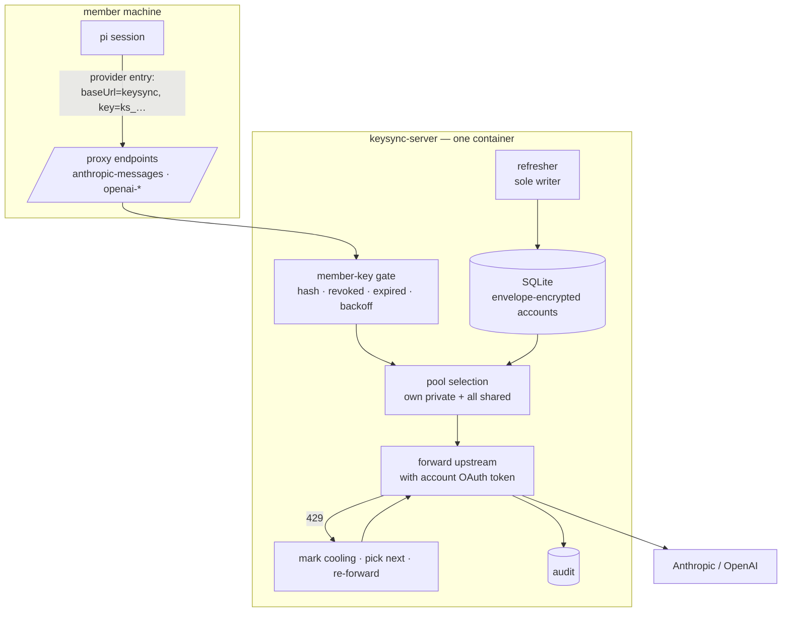
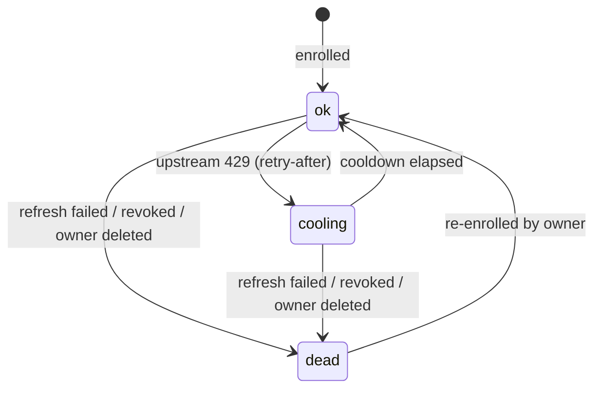

# Design — keysync

## Architecture



The member's machine holds one secret: a keysync key. Provider OAuth tokens exist only inside the container and in its database.

## Source facts this design rests on

| # | Fact | Source |
|---|---|---|
| F1 | pi can route a provider through an arbitrary `baseUrl` with an `api` type of `anthropic-messages` / `openai-completions` / `openai-responses`, plus custom headers | `docs/models.md` — Provider Configuration |
| F2 | Extensions may register providers, including a complete pi-ai `Provider` with its own auth resolution | `docs/custom-provider.md:33` |
| F3 | `PI_CODING_AGENT_DIR` overrides the config directory, so a login can be run in isolation | `docs/environment-variables.md`; `config.js:412` `getAgentDir()` → `:429` `auth.json` |
| F4 | `auth.json` is `Record<providerId, Credential>` — structurally one credential per provider | live `auth.json`; `core/auth-storage.js` |
| F5 | OAuth refresh-before-expiry with per-provider lock serialisation is a solved pattern here | `model-proxy/internal-auth-storage.ts` — `ensureFreshOAuth`, `refreshLocks`, `OAUTH_PROVIDER_MAP` |
| F6 | Issued-key lifecycle (sha256 hash, constant-time verify, revoked/expired/miss) is a solved pattern here | `model-proxy/api-key-store.ts` |
| F7 | Some model ids are unreachable over OAuth credentials and are filtered from availability | `model-proxy/oauth-compat.ts`; `internal-registry.ts` `canRouteModel` |

F4 is why clients cannot hold a pool; F1 is why they do not need to.

## Decisions

### D1 — keysync is a provider-shaped proxy; credentials never leave the server

Members configure a provider entry whose `baseUrl` is keysync and whose key is a keysync-issued token (F1). keysync authenticates that key, selects a pooled account, and forwards upstream using the account's OAuth access token.

Three properties follow that credential sync could not provide at any price: provider tokens never rest on member disks; account health is observed rather than reported; and a 429 can be retried on another account *within the same request*.

*Alternative — sync credentials into each member's `auth.json`* (the previous revision of this design): viable, and verified viable down to pi's retry internals. Rejected because it forces plaintext provider tokens onto every laptop (`auth-storage.js:377` applies `resolveConfigValue` only to `credential.key`, so call-time resolution is impossible for OAuth), makes exhaustion an unverifiable client claim, and can only rotate one turn late.

*Alternative — a pi extension registering a complete provider whose `resolve()` consults a pooled store* (F2): keeps requests going direct to the provider, so no latency hop and no central traffic funnel. Rejected because the pool would then have to be readable on the client, reintroducing exactly the plaintext-on-laptop problem D1 exists to remove.

**Accepted cost:** keysync is on the latency path of every request and is a hard availability dependency. A keysync outage stops every member; credential sync would have degraded to offline-with-cached-credential instead.

### D2 — standalone deployable, not an extension of the dashboard's model-proxy

`packages/keysync-server` is its own npm package and container, depending on no dashboard package.

The dashboard's `model-proxy` already implements the closest thing to this (F5, F6) and extending it would be materially less code. Rejected because it would make pooled key availability conditional on someone running a dashboard, and couple credential service uptime to dashboard restarts — while this service must survive independently and start unattended after a reboot.

**Accepted cost, stated rather than hidden:** `api-key-store.ts`, `auth-gate.ts`, and `ensureFreshOAuth` get reimplemented. These are small, pure, and well-tested, so the duplication is bounded, but it is real. If they drift, the remedy is extracting the pure helpers into a shared workspace package — a refactor of currently-working dashboard code, deliberately out of scope for this change.

### D3 — accounts carry `private` / `shared` visibility; selection is provenance-blind

Every enrolled account belongs to the member who enrolled it and is either `private` or `shared`. A member's selection pool is *their own private accounts plus every shared account*, ordered, with no distinction between the two during selection.

This is what makes "rotation behaves identically for my own unshared key and an imported shared one" true by construction rather than by a rule that could be forgotten. Provenance governs display and revocation only.

*Alternative — one flat pool where everything is shared:* simpler, rejected because a member must be able to contribute an account for their own use without lending it; that is the whole content of the share toggle.

Unsharing removes the account from other members' pools, taking effect at their next request. There is no lease to expire, so no window in which a withdrawn account remains usable.

### D4 — per-member, per-provider primary

Each member marks one account per provider as primary. Selection prefers it while healthy and returns to it once it recovers from cooling.

Primary is per-member rather than global because members enrol their own accounts and will reasonably want their own subscription spent first. A global primary would silently direct everyone's default traffic at one person's account.

*Open:* whether a member may set a *shared* (someone else's) account as their primary. Permitting it means a member's default traffic runs on a teammate's subscription — plausibly not what the owner intended by sharing.

### D5 — rotation is per-request, first-hand, and lossless

```mermaid
sequenceDiagram
  participant C as member's pi
  participant K as keysync
  participant U as provider
  C->>K: request (member key)
  K->>K: select account A (primary, ok)
  K->>U: forward with A's token
  U-->>K: 429 + retry-after
  K->>K: A → cooling(retry-after); select B
  K->>U: forward SAME request with B's token
  U-->>K: 200 stream
  K-->>C: stream
```

The proxy observes the 429 itself, so there is no report to authenticate. Attempts are bounded; when a member's pool is exhausted the 429 is returned to the client with the aggregate `retry-after` rather than retried indefinitely. The whole path is gated by D14.

*Alternative — client-reported exhaustion with server-side verification probes* (the previous design's `suspect` state and probe scheduler): entirely unnecessary here. It existed only because the client made the request and could lie or be wrong. Recorded because the reasoning is worth keeping if the proxy is ever bypassed.

**Constraint:** re-forwarding requires the request body to be replayable. Requests are buffered before forwarding; responses stream through untouched. A rotation cannot occur once response bytes have reached the client, so a mid-stream failure surfaces as an error rather than a silent switch.

### D6 — health states `ok` / `cooling` / `dead`



No `suspect` state, per D5. Cooldown derives from `retry-after` when supplied, otherwise a bounded default.

*Open:* when every account in a member's pool is cooling, does selection use the least-recently-cooled one anyway (optimistic — likely 429s again) or return 429 immediately with the earliest expiry (honest)?

### D7 — single refresher, by construction

One refresher loop keeps every enrolled account's `refresh` alive, following the proven shape in F5: refresh ahead of expiry, serialise per account, persist the rotated token atomically.

Anthropic and openai-codex rotate `refresh` on use, so two refreshers racing revoke the token family for everyone — the highest-severity failure available in this system. Under the proxy shape the account exists in exactly one place, so single-writer is nearly free; a startup guard rejecting a second instance against the same database is sufficient, and no distributed fencing token is required.

*Alternative — the DB ownership lease with a fencing token from the previous design:* rejected as over-engineering once credentials stopped being distributed. It solved a coordination problem that this architecture no longer has.

### D8 — envelope encryption with a boot-supplied KEK

Accounts are stored as ciphertext under a per-account DEK, wrapped by a KEK supplied at boot (env or file). Plaintext exists only in process memory while forwarding or refreshing.

*Alternatives:* plaintext at rest — rejected, a database backup would leak every account. A split-key or human unseal ceremony — rejected, it is hostile to a service that must restart unattended, and D1 already concentrates the risk in the running host rather than the database.

**Honest ceiling:** the process necessarily holds plaintext to forward requests, so host compromise exposes the pool. Encryption at rest protects backups and a stolen disk, not a live intrusion. This is the counterpart to removing per-laptop plaintext: risk is concentrated in one hardened host instead of spread across N laptops. Losing the KEK is unrecoverable — the KEK is deliberately not escrowed beside the ciphertext, which would nullify it.

### D9 — revocation is key revocation

Removing a member revokes their keysync key; the next request fails the gate (F6). No TTL, no client cooperation, no waiting.

*Alternative — short-lived leases requiring renewal* (previous design): a necessary complexity when clients held credentials, and pure overhead now.

### D10 — enrolment captures client-side via a scratch config dir, then uploads

To add an account, the client plugin runs pi's own login with `PI_CODING_AGENT_DIR` pointed at a temporary directory (F3), reads the resulting credential, uploads it to keysync, and deletes the scratch directory. The member's real `auth.json` is never written.

*Alternatives:* log in normally then harvest and restore — rejected, racy, with a window where a concurrent session sees the wrong account. Reimplement each provider's OAuth flow — rejected, duplicates upstream logic that changes without notice. Run the login server-side — attractive, since the token would never touch the member's machine at all, but rejected for now because the provider consent flow expects an interactive browser on the user's device; worth revisiting if a device-code flow is available per provider.

**Residual:** the credential is briefly plaintext in the scratch directory and in the upload. Scratch directories are created with restrictive permissions, removed on success and failure, and swept at plugin start; upload requires TLS.

### D11 — better-auth for member identity

GitHub and Google social login plus better-auth's `admin` plugin for the super-admin role, embedded in the same process and SQLite database.

*Alternatives:* Keycloak/Zitadel/Authentik — full identity servers, a second container and an operational surface far larger than a handful of teammates warrants. SuperTokens — needs its own core service. Auth.js — no admin/RBAC layer, which is precisely the grant/revoke requirement.

Member identity (better-auth session) and machine identity (keysync key) are deliberately separate: the former authenticates a human at the management UI, the latter authenticates a pi session at the proxy.

### D12 — build the vault rather than adopt one

SQLite + libsodium + better-auth in one container.

*Alternatives:* OpenBao — needs auto-unseal to restart unattended, which reintroduces a key-on-the-host anyway. Infisical — two to four containers. Both were rejected on the same decisive ground: **neither performs OAuth refresh keepalive nor exhaustion rotation**, which is the entire novel content of this change. Adopting one would add deployment weight while leaving the hard part unwritten.

### D13 — two packages, no core modification

`packages/keysync-server` (service) and `packages/keysync-client` (thin dashboard plugin: enrolment capture, local provider configuration, pool display). The client handles no credentials and performs no rotation — a deliberate consequence of D1, and the reason it stays thin.

### D14 — rotation is gated by two switches, ANDed, both defaulting on

```
rotate = admin.rotationEnabled AND member.rotationEnabled
```

Both default to on. Both are read at request time, so a change takes effect on the next request with no session restart.

The two switches exist because they answer different questions. The **member** switch is a preference: *do I want my requests spilling onto teammates' subscriptions?* The **admin** switch is an incident control: *stop the cross-account pattern across the whole team, now.* Collapsing them into one setting would mean either an admin cannot stop rotation without asking every member, or a member cannot decline to spend a teammate's account. ANDing them makes the restrictive setting win, which is the correct default for a control whose failure mode is spending someone else's subscription or attracting a provider's attention.

**With rotation off, selection is confined to the member's primary account** and an upstream 429 is returned to the client unchanged. pi's own agent-level retry and the shipped `retry-forever-with-stop-control` behaviour then handle it exactly as they do for a normal single-account setup, so "off" degrades to well-understood existing behaviour rather than to a new failure mode.

Three consequences follow, and the first is the security-relevant one:

- **Enforcement is server-side, so the admin switch is not advisory.** Selection happens inside the proxy; a modified or hostile client cannot rotate by asking. Had rotation stayed client-side (the previous architecture), a global kill-switch would have been a request rather than a guarantee.
- **Health is still recorded while rotation is off.** A 429 still marks the account cooling, because that is an observed fact and the pool view must not go blind. Selection simply ignores it. This is my call rather than something you specified — the alternative, suspending health tracking, would make re-enabling rotation start from stale state.
- **A cooling primary is still attempted when rotation is off.** With no alternative to move to, short-circuiting on a cooldown estimate would strand the member for the length of a guess. Health is informational in this mode. A `dead` primary is different — there is no usable token to forward — and returns an explicit error rather than a 429.

*Alternative — per-provider granularity per member* (rotate Anthropic, never rotate codex): rejected as unjustified for a handful of teammates. The setting can gain granularity later without changing the gate.

*Alternative — applying the switch at session start:* simpler to reason about, and rejected outright, because it would make the admin switch useless precisely when it is needed. A kill-switch that waits for sessions to restart is not a kill-switch.

## Risks

- **Two refreshers race and revoke a token family.** Total and simultaneous for every member of that account. → D7 single-writer plus a startup guard; the highest-severity item and the reason `doubt-driven-review` runs before the refresher lands.
- **keysync outage stops all work.** No offline path exists by construction. → Accepted in D1; mitigations are operational (restart policy, health checks), not architectural.
- **Host compromise exposes every pooled account.** → D8 names this as the ceiling; bounded by host hardening, audit, and fast rotation of enrolled accounts, not by cryptography.
- **Latency and streaming regressions.** Every token now traverses keysync. → Responses stream through without buffering; `performance-optimization` fires unconditionally for this change.
- **Request buffering for replayability raises memory under large prompts.** → Bounded body size, with rotation disabled above the bound rather than buffering without limit.
- **Concentrated egress is a clearer ToS signature than distributed laptops.** → Accepted, recorded in the proposal; per-account attribution limits blast radius when one account is flagged, and D14's admin switch stops the cross-account pattern within one request when it needs to stop.
- **Rotation silently off.** A member believes they have failover, has none, and discovers it as a hard 429 mid-task. Likeliest when an admin flips the global switch. → The accounts screen must state *why* rotation is off and *who* turned it off, never render an inert member toggle as if it were live.
- **`oauth-compat.ts` models are silently unavailable.** A member picks a model that pooled OAuth cannot route and sees an opaque failure. → The client plugin surfaces routability; the constraint itself is upstream (F7) and not fixable here.
- **Scratch-directory credential leak on a crash mid-enrolment.** → Restrictive permissions, removal on both paths, sweep at plugin start.
- **KEK loss is unrecoverable.** → Deliberate; documented in operator setup rather than mitigated by escrow.

## Migration plan

1. **Scaffold and vault** — package, container, schema, envelope encryption. Verify ciphertext at rest and unattended restart with a KEK from the environment.
2. **Identity and keys** — better-auth login, admin grant/revoke, member key issue/revoke, auth gate with backoff.
3. **Enrolment** — scratch-dir capture and upload, for one low-value account first. Verify the member's own `auth.json` is untouched.
4. **Refresher** — run against that one account. Verify a second instance is rejected at startup, and that a rotated refresh token persists atomically.
5. **Forwarding, single account** — proxy one provider end to end with one enrolled account, no pool. Verify streaming passes through and a member key gates access.
6. **Pool and selection** — visibility, primary, ordering. Still no rotation.
7. **Rotation** — enable 429 handling and same-request re-forwarding, behind the D14 gate. Land the gate *with* rotation, not after it, so the kill-switch exists from the first moment cross-account traffic does. This is the step to exercise against a genuinely rate-limited account rather than a synthetic 429 only.
8. **Full enrolment** — remaining accounts; members switch their provider entries to keysync.

Steps 1–5 are independently useful: a single-account keysync is already a working credential-isolating proxy, which makes the sequence safe to stop partway.

## Open questions

- May a member set a shared (teammate-owned) account as their primary, directing their default traffic at someone else's subscription? (D4)
- When every account in a member's pool is cooling: optimistic selection or honest 429? (D6)
- What is the maximum request body size above which rotation is disabled rather than buffered? (D5)
- Should the admin be able to read an account's plaintext through the API at all, or only via direct database access with the KEK?
- Does concentrating egress behind one address materially raise flagging risk versus distributed laptops — and is per-member egress attribution worth adding to the audit record for that reason?
- Is a server-side enrolment flow (device code, where a provider supports it) worth adding later, removing the last moment a provider token touches a member's machine? (D10)
