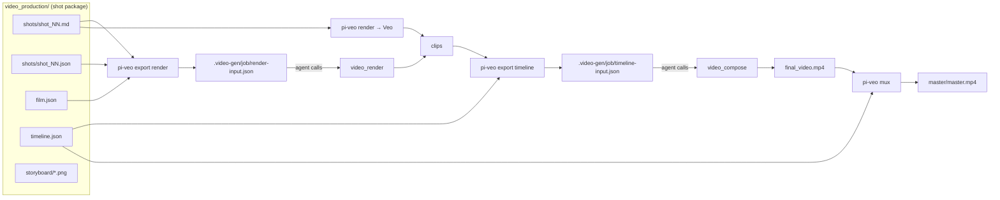

## Context

See proposal.md — Why. Current state of `packages/video-production`: `shots.ts` parses `shots/shot_*.md` into a `Shot` holding only the **pre-joined** "Full Veo prompt" + negative + seed/aspect/resolution/refs/first-frame/seamless; `render.ts` calls Veo via `@google/genai`; `bin/veo.ts` dispatches `parse|plan|render|storyboard`. The kit skill's per-project generator script writes the markdown from structured data that is then lost.

External target (spike against `@amaster.ai/pi-video-gen@0.1.18`, sandbox `/tmp/pvg-sandbox`, no paid calls):

- F1 — `package.json` `exports` exposes only the extension entry; its modules are not importable (`ERR_PACKAGE_PATH_NOT_EXPORTED`). Integration is by **files** the agent hands to its tools.
- F2 — `render-input.json` has no resolution field; resolution = active model's registry default (Seedance 2.0 1080p, OpenRouter Veo 720p).
- F3 — no dry-run: the first `video_render` call snapshots frames + writes `manifest.json` before submit; re-calling the same job dir is a resume and a spec change is rejected ("spec drift").
- F4 — `durationSec` must be an integer; model duration limits are range-checked. Job/shot/segment ids must match `SAFE_ID` `^[A-Za-z0-9][A-Za-z0-9_-]{0,63}$` (`dist/jobs/store.js`). Frames: ≤20 MiB, PNG/JPEG/WebP magic bytes, inside cwd, no symlinks (`dist/frame-input.js`). Timeline media: inside cwd, no symlinks (`copyApprovedMedia`, `dist/timeline-render.js`); timeline enums/ranges in `dist/timeline.js` (mirrored in the sidecars spec).
- F5 — `video_compose` timeline: narration only via Edge TTS text, `bgm` fixed at 0.18 gain, subtitles only derived from TTS narration, overlays text-only.
- Preflight results for a 3-shot spec with one SEAMLESS pair (registry ids): passes on `doubao-seedance-2-0-260128` (alias `seedance-2.0`), `doubao-seedance-2-0-fast-260128` (`seedance-2.0-fast`), `kling-3.0`, `MiniMax-H3`, `google/veo-3.1` (`veo-3.1`); `kling-3.0-turbo` and `happyhorse-1.1` reject `lastFramePath` with an `allowDegradations: ["first-frame-only"]` escape.
- `video_capabilities` returns human text, not JSON.

## Goals / Non-Goals

**Goals:** file-format-only coupling to pi-video-gen; local preflight that catches what we can know without the extension; keep every existing subcommand byte-for-byte unchanged for packages without `film.json`; zero new npm dependencies.

**Non-Goals:** reading `video_capabilities` text automatically; supporting pi-video-gen `referenceAssets` (Seedance trusted assets); driving `video_render` / `video_compose` ourselves (the agent calls them); making `pi-veo render` read sidecars.

## Decisions

### D1 — Sidecars carry only what markdown lacks
Shot sidecar = `{ prompt, durationSec }`. First frame, seamless flag, seed, per-shot negative stay in markdown and are read through the existing `parseShotFile`; of these only the first frame (and the seamless flag, as D2) reach the render spec. pi-video-gen has no per-shot negative, so the export uses `film.json` `negative` and warns when a shot's markdown negative differs.
- *Alternative:* full shot data in JSON, markdown generated from it — cleaner single source but a larger kit rewrite and a second parser path for `render`. Rejected for scope.
- *Alternative:* parse the 7-layer markdown headings — would freeze an unspecified, generator-dependent format. Rejected.
- *Residual drift:* `prompt` (JSON) and "Full Veo prompt" (markdown) can diverge. Accepted: the kit emits both from one data source; `parse` cannot detect semantic drift and does not try.

### D2 — SEAMLESS → `lastFramePath` of next shot's sketch
We cannot hand a rendered last frame across `video_render` shots (one spec, parallel submits). Interpolating toward the next sketch is the closest equivalent and is supported by the preflight-verified models. `--no-last-frame` exists for models that lack it, so the user need not rely on pi-video-gen's `allowDegradations`.

### D3 — Capability preflight via explicit flags
`--durations <min>-<max>` and `--aspect <list>` are copied by the agent from `video_capabilities` text. Parsing that text couples us to an unversioned 0.1.x output format. Without flags only integer rounding applies; pi-video-gen's own preflight is the backstop (cost: a spent job dir, never a paid call — verified F3 failures happen before submit).

### D4 — Always a fresh job dir; export refuses to reuse
Mirrors F3: pi-video-gen treats specs as immutable per job dir. Default `outDir` = `<cwd>/.video-gen` (pi-video-gen's default output dir). Job id default `<sanitized-name>-<mode>-<UTC YYYYMMDD-HHMMSS>`, sanitized + truncated to satisfy `SAFE_ID` (rule in the export spec). If the user configured a different pi-video-gen `outputDir`, they pass `--out`.

**Re-billing guard.** A fresh job per export is necessary but, alone, dangerous: after an interrupted `video_render`, the natural agent retry ("re-export and render") mints a new job and re-bills every shot, while pi-video-gen's resume works only on the original spec path. So every `export render` appends its spec path to a package-local registry `<baseDir>/.pi-veo/exports.json`, and a later `export render` refuses while any registered spec still exists — independent of `--job`/`--out` — pointing at those specs; `--new-job` is the explicit override for a genuinely revised film. Nothing is written into pi-video-gen's job dir beyond `render-input.json`, and we never read its `manifest.json` (unversioned internal format).
- *Alternative:* key on job-dir name prefix — rejected (review): bypassed by `--job`/`--out`.
- *Alternative:* a marker file inside the job dir — rejected: job dirs are pi-video-gen's territory (reserved names, fingerprinting).
- *Alternative:* inspect `manifest.json` to allow re-export after `completed` jobs — rejected, couples to an internal file.

**outputDir trade-off.** pi-video-gen resolves job dirs under its `outputDir` setting (default `.video-gen`, project-overridable). We do not read pi-video-gen's settings (coupling + its trust rules); the export report states the requirement and `--out` covers a non-default config.

### D5 — Paths
- Render spec frames: written **relative to cwd**, must be regular non-symlink files inside cwd (pi-video-gen rejects symlinks/outside paths — failing early saves a job dir). `--cwd` is not a flag: the export cwd is `process.cwd()`, which must equal the pi session cwd; the skill says so, and export enforces the necessary condition that the package base dir lies inside cwd.
- Timeline spec media: absolute paths, and every file must be a non-symlink inside the cwd (pi-video-gen's `copyApprovedMedia` rejects media outside the approved project dir and symlinks).
- Sidecar-declared files: relative to `baseDir`, realpath-contained in `baseDir`.

### D6 — Picture edit in `video_compose`, audio in our `mux`
Given F5, `video_compose` owns cut order, trims, xfades, text overlays, end-card image, ambient clip audio; `mux` owns voiceover/music levels + captions. One ffmpeg invocation, inputs appended only when declared and input indices/`-map`s computed from that list (each combination — VO only, music only, both, captions only, silent/ambient picture — gets a unit test on the pure arg builder):
`-i picture [-i vo] [-i music] [-i srt]` → `filter_complex` `[0:a]volume=1` (if the picture has audio) + `[vo]adelay=<ms>:all=1,volume=V` + `[music]volume=M` → `amix=normalize=0` → `alimiter` → `apad`; `-map 0:v -c:v copy` (or re-encode with the `subtitles` filter under `--burn`); `-c:s mov_text` for soft captions; `-t <picture duration via ffprobe>`. Captions-only: no audio graph, `-map 0:a?` stream copy. Written to a temp file in the output dir, renamed on success.
- **VO fit check:** ffprobe the VO; `offsetSec + duration > picture duration` fails (contract: the official VO is never cut).
- **Burn path safety:** the `subtitles` filter parses its argument as filtergraph syntax (`,` `;` `:` `'` `[`). Mux copies the SRT into a fresh temp dir as `captions.srt`, spawns ffmpeg with `cwd` = that temp dir and all `-i` inputs as absolute paths, and uses the filter argument `subtitles=captions.srt` — no path characters (sidecar- or tmpdir-derived) enter the filtergraph. Every other path argument (inputs, temp output) is absolute whenever `cwd` is overridden.
- **Captions time base:** the SRT is authored against the output timeline; mux never shifts cues (the VO offset exists to place a VO file that starts at t=0, not to re-time captions).
- *Alternative:* upstream PR to pi-video-gen for voiceover/bgm volume/SRT — rejected for this change (user decision); `mux` is small and removable if upstream lands.
- *Alternative:* music ducking under voiceover (sidechaincompress) — deferred; fixed levels are predictable and match the kit's "VO + music in post" intent.

### D7 — ffmpeg resolution
`mux` executes `ffmpeg`/`ffprobe` from PATH (same as `render.ts` `--chain`), with `execFile` argv arrays. `pi.tools` already declares optional `ffmpeg`; add an optional `ffprobe` entry (existing tool-registry id, as in `video-transcription`). Burn capability probed via `ffmpeg -hide_banner -filters` containing ` subtitles `.

### D8 — Module layout
`src/sidecars.ts` (load + validate, returns `{ enabled, film, shots: Map, timeline, problems: { scope, message }[] }`; kept separate from inspect's shot-name `problems`), `src/export.ts` (`exportRender`, `exportTimeline`, pure spec builders + a thin writer), `src/mux.ts` (`buildMuxArgs` pure, `runMux` with injectable exec for tests). `inspect.ts` calls `loadSidecars`. `bin/veo.ts` gains dispatch + flags.

## Risks / Trade-offs

- [pi-video-gen changes its spec formats (0.1.x, rapid releases)] → State "verified against 0.1.18" in proposal, skill doc and export `--help`; sidecar bounds mirror that version's validators; export output is plain JSON the agent can inspect; fixtures in tests encode the documented shape so a format change is a single-module fix.
- [OpenRouter Veo is 720p/16:9 only; seed dropped] → Skill doc steers "quality" renders to `pi-veo render` (Veo direct) and positions pi-video-gen for Seedance/Kling; export warns on dropped seed/refs.
- [Sidecar/markdown prompt drift] → Kit emits both from one data file; documented in the skill pitfalls.
- [ffmpeg without libass → `--burn` fails] → Probed up front with an actionable error; soft captions are the default.
- [Export cwd ≠ pi session cwd — pi-video-gen resolves frames and `outputDir` against its session cwd, which a CLI cannot observe] → Export requires the package inside `process.cwd()`, prints the cwd it used, and the skill instructs running `pi-veo export` from the session cwd without `cd`. A mismatch fails in pi-video-gen's preflight (before any paid submit, verified F3), costing a job dir, not money.
- [Untrusted package content (sidecar paths flowing into ffmpeg and a third-party extension)] → realpath containment, no symlinks for frames, argv-only exec (see specs).
- [Unverified provider behavior in pi-video-gen (its adapters are pending live smoke tests)] → Out of our control; skill doc tells users to run `/video-gen doctor` and one cheap clip first.

## Migration Plan

Additive. Existing packages keep working unchanged (no `film.json` → sidecars disabled). Kit skill update affects only newly produced packages. Rollback = revert; generated sidecars and `.video-gen/` job dirs are inert files.
