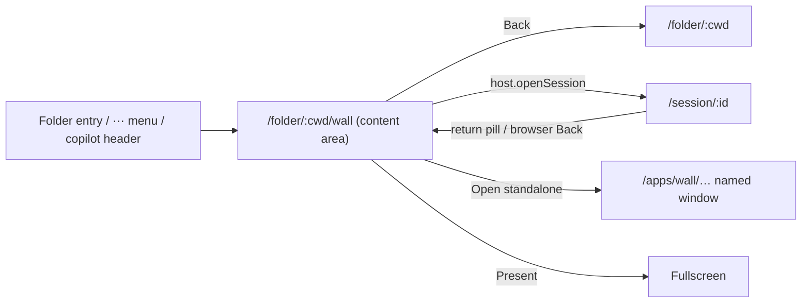

# plugin embedded app — UI plan

Mockup: `embedded-app.html` (5 frames). On the real dashboard: `dashboard/index.html` (screenshots of the running dashboard with the wall injected by `dashboard/capture.cjs`). Example app: the voice wall (owned by `add-voice-wall-plugin` — do not edit that change from here). `app-shell.html` (full-screen app route with its own header) is **superseded** and kept only for history.

Grounding:
- `App.tsx` `renderOpenSpecBoardView` — the OpenSpec board renders in the content area beside the sidebar;
- `FolderOpenSpecSection.tsx` — the state-only folder entry `OpenSpec (N) →`;
- `useFolderMenuItem` (folder ⋯ menu) and the `shell-overlay-route` spec (`presentation`, `depth`, `parentPath`);
- `SessionList.tsx` `header-app-bar` — unchanged; the sidebar stays visible.

## Placement

| Surface | Mechanism | Example (wall) |
|---|---|---|
| Folder entry | `sidebar-folder-section`, state-only | `● Live wall →` while a wall runs |
| Menu entries | `useFolderMenuItem`, group *open* | Live wall · Open wall standalone · Share live wall… |
| Page | `shell-overlay-route`, `presentation: "content"`, `depth: 2`, `parentPath: /folder/:encodedCwd` | `/folder/<cwd>/wall` |
| Top bar | `<EmbeddedApp>` (OpenSpec-board layout) | Back · `acme-erp › Live wall` · meeting chip (`HeaderContext`) · Present · Open standalone |
| Body | app component, same React tree, router based at `basePath` | Board · Graph · Transcript |
| Standalone | plugin-served `/apps/<id>/`, `createStandaloneHost` + `StandaloneBar` | share link / projector |

## Navigation

## Narrow (< 640 px)

Mobile detail panel at depth 2. Top bar: Back (icon) · `HeaderContext` · ⋯ (actions). 44 px targets.

## States

running · loading (Suspense) · crashed (Reload app + Back) · plugin disabled (claim absent → invalid-route fallback to the folder; entry and menu items disappear).

## Cited rules

Nielsen #4 consistency (same placement, top bar and Back as the OpenSpec board) · #3 user control (Back to folder; return pill) · #6 recognition (current folder entry highlighted; breadcrumb) · WCAG 2.4.5 multiple ways (entry, menu, links, deep link) · 2.5.8 target size.

## Open questions

- Return pill in the destination header vs a toast.
- Electron *Open standalone*: new BrowserWindow vs `openExternal`.
