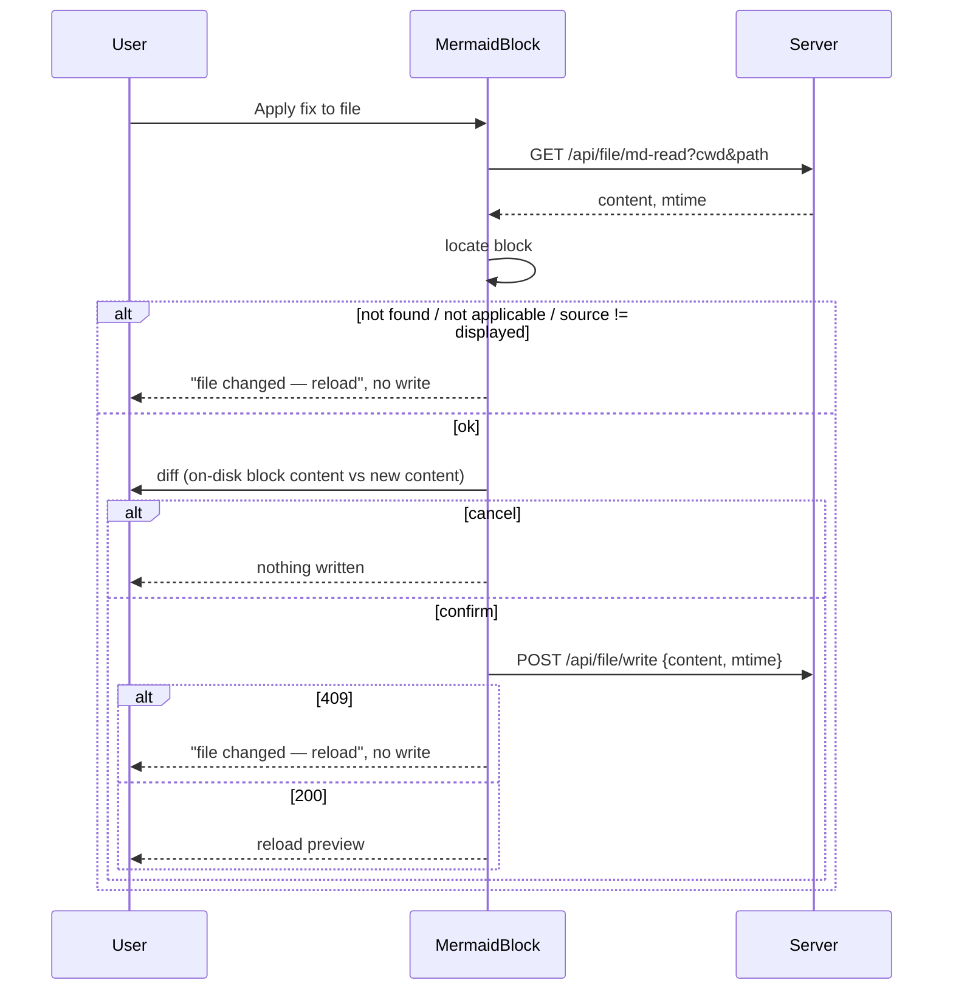

## Context

See proposal.md — Why. Current code:

- Write path: `POST /api/file/write` `{cwd?, path, content, mtime}` → `prepareMdWrite` → `isWritableMdTarget` (realpath, extension on realpath target, `<cwd>/**` containment or `~/.pi/agent` global root; `packages/server/src/lib/writable-md-target.ts:85`) → `serializeWrite` → atomic write with mtime compare (409 on mismatch).
- One extension set `WRITABLE_MD_EXTENSIONS` gates both scopes (`writable-md-target.ts:31`).
- `GET /api/file` returns `content` only for `monaco`/`markdown` viewers or `editable` kinds (`packages/server/src/routes/file-routes.ts:464-470`); `.mmd`/`.mermaid` classify as `editable: false` (`packages/shared/src/file-kind.ts:329`) → no content.
- `GET /api/file/md-read?cwd&path` returns `{content, mtime: mtimeMs}` behind the same `isWritableMdTarget` guard as the write (`file-routes.ts:703-735`).
- `MarkdownContent` renders mermaid when `/language-(\w+)/` on the code className captures `mermaid` and passes `codeString` (react-markdown children, trailing `\n` stripped) as `code` (`packages/client/src/components/preview/MarkdownContent.tsx:498-502`). Plugins: `remarkGfm, remarkMath, remarkFrontmatter` + `rehypeRaw` (`MarkdownContent.tsx:617-627`) — raw HTML `<pre><code class="language-mermaid">` also reaches the `code` component.
- AsciiDoc preview: server-rendered HTML split by `splitAdocDiagramSegments` (`packages/client/src/lib/preview/adoc-diagram-splitter.ts:53`), diagram `source = decodeHtmlEntities(rawContent).trim()` (`:117,125`).
- `.mmd` tab: `packages/client/src/components/editor-pane/MermaidViewer.tsx` fetches `/api/file/raw` and renders `<MermaidBlock code={code} />` (`:37`).
- `MermaidBlock` props today: `{code, complete}`; no repaired outcome yet — introduced by the active `add-mermaid-auto-repair` (`MermaidOutcome = … | {kind:"repaired", svg, code, applied, error}`, its design.md D-cache). That change is a **hard prerequisite**.
- Instructions picker `md-candidates.ts:25` uses `.md`/`.mdx` only.

## Goals / Non-Goals

**Goals:** persist a displayed fix into exactly the block it came from, or write nothing.

**Non-Goals:** editing chat messages; batch "fix all diagrams in file" (possible later on top of the locator); applying fixes in the Monaco edit-mode buffer; kb reindex of `.mmd` writes; mermaid blocks inside blockquotes or raw HTML; widening global-scope writes; listing `.mmd` in the Instructions picker.

## Decisions

### D1 — Block identity = parser ordinal + exact source
Each file surface provides `MermaidSourceContext` = `{ cwd, path, kind: "md" | "adoc" | "mmd", reload, isDirty?, expectedCount? }` (stable identity, memoized). No context → no action (chat, tool cards). The surface provides the context only when `cwd` is a live session cwd: `md-read` and `write` both go through `resolveScopedMdPath`, which 403s any other cwd (`packages/server/src/routes/file-routes.ts:119-126`), so pinned-dir-only previews do not offer the action.

- **md:** a remark plugin `remarkMermaidOrdinal` visits mdast `code` nodes with `lang === "mermaid"` in document order and stamps `data.hProperties["data-mermaid-ordinal"] = String(n)` (mdast-util-to-hast applies it to the inner `code` element). `MarkdownCode` today discards non-inline props (`MarkdownContent.tsx:496`), so it reads the stamp explicitly and passes it to `MermaidBlock`; `stripReactRefAttributes` only deletes `ref` (`MarkdownContent.tsx:119-127`). No stamp (raw-HTML `<pre>`, `mermaid-foo` lang matched by the `\w+` regex) → no action. Ordinal is computed in the tree, not by a render-time counter (StrictMode/memo-safe).
- **adoc:** ordinal = index among the splitter's mermaid diagram segments; `expectedCount` = number of those segments.
- **mmd:** ordinal 0, whole file.

Alternative — react-markdown `node.position` offsets: rejected; the surface may pass transformed content, and AsciiDoc HTML has no source offsets. Alternative — hand-written md fence scanner: rejected; parity with react-markdown across lists, blockquotes, frontmatter, nested/longer fences, tildes is unprovable.

### D2 — Fetch-verify, then diff-confirm, then write

- **Verify in display form.** Compare = the located raw block passed through the *display transform* of its surface, `===` the `code` the block rendered. md: identity — located mdast `code.value` vs `codeString` (`MarkdownContent.tsx:499`; fenced content is literal in CommonMark and hast text round-trips through `rehype-raw`; fixture test with `&gt;`, `&amp;`, `<`, `>` pins this). adoc: `rawInner.trim()` vs splitter `source` (`adoc-diagram-splitter.ts:117,125`); asciidoctor substitutions (callouts, tab expansion, attribute refs) yield a mismatch → abort, the safe direction. mmd: identity — the raw file vs the `code` `MermaidViewer` passes (`MermaidViewer.tsx:37`, no transform). Verify only proves *same block*; the diff (next) shows the real bytes, so an edge-whitespace-only external edit that verify cannot see is still visible before confirm.
- **Diff after re-read**, so the confirmation shows exactly the on-disk change (including indentation re-application and any entity decoding introduced by the fix pipeline's sanitized source), and the `md-read` mtime is the write token.
- Re-read uses `/api/file/md-read`, not `/api/file`: it returns content for `.mmd` and is gated by the same guard as the write.

### D3 — Locator + splice
- **md:** parse the raw file with `unified().use(remarkParse).use(MARKDOWN_REMARK_PLUGINS)` — the plugin list `MarkdownContent` uses, exported as one shared constant so they cannot drift — collect `code` nodes with `lang === "mermaid"` in document order. `MarkdownContent` imports the same constant (single source of truth; `rehypeRaw` is a rehype stage and irrelevant to mdast code nodes). Use `position` to get opener/closer lines. **Not applicable** (abort, no write): no closer line (unclosed fence), or the opener line's prefix before the fence marker contains a non-whitespace char (blockquote `>`, list marker on the same line). Splice replaces only the lines strictly between opener and closer; each non-blank fixed line is prefixed with the opener's leading-whitespace indent (inverse of CommonMark's content de-indent); blank lines stay empty.
- **adoc:** line scanner: `[source,mermaid(,…)?]` attribute line followed by a `----` or `....` delimiter of length N, closed by the identical delimiter. **Count-parity guard:** located count must equal `expectedCount` from the splitter, else not applicable (covers `include::`, `ifdef`, bare `[mermaid]` handled by `add-md-adoc-markup-repair`, any detection drift). Splice replaces only lines between the delimiters.
- **mmd:** whole-file replace; keep the file's final-newline presence and line-ending style; a leading BOM is preserved.
- **Line endings:** detect from the file (CRLF if the opener line ends `\r\n`); the written block uses that ending. Opener/closer bytes copied verbatim.
- Pure functions, unit-tested; round-trip invariant `splice(file, n, located.value) === file`.

### D4 — Allowlist extension (directory scope only)
`isWritableMdTarget` accepts `.mmd`/`.mermaid` only when `cwd` is present; the global branch keeps its current set. Ordering: the allowlist lands before the client action (`md-read` 403s `.mmd` until then). `md-candidates.ts` unchanged (picker remains ⊆ guard). Pre-existing drift — global branch already accepts `.adoc`/`.csv` though the spec says `~/.pi/agent/**/*.md` — is not touched here (noted, out of scope).

### D5 — Refresh
After 200 the surface's `reload` (from the context) re-fetches its content; the fixed source renders with no badge.

### D6 — Dirty editor
`MarkdownViewer` edit mode with unsaved changes passes `isDirty: true`; Apply is disabled with "save or discard edits first". Other editors on the same file (Instructions page, another tab) are covered only by the mtime 409.

## Risks / Trade-offs

- [Duplicate identical diagrams] → ordinal + exact verify targets the right one.
- [Content string-transform reinstated in `MarkdownContent`] → the `markdown-rendering` spec still names `wrapAsciiTables` pre-processing, but code has it disabled (`processedContent = content`, `MarkdownContent.tsx:579-580`); re-enabling it (it can add fences) would break raw-file ordinal parity. The ordinal-parity test (tasks 3.1) fails if that happens. `remarkMermaidOrdinal` is remark-level; the rehype chain pinned by `markdown-rendering` is unchanged.
- [Splice corrupts fences] → only inner lines rewritten; opener/closer verbatim; round-trip test.
- [Fix pipeline decodes entities (`&gt;`→`>`) present literally in the md source] → change is inside the block and visible in the diff; accepted.
- [Edge-whitespace-only external edit to an adoc block between preview and re-read passes `trim` verify] → content inside the block is replaced as shown in the diff; mtime then protects re-read→write. Accepted.
- [Widened write surface] → two text extensions, directory scope only, same realpath + containment gate; tests for symlink escape and global rejection.
- [Rule/AI fix changes meaning] → diff confirmation is mandatory.
- [Prerequisite slips] → this change cannot start until `add-mermaid-auto-repair` lands.

## Migration Plan

Server restart for allowlist; client build. Rollback independent per part; no data migration.
