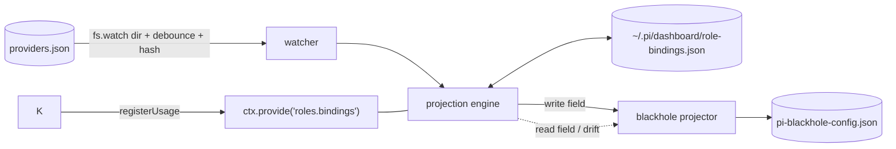

## Context

See proposal.md — Why. Current state relevant to the approach:

- Role config lives in `~/.pi/agent/providers.json` (`roles`, `rolePresets`, `activePreset`, `roleNames`, `removedRoles`). `roles:preset-load` copies the preset into `roles` and saves (`packages/extension/src/role-manager.ts:324-326`), so `roles` on disk is always the effective assignment map. Writers: extension `role-manager.ts` (`roles:*` handlers from the Roles UI), extension `role-model-tools.ts` (agent `update_roles`), and humans. The dashboard server never writes it.
- `packages/shared/src/role-schema.ts` already has `parseRoleConfig`, `effectiveRoleNames`, `overlayRoles`, `splitRef`/`joinRef` — `splitRef` splits on the last `:` with no canonical-level check (`role-schema.ts:120`). `lookupRole` (the `@role → literal` accessor, `role-manager.ts:194`) lives in the extension only and returns the assignment literal verbatim.
- `GET /api/roles` (roles-plugin server) returns role rows incl. resolved `ref`, `model`, `provider`, `thinkingLevel`; 404 when the roles plugin is absent.
- automation has its own `readRolesFromDisk` + `resolveModel` (`packages/automation-plugin/src/server/model-resolver.ts`; no `@role:level` support) and a hard-coded `DEFAULT_ROLE_KEYS` + private `THINKING_LEVELS` in `CreateAutomationDialog.tsx`.
- Session model and thinking level are separate messages: `set_model` and `set_thinking_level` (`packages/shared/src/browser-protocol.ts:1508,1514`).
- `ui:model-selector` contract (`ui-primitives.ts`) explicitly excludes roles.
- blackhole writes `pi-blackhole-config.json` via `config-io.ts` (`writeAtomic`, unmanaged-key preservation, fingerprint-based external-write detection) behind a validator.
- Cross-plugin seam: `ctx.provide`/`ctx.consume`, ordering only guaranteed by `manifest.dependsOn`. No optional-dependency notion.

## Goals / Non-Goals

**Goals:**
- One value grammar and one resolver for every model setting.
- A generic projection engine any plugin can adopt for third-party configs, with zero coupling when the roles plugin is absent.
- Single write per user save; re-projection only on real resolution changes.

**Non-Goals:**
- Making running sessions follow role changes (Kind C is one-shot by design).
- Auto-converting existing concrete values into role refs.
- Projection for files no dashboard plugin owns (no "bind arbitrary JSON path" API).
- Changing how `providers.json` is written or who writes it.

## Decisions

### D1 — Engine lives in roles-plugin, exposed as service `roles.bindings`



Kind A consumers resolve through the shared resolver directly (D3), never through the service — so saved `@role` values keep resolving without the roles plugin (D9). `service.resolve` exists for Kind B save routes and for symmetry; it delegates to the same shared resolver.

Service surface (in-process, versioned `version: 1`):
- `resolve(ref) → { kind:"direct"|"role", model, provider, id, level?, unresolved?: reason }`
- `listRoles() → [{ role, builtin, resolved?: {provider,id,level?} }]`
- `registerProjector({ owner, acceptsField(field), read(field), write(field, resolved) })`
- `replaceBindings(owner, [{ field, ref, projected }])` — record-only; caller already wrote the file; forces status `ok`
- `getBindings(owner) → [{ field, ref, status, projected }]`, `reattach(owner, field)`
- `registerUsage(owner, () => [{ label, ref }]) → dispose` — Kind A "used by" reporting; reporter is called lazily on each read and returns `[]` when its plugin is disabled

Why roles-plugin, not core server: the user requirement is "if role plugin is installed"; absence of the plugin then means absence of the feature with no host code paths to guard. Alternative (core host service) rejected: puts role semantics in the host and contradicts the existing "role management is a host-plugin concern" split.

### D2 — Load-order independence via Fastify `onReady`

The roles plugin calls `ctx.provide("roles.bindings", svc)` synchronously during `registerPlugin` (never inside a hook). Consumers call `ctx.consume("roles.bindings")` inside `ctx.fastify.addHook("onReady", …)` (host loads all plugins before `listen`, `packages/server/src/server.ts:2970`). `undefined` → feature off for that consumer. Fastify runs `onReady` hooks sequentially and awaits each, so a yield inside the roles hook would NOT let later hooks run first. Instead: the roles `onReady` hook only *schedules* the boot pass via `setImmediate` (not awaited), and every `registerProjector` call — before or after the boot pass — triggers a targeted pass for that owner's bindings. Correctness rests on the targeted pass; the scheduled boot pass covers owners already registered. Alternative: add `optionalDependsOn` to the manifest/loader — rejected as a loader-wide change for one feature.

### D3 — Resolver moves to shared; node reader is a node-only shared module

Pure `parseModelRef(value)` + `resolveModelRef(ref, roleConfig)` + exported canonical `THINKING_LEVELS` added next to `role-schema.ts` (browser-safe). `parseModelRef` splits a level only when it is in `THINKING_LEVELS`; the existing `splitRef` is left untouched (its callers keep today's behavior). A node-only module (guarded by `packages/client/src/__tests__/no-node-only-shared-imports.test`) adds `readRoleConfigFromDisk()`. The resolver reads `cfg.roles` only — no preset overlay (see Context). Level rule: ref level > role-assignment level > none.

Delegation: automation `resolveModel` and the roles-plugin service/route delegate fully. Extension `lookupRole` delegates for the lookup but keeps its output contract — `{ literal }` is the assignment string verbatim (incl. its `:level`), so `model:resolve` / `role:resolve-model` consumers see no change. automation's private `THINKING_LEVELS` and the roles UI `splitRefLevel` level list switch to the shared constant.

### D4 — Projectors own their file writes

The engine never writes target files; it calls the projector's `write`. blackhole's projector wraps its existing `config-io` merge + `writeAtomic` + validator, so unmanaged-key preservation and validation stay in one place. Alternative: generic JSON-pointer writer in the engine — rejected (bypasses plugin validators, and a "write any path" primitive is a needless trust expansion). A small `jsonFieldProjector(filePath, fields)` helper may be added later; not in this change.

### D5 — Save path: one write, then record bindings

```mermaid
sequenceDiagram
  participant UI as Blackhole settings
  participant R as blackhole PUT route
  participant S as roles.bindings
  participant F as pi-blackhole-config.json
  UI->>R: slots incl. "@fast" refs
  R->>S: resolve(@fast)
  R->>R: validate concrete config
  R->>F: writeAtomic (single write)
  R->>S: replaceBindings(owner, [{field, ref, projected}])
  Note over S: later providers.json change
  S->>S: re-resolve; changed & not detached?
  S->>R: projector.write(field, resolved)
  R->>F: merge + writeAtomic
```

The client sends role refs in the slot payload; the route is the only place that converts them. An unresolved role ref rejects the whole save (400 naming the role) — no file write, no binding change. With the service absent, role refs are rejected and the route never calls `replaceBindings`, so stored bindings survive a roles-plugin outage; on its return, D6 drift detection marks changed slots `detached`. Chain reorder/remove is handled by recomputing the owner's full binding set on each save (`replaceBindings` replaces, not merges), so bindings follow entries by final position.

Per-owner serialization: the engine exposes `withOwnerLock(owner, fn)`; the save route runs resolve→write→`replaceBindings` inside it, and projection passes take the same lock per owner. This removes the window where a pass compares the stale `projected` against the freshly saved file and wrongly marks it `detached`.

### D6 — Drift detection compares concrete identity only

`detached` when `read(field)` differs from `projected` on `provider`+`id`+`thinking`. Other per-entry keys (`cooldownHours`, `contextWindow`) are ignored for drift and preserved on write (projector merges into the existing entry). Bindings whose owner has no registered projector are `skipped` per pass (kept, not failed, not GC'd). Detached bindings are skipped until `reattach` — no auto-recovery even if the external edit happens to equal the new resolution (predictable over clever).

### D7 — Watcher

`fs.watch` on the `~/.pi/agent/` directory (atomic renames swap inodes, so watching the file breaks — writer uses tmp+rename, `role-manager.ts:110-112`). ANY event in the directory (filename is unreliable on macOS for renames) arms a 250 ms debounce, then compare SHA-256 of the effective role map (not raw bytes) to skip no-op writes. Boot pass always runs. The engine never writes `providers.json`, so no self-trigger loop; projector writes go to other files that are not watched.

### D8 — Picker data source and presence

Client Role tab fetches `GET /api/roles` on tab open (presence = 2xx; 404/error → tab hidden, plain picker). Rows already carry resolution. No new route. Kind C pickers re-fetch `/api/roles` at pick time (one request, never a cached list), check the resolved level against the target model's `supportedThinkingLevels` and skip it with a notice when unsupported (no nearest-level mapping), and send the existing `set_model` followed by `set_thinking_level` when the resolution carries a level (reusing the existing wait-for-`model_update` flow in `useOpenSpecRunConfigRow.tsx`); the "via @role" hint is client state cleared on the next `model_update` that differs.

### D9 — Scope of "inert without roles plugin"

Without the roles plugin: no Role tab (no new way to *create* `@role` values), no `roles.bindings` service, no projection, no "used by". Resolve-at-use consumers still resolve `@role` values through the shared resolver reading `providers.json` — role assignments are owned by the always-loaded extension `role-manager`, and automation already behaves this way today. A grammar config saved with `llm.role` while the plugin was installed keeps resolving after uninstall. This asymmetry is intentional: removing the picker must not break existing configs.

### D10 — Automation editor writes bare `@role`

The automation editor keeps its existing rule (no level control for roles, bare `@role` written). `@role:level` remains valid when hand-written in `automation.yaml` and is honored at run time. Intentional asymmetry: the picker's Role tab does not offer a level override anywhere in this change; adding one is a separate UX decision.

### D11 — Persistence formats

- `~/.pi/dashboard/role-bindings.json`: `{ version:1, owners: { [owner]: { [field]: { ref, projected:{provider,id,level?}, status, updatedAt } } } }`, written with tmp+rename.
- Grammar plugin config: role pick stored as `llm: { role: "@fast" }` (the picker emits bare `@role`, D10; a hand-written `:level` is honored); direct stays `llm: { provider, model }`. `configSchema` `llm` becomes `oneOf: [{provider, model} required, no role], [{role} required, no provider/model]`, each with `additionalProperties: false`, so a mixed object is invalid.
- Automation: unchanged (`model` string already accepts `@role`).

## Risks / Trade-offs

- [Concurrent writers to `pi-blackhole-config.json` (blackhole itself, `/blackhole configure`)] → projector reuses `config-io` fingerprint check; external change between read and write marks the binding `detached` instead of clobbering.
- [Watcher misses events (network FS, editor save patterns)] → boot pass + re-check on every `GET /api/roles` hash mismatch; worst case is a delay, never a wrong write.
- [Service API becomes a public contract] → `version` field on the service object; consumers check it. `doubt-driven-review` before task group 2 lands.
- [Projector write failure loops] → failures logged per owner/field, retried next pass only (no tight retry).
- [User confusion: session pickers don't follow roles] → explicit "via @role" hint and spec'd one-shot semantics.
- [Primitive contract reversal] → opt-in prop; absent prop = identical behavior; existing tests unchanged.
- [Background projection changes a running blackhole's config with no user action] → apply semantics unchanged (spec makes no hot-reload promise); each projection write is logged and the slot shows the role + last-projected value + time, so the change is discoverable.
- [Trust boundary] → only in-process plugins can register projectors; field keys allow-listed per projector; no HTTP surface takes a path or field name outside an owner's own route.

## Migration Plan

1. Ship shared resolver + service + picker (inert until a caller opts in).
2. Migrate automation (behavior-preserving; now also honors presets overlay + level).
3. Enable Role tab on grammar, blackhole, session pickers.
Rollback: revert; delete `~/.pi/dashboard/role-bindings.json` optional. Target files keep last concrete values; grammar configs holding `llm.role` fall back to "pick a model" prompt after revert (documented in CHANGELOG).
