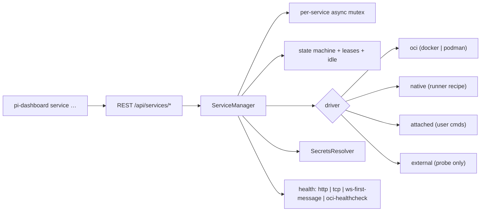

## Context

See proposal.md for the motivation. Evidence base:
`openspec/changes/archive/2026-10-08-spike-managed-services/findings.md`,
cited as `F:<section>`. Where a decision rests on reasoning rather than a
measurement, it says so.

Existing machinery, verified against the code:
- `packages/server/src/auth/locked-json-file.ts`:
  - `withLockedJsonFile(path, fn, opts)`: the critical section `fn` is
    **synchronous**, so async work (spawning, crypto via callbacks) happens
    outside it.
  - `writeJsonAtomic(filePath, data, forceMode?)`: without `forceMode` it keeps
    only the owner bits of an existing file's mode (`& 0o700`). This change
    always passes `0o600`.
  - `readJsonChecked`, `tryReadJson`, `corruptUnbackedRefusal`: corrupt-file
    quarantine plus write refusal when a backup cannot be made.
- `packages/shared/src/tool-registry/pi-tools.ts:176`
  `discoverSkillManifests(root)` returns only packages whose `pi.tools` is set
  (line ~196). It therefore **cannot** find `pi.services`-only packages (see
  D7).
- `packages/shared/src/tool-registry/definitions.ts` registers no `docker`,
  `podman`, `ssh`, `uvx`, `security`, `secret-tool`, `lsof` or `netstat`. The
  `tool-registry` "Registered tool set" requirement says "at minimum", so adding
  definitions is additive.
- `packages/shared/src/tool-registry/strategies.ts:~279` `dockerImageInspect`
  hardcodes `docker` and maps any non-zero exit to "image not found", which is
  exactly the ambiguity `F:S1.5` warns about. The OCI driver does **not** reuse
  it (D4).
- `packages/shared/src/platform/process.ts:187,233`:
  - `killProcess(pid, {timeoutMs})`: unix SIGTERM, wait, SIGKILL on the
    **pid**; win32 immediate `taskkill /F /T`.
  - `killPidWithGroup(pid, signal)`: one signal to `-pid` (the group) on
    POSIX.

  The `command-executor` spec requires termination through these. Spawning
  goes through `packages/shared/src/platform/exec.ts` `spawn`, the same path
  as `document-converter/src/engine.ts`. Process scans go through
  `platform/process-scan.ts` (`isProcessRunning`), per `platform-primitives`.
- `packages/server/src/lifecycle/home-lock.ts`: a per-HOME advisory
  `proper-lockfile` lock gives one dashboard per HOME, but it is advisory and
  takeover is possible.
- `packages/server/src/__tests__/route-tier-gate.test.ts` and
  `mcp-manifest-completeness.test.ts`: every `/api/*` route needs a tier entry
  and an MCP manifest binding or denylist entry.
- `packages/server/src/auth/localhost-guard.ts`: `createNetworkGuard` admits
  loopback, **trusted networks** and authenticated callers. `isGenuinelyLocal(ip, headers)`
  (`:77`) is stricter. `isLocallyTrusted(input, ctx)` (`:88`) adds the
  `requireLocalProof` strict-mode check and is the host-trust predicate used by
  the network guard, WS, editor and pairing.
- `packages/server/src/cli.ts`: subcommand switch (`start|stop|restart|status|runtime|open`
  near `:1007`) and `localTokenHeader()` for server calls.
- `packages/shared/src/tool-registry/ensure-cli.ts`: precedent for an `ensure`
  verb whose `--json` form always exits 0.

## Goals / Non-Goals

**Goals:**
- One consumer contract (`ensure` / `heartbeat` / `release` / `exec`) for three
  ownership modes.
- Safe by construction:
  - no implicit execution;
  - no secret value in any transcript, log, argv, `inspect` output or REST
    response;
  - no host VM is ever started or stopped;
  - a stop is never assumed to have succeeded;
  - no silent multi-GB download.
- Restart-safe: adopt, never duplicate; holders recover their leases
  transparently.

**Threat model.** The protected boundary is **dashboard surfaces and other
OS users**. No dashboard output (REST, CLI, logs, `ensure`, `inspect` of
dashboard-created containers) carries a secret value, and secret files are
owner-only. The following are **out of scope by construction**:
- code that runs as the same OS user, which can read 0600 files and
  `/proc/<pid>/environ` of same-uid children;
- the child of `service exec`, which receives secrets by design and can
  print them.

`service exec` is therefore a deliberate delivery channel and is not
covered by the no-output invariant. That trade-off is listed under Risks.

**Non-Goals:**
- Settings UI, guest-VM actions (VMware / VirtualBox / qemu), **host-VM
  start/stop** (Docker Desktop, podman machine), keychain writes, Windows
  keychain, reverse proxy, plugin-host `ctx.services`, image pulls, compose
  stacks.
- Revealing stored secret values through any dashboard surface (D8).

## Decisions

### D1 — One manager, pluggable drivers, capabilities as data

There are **three ownership modes**: `managed` (with drivers `oci:docker`,
`oci:podman`, `native`), `attached`, and `external`. Each driver implements
`probe() / isRunning() / start() / stop() / adopt() / endpoints()` and
advertises a capability set. The manager branches on capabilities, not driver
ids. This is a design choice; `F:S7` shows the capability sets differ per
runtime. Docker and podman share one OCI module because the `inspect` paths a
driver needs are identical on both (`F:S1.2`); their behavioural differences
(`F:S1.1`) are isolated in D4.

**Concurrency:** every lifecycle operation on a service (`ensure`-triggered
start, `start`, `stop`, idle-stop, `remove`) runs under:
1. a per-service in-process async mutex. A second `ensure` during `starting`
   awaits the same start.
2. an async `proper-lockfile` lock on `services-run/<id>/lifecycle.lock`.
   `proper-lockfile` refreshes the lock mtime while it is held (its `update`
   option), so the 30 s `stale` threshold applies only after the holder dies,
   not to long starts (`F:S2.2`: 46 s first start). This covers the window
   where `home-lock.ts` is advisory and two servers could briefly coexist. A
   losing server's in-memory leases are irrelevant: it cannot start or stop.

**Lock order:** mutex, then lifecycle file lock, then (briefly, synchronously)
the definitions/secrets `withLockedJsonFile`. The JSON locks are never held
while awaiting anything, so there is no inversion.

Definition writes do the whole read-modify-write inside one
`withLockedJsonFile` call, re-reading the file each time. **A corrupt
`services.json` refuses every write** (same rule as the secrets file, D8),
because a corrupt read yields `{}` and writing would wipe all definitions. The
file is quarantined, `list` reports `definitionsCorrupt` with the backup path,
and every service is `unavailable` with reason `invalid-definition`. There is no cached
write base, so hand edits are never overwritten by a stale copy.

### D2 — State machine with explicit failure states
```mermaid
stateDiagram-v2
  [*] --> stopped
  stopped --> starting: ensure / start
  starting --> healthy: probe ok
  starting --> failed: timeout / exit
  starting --> blocked: alive, probe failing past startTimeout
  blocked --> healthy: probe ok (self-recovery)
  healthy --> idle: leases = 0
  idle --> healthy: ensure + probe ok
  idle --> blocked: ensure, alive, probe failing
  idle --> stopping: idleStop elapsed (owned, not blocked)
  healthy --> blocked: probe failing, alive
  stopping --> stopped: exit observed
  stopping --> stop-failed: no exit within stopTimeout
  stop-failed --> stopping: manual stop
  failed --> starting: ensure after retryAt
```
- `unavailable` is a derived state that is re-evaluated on every `ensure`. It
  always carries a `reason` from a **closed set**: `runtime-missing`,
  `runtime-unreachable`, `host-vm-stopped`, `image-absent`, `runner-absent`,
  `package-absent`, `secret-unavailable`, `unsupported-platform`,
  `invalid-definition`, `adoption-uncertain`, `owner-conflict`.
- **`blocked`** (`F:S3.2`: OBS sat on a modal dialog with its process alive and
  its probe failing, then recovered unchanged). The manager never kills,
  relaunches or **idle-stops** a `blocked` service. Only an explicit `stop`
  acts on it. Recovery from `blocked` to `healthy` **resets the idle clock**.
- **`stop-failed`** (`F:S3.2` and the controller-started complement in
  `F:S3.3`: `osascript quit` returned rc 1 on a successful quit and failed
  silently on a blocked instance). A stop is confirmed only by observed exit
  (D4/D5/D6 define the observation per driver).
- **`failed` backoff:** after a failed start, `retryAt` is set with
  exponential backoff (5 s, doubling, capped at 5 min, reset on reaching
  `healthy`). `ensure` before `retryAt` returns `failed` with `retryAt` and
  does **not** start anything, so a broken service cannot become a respawn loop
  driven by skill retries. No start path overrides `retryAt`. A local skill can call `start` too, so an
  override would recreate the respawn loop. `service retry <id>` (and a
  definition change) clears `retryAt`. Abuse of `retry` by local code is within
  the same-user threat model.
- **Stale definition on a live instance:** if the running instance's
  `pi.def-hash` or recorded hash differs from the current definition, `ensure`
  keeps serving it and reports `restartRequired: true`. The new definition
  applies on the next start.

### D3 — Leases, idle, pin, restart recovery
- `ensure` creates a lease `{ leaseId, holder?, expiresAt }` with a default TTL
  of 300 s, **only when it returns `healthy`**. Other states return no
  `leaseId`. `heartbeat` extends it, and `release` ends it.
- **Unknown lease:** `heartbeat` or `release` on an unknown `leaseId` returns
  `404 lease-unknown`. This happens after a server restart, because leases are
  in memory. The CLI's `exec` and `heartbeat` handle `404` by calling `ensure`
  again and adopting the new `leaseId` transparently.
- Idle starts when the count of live leases reaches 0. Idle-stop fires after
  `idleStopMinutes` (default 15) only when the instance has
  `startedBy: "dashboard"`, is not pinned, and is not `blocked`.
  Pin/unpin and definition changes reset the idle clock (`F:S4` side finding).
- After a restart, adopted instances get zero leases and a fresh idle clock.
  Holders that heartbeat re-acquire a lease through the 404 path well within
  `idleStopMinutes`, since the heartbeat interval is far below TTL.
- `idleStopMinutes: null` disables idle-stop. It is the default for `attached`.
- The defaults (300 s, 15 min) are written into the spec. Changing them later is
  a spec change.

### D4 — OCI driver: one module, runtime quirks isolated
- **Binaries:** `docker` and `podman` are resolved via new `ToolRegistry`
  definitions (task 1.x). The driver runs the runtime with
  `DOCKER_CONFIG=<empty dashboard-owned dir>` (`F:S1.1` credHelper trap).
- **Probe order** (per runtime, async, cached for 30 s):
  1. binary resolvable, else `runtime-missing`;
  2. `info` succeeds, else `host-vm-stopped` when a known host VM is reported
     stopped, otherwise `runtime-unreachable`.
     - The host-VM check uses `podman machine list --format json`.
     - Docker Desktop has no measured status command. `docker desktop status`
       output is **unverified** on every platform (not recorded in the
       findings). When it is absent or cannot be parsed, the reason degrades
       to `runtime-unreachable`.
     - An `info` result reporting `OSType=windows` (Windows-container mode)
       yields `unsupported-platform`;
  3. `image inspect <ref>` succeeds, else `image-absent`.

  Step 3 runs only after step 2 succeeds, which removes the `F:S1.5` ambiguity.
  The first runtime in the `drivers` preference order that passes all three
  steps is used. Nothing is pulled.
- **Create:** labels `pi.service`, `pi.owner=<instanceId>`, `pi.def-hash`;
  `--init` by default (`F:S1.1` SIGTERM stall); ports `127.0.0.1::<p>`; secret
  mounts `:ro` (D8); `--restart no`. Containers are **retained** after stop for
  fast restart (no `--rm`). They are removed on `remove`, or recreated when
  `pi.def-hash` differs.
- **Start:** `start`, then re-read host ports from `inspect`. The port is
  re-read after every start (`F:S1.2`: docker reassigned 54264→62520, and
  62520→58920 on retry).
- **Stop:** `stop -t <stopTimeout>`, then poll `inspect` `State.Running` until
  it is `false` (with a margin). If it is still running, the state is
  `stop-failed`.
- **Adopt:** `ps -a --filter label=pi.service=<id> --filter label=pi.owner=<instanceId>`.
  A running container becomes `idle` with endpoints re-read; an exited one
  becomes `stopped`. More than one match makes the service `unavailable` with reason
  `duplicate-instances`: no endpoint is served (so callers never get an
  ambiguous endpoint), nothing is auto-removed, and `service stop`/`remove`
  acts on **all** matches. If containers carry `pi.service=<id>` with a **different** `pi.owner` (for
  example after `instanceId` was regenerated), nothing is created and the
  state is `unavailable` with reason `owner-conflict`, plus a hint to remove or
  re-label them. `instanceId` is created once and never regenerated while the
  file exists.
- **Host reachability:** the manager probes the endpoint from the host. If
  that fails and the runtime has a podman machine connection (macOS and
  Windows podman machine), the driver opens an
  `ssh -N -L 127.0.0.1:<h>:127.0.0.1:<p>` tunnel **without any in-container
  precondition** (a host probe can never pass there, `F:S1.1`), re-probes
  through the tunnel, and only then declares the service healthy or
  `blocked`. The tunnel uses  (the `ssh -L` workaround was measured on macOS in `F:S1.1`). Identity
  and port are read from `podman system connection list --format json`; that
  source is **unmeasured** and verified in task 5.4.
  **Observed (podman 6.1.0, applehv, task 4.1):** an array of
  `{ Name, URI: "ssh://core@127.0.0.1:<port>/run/user/<uid>/podman/podman.sock",
  Identity, IsMachine, Default, ReadWrite }` (fixture in
  `oci-driver.test.ts`). A real-runtime smoke confirmed the host cannot reach
  the published port directly and the `ssh -L` forward can; the forward needs
  a moment to bind, so the driver waits for it before re-probing, and records
  its pid in `services-run/<id>/tunnel.json` so a forward left by a previous
  server is terminated (after re-checking it is still an `ssh -L`) instead of
  leaking. The tunnel is a child owned by the service and is terminated
  via `killProcess` with it. On Linux rootless podman, no tunnel is expected;
  this is a QA item.
- **Host VM:** reported only. The dashboard never starts or stops Docker Desktop
  or a podman machine (`F:S1.4` incident). This is a non-goal; the
  `host-vm-stopped` hint tells the user what to start.

### D5 — Native driver: structured runners, explicit fetch, platform kill helpers
- The recipe is `{ runner: "uvx" | "npx", package: "<name>@<exact>", bin?, args }`.
  Runners resolve via `ToolRegistry` (`uvx` is a new definition; `npx` already
  exists). `args` may contain only `${port.<name>}` placeholders.
- **No silent fetch** (`F:S2.1`: the first install took 49 s and pulled torch):
  - The presence probe runs the composed command with the runner's offline flag
    (`uvx --offline …  --help`, `npx --no-install …`). Their exact behaviour is
    verified in task 5.6.
  - **Observed (dev Mac, task 4.2):** `uvx 0.8.18 --offline --from
    docling-serve@1.36.0 docling-serve --help` exits 1 in ~1.2 s with
    "docling-serve was not found in the cache" — no network, reliable, so uvx
    presence = offline probe OR marker. `npx --no --package=cowsay@1.6.0 --
    cowsay --help` exits 1 ("npx canceled due to missing packages and no YES
    option") but may still resolve the spec against the registry, so npx
    presence = the prefetch marker ALONE (no invocation). `start` also runs
    with the offline flag (`uvx --offline`, `npx --no`).
  - On failure the state is `unavailable` with reason `package-absent`.
  - A successful explicit prefetch also writes
    `services-run/<id>/prefetched.json` (package@version). If a runner's
    offline mode turns out to be unreliable (task 5.6), presence falls back to
    this marker alone. The spec admits both forms. Either way, `ensure` never
    fetches. A stale marker (cache evicted) surfaces as a `failed` start, not a
    fetch.
  - `service add --yes` does **not** imply prefetch. Prefetch needs its own
    `--prefetch` flag or a separate confirmation.
  - Fetching happens only via `service prefetch <id>` /
    `POST /api/services/:id/prefetch`, or the opt-in prefetch step of
    `service add`, which shows the package and requires confirmation.
- **Ports:** for each named port, the dashboard allocates a free loopback port
  at start (bind `127.0.0.1:0`, read the port, close, pass it to the process),
  records it in `services-run/<id>/instance.json`, and re-allocates on every
  start. There is a small race between close and bind; a bind failure surfaces
  as `failed` and is retried with backoff.
- **Spawn:** via `platform/exec.ts` `spawn`, detached (its own process group on
  POSIX), with the pid, argv and
  ports recorded in `services-run/<id>/instance.json`.
- **Stop:** composed from the shared helpers.
  - A **new** platform helper `killProcessGroup(pid, { timeoutMs })` (MODIFIED
    `command-executor` delta). POSIX: SIGTERM to `-pid`, poll until no group
    member is alive, re-check the group still exists, then SIGKILL to `-pid`.
    win32: delegates to `killProcess` (`taskkill /F /T`).
  - Why: `killProcess` signals only the pid on POSIX, and `killPidWithGroup`
    sends one signal with no ladder, so neither alone guarantees that workers
    die. The group re-check addresses the `force-kill-handler` concern about
    signalling a recycled id.
  - Known limit: a worker that calls `setsid` (leaves the group) is not
    reached on POSIX. Task 9.3 measures this for docling-serve.

  No direct `process.kill` is used (`command-executor`). If the process is
  still alive after the final poll, the state is `stop-failed`. `F:S2.3` measured SIGTERM to the `uvx` parent only (0 leftover
  processes in 3/3 runs). Termination of the whole group, including lazily
  spawned workers, is **not yet measured**; task 9.3 does that.
- **Adopt:** the pid is alive, its command line (via a new
  `platform/process-scan.ts` primitive) contains the recorded `package` token,
  **and** that pid holds the recorded port (`findPortHolders`). If all three
  hold, the instance is adopted. If the pid is dead, the instance file is
  discarded. If the pid is alive but not verified (argv rewritten or
  truncated), the manager **does not spawn**: the state is `unavailable` with
  reason `adoption-uncertain` until an explicit `stop --force`/`remove`, which
  signals the **recorded** pid group after re-checking that the pid is still
  alive. This avoids duplicates when argv is rewritten. When the port check is
  impossible (`findPortHolders` returns `[]`, for example without `lsof`), the
  instance is `adoption-uncertain`, never adopted blindly.

### D6 — Attached and external
- `attached`: `lifecycle.{start,stop}.{darwin,linux,win32}` argv arrays, allowed
  only when `origin: "user"`. They are spawned without a shell.
  - Every definition declares a health probe (spec).
  - An entry that declares `lifecycle.stop` **must** declare
    `process: { name }`. It is matched by a **new** primitive
    `findProcessesByExecutable(name, { platform })` in
    `platform/process-scan.ts`. The existing `isProcessRunning` is a
    `pgrep -f` substring match and would over-match, so it is not reused. The
    new primitive takes an injectable `platform`, is exported from the platform
    barrel, and has per-branch tests (`platform-primitives` conventions). Match
    rule: **exact executable basename**, case-insensitive on darwin/win32 and
    `.exe` stripped on win32, compared against the full executable path, so
    Linux's 15-character `comm` limit does not apply.
  - An `attached` entry without `lifecycle.stop` cannot be stopped, so
    `idleStopMinutes` must be `null` (validation).
  - Stop success is judged by the matcher no longer matching within
    `stopTimeout`, never by the command's rc (`F:S3.2`) and never by the probe
    failing, because a `blocked` instance already fails its probe.
  - A platform with no command means the operation is unsupported.
- `external`: probe + endpoint + secrets. `start`/`stop`/`remove` touch only
  the definition.
- **Exposure warning** (`F:S3.5`) for local endpoints uses a new
  `platform/` primitive `findListenAddresses(port)`: `lsof -nP -iTCP:<p> -sTCP:LISTEN`
  on darwin/linux, falling back to `netstat -an`; `netstat -ano` on win32. It
  follows the `platform-primitives` rule that win32 branching lives in
  `packages/shared/src/platform/` (injectable `platform`, barrel export,
  per-branch tests). It reports `loopback | all-interfaces | unknown`
  and never blocks.

### D7 — Definitions: offers vs. user entries
- **Discovery:** extract the package-walk in `pi-tools.ts` into
  `scanPiManifests(root, predicate)`. `discoverSkillManifests` keeps its exact
  behaviour (predicate `pi.tools`), and the new `discoverServiceOffers` uses
  predicate `pi.services`. This is a refactor with an unchanged
  `tool-registry` contract, verified by the existing pi-tools tests staying
  green.
- **Offer schema:** strict exact key set with named rejections
  (`parseSkillTools` style) and `schemaVersion: 1`. Offers may not contain
  `lifecycle`, bind mounts, `privileged`, host network or non-loopback ports.
  The image must be `@sha256:`-pinned, and native packages must pin an exact
  version.
- **Add:** `POST /api/services` with `{ offer: "<pkg>#<id>", dryRun: true }`
  returns the review (image or recipe, ports, volumes, secrets,
  `templateHash`). The same call with `dryRun: false` writes it. The CLI
  `service add` performs both calls with a confirmation in between.
- **Update:** when the offer's `templateHash` differs from
  `origin.templateHash`, the service reports `updateAvailable` and a structural
  diff (`[{ path, from, to }]`). `POST /api/services` with `{ offer, update: true }`
  (`service add --update`) applies it. It is never applied silently.
- **User entries** (`origin: "user"`) are created by `POST /api/services` with
  a `definition`, or by editing the file. A file edit is picked up on the next
  `ensure` or `list`.
- **Remove:** `DELETE /api/services/:id` (`service remove <id> [--purge-data]`)
  stops the service if it is owned, removes the container/instance files, and
  deletes its secrets and `services-run/<id>/`. Named volumes are **retained**
  unless `--purge-data` / `purgeData: true` is given. `service remove --all`
  applies this to every service.
- **User OCI entries** are user-authored, so they may declare host bind mounts
  (the user's choice) and unpinned image tags. In core they may **not** declare
  `privileged`, host networking or non-loopback ports. `--init`, the labels and
  the secret-delivery rules apply to every entry.
- An offered-but-not-added id returns `state: "not-added"` with a hint.

### D8 — Secrets: storage, refs, delivery
- **Store:** `~/.pi/dashboard/services-secrets.json`, keyed `<id>/<name>`,
  written with `writeJsonAtomic(path, data, 0o600)` under `withLockedJsonFile`.
  Reads use `readJsonChecked`. **On a corrupt file, every write is refused**,
  which is stricter than `plugin-credential-store`'s backup-then-write. The
  file is multi-service, so writing a fresh file would wipe every other
  service's secrets. The file is quarantined (byte-exact backup), affected
  services report `secret-unavailable`, and `status` names the backup path for
  manual repair.
- **Sources:**
  - `generate: { bytes }` at add time, using synchronous
    `crypto.randomBytes(n)` inside the single `withLockedJsonFile`
    read-modify-write, so there is no second lock and no lost update;
  - user-entered via `PUT /api/services/:id/secrets/:name` or
    `service secret set <id> <name>`, with the value read from **stdin**, never
    argv;
  - imported through an explicit user action naming the file.
- **No reveal surface:** no dashboard surface returns a stored value. `service exec`
  hands values to a child process by design (see Threat model). What the child
  does with them is outside the dashboard's output invariant.
- **Refs:** `store:<id>/<name>`, `env:<NAME>`, and `keychain:<service>/<account>`.
  - The keychain is **read-only**: darwin
    `security find-generic-password -s … -a … -w`, linux
    `secret-tool lookup service … account …`, with a timeout of 10 s.
  - win32 and the docker all-in-one image (no keyring) give
    `secret-unavailable`. There is never a fallback to another backend.
  - Keychain writes are excluded because `security add-generic-password -w <value>`
    takes the value as an argv element, which `ps` exposes. That rests on
    reasoning, not on this spike. The argv-exposure mechanism itself was
    measured in `2026-09-14-spike-mcp-credential-delivery` Q1.
- **Delivery:**
  - `oci` (one mechanism for both runtimes; `podman secret` was also clean in
    `F:S6` but has no docker equivalent without swarm, so it is not used):
    secrets go to `~/.pi/dashboard/services-run/<id>/secrets/<name>`
    (dir 0700, file 0600) and are mounted `:ro` at `/run/secrets/<name>`. This
    path is for Linux containers, which is the only container OS supported.
    `-e`/`--env-file` are never used for secrets (`F:S6` table: `--env-file`
    values persisted in `inspect` `Config.Env` and `/proc/1/environ` on both
    runtimes; the mounted file showed 0 everywhere). The run dir lives under
    `~/` because the podman machine does not mount `/tmp` (global skill
    `podman-macos-container-validation`, and the `F:S6` probe used `~/`).
  - `native` / `attached`: env injection into the spawned child only.
  - Skills: `service exec <id> -- <argv…>` sets `SVC_<ID>_<NAME>` in the child
    env only (`F:S6` table row "service exec env injection": argv 0, env view
    0, parent env 0).
- **Mutation authorization:** every mutating `/api/services` route (not only
  secret writes) requires **a bearer of tier `operate`, or another
  authenticated operator session, OR `isLocallyTrusted(input, ctx)`**.
  `observe`/`control` bearer tiers are refused, because authentication alone is
  not authorization to create argv-carrying entries.
  That predicate honours `requireLocalProof` strict mode, and it is stricter
  than the network guard, which admits trusted-CIDR callers. The reason: a
  user-origin `attached` entry carries argv, so creating one is equivalent to
  executing code. Read routes stay behind the network guard. Every route gets a
  route-tier entry, and is bound in the MCP tool manifest or denylisted
  (mutations are denylisted from MCP in core), so `route-tier-gate` and
  `mcp-manifest-completeness` stay green.

### D9 — Consumer contract and the skill pattern
`ensure --json` **always exits 0** (the `ensure-cli.ts` precedent; user
decision). Payload:
```jsonc
{ "id": "docling",
  "state": "healthy" | "starting" | "blocked" | "failed" | "unavailable" | "not-added" | "no-server" | "stop-failed",
  "tried"?: [{ "driver": "oci:docker", "reason": "runtime-unreachable" }],
  "reason"?: "<closed set, D2>", "retryAt"?: "<ISO>",
  "endpoints"?: { "http": "http://127.0.0.1:41231" }, "leaseId"?: "…",
  "driver"?: "oci:podman", "exposure"?: "loopback", "updateAvailable"?: true, "hint"?: "…" }
```
`ensure` waits up to `startTimeout` while the service is `starting`, and
always starts or probes an `idle`/`stopped` instance, so `idle` is never
returned. Defaults: `startTimeout` 120 s (`F:S2.2` worst case 46 s plus
margin) and `stopTimeout` 15 s; both are per-definition overridable.
When every driver fails, `reason` is the **first-preference** driver's reason,
and `tried` lists every driver with its reason.
`no-server` is produced by the CLI itself. Without `--json`, the CLI exits
non-zero unless the state is `healthy`. The documented skill pattern branches
on `state === "healthy"`, and otherwise reads `references/standalone.md`.
Every `service` verb follows the same rule: with `--json` it exits 0 with
`{ ok, … }`; without it, it exits non-zero on failure.
**Evidence caveat:** `F:S5` measured the exit-code form with one model
(glm-5.3-flash). The payload form is untested, and task 9.5 re-measures it.

### D10 — Event-loop safety and observability
All runtime calls are async `spawn` with timeouts. Detection is **on demand
only**, triggered by `ensure`, `GET /api/services/runtimes`, or a `list` that
includes OCI services; nothing is probed at boot when `services.json` is
absent. When definitions **are** present, boot runs adoption only. That means
read-only runtime commands (`ps -a`, `inspect`) once per runtime referenced by
those definitions, plus pid/port checks for native instance files. **No health
probe and no network I/O run at boot.** Adopted services are probed on their
first `ensure`/`status`. Health polling has a global concurrency cap (default 4). A running service is
re-probed every 30 s **only while it has live leases**, plus on every
`ensure`/`status`; unleased idle services are not polled. The CLI heartbeat loop
(`exec`, `heartbeat --loop`) sends every 30 s (TTL/10). Every
transition logs `[services] <id> <from>→<to> reason=…` with no secret values.

### D11 — Platform matrix
| | macOS | Linux | Windows | docker all-in-one image |
|---|---|---|---|---|
| oci:docker | measured | expected (native daemon, no host VM) | expected (Docker Desktop, Linux containers) | `runtime-missing` (no docker CLI in the image) |
| oci:podman | measured, needs tunnel | expected (rootless, no tunnel) | expected (podman machine; tunnel path as macOS) | `runtime-missing` |
| native | measured (uvx) | expected | expected (`killProcess` → `taskkill /T`) | works if `uvx`/`npx` is present |
| attached | measured (OBS) | expected | expected (`win32` argv) | user commands run inside the container |
| keychain: | `security` | `secret-tool` (needs a session bus) | `secret-unavailable` | `secret-unavailable` |
| exposure | `lsof` | `lsof`, falling back to `netstat` | `netstat -ano` | `lsof`/`netstat` if present, else `unknown` |
| Windows-container mode | n/a | n/a | `unsupported-platform` | n/a |
| hypervisor detection (report only) | qemu, VirtualBox, VMware (measured) | qemu, VirtualBox, VMware binaries if found | VirtualBox, VMware if found; **Hyper-V not detected** in core | none found → `installed: false` |

"Expected" rows are unmeasured. They are QA items (tasks 9.x) and carry
explicit `unavailable` reasons when their binary is missing.

## Risks / Trade-offs

- [`service exec` children can print secrets; same-uid code can read 0600
  files and child environ] → **Accepted trade-off** under the stated threat
  model. It is documented in the skill pattern: skills pass secrets onward and
  never echo them.
- [`adoption-uncertain` requires a manual stop] → This is preferred over
  starting a duplicate, and it is surfaced in `status` with the pid.
- [Refusing all secret writes on a corrupt file blocks new secrets until
  repair] → This is preferred over silently wiping other services' secrets.

- [`ensure --json` exit 0 diverges from the measured S5 form] → **Accepted
  trade-off** (consistency with `tool-registry`). Task 9.5 re-measures before
  `migrate-skills-to-services`. If the wrong-read rate rises, the skill
  documentation pattern changes; the spec does not.
- [The podman tunnel is macOS-measured only] → It is used only after the host
  probe fails, so a working forwarder is never bypassed.
- [`pi.services` is hard to change once published] → Strict parser plus
  `schemaVersion: 1`.
- [The port-allocation race in the native driver] → Bind failure is handled as
  `failed` with backoff.
- [First keychain access prompts on macOS] → 10 s timeout, then
  `secret-unavailable` with a hint.
- [More than one container matches the labels] → Kept, surfaced, never
  auto-deleted.

## Migration Plan

This change is additive and has no data migration. To roll back cleanly,
**before** removing the module run `pi-dashboard service remove --all` (spec'd
in the CLI requirement). That
command stops owned services, removes containers, native instances, tunnels,
`services-run/` and secrets, and retains named volumes unless `--purge-data` is
given. Without it, the leftovers are:
- labelled containers (`… ps -aq --filter label=pi.owner=<instanceId>`);
- pid files under `services-run/`;
- `services-secrets.json`, which contains live secrets and must be deleted
  deliberately.
