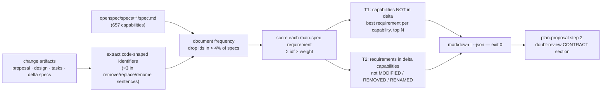

## Context

Motivation and spike numbers: see `proposal.md` → Why. The spike prototype
(`/tmp/spike/scan.py`, not committed) established what works; this design ports
its measured tuning to a Node script in the repo's enforcer style
(`scripts/*.mjs`, pure exported functions + thin CLI, tests in
`scripts/__tests__/`). Requirements: `specs/spec-collateral-scan/spec.md`,
`specs/plan-proposal-orchestrator/spec.md`.

## Goals / Non-Goals

**Goals:** a bounded, ranked candidate list a reviewer can check exhaustively;
deterministic; fast enough to run before every doubt cycle.

**Non-Goals:** deciding contradiction (the reviewer does); catching conflicts
that share no code identifier with the change (prose-only UI restructures).

## Decisions

### D1 — Code-shaped identifiers only

Identifiers are taken from backticked spans and from bare tokens — each still
passing the same shape test — in `proposal.md`, `design.md`, `tasks.md` and every delta spec. A token
counts only if it is code-shaped: contains one of `_`, `/`, `@`, `:`, `.`; or is camel/Pascal case
with an internal lower→upper transition and ≥ 6 chars; or is an UPPER_CASE
constant ≥ 5 chars; or is kebab-case with ≥ 2 hyphens. `@scope/name` packages
and `/api/...` routes stay whole; other `/` tokens are file paths and reduce to
their basename with extension (`index.css` — code-shaped via `.`), plus the
stem when the stem passes the shape test on its own (`pi-core-checker`, not
`index`). CSS custom properties (`--a-b`) count; a `--` prefix followed by a
word with no further hyphen (`--json`) is a CLI flag and does not (multi-hyphen
flags such as `--dry-run` do count — accepted noise, removed by the frequency
cap when common). A trailing `:line` citation suffix is stripped, since D5 asks
authors to cite `path:line`. Excluded capability names = every capability
directory in the corpus plus every capability the change's own delta names.
Any missing input artifact reads as empty. Capability names are excluded (every spec names its own). Surrounding
brackets/punctuation are stripped before the shape test, and a fixed stoplist
drops OpenSpec vocabulary (`ADDED`, `MODIFIED`, `REMOVED`, `RENAMED`,
`REQUIREMENTS`, `SHALL`, `MUST`, `WHEN`, `THEN`, `GIVEN`) and CLI flags
(`--x`) — dogfooding the prototype on this change ranked `MODIFIED`,
`RENAMED` and `[--json` as top identifiers.

*Why:* the spike's first version, which admitted capitalised words, ranked
`Tasks`, `Popover`, `Apply` highest (201 candidates, 1 hit in the top 10); the
shape filter is what moved precision@5 to 4/5. *Alternative rejected:* all
words with stop-listing — unbounded tuning, same noise.

### D2 — Rank requirements, weight change intent, cap document frequency

- Each identifier's weight = `ln(N / df)`; ×3 when any of its occurrences is in
  a sentence of the change that removes, replaces, renames, drops, retires,
  hides, narrows or forbids (max over occurrences — the verbs that create
  contradictions).
  A "sentence" is text split at `.`, `!` or `?` followed by whitespace, and at
  every line that starts a list item, heading or table row — so one bullet or
  one table row never shares a sentence with its neighbour.
- An identifier with df = 0 matches nothing (no `ln(N/0)`).
- An identifier is dropped when its document frequency exceeds
  `max(2, ⌊0.04 · N⌋)` (26 for today's 657 specs) — generic tokens like
  `SessionCard` otherwise dominate.
- A main-spec capability's score is its **best single requirement's** score (sum
  of matched identifier weights inside that requirement block), not the sum over
  the whole spec. *Why:* in the spike, whole-spec summing buried
  `openspec-task-toggle` (one requirement, one strong identifier) under large
  specs with many weak matches.
- Matching is token-bounded (the character before and after an occurrence is not
  `[A-Za-z0-9_-]`), so `pi-core-version` does not match inside
  `pi-core-version-check` but does match `pi-core-version.ts`.

### D3 — Two lists, advisory exit

- **T1** — capabilities not in the delta set, top N (default 10) by D2 score,
  each with its best requirement's name and the matched identifiers.
- **T2** — across all delta capabilities that exist in the main specs: their
  requirements that are not named under `## MODIFIED` / `## REMOVED` or as a
  `FROM:` of `## RENAMED`, and that match at least one identifier; sorted, then
  a global top N.
- Both lists state how many entries the cap omitted, so a reviewer knows the
  list is bounded, not exhaustive.
- Output: markdown (two tables + the identifier list used + omitted counts) or
  `--json` (`{ t1: { entries, omitted }, t2: { entries, omitted },
  identifiers: [{ id, weight }] }` — an array, not a serialised `Map`). T1 lists only capabilities with at least one matching
  requirement. A delta that MODIFIES a requirement under a reworded heading
  leaves the original unnamed, so it surfaces in T2 — intended: that is itself a
  post-archive inconsistency. Deterministic ordering: score
  desc, then capability name, then requirement name.
- Exit 0 whenever the scan completes, whatever it finds; exit 2 on any failure
  — usage (unknown change, missing specs directory) or runtime (unreadable file)
  — via a top-level catch naming the path. It never exits 1, deliberately
  departing from the enforcer convention (1 = violations found in
  `check-conventions.mjs` and siblings) so a failed scan can never be read as a
  gate verdict.
  Each main spec is read once (a single pass builds both document frequencies
  and requirement blocks).

### D4 — plan-proposal runs it before every doubt cycle

Step 2 runs `node scripts/spec-collateral.mjs --change <name>` before each
doubt-review cycle (the artifact changes between cycles) and appends the output
to the CONTRACT under *Candidate conflicting requirements (advisory scan) —
check each*. The candidates are not the CLAIM: they are facts about the corpus,
not the author's conclusion. Reconciling a candidate the reviewer flags follows
doubt-review's normal precedence; the fix for a real one is a MODIFIED/REMOVED
delta or an artifact correction; "unaffected" is reserved for a verified false
positive. After the scenario fold (step 3) the scan runs once more, because
folded tasks can introduce identifiers the review never saw; new candidates are
reported, and a real conflict sends planning back to step 2. A scan that cannot
run (or exits
non-zero) is reported and the cycle proceeds without candidates — the scan is
advisory in its failure path too.

*Evidence from planning this change:* the dogfooded prototype listed «Planning-
phase orchestration on develop, main session only» as an unmodified candidate;
the author dismissed it, and the cross-model reviewer, handed the same list,
correctly flagged its "interactively a second cross-model reviewer" clause as
contradicting this change. The list's value is in forcing the check, not in the
author's first read of it.

While this change MODIFIES the doubt-review trigger requirement anyway, its
stale clause "SHALL surface the interactive cross-model offer" is aligned with
the current `doubt-driven-review` skill: cross-model runs automatically when a
`@propose-review-N` role resolves, and the offer is surfaced only when none
does. Carrying the old wording forward would archive a contradiction with the
skill — the exact defect class this change targets.

### D5 — Reviewer and author hygiene

- `doubt-driven-review`'s adversarial template (SKILL.md and SKILL.agent.md) adds:
  verify each claim against the repository; if you cannot check it, write
  `unverified` instead of asserting; when the CONTRACT lists candidate
  requirements, check each and report every one the artifact contradicts. Wording
  stays engine-agnostic (published package).
- `plan-proposal` step 1 asks authors to cite `path` (and `:line` when specific)
  for every statement in `design.md` about existing code behaviour. Not gated —
  a citation makes a wrong claim cheap to spot for both author and reviewer.

## Risks / Trade-offs

- [Prose-only conflicts are missed] → accepted; stated in the CONTRACT heading
  as advisory, reviewer still owns contradiction-finding.
- [Multi-hyphen CLI flags count as identifiers] → accepted for now: `--dry-run`
  and `--accent-green` are lexically identical, and CSS custom properties are
  real contracts (`message-severity-tokens`). Evidence from this change's own
  post-fold re-scan: `--dry-run` alone pulled 4 packaging/publishing specs into
  the candidate list (all verified unaffected). If implementation measurements
  confirm flags dominate, prefer a context rule (`var(--x)` / CSS-file context
  keeps; a preceding command word drops) over a lexical one.
- [Adopted mockups are not scanned] → accepted; mockups carry little code
  vocabulary, and their contract lives in the delta specs the scan reads.
- [Scan cost grows with the corpus] → the spec pins the deterministic part
  (each spec read once); wall-clock is measured, not specified — the test plan
  carries a generous timed check on a synthetic 700-spec corpus that guards
  against an accidental quadratic, not against a slow runner.
- [Long candidate list is skimmed] → top-N cap (10) per list; T2 only lists
  requirements with at least one identifier match.
- [Identifier regex misses a code token] → the markdown output lists the
  identifiers used, so a reader can see what was (not) considered.

## Migration Plan

Additive script + skill text. No persisted state. Rollback: revert.

## Open Questions

- Whether to also feed the scan into `ship-it`'s generated reviewer prompt
  (after `harden-review-and-fix-loop` lands) — a follow-up that does not change
  this design.
