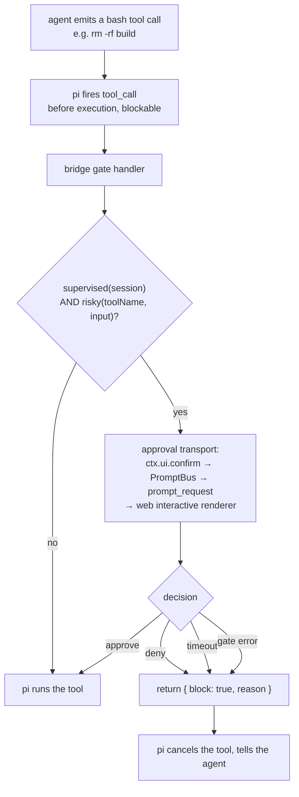

# Design — supervised mode (dashboard tool-approval gate)

## Origin

This change is one of six candidate adaptations mapped from a research pass over
[`pingdotgg/t3code`](https://github.com/pingdotgg/t3code) (a minimal multi-provider web GUI
for coding agents). t3code's **Runtime modes** feature (`docs/architecture/runtime-modes.md`)
offers a global switch:

- **Full access** (their default): `approvalPolicy: never`, `sandboxMode: danger-full-access`.
- **Supervised**: `approvalPolicy: on-request`, `sandboxMode: workspace-write`, prompting
  in-app for command/file approvals.

We already run pi sessions full-access. The question was whether "supervised" is buildable
against pi's runtime. A spike answered it.

## Spike — how pi surfaces tool approvals in `--mode rpc`

**Question:** when the dashboard spawns pi `--mode rpc`, do pi's built-in tool actions
(`bash`/`write`/`edit`) emit an interceptable approval we can render in the browser, or does
pi self-decide and run them silently?

**Answer: pi has no built-in approval prompt — by design — but exposes a blockable
`tool_call` hook that lets an extension build one. All rails to surface it in the dashboard
already exist and are proven in our own code.**

Verified facts (file:line, re-verified against `@earendil-works/pi-coding-agent@0.85.1`):

| Fact | Source | Consequence |
|---|---|---|
| "No permission popups. … build your own confirmation flow with extensions." | `README.md:503` | pi will run bash/edit with **no prompt** unless the host builds one. Nothing to "catch" passively. |
| "Pi does not include a built-in sandbox." | `docs/security.md:33-35` | We **cannot** replicate t3code's `workspace-write` in-process. OS confinement = container/VM only. |
| `tool_call` event: "Fired … before the tool executes. **Can block.**" Return `{ block: true, reason?, terminate? }`. | `docs/extensions.md:778-792` | The interception point. An extension can veto a tool before it runs. |
| Pipeline diagram: `tool_call (can block)` | `docs/extensions.md:304` | Confirms block is a first-class capability, not a side effect. |
| `isToolCallEventType("bash", event)` / typed inputs | `docs/extensions.md:778-836` | Gate can target specific tools + inspect args (command text, file path). |
| `ctx.ui.confirm` guarded by `hasUI`, which is **`true` in TUI and RPC modes** | `docs/extensions.md:972`, mode table `:2930-2937` | Confirm dialogs work in the RPC sessions the dashboard spawns. |
| Our bridge **patches `ctx.ui.confirm` onto PromptBus**, and callers render in the dashboard | `packages/extension/src/bridge.ts:2870`, `packages/extension/src/ask-user-tool.ts:438` | The confirm→PromptBus→web-renderer→response path is live and proven today. |
| **The whole interceptor is already shipped** — `createToolCallGuard` (confirm + fail-closed timeout + `{block:true,reason}`) and the pure `decideToolCall` policy engine | `packages/chat-gateway/src/guard/index.ts`, `.../policy.ts` (+ `__tests__/`) | The build is an **extraction**, not a green-field hook. |
| A second `tool_call` handler already exists in the bridge (event forwarding) | `packages/extension/src/bridge.ts:2602`; ordering `docs/extensions.md:790`; "`tool_call` errors block the tool (fail-safe)" `:2925` | The gate coexists with it; ordering + throw-semantics must be decided (D8). |
| `turn_start`/`turn_end` already first-class client-side | `packages/client/src/lib/event-reducer.ts` | Same interception family is available for the sibling checkpointing feature. |
| `pi.setActiveTools(["read","bash"])`, `--tools` allowlist | `docs/extensions.md:1677-1693` | A "read-only" preset is essentially free. |

**Composed mechanism (the whole feature):**



Every arrow above is either pi-native (`tool_call` block) or already shipping in this repo
(`ctx.ui.confirm` → PromptBus → renderer). No new session protocol for the approval loop.

**Blocker status: cleared.** Pre-spike this feature was "MEDIUM, gated by unknown"; post-
spike it is "MEDIUM, unblocked, mostly UI + one bridge hook." **Re-check (this pass):** the
hook itself now exists in shipped code, so the remaining work is *extraction + policy
widening + flag wiring + UI*.

## Design decisions

### D1 — Approval gating only; sandboxing is out of scope (delegated to containers)
pi refuses an in-process sandbox on purpose. We honor that: Supervised gates **whether** a
risky tool runs; it does **not** confine what an approved tool can touch. The UI copy MUST
avoid words like "sandboxed" / "safe" and instead say "approve each action." Users needing
real isolation run the session in the Docker path. This is the single most important framing
decision — it prevents a false security boundary.

**Coverage caveat (must be in the copy).** The gate sees **agent-initiated tool calls**
only. It does NOT cover: `user_bash` (the operator's own `!` prefix — a distinct event,
`bridge.ts:2104`, that never traverses `tool_call`), extension-initiated `executeBash()`,
or — pending open question 5 — tools run inside an `Agent` subagent. The copy says
"approve each action the agent takes", never a bare "approve each action."

### D2 — Risky-tool set is a matcher, default `{bash, powershell, write, edit, Agent}`
Read-family tools (`read`, `grep`, `find`, `ls`) are not in the default set. The set is
configurable (shared config) so a team can add custom tools or relax `edit`. Matching uses
`isToolCallEventType` for typed args so the prompt can show the actual command / path + a
diff preview, not an opaque tool name.

**The configured set is authoritative — there is no hardcoded read-family exemption.** The
spec's "read-family tools never prompt" is a statement about the *default* set, not an
override: an operator who deliberately adds `read` to the set gets `read` gated. A hidden
exemption list would be a second, invisible policy.

**`allow` beats `approval` in the shipped engine** (`policy.ts` precedence: explicit allow >
explicit approval > default). Under supervised's allow-first posture that makes an `allow`
entry a *silent un-gate* of an otherwise-risky tool. Kept (changing precedence would alter
shipped chat-gateway semantics), but the supervised config UI does not expose an `allow`
list — under `defaultAction: "allow"` it is redundant and only creates a footgun.

**Expressed in the shipped policy shape** (`packages/chat-gateway/src/guard/policy.ts`):
supervised = `{ approval: ["bash","write","edit","powershell"], defaultAction: "allow" }`.
This requires D7's enum widening — today `ToolDefaultAction` is `"deny" | "approve"` only.

**`powershell` is in the default set.** pi's built-in tools are `read, bash, powershell
(Windows), edit, write, grep, find, ls` (`README.md:588`). Omitting `powershell` leaves shell
execution ungated on Windows — a platform this repo actively supports (`qa/`).

**Name-drift is a fail-OPEN hazard under `defaultAction: "allow"`** (it is fail-closed for
chat-gateway, which is why the shipped code never had to worry). A renamed, aliased, or
MCP-provided mutating tool silently bypasses the gate. Mitigations, both required:

- **The drift test is an inverse allowlist, not a mutating-tool list.** Asserting "every
  known-mutating tool is in the risky set" is a tautology — the classification under test is
  the list itself. Instead the test pins a **read-family allowlist** (`read`, `grep`, `find`,
  `ls` — the tools it is safe to *not* gate) and fails when the host's tool inventory
  contains any name outside `readFamily ∪ riskySet`. A new pi tool, a rename, or an MCP
  addition then trips the test and forces a human classification instead of silently
  running ungated. The inventory comes from `pi.getAllTools()` at session start, so the
  assertion is a runtime check with a fixture-backed unit test, not a pure unit test.
- Tool names are compared case-insensitively. The repo is already inconsistent
  (`"Agent"` capitalised in `subagent-fanout-admission.ts:176`, lowercase elsewhere).

**`Agent` is a gate bypass** — a subagent can run shell out of the parent's sight. `Agent` is
in the default risky set (see the set above) rather than claiming coverage we do not have;
see the scope caveat in D1 and open question 5.

### D3 — Reuse PromptBus; do not invent an approval channel
Approve/deny is a `ctx.ui.confirm` (or a richer custom interactive payload) over the
existing PromptBus. This inherits first-response-wins, cross-surface dismissal, reconnect
replay, and the answered-prompt history card for free — the same guarantees `ask_user` has.

### D4 — Mode flag wiring (SETTLED — both arms ship)
The bridge hook needs to know a session is supervised. **Decision: ship both.**
- **(b) Shared-config default** (`~/.pi/dashboard`, alongside `askUserPromptTimeoutSeconds`)
  read at session start — sets the mode a new session starts in.
- **(a) Session-scoped control message** dashboard → bridge (`set_supervised {on}`), the
  live per-session override toggled from the session UI. One small control message; not an
  event-protocol change, and not part of the approve/deny round-trip.

**Mid-turn semantics (SETTLED):** the flag is read **per tool call**, so flipping Supervised
ON during a running turn gates the *next* tool call in that same turn. Flipping it OFF is
symmetric — the next call runs ungated. No turn-boundary deferral. An approval already
pending when the flag flips OFF is **not** auto-approved; it resolves normally or times out
(a pending prompt is a decision already in flight, and auto-approving it would be a silent
un-block).

**Performance budget (SETTLED):** on a **non-supervised** session the gate is a flag check;
p95 added latency per `tool_call` must stay **under 1ms**, asserted by a timed L1 unit test.
This is the honest replacement for the withdrawn "zero overhead" claim.

### D5 — Deny semantics fail closed
An unanswered approval (PromptBus timeout) or an explicit deny returns `{ block: true }`.
The agent receives the `reason` and continues (it may replan). We never silently run a tool
whose prompt was dismissed. Mirrors `add-chat-gateway`'s "unanswered approval fails closed."

### D6 — Extract the SHIPPED chat-gateway guard into a shared package (decided)
**Status corrected:** `add-chat-gateway` is archived (`openspec/changes/archive/
2026-09-18-add-chat-gateway`) and its L3 guard is **live code**, not a plan. It already
carries everything this change needs: `ctx.ui.confirm` escalation, a fail-closed approval
timeout (60s default, injectable `schedule`/`cancel` for tests), `{ block: true, reason }`,
and a pure, unit-tested decision engine.

**Decision:** lift `guard/index.ts` + `guard/policy.ts` into a surface-agnostic shared
package, and migrate chat-gateway to consume it. One primitive, two surfaces — Discord
buttons vs the dashboard approve/deny card differ only in how `ctx.ui.confirm` is routed.

Constraints the extraction MUST honor:
- The shipped spec `openspec/specs/chat-gateway/spec.md` — *"Hard in-session tool policy for
  spawned sessions"*, incl. *"Unanswered approval fails closed"* and *"Attached session is
  not gated"* — stays satisfied. Its existing `guard.test.ts` / `policy.test.ts` are the
  regression harness and must pass unchanged (move, do not rewrite).
- The published `./guard` export subpath of
  `@blackbelt-technology/pi-dashboard-chat-gateway-plugin` keeps working (re-export shim),
  and the `toolPolicy` / `guardExtension` config surface documented in
  `docs/chat-gateway.md` is unchanged.
- chat-gateway's `defaultAction` stays `"deny"`. The new `"allow"` arm is opt-in and used
  only by supervised mode.
- Rollback = revert the extraction commit. The guard holds no persisted state.

### D7 — Widen `ToolDefaultAction` with `"allow"` — type AND resolution AND validators
`decideToolCall` is deliberately deny-first: *"There is no 'unknown tool' allow path — an
unrecognised tool name is denied, which is what makes the default fail closed."* Supervised
mode is the inverse posture, so the enum grows a third arm:

```ts
type ToolDefaultAction = "deny" | "approve" | "allow";  // "allow" is new
```

**Widening the type alone is a silent bug.** The resolution is currently a binary ternary
(`policy.ts:60-68`): `(defaultAction ?? "deny") === "approve" ? approve : deny`. With only
the type widened, `defaultAction: "allow"` falls into the `else` and **denies every
non-approval tool** — supervised mode would block `read`. Four coordinated edits, all
required:

1. `decideToolCall` gains an explicit `"allow"` branch returning `{ action: "allow" }`.
2. The **absent** `defaultAction` keeps resolving to `"deny"` — no existing caller or
   persisted policy changes meaning.
3. `normalizeToolPolicy` (`packages/chat-gateway/src/server/config.ts:97-98`) coerces any
   non-`approve|deny` value to `deny`. It stays that way — **chat-gateway must NOT be able
   to configure `"allow"`**, so its `configSchema.json` enum stays `["deny","approve"]`.
   That is the point: the widened type is shared, the widened *config surface* is not.
4. `policyFromEnv` performs **no validation** today (`guard/index.ts`), so an env-supplied
   `defaultAction:"allow"` would be honored in a gateway session. The documented config path
   already coerces (`normalizeToolPolicy`) and the JSON schema already rejects `"allow"` —
   so this is defence-in-depth against the *undocumented* env path, not the primary control.
   **Ownership (resolves the D9 overlap):** `policyFromEnv` itself — the gateway-specific
   env NAME — stays in the chat-gateway package; the shared package exports a pure
   `parseToolPolicy(raw, { allowedDefaults })` validator that `policyFromEnv` calls with
   `["deny","approve"]`. Shared validation, gateway-local plumbing.

### D8 — Handler ordering and error semantics — the gate must fail closed ITSELF
There are already **two** `tool_call` handlers in the bridge, not one:
- the pass-through forwarder (`bridge.ts:2563`, `tool_call` is in `passThroughEventTypes`
  at `:2102`), and
- the subagent fan-out admission gate (`bridge.ts:2602`), which is itself blocking.

The supervised gate is the **third**. The bridge's own comment (`:2579-2585`) states
`runner.emitToolCall` **returns on the first handler that answers a blocking result** — so
handler order is behaviorally load-bearing, not cosmetic. Decisions:

- **Registration order: forwarder → fan-out admission → supervised gate.** The forwarder
  stays first for the reason already documented at `:2579` (a gate registered earlier
  starves it, and live UI would disagree with the transcript). The fan-out gate stays ahead
  of the supervised gate so its permit accounting (`tool_execution_end`, `:2606`) is not
  perturbed; a host-pressure refusal short-circuits the approval prompt, which is correct
  — there is nothing to approve if the call is not admitted.

- **Open risk, needs a spike before implementation: the fan-out permit window.** The fan-out
  gate adds a permit on admission and releases it **only** on `tool_execution_end`
  (`bridge.ts:2606`, `subagent-fanout-admission.ts`). With fan-out registered *before* the
  supervised gate, an `Agent` call can be admitted and then denied by the supervised gate —
  and the permit leaks unless pi still emits `tool_execution_end` for a tool blocked by a
  *later* handler. The bridge's existing comment asserts `tool_execution_end` fires on the
  blocked path, but that was written about the fan-out gate's **own** block. **Verify
  empirically**; if it does not fire, register the supervised gate *before* fan-out (a
  denied call is then never admitted, and no permit exists to leak).

- **The gate MUST NOT rely on pi's throw-is-fail-safe semantics.** `extensions.md:2925`
  says a throwing `tool_call` handler blocks the tool — but the bridge wraps **every**
  handler in `safe()` (`bridge.ts:898-915`), which catches sync throws, `.catch()`es async
  rejections, and returns `undefined`. `undefined` means **allow**. A supervised gate
  registered the conventional `safe(...)` way therefore **fails OPEN on internal error** —
  the exact inverse of D5. Resolution: the gate owns its own `try/catch` and returns
  `{ block: true, reason: "supervised: gate error" }` on any internal failure. It may still
  mechanism. **The gate is registered WITHOUT `safe()`** — wrapping it would re-introduce
  the fail-open path the moment its internal catch ever misses one (e.g. a throw in the
  wrapper-visible sync prologue). Its own `try/catch` is the total error boundary, and a
  unit test asserts: gate internals throw ⇒ result is `{ block: true }`.

- The gate awaits `ctx.ui.confirm`, holding the `tool_call` preflight open. Sibling tool
  calls are preflighted sequentially (`extensions.md:784`) — this is what makes open
  question 1 (N prompts vs batched) sequential-by-construction.

### D9 — The extraction is a parameterisation, not a byte-for-byte lift
The shipped guard is **not** surface-agnostic today:
- Its confirm copy is hardcoded chat wording: `"A chat user asked this session to run a
  tool that needs approval."` (`guard/index.ts:101-104`).
- Its block reasons are prefixed `chat-gateway:`, and `guard.test.ts` pins that prefix.
- Its handler signature is `(event: { toolName: string }, ctx)` and it passes only
  `event?.toolName` to `decideToolCall` — **`event.input` is discarded**. The contract
  requires the prompt to show the bash command text and the write/edit target path, so
  consuming `input` is mandatory.
- `policyFromEnv` reads `PI_EXT_CHAT_GATEWAY_GUARD_POLICY`, a gateway-specific env name
  that cannot live in a surface-agnostic module.

**Decision — one injected surface, covering presentation AND transport** (this supersedes an
earlier draft that split them and contradicted D10):

```ts
interface ApprovalSurface {
  /** Human-readable card built from the FULL tool_call event, incl. `input`. */
  buildPrompt(event: ToolCallEvent): { title: string; body: string };
  /** Block-reason namespace, e.g. "chat-gateway" | "supervised". */
  reasonPrefix: string;
  /** Cancellable request — NOT a bare Promise<boolean>. D10 needs `cancel`. */
  request(prompt: { title: string; body: string }):
    { decision: Promise<{ approved: boolean; surface: string }>; cancel(): void };
  /** REQUIRED, not optional — the observability contract is a SHALL. */
  onDecision(record: DecisionRecord): void;
}

type GateOutcome = "approved" | "denied" | "timeout" | "error";
```

**The guard result widens to carry the cause.** Today every negative path — explicit deny,
timeout, and a throwing confirm — collapses to `false` inside `withTimeout`, so the
spec's *"blocked outcomes are distinguishable"* requirement is unsatisfiable by the shipped
shape. The extracted guard returns `GateOutcome` internally and maps it to a block reason
via `reasonPrefix`. chat-gateway's surface maps **all three negatives to its existing single
string** `chat-gateway: approval_denied_or_timed_out`, so its shipped agent-visible behavior
is byte-identical; the supervised surface maps them to distinct reasons and logs the
distinct `GateOutcome`.

**Honest correction to D6:** `guard.test.ts` does **not** survive on an import-path change
alone — it constructs `ctxWithConfirm` with a bare function and asserts on the collapsed
reason string. It needs a thin chat-gateway `ApprovalSurface` adapter in its setup. Its
*assertions* stay unchanged (that is the regression guarantee that matters); its
*construction* changes. `policyFromEnv` stays in the chat-gateway package per D7#4. D6's
"move, do not rewrite" applies to the test **expectations**, not to the test setup and not
to `index.ts`.

**No default presenter.** `ApprovalSurface` is a required argument with no chat-flavoured
fallback — a supervised call site that forgets to inject fails to compile rather than
rendering "A chat user asked this session…" in the dashboard.

### D10 — One approval clock, not two
The guard runs its own `withTimeout` (60s default, `guard/index.ts:49`); PromptBus has an
independent default of 5 minutes (`prompt-bus.ts:98`, configurable via
`askUserPromptTimeoutSeconds`). Left as-is, the guard denies at 60s while the dashboard
keeps rendering an answerable approval card for ~4 more minutes; a late "Approve" resolves
a promise nobody awaits, and reconnect replay can resurrect a prompt whose gate already
blocked. The logged outcome then contradicts what the operator saw.

**Timeout value (SETTLED):** a dedicated config key
`supervised.approvalTimeoutSeconds` in `~/.pi/dashboard`, **default 120s**. Deliberately not
inherited from `askUserPromptTimeoutSeconds` (an approval gate and an `ask_user` question
have different urgency) and not the guard's hardcoded 60s (too tight for a phone-driven
session, which is a motivating use case). chat-gateway keeps its own 60s default — the
extracted guard takes the timeout as a parameter, it does not own a constant.

**Decision:** the guard timeout is the single clock, and on expiry the gate calls
`cancel()` on the `ApprovalSurface.request` handle (D9) so the card disappears on every
surface. This is precisely why the injected surface returns `{ decision, cancel }` rather
than a bare `Promise<boolean>`: `PromptBus.cancel(id)` needs the prompt id, which
`ctx.ui.confirm` never returns to its caller — so the dashboard surface implementation talks
to PromptBus directly rather than through the patched `ctx.ui.confirm`. An abort (Esc)
likewise cancels the pending approval rather than leaving the turn awaiting it.

### D11 — `answeredBy` is not obtainable today; v1 logs the surface, not the person
The observability requirement asks who answered. `PromptResponse.source` is an adapter
label, not a viewer identity — the web client hardcodes `source: "dashboard-default"`
(`packages/client/src/hooks/useSessionActions.ts:168`), and `GuardCtx.ui.confirm` returns a
bare `boolean`, discarding `source` entirely. Two approvals from two devices are
indistinguishable. Carrying a real identity would require extending `prompt_response` — the
protocol change this change forbids.

**Decision:** v1 logs `answeredSurface` (`dashboard` | `tui` | `chat-gateway` | `timeout` |
`error`), not `answeredBy`. Per-viewer attribution is deferred to whichever change
introduces authenticated viewer identity on `prompt_response`.

**Sink (named, not left vacuous):** `onDecision` writes a `pi.appendEntry(
"supervised-tool-decision", record)` — the same durable-entry mechanism the fan-out gate
uses for refusals (`bridge.ts:2596`) — plus a `console` line. A durable entry is required
because the failure this makes diagnosable ("why did the agent stop") often outlives the
live frame.

### D12 — A supervised, gateway-spawned session must not double-gate
The bridge is in every session; the chat-gateway guard is loaded only on the **spawn** path.
A gateway-spawned session with supervised mode ON would register both gates — two prompts,
or one short-circuiting the other by registration order. The shipped chat-gateway spec
covers "attached sessions are never gated" but says nothing about "spawned **and**
supervised".

**Decision:** the chat-gateway guard wins in a spawned session and the supervised gate
**self-disables** there — the gateway policy is deny-first and strictly stricter, and the
session's approvals already route to the chat surface. The supervised toggle is hidden (not
silently ignored) on gateway-spawned sessions, with a note explaining which policy is
active.

**Detection signal (it needs one — the bridge cannot infer this today).** The gate registers
unconditionally (the live toggle in D4 requires it) and self-disables, so "does not
register" would be wrong. The signal: the chat-gateway guard extension announces itself to
the bridge at load — the cleanest available hook is for the shared package to expose a
process-level `markToolGateOwner("chat-gateway")` that the guard calls on registration and
the supervised gate reads. Sniffing `PI_EXT_CHAT_GATEWAY_GUARD_POLICY` from `bridge.ts` is
rejected: that env var is only set when `toolPolicy` **and** `guardExtension` are both
configured, so absence does not imply "not gateway-spawned", and it couples the bridge to a
plugin-private env name.

### D13 — Packaging: a real workspace package, and an honest rollback
`packages/extension` cannot depend on the chat-gateway **plugin** package, so the shared
guard becomes its own workspace package (see open question 4). chat-gateway's published
`./guard` export subpath stays a real re-export file so downstream consumers do not break.
**Rollback is not "revert the extraction commit"** — that alone would restore two engines
while leaving the bridge gate importing a deleted module. Rollback = revert the whole
change (extraction + gate + wiring) as one unit; the guard holds no persisted state, so
there is no data migration either way.

**Release ordering (git revert is not the whole story).** The change publishes a NEW shared
package and a NEW chat-gateway version whose `./guard` is a re-export. npm publishes are not
cleanly reversible, so: the shared package must be published **before** the chat-gateway
version that depends on it, and a post-release rollback is a forward fix (a new patch
restoring the inlined guard), never an unpublish. See the `release-cut` / `release-revoke`
skills.

## Open questions

1. **Parallel tool calls.** pi preflights sibling tool calls sequentially then runs them
   concurrently (`extensions.md:784`). With several risky calls in one assistant message, do
   we present N prompts, or one batched approval? v1: N sequential prompts (simplest, and
   what sequential preflight gives for free — see D8); revisit batching if noisy.
2. **Diff preview cost.** For `edit`/`write`, computing a diff preview at approval time —
   render inline in the card, or a compact summary + expand? Lean compact + expand.
3. ~~**Live toggle mid-turn.**~~ **Answered — see D4:** immediate, per-call, symmetric in
   both directions; a pending approval is never auto-resolved by a flag flip.
4. **Where does the shared package live?** The D6 extraction needs a home — a new
   `packages/tool-gate`, or a subpath of `packages/shared`. Leaning a small dedicated
   package so the chat-gateway plugin does not pull in dashboard protocol types, and because
   `packages/extension` must not depend on the plugin (D13).
5. **Does the supervised gate see subagent tool calls?** Unverified: whether an `Agent`
   child's tool calls surface on the parent session's `tool_call` stream. If they do not,
   gating the `Agent` tool itself (D2) is the only coverage — which makes the scope caveat
   in D1 load-bearing, not cosmetic. **Must be answered by a spike before implementation.**
6. **Non-`ctx.ui.confirm` richer payload.** A yes/no confirm is enough for v1, but a custom
   interactive type (Approve / Deny+reason / Always-allow) may want a dedicated renderer.
   Start with confirm; grow into a custom renderer if D-follow-up (persistent allow-rules)
   lands.

## Alternatives considered

- **Wrap pi in an OS sandbox to mirror `workspace-write`.** Rejected: pi explicitly declines
  a partial in-process sandbox; the only real confinement is a container, which we already
  offer. Building a fake one would mislead users (D1).
- **Replace built-in tools with gated custom tools.** Rejected: heavier, brittle across pi
  upgrades, and redundant — the `tool_call` block hook is the supported extension point.
- **Server-side gating instead of in-bridge.** Rejected: the block decision must happen
  in-process with pi (the hook runs in the extension); the server has no pre-execution veto.
