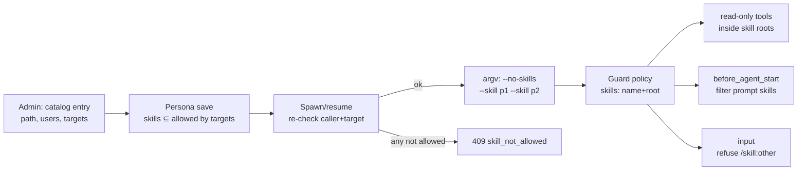

## Context

The team plugin (`packages/team-plugin`) spawns persona sessions with a fixed set of scope flags: `tools`, `skills`, `-e guard`, `appendSystemPrompt`, `noContextFiles`, `noProjectTrust` and `sessionDir`. Each session runs with the team guard extension (`src/extension/guard.ts`). For each tool call the guard checks two things:

- the tool name is in the persona's preset;
- for file tools, the canonicalised path is inside the target root.

These are the facts the design depends on, verified on the installed pi (`@earendil-works/pi-coding-agent`):

| Fact | Where |
|---|---|
| `--no-skills` drops discovered and settings-configured skills, but explicit `--skill <path>` still loads | `docs/cli.md:203`, `core/resource-loader.js:420` |
| Skills added by extensions through `resources_discover` are merged by `extendResources` with no `noSkills` check | `core/resource-loader.js:319-334` |
| `pi-hermes-memory` adds skills through `resources_discover` | `pi-hermes-memory/src/index.ts:87` |
| The `input` event fires before `/skill:` is expanded | `agent-session.js` `_queueUserInput`: `_runInputHandlers` → `_expandSkillCommand` |
| `input` can return `{action:"handled"}` (drop) or `transform` | `extensions/types.d.ts` `InputEventResult` |
| `before_agent_start.systemPromptOptions` is mutable, and its `skills` field is the list rendered into the prompt | `extensions/types.d.ts:701`, `system-prompt.d.ts` |
| The guard blocks a `read` of any `SKILL.md` outside the root | `guard.ts:91` |

## Goals / Non-Goals

**Goals**
- An admin decides which skills each user can use in each target, and the decision is enforced.
- The model can actually load a granted skill (`SKILL.md` plus its sibling files).
- No skill outside the granted set reaches the prompt or the conversation, whatever its source (disk, settings, package, extension). This holds for the `chat` and `files` presets. A `full` (bash) session can `cat` any file, so it is exempt; `full` is already single-user only (`persona.ts:124`).

**Non-Goals**
- Per-persona skill *versions*, and editing skill content from the team app.
- Changing pi core. The upstream `--no-skills` fix is filed as an issue only.
- Hardening the `full` preset (bash). It is single-user only, and bash can read any file by design.

## Decisions

### D1 — Catalog entry shape, legacy-compatible
`skillCatalog: Record<name, string | { path, users?, targets? }>`. A string value, or a missing `users` or `targets`, is treated as `"*"`. Normalisation happens once, in `skills-service.ts`, and every consumer reads the normalised entries.

**One identity: the catalog name *is* pi's skill name.** (pi loads a skill with an invalid name with a warning only, `skills.js:247-256`, so colon-named extension skills can exist. They can never be *granted*, because catalog names must be valid pi names, so they can only ever be filtered out.) pi matches `/skill:x` and lists skills by `Skill.name` (`agent-session.js:1661-1675`). Its names are `[a-z0-9-]`, at most 64 characters, with no leading, trailing or doubled hyphen (`skills.js:61-76`). On write, the server reads the skill's `SKILL.md` frontmatter `name` (falling back to the directory name, as pi does) and rejects the entry with `400 invalid_skill` (`fields.name = "name_mismatch"`) unless it equals the catalog name. Persona, guard, bridge and composer therefore all key on the same string. The `:`↔`-` alias probing of `bridge-prompt-expansion` is not needed for skills, because catalog names cannot contain `:`.

A legacy config string entry whose name does not match is logged and treated as `invalid` (`reason: "name_mismatch"`). It never fails activation. This is the one legacy break: personas that used an alias name stop starting until the admin renames the config key. The Skills panel lists such entries with an "invalid: name does not match the skill" warning, and the CHANGELOG calls it out.

- *Alternative:* keep a separate `skillAccess` map → rejected. It splits one fact across two places.

### D2 — Config entries plus managed entries
This is the same model as config projects vs folder-enabled projects:

- Config entries are read-only (`409 skill_readonly`).
- Managed entries live in `<teamHome>/skills.json` (written atomically, `schemaVersion: 1`).
- A name that already exists in either source → `409 skill_exists`.
- Admin-only in multi-user mode; the operator in single-user mode; everyone else gets `403`.
- **Precedence:** when config and `skills.json` both hold a name (for example, a config key added after a managed entry), the **config entry wins**. The managed one is reported `invalid` with `invalidReason: "shadowed_by_config"` and logged.
- `skills.json` is loaded once and then kept in memory; only the plugin writes it. A file that is unreadable or has an unknown `schemaVersion` at load is ignored and logged, so no managed entries are loaded and every D6 check of a managed skill fails closed. The admin `GET /skills` then carries `managedLoadError`, which the panel shows, and managed writes are refused (`503 skill_store_unavailable`) so the bad file is never overwritten blind.
- Managed writes run under one in-process mutex (read → check → atomic write), so two concurrent `POST`s of the same name to **one server process** give one `201` and one `409 skill_exists`. The plugin assumes one server per team home, the same assumption the persona store and conversation records already make (single-flight maps in `conversations.ts` are in-process). Cross-process lost updates are out of scope.

### D3 — Path validation
A path must be absolute. It must resolve through `realpath` to a directory that contains a regular `SKILL.md`. Single-file (`.md`) skills are **not** accepted: their only possible root is the file itself, so any sibling files they reference could never be read, which breaks the goal. The check works **in both directions**. The resolved path must not lie inside the team home or any project root, **and** it must not contain the team home, any project root, the pi agent dir (`~/.pi/agent`: `auth.json`, settings), the host sessions root (`piSessionDirForCwd`'s parent, which holds every team transcript, `conversations.ts:423`) or the dashboard home (`~/.pi/dashboard`). A root *inside* the agent dir, such as `~/.pi/agent/skills/review`, stays valid; one *containing* it, such as `~/.pi`, does not. This is the same rule as project paths (`team-agent-sessions/spec.md:22`). The first direction stops a `files` persona from rewriting a skill that another session trusts. The second stops a skill rooted at an ancestor such as `/data` from granting read access to every project and to the team home.

The path is validated on write and again on every spawn. An entry that has become invalid is logged without its path and treated as not allowed.

The **skill root** granted to the guard is that realpath directory.

### D4 — Access predicate
`allowed(entry, caller, target)` = (single-user mode, or `entry.users === "*"`, or the list contains `(iss, sub)`) **and** (`entry.targets === "*"` or the list contains `target`). Principals match exactly (`iss` and `sub` string equality), the same rule as project `users` (`team-agent-sessions` "Admin-configured projects").

Switching multi-user → single-user widens every user-scoped entry to the operator. This is intended, because single-user mode has one principal. The switch is noted in the Migration Plan.

`GET /me.skills` returns the names for which `allowed(entry, caller, t)` holds for at least one target the caller may use. The editor narrows this list further.

### D5 — Strict persona validation (decision 1c)
When a persona is written:

- Every skill must exist in the catalog.
- Every skill must satisfy `targets` for **every** id in `persona.projects`.
- For a private persona, every skill must also satisfy `users` for the owner.

Otherwise the write is rejected with `400 invalid_persona` (`fields.skills = "skill_not_allowed"`). A shared persona's `users` is not checked at save time, because its users vary; it is checked at spawn (D6).

**Fork** (`personas-service.ts:169` copies `skills` verbatim today): the fork keeps only skills that are allowed for the forking user *and* for every project the fork keeps, mirroring how fork already drops unusable projects and `bash`.

Error discriminator: `400 invalid_persona` + `fields.skills` is a *save* error; `409 skill_not_allowed` + `{skill, reason}` is a *start* error. Clients key on status code + `error`, never on the string alone.

- *Alternatives:* silently drop at spawn, or drop with a badge → rejected by the user. Strict refusal keeps the shared-persona contract honest.

### D6 — Start check, on every ensure
`ensureSession` computes `effective = persona.skills` on **every** path: create, resume **and reuse**. If any skill is missing, invalid or not allowed for `(caller, target)`:
- it answers `409 skill_not_allowed` with `{skill, reason}`, naming the first failing skill in persona order;
- it spawns nothing;
- on the reuse path, it also ends the live session.

Running the check on reuse is what makes config-file edits take effect: config has no change notification (D8), so a revoked config entry is enforced at the next open.

The window between this check and the spawn is a check-then-act gap. A concurrent **managed** revocation in that window is closed with a **catalog epoch**: D6 records the epoch it checked, and when the spawned session correlates (registers live), the plugin compares epochs. On a mismatch it re-runs `firstBlockedSkill` and, if the session is now blocked, aborts it and answers `409`. This covers the gap where a not-yet-registered session would escape the D8 pass. A concurrent **config-file** revocation is not caught until the next ensure; that window is milliseconds wide and accepted.

### D7 — Exact skill set at spawn
`scope.noSkills: true` is always set, together with `scope.skills = effective paths`. `noSkills` is already wired through `spawn-mechanism.ts:139,184` (`--no-skills`). No host change is needed for the flag.

**Size cap:** a skill path is at most 512 bytes (`400 invalid_skill`). With `skillsMax: 50` (`persona.ts:15`) and 64-byte names, the serialised set stays below about 30 KiB, so no separate set cap or extra refusal reason is needed. That is well under Linux `MAX_ARG_STRLEN` (128 KiB).

**Composition:** `cwd-policy.ts:131-139` may intersect `scope.skills` with a trusted cwd policy. None narrows skills today. If the composed set differs from the requested one, the plugin logs `team.skills_narrowed` and refuses the start (`409 skill_not_allowed`, `reason: "invalid"`) rather than silently running with fewer skills (contracted in `team-agent-sessions`).

**Policy transport:** `sanitizeExtensionConfig` keeps only `string | string[]` values (`packages/dashboard-plugin-runtime/src/server/server-context.ts:368-383`), so an array of objects would be silently dropped. The effective set therefore travels as one JSON **string**, `extensionConfig.team.skills = JSON.stringify([{name, root}])`, which projects verbatim to `PI_EXT_TEAM_SKILLS` (`process-manager.ts:379`). Size is bounded by `skillsMax: 50` (`persona.ts:15`) × (64-character name + path), well under env limits.

### D8 — Managed catalog change ends sessions whose grant changed (decision 2)
After a successful **managed** write, the plugin runs a **server-authority invalidation pass**, `invalidateSkill(name)`, modelled on `sweepIdle` (`conversations.ts:237-250`). It iterates the conversation records, not the caller's sessions. For each live session it re-checks owner binding (record `uk` == `principalOwner`) exactly as `sweepIdle` does, and ends sessions with `host.abortSpawnedRun({ sessionId, graceful: false })`. The pass is internal, reachable only from a successful admin catalog write, and never from ensure/resume/restart routes, so no caller can use it to end another user's session. Each end is audit-logged (`by=<admin uk>`, affected `uk`, target), and records are kept. It re-evaluates every live team session whose persona lists the skill. It ends a session only when one of these holds:
- the skill is now denied for that session's `(caller, target)`;
- the entry was removed;
- the resolved root changed (a path edit), meaning `realpath(new) !== realpath(old)`. A cosmetic edit, such as a trailing slash or a symlink to the same target, ends nothing.

A widening, or an edit that leaves the session's grant unchanged, ends nothing.

- Every affected session is ended **within 5 s** of the write's 2xx (decision C1, 2026-10-08).
- Revocation ends a session **even mid-turn**, non-gracefully (`graceful: false`), so the revoked root does not keep serving reads until the turn finishes. This is a deliberate exception to "Idle ending" (`team-agent-sessions/spec.md:212`, which never ends a streaming session for idleness), because revocation is a security event, not idleness.
- Conversation records are kept. The next open resumes, and D6 applies.
- Each ended batch is logged as `team.skill_invalidated name=<n> sessions=<k>`.
- **Impact preview.** `POST /skills/:name/impact` with a JSON body (admin, dry run, writes nothing; D14) answers `{ endSessions, blockedPersonas: [{key, name, lostTargets}], otherUsersPrivate }` using the same predicate. The panel shows it before Save or Remove (`team-app` "Admin Skills panel").

**Config entries:** the plugin reads config through a live getter (`team.ts:26,95`) and receives no change notification, so there is no reload hook. A config edit takes effect at the next ensure, through D6 on reuse, resume and create. A live, never-reopened session keeps its grant until it ends (idle ending, or a dashboard restart). This is accepted and documented in the README.

### D9 — Guard policy carries the skills
The guard reads `PI_EXT_TEAM_SKILLS` (a JSON string, D7) into `skills: [{ name, root }]` (the effective set only). The plugin always sets it, to `"[]"` when there are no skills. If it is **missing or unparseable**, `policyFromEnv` returns `null`, exactly like a bad `PI_EXT_TEAM_TOOLS` (`guard.ts:33-39`). The guard then never signals readiness, and the spawn is aborted with `503 guard_unavailable` instead of running a silently degraded persona. The guard reads the policy once at load: a revocation takes effect when D8 ends the session, and reads in flight in that window are accepted (Risks).

`decideToolCall` keeps checking the root as before. When a path-tool target lies outside the root, a **read-only** tool (`read`, `grep`, `find`, `ls`) is allowed when the canonical target is inside a skill root. `write` and `edit` are always confined to the target root. The guard uses the same `canonicalize` and `inside` helpers, so the symlink rules stay identical.

### D10 — Guard hides skills outside the set ("leaked names guarded")
- `before_agent_start`: filter `event.systemPromptOptions.skills` in place, keeping a skill only when its `(name, canonical filePath)` matches a policy entry: same `name`, and `filePath`, canonicalised with the same `canonicalize` helper (`guard.ts:41-56`), equal to `<root>/SKILL.md`. A leaked skill that reuses a granted name from another file, or a different skill planted inside a granted root, is removed. Never return a `systemPrompt` string, because that would override the bridge's and the persona's prompt contributions.
- `input`: parse with the shared `parseSkillCommand` (D13). If the input is a `/skill:<name>` that is not an effective name, **or** a `parseSkillBlock` envelope whose canonical `location` is outside the effective roots, return `{action:"handled"}` and nothing else. The guard does **not** call `ctx.ui.notify`: the bridge wraps that call with `runUiSafely` (`bridge.ts:3782`) because it can throw in some session shapes, and a throw inside the guard must never turn into a fail-open. The text is never expanded. In team chat the user-facing refusal comes from the bridge (D12); this hook is defense in depth.
- A missing or unparseable policy fails closed: the guard filters out every skill and refuses every `/skill:`.

**Spike 1.1 (2026-10-08, pi 1.0.0): confirmed.** `emitBeforeAgentStart` passes one shared `currentOptions` object to every handler and returns it. `_preparePromptAndToolLoadout(result.systemPromptOptions)` builds the run prompt from it (`agent-session.js:1587-1623`). The spike was run as `pi -p --no-skills --skill granted -e leaker -e filter`, capturing `before_provider_request`:

| Run | granted in prompt | leaked (ext) in prompt | hermes skills in prompt |
|---|---|---|---|
| control (no filter) | yes | **yes** | **yes (15)** |
| filter: in-place splice of `systemPromptOptions.skills` | yes | no | no |

The rest of the prompt is unchanged; the payload only shrinks by the size of the skill block. The leak is real and large: under `--no-skills`, `pi-hermes-memory` still injects 15 operator skills. The filter must mutate the array **in place** (splice), never reassign it and never return `systemPrompt`.

### D11 — Discovery source for the admin picker (spike 1.3: resolved)
The seam is the plugin service registry. The server registers `host.*` services in `server.ts` (`host.isProjectTrusted`, `host.knownFolderCwds`, …), and plugins read them with `ctx.consume(...)`, as `mcp-client-plugin` and `goal-plugin` already do.

This change adds `host.listOperatorSkills: () => Promise<{name, description, path, source}[]>`. It is built from a new exported helper, `listGlobalSkills(globalDir)`, in `pi-resource-scanner.ts`. The helper composes the exported `scanGlobalResources` (`:229`) and `resolvePackages` (`:372`) with the module-private `readSettingsPackages` (`:358`), which stays unexported. It does **not** use `scanPiResources(cwd)`, which always includes `scanLocalResources(cwd)` and local-settings packages (`:562-572`). It never returns project-local entries, and a test asserts this. `GET /skills/available` calls it.

When the service is absent (the plugin runs against an older host), the route returns `[]` and the panel offers only "Enter a path". Extension-discovered skills, such as hermes, are not listed; admins add those by path if they want them.

### D12 — Bridge-side skill expansion in team sessions (spike 1.2: new finding)
Team chat does not reach pi's `/skill:` expansion. `send_prompt` goes through the bridge (`packages/extension/src/command-handler.ts`):

- A single-line `/skill:x` parses as `slash`. `TEAM_ALLOWED_PARSED` excludes `slash`, so it is **silently dropped** and granted skills cannot be invoked.
- A multi-line `/skill:x\n…` parses as `passthrough`, which is allowed. The bridge then calls `expandPromptTemplateFromDisk` (`prompt-expander.ts`), which reads `<cwd>/.pi/skills`, `<cwd>/.pi/prompts` and **every** entry in `pi.getCommands()`. That includes extension-discovered skills and global prompt templates. The bridge sends the expanded `<skill name location>` envelope through `sendUserMessage`.
- pi's `input` event therefore sees the envelope, not `/skill:`. The guard check in D10 alone would miss it. This is a second content-leak path, and it also bypasses `--no-approve` for project `.pi/skills` and `.pi/prompts`.

pi-side refusal works for **skill expansion**: `input → {action:"handled"}` runs before `_expandSkillCommand` for every source, including `extension` (`sendUserMessage → prompt → _runInputHandlers`, `agent-session.js:1534-1543`). It does **not** cover extension commands: when `expandPromptTemplates: true`, `prompt()` runs `_tryExecuteExtensionCommand` **before** the input handlers (`:1522-1532`). Team sessions must therefore never reach a send with `expandPromptTemplates: true`; the bridge rule below guarantees that.

Decision:
1. **Bridge (authority for team chat).** In a team-confined session (`isTeamConfinedSession()`):
   - `parseSkillCommand` (D13) runs **first**, before `parseSendPrompt` routing and before any streaming/follow-up buffering. A refused `/skill:` is never buffered and emits no `queue_update`. The bridge answers with `prompt_received { sessionId, fresh: false }`, the same settlement as the existing team drop (`command-handler.ts:562-564`), so the optimistic bubble settles instead of hanging until the 30 s timeout. It **additionally** emits `command_feedback { command: "skill", status: "error", message: "skill not available" }`, which the existing drop does not, and which the team-app chat renders as an inline error (team-app "Skill availability feedback").
   - If the name is in `PI_EXT_TEAM_SKILLS`, the bridge reads `<root>/SKILL.md` through the existing `readTemplate` (`prompt-expander.ts:179-181`, which strips frontmatter and trims exactly like pi's `_expandSkillCommand`) and builds the envelope with the existing `buildSkillBlock` (`packages/shared/src/skill-block-parser.ts:91`). If the read fails (the file was deleted after spawn), the bridge refuses with the same feedback and settlement. It never falls back to sending the text unexpanded or resolving elsewhere. The result is byte-identical to the non-team expander, so `parseSkillBlock`, `SkillInvocationCard` and `firstMessage` condensing (`bridge-prompt-expansion`) keep working. The text then follows the normal delivery routing, including follow-up buffering when the session is streaming.
   - Never call `expandPromptTemplateFromDisk`: no local scan, no registry, no prompt templates. (Exec templates already never run on the multi-line path, because `expandPromptTemplateFromDisk` returns the raw text for `exec`, `prompt-expander.ts:366-368`, and the single-line slash path is already dropped. D12 keeps it that way.)
   - Any other leading-`/` text that is not a `/skill:` passes through **unexpanded** (`/compact` keeps its existing team allowance; other single-line slashes stay dropped as today).
   - **Invariant (regression-tested):** in a team-confined session, `sessionPrompt` is unreachable, and so are its flow fast-path, `tryDispatchExtensionCommand` (`expandPromptTemplates: true`) and `tryExecSlashTemplate` (exec templates run bash through `pi.exec`, outside the guard). Today `sessionPrompt` is reached only from the single-line `slash` branch (`command-handler.ts:698-710`), which the team drop at `:562` already blocks. The new `team_skill` route is handled before that branch and never delegates to `sessionPrompt`. Tests send a single-line registered extension command, a single-line exec template and a multi-line `/x↵args` exec template in a team session, and assert that nothing dispatches or executes.

   This narrows `bridge-prompt-expansion` "Template and Skill File Resolution" for team sessions, so that requirement gets a MODIFIED delta.
2. **Guard (defense in depth).** The `input` hook refuses `/skill:<name>` outside the effective set, **and** refuses text that parses as a skill envelope (`parseSkillBlock`) whose `location` is outside the effective roots.

A missing or unparseable `PI_EXT_TEAM_SKILLS` means an empty set, which fails closed.

### D13 — One `/skill:` parser for all three layers
`packages/shared` exports `parseSkillCommand(text) → { name, args } | null`:
- `text` must start with exactly `/skill:` (case-sensitive, no leading whitespace).
- `name` is everything up to the first whitespace character (space, tab or newline); `args` is the rest, trimmed.
- An empty name returns `null`.

The composer, the bridge and the guard all use it, so one input cannot pass one layer and fail another. Variants such as ` /skill:x` (leading space) or `/SKILL:x` are not skill commands in any layer, and pi does not expand them either (`agent-session.js:1662`, `startsWith("/skill:")`).

**Intentional superset of pi.** pi splits the name at the first *space* only (`agent-session.js:1663`), so to pi, `/skill:x\nargs` is not a skill command. The team parser also splits at tab and newline, so the composer's multi-line `/skill:review↵…` works. Team sessions never rely on pi-side expansion, because `sendUserMessage` defaults to `expandPromptTemplates: false` (`agent-session.js:1866`). The only effect of the wider split is that more inputs are *checked*: a tab/newline variant naming an ungranted skill is refused rather than passed through as literal text.

### D14 — Listing data and one blocking helper
One exported helper, `firstBlockedSkill(personaSkills, caller, target) → {skill, reason} | null`, implements D4 + D3 in persona order. Both D6 (ensure) and the `GET /agents` `skillBlock` use it, so card badges and `409` reasons cannot drift.

Admin listing usage counts `{personas, liveSessions}` come from one pass over the persona store and the live team-session index per request. The impact preview (D8) reuses the same pass with the proposed entry substituted. It is a `POST /skills/:name/impact` with a JSON body `{path?, users?, targets?, remove?}`, so principals and paths need no query-string encoding.

Non-admin catalog listings and `effectiveSkills` need a `description`. It is read from `SKILL.md` frontmatter at list time and memoised per entry by the **`SKILL.md` file's** `(realpath, mtimeMs, size)`. A directory's mtime would miss content edits. A same-size rewrite inside one mtime tick can serve a stale *description* until the next change; this is accepted, because descriptions are display-only and never used for access. If it is unreadable, the entry is listed with `valid: false` and no description. Validation (D3) runs once per catalog entry per request, not once per persona, so the cost scales with catalog size (small).

## Risks / Trade-offs

- **[Behavioral break]** Personas lose skills that had leaked in → a CHANGELOG entry, and the admin panel makes granting them explicit.
- **[Prompt-filter seam relies on pi internals]** → spike task 1 plus a regression test pinned to the pi version. The upstream issue removes the need for it long term.
- **[Skill root contains secrets]** → admins choose the paths; D3 forbids team-home and project-root paths; reads are read-only.
- **[Catalog change ends live sessions mid-turn]** → accepted (decision 2). The transcript is kept and the user simply reopens.
- **[`resources_discover` paths at runtime]** → filtered by D10 on every agent start, not only at spawn.
- **[Skill directory mutated after the grant]** Anyone with host write access to a granted directory can add files that the guard will then serve read-only. → Accepted. Admins choose the directories. D3 forbids team-home and project-root paths, so a `files` persona can never write into one. The guard re-canonicalises every path on every call, so symlinks out of the root are still blocked.
- **[Revoked skill text stays in history]** A resumed transcript still contains turns, and possibly the skill envelope, from before the revocation. → Accepted and documented. Revocation stops *new* use, not past turns. The session file is the user's own transcript.
- **[Config edits only apply at the next open]** (D8) → Accepted and documented. Admins who need immediate effect use managed entries or restart the dashboard.
- **[Legacy alias keys]** A config key that differs from the skill's pi name becomes `invalid` (D1). Remediation: rename the key, then re-save the affected personas; the editor flags the missing name. The operator's current config has no `skillCatalog` (checked 2026-10-08), so no known deployment is affected. The same applies to legacy single-file entries, which D3 now rejects.
- **[Project added inside or around a skill root]** This makes the skill invalid under D3. New opens fail closed through D6. Live sessions keep reading until they end. Accepted, like config edits.
- **[Catalog existence visible across targets]** A non-admin sees the name and description of a skill allowed in at least one of their targets, even if it is also granted elsewhere. Targets they cannot use are never shown. Accepted: the catalog is admin-curated, and the editor needs the union.
- **[Reads racing a revocation]** Between a managed revocation and D8 ending the session, the guard's load-time policy still allows reads in the old root (D9). Accepted: this is a seconds-wide window.
- **[Persona edits that change `skills`]** These follow the existing `personaStale` → restart flow. They are not a permission boundary, because the catalog is, and D6 runs on every ensure.

## Migration Plan

1. Ship with legacy string support. Existing configs keep working.
2. `skills.json` is created on the first admin write.
3. Rollback: revert the plugin. `skills.json` is ignored and the legacy map is still read.
4. Switching multi-user → single-user widens user-scoped entries to the operator (D4). This is documented in the README.

## Open Questions

- None open. (Closed: whether prompt templates could expand skills in team sessions. They cannot: pi-side expansion is off on the only entry path, `sendUserMessage` → `expandPromptTemplates: false`, and D12 removes the bridge's disk expansion.)
