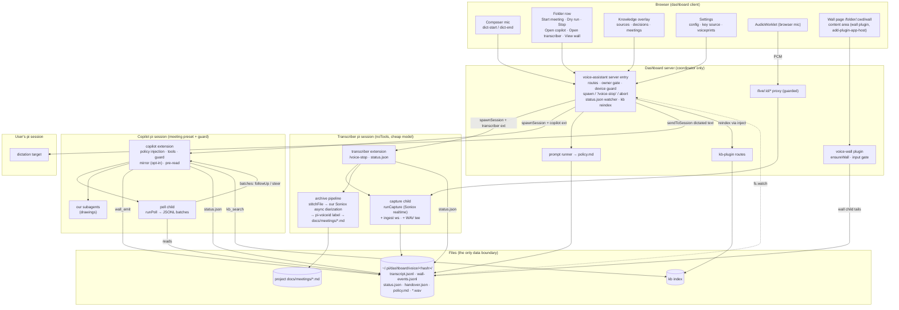
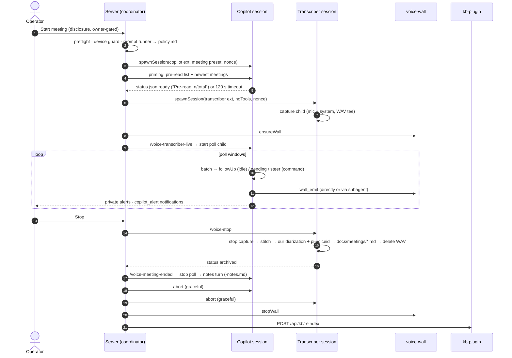
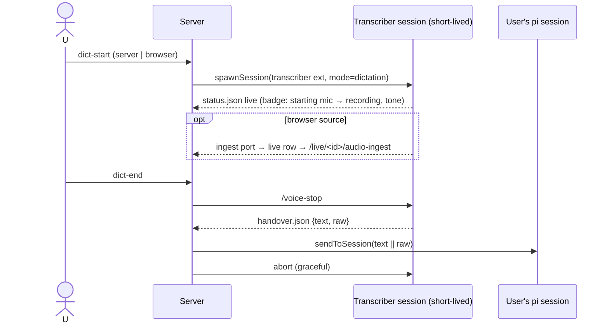
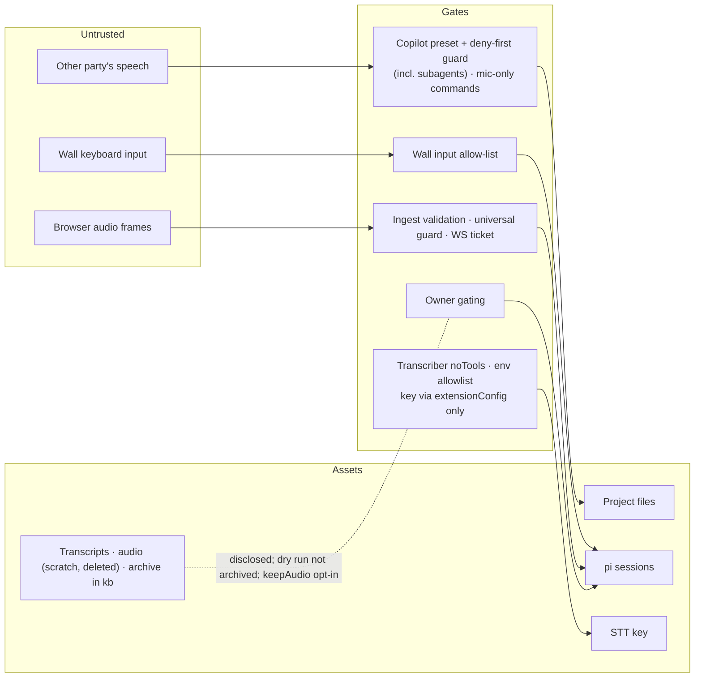

# Architecture — voice assistant + voice wall (rev. 2026-10-04)

"Copilot" = set-copilot's meeting-copilot **role**, played by a pi session. Voice handling and agent control are **pi-dashboard's own system**. set-copilot contributes vendored mechanics and field lessons (`references/`).

## 1. Components

## 2. Meeting lifecycle

## 3. Dictation

## 4. Trust boundaries

## 5. Own-system mapping (summary)

| Upstream (Claude Code) | Ours |
|---|---|
| `/ds` `/dd` | Composer mic (`composer-toolbar-action`) → short-lived transcriber session → draft |
| `/meeting-copilot` + Monitor loop | Folder row → copilot session with its own poll child |
| `capture --detach` | Capture child owned by the transcriber extension |
| `fork` producers | Our subagents + `wall_emit` |
| `mirror-follow` | Copilot extension `message_end` (opt-in) |
| `transcript` stitch | Transcriber archive + our Soniox async diarization + `pi-voiceid` |
| Desktop notify | `copilot_alert` → `ctx.ui.notify` |

## 6. Package map

| Package | Owns |
|---|---|
| `packages/voice-assistant-plugin` | coordinator server, client surfaces, transcriber + copilot extensions, runners, vendored engine |
| `packages/voice-wall-plugin` | wall children, `/live` registration, input gate, `./emit` |
| `packages/video-transcription` (existing) | STT key resolution, Soniox/AssemblyAI async, `pi-voiceid` speaker naming |
| `packages/kb-plugin` (existing) | kb config + reindex |
| `packages/client` (via `add-plugin-app-host`) | embedded wall app frame |
