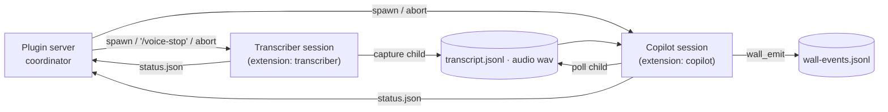

## Context

`set-copilot` (upstream, Tatár Gábor) turns speech into chat alerts, commentary and wall visuals. Its own architecture overview (`references/2026-10-03-set-copilot-architecture.html`) states the principles we keep:
- the session is the copilot;
- files are the boundaries;
- two channels (mic / system), never mixed;
- instructions skip the queue (fast lane, 250 ms tick);
- mechanics in code, judgement in config;
- the wall fails closed, dictation fails open.

Its field playbook (`references/2026-10-03-set-copilot-playbook.md`) supplies the operating lessons.

**We keep upstream's mechanics and replace its control plane with pi-dashboard's own system.** Voice handling and agent control are ours: spawned pi sessions, our extensions, our subagents and flows, our `video-transcription` and speaker-id. "Copilot" always means set-copilot's meeting-copilot **role**, played by a pi session; no Anthropic or Claude Code tooling is used.

**Revision 2026-10-04.**
- Transcription moves out of the dashboard server into a **separately spawned transcriber pi session**, short-lived for dictation and per meeting for meetings.
- The copilot session runs its own poll loop.
- The plugin server is a thin coordinator.
- Earlier revisions (server-owned runners, server-side poll parser) are superseded.

### Verified upstream facts (`32b6a7d`)

| Fact | Consequence |
|---|---|
| `runCapture` uses cwd-derived `loadConfig()`, calls `process.exit`, owns `SIGINT`/`SIGTERM`, logs to stdout | Runs in a child process of the transcriber session, never in the pi process or the dashboard |
| `runPoll(cfg, s): Promise<void>` writes batches, `capture-dead`, `wall-input` to stdout | Runs in a child of the copilot session; its stdout is the batch API |
| `loadConfig(root)` writes `.env` into `process.env` | Only inside those children |
| `handover.ts` outside the `index.ts` closure; `spawnSync(cmd,{shell:true})` hook path | Vendored explicitly; hook path never called |
| `capture.ts` calls `startDualCapture` inline | One carve-out (`captureFactory`) for browser-mic and audio tee |
| Soniox realtime reconnect unbounded, one clock (`2835e5d`); `{"type":"reconnect"}` lines | Adopted |
| Fast lane: `copilot … csináld/stop/vége` → `{"type":"command"}`; name addressing → `command:true`; poll returns early on these | Adopted unchanged (mechanics) |

### Our own system (verified on `HEAD`)

| Need | Ours |
|---|---|
| Spawn and control agent sessions | `ctx.spawnSession` (trusted plugin) with `pluginRef`, `principalOwner`, `scope { tools, noTools, extensions, extensionConfig → PI_EXT_<ID>_<KEY> }`; `onSessionResolved`, `abortSpawnedRun`, `sendToSession` (`/`-prefixed text → extension command dispatch), `onEvent`, `onSessionEnded` |
| In-session control | pi extension API: `registerCommand`, `registerTool`, `sendUserMessage(text,{deliverAs:"followUp"})`, `ctx.isIdle()`, `before_agent_start`, `tool_call`, `session_shutdown`, `ctx.ui.notify` |
| Sub-work inside a session | our subagents (`pi-dashboard-subagents` `Agent` tool) replace upstream's `subagent_type:"fork"` producers |
| Batch/after-meeting pipelines | pi-flows, available for v2 (`transcript-recover` equivalent) |
| Speech credentials, async STT, diarization | `packages/video-transcription`: `loadConfig` (keys `SONIOX_API_KEY` / `ASSEMBLY_AI_KEY` from env or gitignored `.env`), `SonioxClient` (stt-async-v3, diarization), `AssemblyAIClient` (EU) |
| Naming speakers | `pi-voiceid` (`voiceid.ts`): `label` writes `*.named.srt` from the voiceprint library `~/.pi/voiceprints/voiceprints.json` |
| Knowledge | `packages/kb` + kb-plugin routes (`/api/kb/config`, `/api/kb/reindex`) |
| Wall | `add-voice-wall-plugin` (`voice-wall` service, `./emit` schema export) |

## Own-system mapping (upstream → ours)

| Upstream (Claude Code) | Ours |
|---|---|
| `/ds`, `/dd` slash commands | Composer mic (`composer-toolbar-action`) → short-lived **transcriber session** → text into the composer draft (or sent, per setting) |
| `/meeting-copilot start\|stop\|status` | Folder-row Start / Dry run / Stop → **transcriber + copilot sessions**; status from runtime-dir `status.json` |
| `capture --detach` (escape the tool harness) | Capture child owned by the transcriber session's extension (no tool call involved) |
| Monitor loop on `set-copilot poll` | Poll child owned by the copilot session's extension; batches injected with `sendUserMessage(followUp)` when idle |
| `set-copilot prompt` loaded by the skill | `prompt` runner → `policy.md`; injected additively on every `before_agent_start` |
| `wall-emit` CLI | `wall_emit` tool (validates with `voice-wall/emit`) |
| `subagent_type:"fork"` producers for drawings | Our `Agent` tool (subagents) under the copilot preset, emitting via `wall_emit` |
| `mirror-follow` tailing the Claude transcript | Copilot extension `message_end` hook, opt-in |
| Stop hook guarding `transcript-recover` | v2 flow; v1 archives deterministically |
| `.set/copilot/<session-id>/` in the project | `~/.pi/dashboard/voice/<hash>/{dict-<sid>,meeting-<id>}/` scratch |
| Desktop notify | `copilot_alert` → `ctx.ui.notify` |
| `/set-repair` | Plugin activation reap + `session_shutdown` cleanup |
| `transcript` (stitch) after stop | Transcriber archive step + our Soniox async diarization + `pi-voiceid label` |

## Goals / Non-Goals

**Goals:**
- The dashboard server never hosts vendored code or audio.
- Every voice activity is a visible, stoppable pi session.
- Files are the only data boundary between sessions.
- Upstream guarantees are preserved (exactly-once handover, fail-open dictation, reconnect-with-replay, fast lane).
- Meetings end up named, stitched and indexed in kb.

**Non-Goals (v1):**
- the wall itself;
- browser capture of the other party;
- latency budgets;
- persistent copilot;
- the high-effort lane;
- the transcript split view;
- standalone apps;
- a `transcript-recover` flow.

## Decisions

**D1. Three roles, one package.**

- The package ships two extensions, `extension/transcriber` and `extension/copilot`, loaded **only** into the sessions the plugin spawns (`scope.extensions` + `extensionConfig`).
- There is no manifest `bridge`, and nothing is loaded into ordinary sessions.
- The plugin must be host-trusted (`priority <= 100`) to spawn.

**D2. Vendor the engine, one carve-out.**
- Import closure of the upstream engine modules, computed by script. Exclusions as before (`cli.ts`, `doctor.ts`, `diagnostics.ts`, `mirror-*`, `skill-install.ts`, `replay*`, `meeting.ts`, `detach.ts`, `project-registry.ts`, wall server/UI, `.claude/`, `hooks/`).
- The single patch adds an optional `captureFactory` to `CaptureOptions` (one call site, `capture-source.patch`).
- Our factory implementations wrap `startDualCapture` for (a) the browser-mic ingest source and (b) a **tee** that writes each channel's PCM to a scratch WAV for post-meeting diarization. Neither needs a further patch.

**D3. Children are owned by sessions, not the server.**
- Runners (`src/runner/*.ts`) are spawned by the extensions with `cwd = projectRoot`, `detached` (own process group), an env allowlist, `SET_COPILOT_DIR`, and the STT key where needed.
- On `session_shutdown`, the owning extension kills its children's groups.
- The server never imports vendored entrypoints (test-enforced).

| Runner | Spawned by | Does |
|---|---|---|
| `capture` | transcriber | `runCapture({ micOnly, maxMinutes, captureFactory })` |
| `handover` | transcriber (dictation) | `handoverTranscriptOnce` → stitch → `{text, raw}` |
| `archive` | transcriber (meeting) | `stitchFile` → stitched artifacts |
| `prompt` | server, before copilot spawn | `renderCopilotPrompt(loadConfig())` + instructions → `policy.md` |
| `poll` | copilot | `for(;;){ await runPoll(cfg, windowSec); print voice-batch-end }` |

**D4. Scratch and status files.**
- Scratch root is `~/.pi/dashboard/voice/<sha1(projectRoot)[:12]>/`: `dict-<targetSessionId>/` for dictation, `meeting-<meetingId>/` for meetings (new and empty per meeting). It is shared with `voice-wall`.
- Each extension writes `status.json` (`{ role, phase, detail, counters, updatedAt }`) atomically (temp + rename).
- The server watches runtime dirs with `fs.watch` (no timers) and maps the files to badges.
- `claimRuntimeDir` PID liveness stays the per-dir guard.

**D5. Transcriber session.**
- Spawned with `noTools: true` (no LLM tool surface) and the resolved `transcriberModel` (D20; intended cheap). It does no LLM work in normal operation.
- Its extension reads `PI_EXT_VOICE_*` (`mode`, `runtimeDir`, `source`, `maxMinutes`, `archive` settings).
- On `session_start` it spawns the capture child. It reports phases `starting → live → (reconnecting n) → stopping → handing-over | archiving → done | error`.
- Commands: `/voice-stop` and `/voice-status`.
- The STT key arrives through `extensionConfig` env, resolved by the server from our `video-transcription` `loadConfig` (same `SONIOX_API_KEY` source as `pi-transcribe`), with `ctx.credentials` as an optional override. With no tools, the session cannot echo it.
- Upstream `tones.ts` plays the rising tone when the mic is live.

**D6. Dictation via a short-lived transcriber.**
- `dict-start` (owner-gated, device guard) → spawn a transcriber (`mode: dictation`, source `server|browser`), correlated by a `runId` nonce, with a 30 s timeout.
- Triggered from the composer mic (`composer-toolbar-action`, D22), not the session card. The client takes `composer.snapshot()` at start.
- `dict-end` → `sendToSession(transcriber, "/voice-stop")` → the extension stops capture and runs `handover`. It writes `handover.json` `{text, raw}` and phase `done`.
- The server reads `handover.json` and returns `{ runId, text: text || raw }` (fail-open) to the requesting client, which calls `composer.insertAtCursor` (delivery `draft`, default) or insert + `composer.submit()` (delivery `send`, ≥ `minSendWords`). Then `abortSpawnedRun({ graceful: true })` ends the transcriber.
- No live handle (composer unmounted/switched): server retains `{targetSessionId, runId, text}`; next composer for that session offers Insert / Copy / Discard. Delivery `send` with no composer → `sendToSession(target, text)`; `false` → retained the same way.
- Cancel (`Esc`/cancel affordance, or hold released before `live`) → `/voice-stop` with discard + `composer.restore(snapshot)`.
- Modes `toggle` (default) / `hold` / `auto` + shortcut `Ctrl+M`. Default is `toggle`, not hold: spawn latency (seconds before `live`) makes push-to-talk feel broken until a warm transcriber exists.
- **Latency trade-off:** the mic goes live only after the pi session starts (seconds). The badge shows `starting mic` until phase `live` (and the tone). Accepted for v1; a warm transcriber is a v2 option.

**D7. Browser-mic (dictation only).**
- Browser: `AudioWorklet` → raw PCM matching `soniox-rt.ts`.
- The ingest `ws` server lives in the transcriber's capture child (`captureFactory`). Its port goes into `status.json`.
- The server registers it with `ctx.fastify.inject` (`POST /api/live-server/start`) and returns `/live/<id>/audio-ingest`, which runs over the existing `"live"` scope.
- `registerWsRoute` was rejected because it is genuinely-local only.
- Frames are format-validated. The option is hidden when `!isSecureContext`. The row is deleted when the transcriber ends.

**D8. Meeting = transcriber + copilot.**
- Start (owner-gated, device guard):
  1. preflight;
  2. `prompt` runner;
  3. spawn the **copilot** (D9);
  4. priming + pre-read (D11);
  5. spawn the **transcriber** (`mode: meeting`, tee on);
  6. `ensureWall` if `voice-wall` is present;
  7. running.
- Stop:
  1. `/voice-stop` to the transcriber → capture stops → archive (D13) → phase `archived`;
  2. the server signals the copilot (`/voice-meeting-ended`), which stops its poll child and runs the notes turn;
  3. the server ends both sessions, stops the wall, and reindexes kb.
- Dry run follows the same flow without archive or notes.
- Either session ending unexpectedly stops the meeting and archives what exists.

**D9. Copilot session.**
- `spawnSession({ cwd: projectRoot, model: resolvedCopilotModel /* D20 */, pluginRef: { voice: { meetingId, runId, role: "copilot" } }, principalOwner, scope: { tools: preset, extensions: [copilotExt], extensionConfig: { voice: { runtimeDir, policyFile, preset, mirror, wallInputAllowed, archiveDir } } } })`.
- It is fresh per meeting and never reused. Continuity comes from kb (D13).

**D10. Copilot extension.**
- **Policy:** additive section on every `before_agent_start` (never returns `systemPrompt`; coexistence test with the bridge in both orders).
- **Poll:** spawns the poll child after the transcriber is live and parses the JSONL (line cap; malformed/unknown → log + drop).
  - Lines between sentinels form one batch.
  - A reaction-worthy batch is delivered with `pi.sendUserMessage(batch, { deliverAs: "followUp" })` **only when `ctx.isIdle()`**; otherwise it merges into a pending payload (append; cap 200 lines OR 32 KB; oldest-drop + truncation marker), flushed on `agent_end`.
  - `{"type":"command"}` lines and name-addressed lines are delivered as `steer` (upstream "instructions skip the queue").
  - `capture-dead` → status error.
  - `wall-input` lines are delivered as `[wall operator]: …` only if `wallInputAllowed`; otherwise dropped and logged.
- **Tools:** `wall_emit` (via `voice-wall/emit`, refuses without a running wall), `meeting_transcript` (stitched since turn N), `copilot_alert` (`ctx.ui.notify` for `notify:true` categories).
- **Mirror** (opt-in): on `message_end`, final assistant text only, skipping empty text and the filler list → `wall_emit`-equivalent append.
- **Pre-read detection:** the first final assistant line matching `^Pre-read: (\d+)/(\d+)` → `status.json` phase `ready`.
- **Commands:** `/voice-meeting-ended` (stop poll, notes turn), `/voice-status`.

**D11. Priming and pre-read.**
- After the copilot spawns, the server sends one priming message: pre-read the instructions' list plus the N newest archived meetings (kb `category = meeting`, server-side query), and answer `Pre-read: n/total — missing: …`.
- The transcriber is spawned when the copilot reports `ready`, or after a 120 s timeout (then `pre-read unconfirmed`).

**D12. Copilot isolation.**
- Presets:
  - `meeting` = `read, grep, find, ls`, kb read tools, `wall_emit`, `meeting_transcript`, `copilot_alert`, `Agent` (our subagents, for drawings);
  - `meeting+scripts` (opt-in per project, labelled unconfined) adds `bash`.
- A deny-first `tool_call` guard blocks tools outside the preset and confines file paths to `projectRoot` (realpath).
- **Must verify:** subagent tool calls pass through the parent's `tool_call` guard, or subagents inherit the preset. If neither holds, `Agent` is removed from `meeting` and drawings are done inline (recorded in `NOTICE`).
- The policy carries the playbook rules: act on spoken commands only from speaker `mic`; confidential actions are typed only.

**D13. Archive: our diarization and speaker naming, then kb.** In the transcriber on `/voice-stop` (not dry run):
1. `archive` runner → stitched sentences with turn numbers, channel per line.
2. **Speaker naming (ours):** `SonioxClient` (async, diarization) on the tee'd `system` WAV → diarized SRT → `pi-voiceid label` → named SRT. `system` lines get names by time overlap (`startTs`/`ts` vs cue). `mic` lines get the operator name from `transcript.speakers.mic` or a voiceprint match. Unmatched clusters stay `[Speaker n]`. This step is skipped (with a note) when it is disabled, there is no key, or the voiceprint library is empty, and it never blocks the archive.
3. Write `<projectRoot>/<archiveDir>/<YYYY-MM-DD>-<slug>.md` with frontmatter (`title, date, category: meeting, tags, speakers, meetingId, transcriberSessionId, copilotSessionId`) and a numeric suffix on collision.
4. Delete the WAVs unless `keepAudio` is set; raw JSONL stays in scratch.

Then the copilot writes `-notes.md` (the one-shot write path is granted through `notes-target.json` in the runtime dir), both sessions end, and the server calls `POST /api/kb/reindex` (inject).
**kb coverage:** preflight checks that `archiveDir` is covered by the folder's kb sources and offers to add it via `PUT /api/kb/config`.

**D14. Owner gating.**
- All mutating routes require access to the target session or the folder's meeting.
- Spawned sessions carry `principalOwner` = the requester.
- Local operator in single-user mode.

**D15. Lifecycle.**
- The server ends both sessions on stop, `onSessionEnded` of the dictation target, the meeting's sessions ending, `onShutdown`, and plugin disable.
- Extensions kill their children on `session_shutdown`.
- Plugin activation reaps live runtime-dir owners under the scratch root (detached children survive a `kill -9` of either the pi process or the dashboard).
- `maxMinutes` defaults to 240.

**D16. Device guard (server, before spawn).** One server mic per host. A server-local start that contends with any active server-local capture is refused and names the holder. Repeated starts are idempotent. Browser dictation is exempt.

**D17. Knowledge (unchanged).** kb first, vendored adapter as fallback. The keyword index is seeded into the runtime dir before capture. Zero kb queries per line. The knowledge browser lists archived meetings.

**D18. Slots.**
- Composer toolbar (`composer-toolbar-action`, D22): dictation mic + state (phases from the transcriber's `status.json`), source menu (server/browser).
- Folder row: Start meeting / Dry run / Stop / Open copilot / Open transcriber, plus phase badge. The wall's folder entry and menu items belong to the wall plugin (D19).
- Spawned sessions' own cards: role badge (transcriber / copilot) + Stop.
- Knowledge overlay route.
- Global `settings-section`: global model defaults (D20), STT key status from our `video-transcription` resolution + optional `ctx.credentials` override, voiceprint library status.
- `folder-settings-section` (D21): `set-copilot.config.json` editor + per-folder model overrides, for the route's `cwd`.

**D20. Model selection: global default + per-folder override.**
- Global settings renders two `ui:model-selector` pickers (copilot, transcriber) for the global defaults (`copilotModel`, `transcriberModel` in `configSchema.json`); the folder section (D21) renders two override pickers with an "inherit global (<ref>)" option.
- Overrides live in the plugin-config store as `folderModels[<cwd>]`, not in `set-copilot.config.json`: model refs name providers local to this host, and the project file is shared via git.
- Resolution per spawn: `folderModels[cwd][role] ?? global[role] ?? undefined` (undefined → pi default model).
- Preflight checks the resolved ref against the model registry and names its source on failure; override writes are gated by the known-folder allow-list.
- Rejected: per-project only (forces re-picking in every folder); storing in `set-copilot.config.json` (leaks host-local provider names into the repo).

**D21. Folder settings plugin sections (core seam).**
- New slot `folder-settings-section`, props `{ pluginContext, cwd }`, claim `label` required. Declared in `shared/src/dashboard-plugin/slot-types.ts` + `slot-props.ts`; validated in `dashboard-plugin-runtime/src/manifest-validator.ts`; consumer `FolderSettingsSectionSlot` in `slot-consumers.tsx` inside the slot error boundary.
- `DirectorySettings.tsx` adds a **Plugins** nav group (hidden with zero claims) → `/folder/:cwd/settings/plugins/:pluginId`; page id `plugins` + second segment parsed like global settings' `activePluginId`.
- Relaxes settings-panel's "folder-scoped settings route SHALL NOT host plugin pages": only `folder-settings-section` claims render there; global `settings-section` pages never do.
- Why core, not a plugin overlay route: per-folder config is a recurring need (kb-plugin's `/folder/:encodedCwd/kb` overlay is the workaround); one discoverable place beats per-plugin pills.
- Rejected: folder selector inside the global section (the old D18 design) — the user wants overrides where the folder lives; plugin `shell-overlay-route` per folder — not discoverable from folder settings.
- Compatibility: additive slot; existing folder pages and the invalid-page fallback unchanged for plugins without the claim. Rollback: drop the slot and the nav group; voice-assistant falls back to a global-section folder selector.

**D22. Composer toolbar action slot (core seam).**
- New slot `composer-toolbar-action` in `CommandInput`'s input-row trailing cluster, before the inline terminal + morphing send/stop button. Props `{ pluginContext, sessionId, sessionStatus, draft, composer }`; claim requires `ariaLabel`.
- `composer` handle = bounded writes: `insertAtCursor`, `snapshot`/`restore`, `submit` (honours `Steer | Queue`). No arbitrary replace. Handle inert after unmount/session switch.
- Never displaced: visible with text, attachments, or while working; not folded into `⋯` at narrow width; 44 px target narrow.
- Why: every surveyed chat UI (ChatGPT, Codex, Cursor, VS Code Copilot Chat, claude.ai) puts the mic in the composer next to send, inserting into the draft. Their reported bugs — mic hidden with text/attachments (claude.ai), replaced by stop while agent runs (Cursor), "recording" before audio flows (Codex) — become requirements here.
- Rejected: `composer-panel` (renders below the card; nobody places a mic there); session-card action bar (the old D18 — sends without review, away from where the user types).
- Compatibility: additive; no claim → composer unchanged. Rollback: drop the slot; dictation falls back to `composer-panel` with `onApplyText`.

**D19. Live wall = the wall plugin's folder page (no own seam).** The wall belongs to the meeting, the meeting to the folder. The wall plugin embeds its app like the OpenSpec board (`add-plugin-app-host`): its own state-only folder entry (`● Live wall →`), its folder-menu items (Live wall · Open wall standalone · Share live wall…) and the page `/folder/<encodedCwd>/wall` in the content area beside the sidebar (`shell-overlay-route`, `presentation: "content"`). Voice-assistant adds no wall menu item; it links to that route from the copilot session header and the meeting toast while a wall runs. Fallback without the app host: `/apps/wall/…` in a named window. With no meeting running: no wall tile and no wall menu items (only the voice-assistant MEETINGS tile and *Start meeting…*); a stale link or reload of `/folder/<cwd>/wall` shows the wall page's empty state (*No live meeting*, *Start meeting…* opening this plugin's start dialog, and the last meeting's wall read-only from its archive) instead of redirecting. The meeting archive therefore keeps `wall-events.jsonl`. Superseded: the live-target bridge and the `/open/wall/…` full-screen frame.

## Risks / Trade-offs

- **[Risk] Dictation start latency** (a pi session spawn before the mic is live). Visible `starting mic` + tone; warm transcriber in v2.
- **[Risk] Process count:** 2 pi sessions + 2–3 children per meeting. Bounded by the device guard; cheap model and `noTools` for the transcriber.
- **[Risk] Spoken prompt injection.** Preset + guard, `mic`-only commands, wall-input gating.
- **[Risk] Subagents might bypass the guard.** Verified before `Agent` stays in the preset (D12).
- **[Risk] Audio retention:** tee'd WAVs hold both parties' voices. Deleted after archive by default; `keepAudio` is explicit and disclosed.
- **[Risk] Meeting PII in the project tree and kb.** Disclosed at start; dry run never archived.
- **[Risk] Voiceprint misattribution.** Conservative `pi-voiceid` gates (threshold, margin, min segments); unmatched clusters stay anonymous; names are marked as machine-assigned in frontmatter.
- **[Risk] `status.json` watcher misses** (`fs.watch` semantics differ by platform). Re-read on every session event via `onEvent` as a backstop; no polling timer.
- **[Risk] `fastify.inject` and the universal guard.** Verified in `add-voice-wall-plugin` 1.4.
- **[Risk] Upstream drift.** SHA pin, patch, closure script, parser fixtures.

## Migration Plan

- Land `add-voice-wall-plugin` first (it provides `./emit`).
- Add the package, then `pnpm install`, `npm run build`, `curl -X POST :8000/api/restart`.
- The plugin must be host-trusted.
- Rollback: disable/remove. Sessions are ended, children reaped, live rows deleted; archived meetings remain as markdown.

## Open Questions (v2)

- warm transcriber for dictation;
- persistent copilot (shared get-or-create helper);
- high-effort lane via our subagents;
- `transcript-recover` as a pi-flows flow;
- transcript split-view page;
- `app-kit` standalone apps;
- server-enforced per-box wall cadence;
- command-word false positives (upstream).
