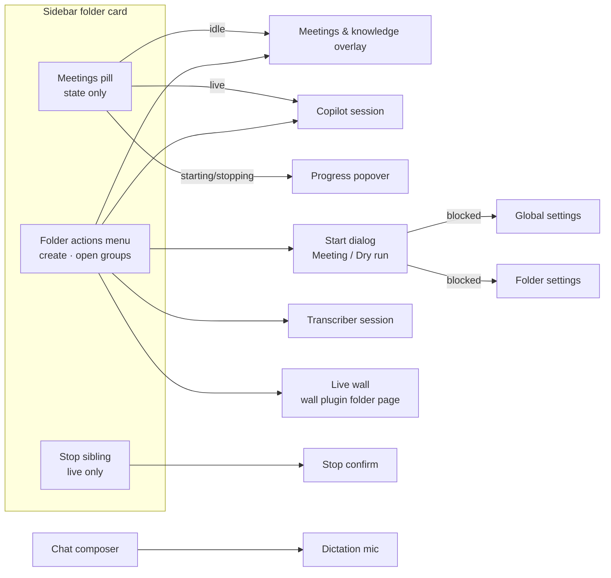
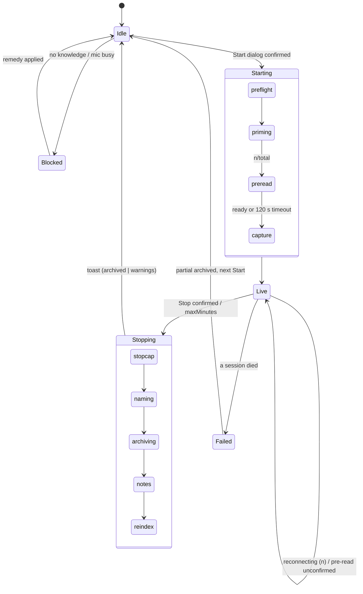

# voice-assistant plugin — UX design + UI plan

Grounded in shipped sources, never invented:

- `packages/dashboard-plugin-runtime/src/SlotPill.tsx` — state-only folder pill (single `role=button`, capsule legend, accent glyph).
- `packages/client/src/components/folder/FolderActionsMenu.tsx` + `docs/migration/slot-pill-actions-to-folder-menu.md` — folder verbs are declarative `useFolderMenuItem` contributions, groups `workspace|directory|create|open|maintenance`, `badge` + `aria-disabled` items.
- `packages/kb-plugin/src/client/FolderKbSection.tsx` — the precedent for a state-varying menu item (`kb-reindex`) and for a **sibling** control outside the pill's button root (card placement).
- `packages/client/src/components/session/SessionCard.tsx` — compact action-bar buttons + badges.
- `packages/client/src/index.css` → `tokens.css` (dark + light), `--severity-*` palette as used by `FolderActionBanner`.

Every colour in the mockups is a `var(--token)`; the one literal is SlotPill's cyan, which ships as a Tailwind class, not a CSS variable.

## 1. Users and jobs

| User | Job | Primary surface |
|---|---|---|
| Operator in a meeting (on the dashboard host) | Start a copilot for a call, see it's live, stop it, get the transcript + notes | Folder row → start dialog → live pill → toasts |
| Same operator, later | Find what was said/decided; let the next meeting know | Meetings & knowledge overlay |
| Anyone at a session (local or remote/phone) | Speak a prompt instead of typing | Composer mic (dictation) |
| Host admin | Pick models, key, defaults, risk allow-lists | Global + folder settings |

## 2. Information architecture

Meetings belong to a **folder** (spec `voice-assistant-copilot-control`), dictation to the **chat composer** of a session (mic before send/stop, text into the draft). The session card carries no meeting or dictation control.

## 3. Meeting lifecycle (what the pill shows)

Dry run walks the same machine, skips naming/archiving/notes/reindex, and labels itself `dry run` in the pill.

## 4. Key flows

**Start a meeting (happy path, 3 interactions):** folder menu → *Start meeting…* → dialog (title optional) → *Start meeting*. The pill walks `preflight → priming copilot → pre-read 4/7 → starting capture → ● live 00:00`.

**Blocked start:** the item stays visible and focusable but is `aria-disabled`, with a reason badge (`knowledge required`, `mic in use: dictation · fix-auth`), and the remedies sit next to it. Inside the dialog, preflight failures use a GOV.UK error summary that links each problem to where it is fixed.

**Stop:** sibling *■ Stop* (or menu *Stop meeting…*, or *Stop meeting* on either spawned session card) → confirm (*Keep running* has focus) → stepper → persistent toast with *Open transcript* / *Open notes*.

**Dictate:** mic / `Ctrl+M` → `Starting mic…` (info blue) → `● Recording · <host>` (red, level meter) → mic / `Ctrl+M` → `Transcribing…` → inserted at caret (default) or sent (setting). `Esc` cancels and restores the draft. Not inserted (composer closed) → retained, offered with Insert / Copy / Discard.

## 5. Surfaces → tokens → states

| Surface | Slot / mechanism | Tokens | States (mockup) |
|---|---|---|---|
| Meetings pill | `sidebar-folder-section` → `SlotPill` accent `purple`; `yellow` warn, `red` error | SlotPill classes; `--accent-purple`, `--severity-*` | idle (n archived) · needs knowledge · starting ×4 · live · live degraded ×2 · dry run · stopping ×5 · failed — `folder-row.html` |
| Meeting verbs | `useFolderMenuItem`: `create` = Start meeting… / Dry run… ↔ Stop meeting… (same id, label morphs); `open` = Open copilot · Open transcriber · Meetings & knowledge · remedies | FolderActionsMenu item classes, `badge`, `aria-disabled` | enabled · disabled+reason · live — `folder-row.html` |
| Stop sibling | Rendered next to the pill **outside** its `role=button` (FolderKbSection card precedent); live only | `--severity-error-*` | live / dry run — `folder-row.html` |
| Start dialog | Plugin modal (`role=dialog`, focus trap, Esc) ; sheet < 640 px | `--bg-secondary`, `--severity-*`, `--accent-purple` primary | ready (+kb-coverage offer) · dry run · blocked — `start-dialog.html` |
| Stop confirm / progress / toasts | `alertdialog`; popover `role=status aria-live=polite`; persistent toasts | `--severity-*` | confirm · stepper · archived · no names · no notes — `meeting-stop.html` |
| Spawned session cards | `session-card-badge` role badge + `session-card-action-bar` Stop meeting | purple role chip | copilot · transcriber — `meeting-stop.html` |
| Dictation | `composer-toolbar-action` (new core slot, D22) | neutral idle, `--severity-info-*` starting/processing, `--severity-error-*` recording, `--severity-warning-*` retained/not configured | 12 states — `composer-dictation.html` |
| Live wall | wall plugin's folder entry + menu items + page `/folder/<cwd>/wall` in the content area (`add-plugin-app-host`, OpenSpec-board style); voice-assistant links from copilot header + toast; standalone `/apps/wall/…` | board-style top bar; wall `HeaderContext` = meeting chip | `wall-view.html`; `../../add-plugin-app-host/mockups/embedded-app.html` |
| Meetings & knowledge | `shell-overlay-route` `/folder/:encodedCwd/voice-assistant-knowledge`, tabs Meetings · Decisions · Sources | `--bg-tertiary` rows, `--accent-purple` tab indicator | live strip · populated · partial/notes-missing · fallback · empty · invalid — `knowledge-browser.html` |
| Global settings | `settings-section` | form tokens | models · key · voiceprints · meeting defaults · scripts allow-list — `global-settings.html` |
| Folder settings | `folder-settings-section` (D21) | form tokens | config editor + operator name + model override — `config-editor.html` |

## 6. Cited rules

1. **Nielsen #1, visibility of system status.** Every lifecycle phase is visible on the pill. The stop stepper is determinate. `Starting mic` ≠ `Recording`.
2. **Nielsen #3, user control (emergency exit) + Fitts's law.** Stop is one click away while live (sibling), not two levels deep in a menu.
3. **Nielsen #5, error prevention.** The stop confirm defaults focus to *Keep running*. Disabled actions carry their reason. The dry run is labelled everywhere.
4. **Nielsen #6, recognition over recall.** The device guard names the holder. Model checks name their source (folder override / global / pi default).
5. **Nielsen #9, recover from errors.** Undelivered dictation keeps its text. Partial meetings are archived and labelled. Every failure links to its fix.
6. **GOV.UK error summary.** Count heading, one link per problem, focus moved to the summary (start dialog C).
7. **Progressive disclosure (NN/g) + Hick's law.** Passed preflight checks collapse to one line; warnings are lifted out. A single-option source picker collapses to a label.
8. **WAI-ARIA APG.** Menu items use `aria-disabled` and stay focusable. Tabs use `tablist`/`tab`/`tabpanel`. Dialogs are `aria-modal`. The stop confirm is an `alertdialog`.
9. **WCAG 1.4.1, use of colour.** Every state pairs an icon or dot with a word. Live = red dot + "live" + timer.
10. **WCAG 1.4.3, contrast.** Meaningful small text uses `--text-secondary`. `--text-muted` (#aaa on #fff ≈ 2.3:1) is banned for text in the mockups.
11. **WCAG 2.2.1, timing adjustable.** Toasts with links persist until dismissed.
12. **Gestalt common region / Nielsen #2.** Both spawned sessions show the *meeting* role, and Stop on either ends the whole meeting.

## 7. Spec gaps found while designing — fold into the change

| # | Gap | Proposed resolution | Touches |
|---|---|---|---|
| G1 | Specs say "From the folder row the system SHALL offer Start meeting…". The shipped folder row forbids actions in pills (`move-slot-actions-to-menu`). | The verbs become `useFolderMenuItem` contributions (`create` / `open`). The pill is state-only. | `voice-assistant-copilot-control` req 1, design D18, task 8.2 |
| G2 | Stop is two clicks deep in a menu while a meeting is live. | A sibling Stop next to the pill (live only), following the FolderKbSection precedent. Needs a `directory-card-layout` check that a sidebar-placement sibling is acceptable. | design D18, task 8.2 |
| G3 | No stop confirmation in the spec, though a stop is irreversible. | Add the stop-confirm `alertdialog` (dry run variant). | `voice-assistant-copilot-control` Stop sequence, task 8.2 |
| G4 | The pill's activation target is unspecified. | idle/failed → Meetings & knowledge; live → copilot; starting/stopping → progress popover. | design D18 |
| G5 | Start dialog title/slug input is not specified, but the archive file name needs a slug. | Optional *Title*, default `meeting`. | `voice-assistant-copilot-control` Disclosure, task 8.3 |
| G6 | The `transcript.speakers.mic` operator name has no UI. | A field in the folder config editor. | `voice-assistant-config-editor`, task 8.7a |
| G7 | Meeting defaults (`archiveDir`, `priorMeetings`, `maxMinutes`, `speakerNaming`, `keepAudio`, `scriptsProjects`) have no settings UI. | A *Meetings* fieldset in global settings. | task 8.7 |
| G8 | Dictation *Discard* is not in the spec. | Allow discarding retained text after delivery failure / target end. | `voice-assistant-dictation-control` |
| G9 | Partial / notes-missing meetings are not distinguished in the knowledge view. | Labelled rows (`partial: copilot ended`, `Notes not written`). | `voice-assistant-knowledge-browser` Archived meetings |

## 8. Naming

Product/plugin `voice-assistant`. Upstream references (`tatargabor/set-copilot`, `set-copilot.config.json`, `src/vendor/set-copilot/`) are kept as they are. Dictation is one icon-only mic toggle with an `aria-label` naming the action and shortcut; `dict-start` / `dict-end` remain internal route names only.

## 9. Screens

`index.html` (grouped nav) · `folder-row.html` · `start-dialog.html` · `meeting-stop.html` · `wall-view.html` · `composer-dictation.html` · `knowledge-browser.html` · `global-settings.html` · `config-editor.html`. Shared primitives are in `va.css`; tokens are in `tokens.css`; `?theme=light` forces the light theme.
