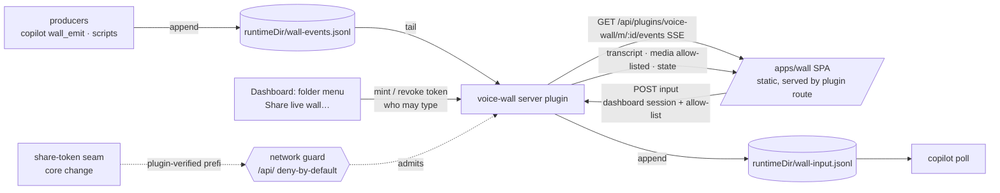

# voice-wall — UX design + UI plan (wall app at `/apps/wall`)

Direction (decided 2026-10-05, replaces the vendored-wall-behind-`/live/<id>/` plan):

- The wall is for a **shared screen and for meeting participants on their own devices**.
- It is our own app, **served by the dashboard** at `/apps/wall/` (same origin). It is not a separate origin like Team.
- **Viewers** join with a per-meeting **share link** (read-only capability token, expiring, revocable). **Typing** into the copilot requires **dashboard sign-in** plus the meeting's allow-list.
- v1 reproduces all upstream wall views: the board of areas (live feed), graph, presentation mode, transcript, media and operator input.
- A small separate core change adds a **share-token guard seam**. The wall app runs under a **strict CSP**.

Grounding: the upstream wall model comes from `../../add-voice-assistant-dashboard-plugin/references/2026-10-03-set-copilot-playbook.md`:
- the wall is a board of configured *areas*, "each with one job and an update trigger"
- `pending` items have a TTL
- graph reset, and figures served under a path redaction leaves alone
- the presentation keys are F, ←/→ and A
- "everything on the wall is public"; the number lock; no strikethrough (✕ + reason instead)

Dashboard grounding comes from the same sources as the voice-assistant mockups (`va.css`, `tokens.css`): `FolderActionsMenu`, the tint button recipe, the `--severity-*` palette and the `localhost-guard.ts` jurisdiction.

## 1. Architecture

- **No wall child process, no port, no live-server row, no upstream UI and no patches.** The plugin tails the JSONL file and serves the app and the API. The file contract (`wall-events.jsonl` / `wall-input.jsonl`) and `./emit` (`normalizeEvent`) stay.
- **`/apps/` namespace:** the plugin mounts its built SPA (`base: "./"`, hash routing, like the neutral shell) at `/apps/wall/`. That's outside the guard's jurisdiction, so the shell loads like the dashboard's own SPA and holds no data. Propose `/apps/<id>/` as the convention for any plugin web app (a same-origin Team later could reuse it). The core change reserves the prefix and rejects collisions.
- **Data** lives under `/api/plugins/voice-wall/…`, inside guard jurisdiction. Admission works like this:
  - local / trusted / authenticated callers pass as today
  - anonymous callers pass only on the **share-token prefix** registered through the new core seam, where the plugin's verifier must accept the token for that meeting
  - everything else stays deny-by-default
- **Events use SSE**, not a plugin WebSocket, because plugin WS routes are genuinely-local only.

## 2. Access model

| Actor | Gets in by | Can see | Can type |
|---|---|---|---|
| Share-link viewer | Token in the URL **fragment** (`#/s/<token>`), sent as a header, never in a query or path | Board, graph, figures; transcript only if the share enables it | Never |
| Signed-in dashboard user, not on the list | Dashboard session (same origin) | Same as a viewer, or more if they'd already have dashboard access | No |
| Signed-in user on the meeting allow-list | Dashboard session | Everything | Yes, attributed `[wall operator] <principal>` |
| Genuinely-local operator (single-user host) | Loopback | Everything | Yes (sole typist when no sign-in is configured) |

**Secure defaults:**
- the link expires with the meeting
- transcript hidden from link viewers
- typing allowed only for the meeting owner
- media limited to files referenced by an emitted event, never arbitrary `projectRoot` paths
- revoking closes open SSE streams immediately

The token is ≥128-bit random, stored hashed, and scoped to one meeting. Invalid, expired and revoked tokens all get the same response (no oracle); the app only words the reason when it already knows it.

**CSP on `/apps/wall/`:**
- `default-src 'self'`
- `script-src 'self'`
- `connect-src 'self'`
- `img-src 'self' data:`
- `frame-ancestors 'self'`
- `base-uri 'none'`

Event text renders as text, never as HTML. The graph renderer (cytoscape + dagre) is bundled, not loaded from unpkg. Why it matters: the app runs on the dashboard origin, so an XSS bug would reach the operator's dashboard session.

## 3. Flows

**Share:** folder menu → *Share live wall…* (group `open`, only while a meeting runs) → dialog showing the link, QR, viewer count, expiry, transcript toggle, who may type, and *Revoke link*.

**Join (viewer):** scan the QR or open the link → *Joining…* → board. Dead ends (expired, revoked, ended, invalid) each state the reason and who can help, and show no dashboard chrome.

**Type (participant):** the viewer strip offers *Sign in to type*, which runs the dashboard's `/auth/*` and returns to `/apps/wall/`. The input bar appears only if the user is on the allow-list.

**Present:** *Present ⤢* (or *Present on this screen* in the share dialog) → full screen with large type, auto-advancing views, ←/→/A/F/Esc, and a join QR in the corner.

## 4. Screens → states

| Screen | States |
|---|---|
| `share-dialog.html` | active link · single-user/LAN host · revoked toast |
| `join.html` | connecting · expired · revoked · meeting ended · invalid · reconnecting (stale, dimmed) · identity strip ×3 |
| `wall-app.html` | Board (areas, fresh/done/✕ items, pending + TTL, figure, copilot standing answer) · Graph · Transcript · input bar |
| `input-states.html` | ready · sending · delivered · too long · rate-limited · typing revoked · not delivered |
| `presentation.html` | room view, auto-advance, keys, join QR |

## 5. Cited rules

1. **Nielsen #1, status.** Live dot + elapsed time; reconnecting banner over dimmed stale content; viewer count; *Delivered* ≠ *answered*.
2. **Nielsen #5, prevention.** Least-exposing defaults; risk text next to the link; destructive *Revoke* kept apart from *Done*.
3. **Nielsen #9, recovery.** Every dead end names its cause and who can help; failed input keeps its text.
4. **Least privilege (OWASP ASVS V1/V4).** Signing in grants nothing extra; typing needs explicit per-meeting allow-listing; media is allow-listed by reference.
5. **Capability URLs (W3C TAG "Good practices for capability URLs").** Token in the fragment; HTTPS (tunnel) recommended; expiry and revocation; no leak via Referer.
6. **GOV.UK error messages.** Specific, counted, inline (`412 / 400: shorten by 12 characters`).
7. **WCAG.**
   - 1.4.1: tags and graph nodes have a text label beside the colour.
   - 1.4.3: `--text-secondary` for small text.
   - 2.2.2: auto-advance can be paused (A) and stepped (←/→).
   - 2.1.1: keyboard operation.
   - 4.1.3: board updates go through `aria-live=polite`.
8. **Room-screen legibility.** Presentation type scales with the viewport (`clamp`, ~34 px items at 1080p), for viewing at distance (Material/Apple large-display guidance).

## 6. Artifact rework (step B, after mockup review)

> **Done 2026-10-05.** Folded into `../proposal.md`, `../design.md` (D1–D11) and `../specs/`. Two changes since this list: the wall is also embedded as a folder app (`add-plugin-app-host`, design D6/D8), and the wall reuses vendored upstream `WallServer` in-process (design D1) instead of a bare JSONL tail. The core seam is `add-plugin-capability-routes`. The list below is kept as history.

**`add-voice-wall-plugin`**:
- **Remove:** D1 child process, D2 port discovery, D3 live-server registration, D4 relative-URL patch, D5 input-gate patch, D7 orphan reaping, the vendored `wall/public/*`, and the CDN requirement.
- **Add:**
  - JSONL tail + SSE
  - share tokens (mint, verify, revoke, expire with the meeting)
  - allow-listed media
  - authenticated input with an allow-list and rate limit
  - static `/apps/wall/` mount + CSP
  - a small client entry (*Share live wall…* menu item + dialog)
  - new package `packages/voice-wall-app` (private build artifact, like `team-app`)
- **Keep:** the `./emit` export and the file contract.
- **Note:** the upstream wall UI is no longer vendored; only the event schema is.

**New core change** (`add-plugin-share-token-routes`, name TBD):
- a plugin-registered public prefix under `/api/plugins/<id>/` that the guard admits only when the plugin's verifier accepts the request
- reservation of the `/apps/<id>/` mount namespace
- needs a `doubt-driven-review` plus `security-hardening`

**`add-voice-assistant-dashboard-plugin`**:
- *View live wall* opens `/apps/wall/` (a new tab or the split viewer) instead of embedding through `live-server-preview` and the live-target bridge. Reassess whether that bridge is still needed.
- `wall-view.html` is superseded.
- The copilot's `wall-input` lines now carry the principal.
