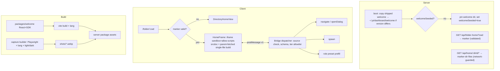

## Context

Explore session findings (spikes in `/tmp/welcome-spike`, not committed):

1. `agent-browser` / Playwright capture the running dashboard in ~2 s/shot. Theme switches via `localStorage['dashboard:theme']` (the `?theme=` URL param does nothing); language via `localStorage['pi-dashboard-language']` (`en`, `zh-CN`, `hu`). Real-state shots leak key fragments, session titles, paths and costs.
2. `HtmlPreview` (`sandbox="allow-same-origin"`, `srcdoc`, no scripts): relative assets need a `<base>`; declarative `popovertarget` works; the parent can intercept `pi-dashboard:` links.
3. `sandbox="allow-scripts"` frame (origin `null`): `localStorage` throws, `GET /api/health` fails CORS, `POST /api/pair/redeem` → 403 `untrusted origin` (control without Origin → 400), `/ws` upgrade rejected (`[ws-gate] rejected upgrade origin=null`).
4. The deleted `site/scripts/screenshots` pipeline failed on placeholder routes (`"/"` everywhere), a non-pi seed format, and no drift check.

## Goals / Non-Goals

**Goals**: one reusable marker-home mechanism; a tutorial that is themed, localized, interactive and never shows a stale design; reproducible, drift-detected capture.

**Non-Goals**: arbitrary JS APIs for marker pages; server-side rendering of client UI; CI-blocking visual diffs; screenshots for every named theme.

## Decisions

### D1 — Marker format: `.pi/home.json`
`{ "v": 1, "entry": "{lang}/index.html", "fallback": "en", "showPrompt": false }`. Directory-per-language (not filename prefix) so relative links and assets are identical across languages. `{lang}` resolved from `useI18n()`; missing file → `fallback`; missing fallback or invalid JSON → `DirectoryHomeView` (fail open to today's behavior, logged). `showPrompt: true` keeps a compact composer below the frame.

### D2 — Runtime React in an opaque-origin frame (option B)
Chosen over build-time SSG (keeps interactivity, specimens need real React) and over a first-party route (keeps the mechanism generic). Security rests on spike 3: no ambient authority from `Origin: null`. Consequences: no `localStorage` inside (SDK ships in-memory storage); theme/lang/status arrive by message; the frame cannot authenticate any request it makes (D3), so it makes none. `/live/:id` is precedent for opaque-origin frames, but it is loopback-only and does not solve remote access.

*Alternative rejected*: `allow-same-origin` + scripts — equals full dashboard authority for any marker page.

### D3 — Guarded file route + parent-fetched delivery
Recheck finding: a top-level `/home/*` prefix would sit OUTSIDE the universal network guard's jurisdiction (`GUARD_JURISDICTION_PREFIXES = /api/, /v1/, /editor/, /live/` in `localhost-guard.ts`) and would publish every marker directory over a tunnel. And even a guarded route cannot be loaded by the frame itself for remote users: its subresource requests are cross-site from origin `null`, so the `SameSite=Lax` session cookie is not sent, and a paired device's bearer lives in the parent's fetch wrapper, never in iframe loads. Local-only testing would hide both problems.

Decision:
- Files are served at `GET /api/home/:dirId/*` — inside the guard's jurisdiction, so the namespace-coverage test covers it with no new public surface. `dirId` is an opaque server-issued id for a pinned/workspace cwd holding a valid marker; paths go through `lib/path-containment.ts` (realpath both sides); GET/HEAD only.
- The **parent** fetches with its own credentials (cookie or bearer). The tutorial is built **single-file** (JS/CSS inlined) and set as the frame's `srcdoc`, so no module fetch from `Origin: null` happens and no `Access-Control-Allow-Origin: *` is needed.
- Binary assets (screenshots, optional lazy chapter chunks) are requested by the frame with bridge verb `asset {path}`. The parent fetches them (path-limited to the marker dir), transfers the `ArrayBuffer`, and the frame creates blob URLs in its own origin. The SDK's `<Shot>` and chapter loader wrap this.

*Alternative rejected*: an auth-exempt capability URL (signed `dirId`) — adds a new unauthenticated surface to the auth gates for convenience.

### D4 — Bridge protocol v1
Envelope `{ pi: "home", v: 1, type, id?, payload }`. Parent accepts only if `event.source === iframe.contentWindow`, `pi === "home"`, `v === 1`, schema-valid payload, and verb ∈ tier allowlist; everything else is dropped and logged once per (dir, reason).

| Verb (frame→parent) | first-party | other marker dirs |
|---|---|---|
| `ready` | ✓ | ✓ |
| `navigate {to}` — allowlisted route patterns (`/settings/*`, `/folder/:self/*`, `/`) | ✓ | ✓ |
| `openDialog {id}` — `pin`, `providers-add`, `pairing-qr`, `package-install` | ✓ | ✗ |
| `spawn {prompt, cwd?}` — cwd defaults to the marker dir | ✓ | confirm dialog |
| `applyRolePreset {roles}` — prefill Model roles page, user saves | ✓ | ✗ |
| `refreshShots` | ✓ | ✗ |
| `asset {path}` — relative path inside the marker dir, size-capped | ✓ | ✓ |

Parent→frame: `theme {mode, name, vars}`, `lang {lang}`, `status {…}` (first-party only). `status` fields are an explicit allowlist: `providersConnected:n`, `pinnedCount`, `sessionCount`, `plugins:{id:enabled}`, `tunnel:{status, provider}`, `pairedDevices:n`, `authConfigured`, `trustedHasLoopback`, `features:{remoteAccessSafe}` (true when the server includes `fix-trusted-network-tunnel-bypass`), `models:[{id, family, input, reasoning, contextWindow, maxOutput, costIn, costOut}]`, `roles:{name: ref}`. No URLs, tokens, paths, or secrets. Adding a field requires a spec change.

### D5 — Trust tier
First-party = the cwd equals `~/.pi/dashboard/welcome` AND the server's copy manifest hash matches. Anything else is "other". Other-tier frames render with a persistent "Content from `<dir>`" label.

### D6 — Ship, copy, pin once
Server package contains `welcome/` (built app, en shots, `version.json`). At boot: if `~/.pi/dashboard/welcome/version.json` differs, replace the directory atomically (tmp + rename), preserving `shots/` refreshed by the user unless the shot manifest version changed. `welcomeSeeded` (preferences) gates the one-time pin, independent of `pinSeeded` (docker env seeding). The welcome dir is added to `openspec.optOutDirectories` semantics and skipped by the Initialize offer.

### D7 — Specimens before screenshots
Rule per tutorial figure: self-contained component → `<Specimen of={X} fixture="…">`; shell composition, mobile, xterm → `<Shot id>`; hand-drawn mockups → never. `SpecimenProvider` supplies mock WS store, mock fetch (fixture-typed from shared API types), in-memory storage, i18n and theme. Components that cannot render under it fall back to a shot (tracked in the manifest). Bundle: one lazy chunk per chapter; `monaco-editor`, `xterm`, `mermaid` are forbidden imports (lint).

### D8 — Capture builder
Manifest entry: `{ id, route, viewport, setup:[{click|fill|press}], anchor, mask:[selectors], mock:[{url, json}], requires?: pluginId, crop?: anchor }`. Runs against a fixture HOME (docker test harness): recorded real pi session JSONL, a git repo with a worktree, enabled plugins, a writable scratch root. Determinism: `page.clock` frozen, `animations: 'disabled'`, fixed fonts, DPR 1, `addInitScript` sets theme/lang storage. Output `shots/{lang}/{light|dark}/{id}.webp`. Runtime "Refresh screenshots" runs the same manifest against the user's own server via Playwright or `agent-browser`, masks enforced; results only visible locally.

### D9 — Drift detection (report-only)
Blocking (vitest, every PR): shot/specimen ids ↔ manifest, i18n key parity across `en/hu/zh-CN`, every `data-tour` anchor referenced by the manifest exists in client source, forbidden imports. Non-blocking: path-filtered CI capture + pixel diff vs baseline → warning annotation + diff artifact.

### D10 — Roles chapter content model
Size classes L/M/S and per-role hints (type, size, thinking, hard requirement) live in `packages/welcome/content/roles.ts`. Roles are free-form strings; the hints cover the roles agents in this repo actually request (`planning`, `coding`, `review`, `research`, `fast`, `compact`, `vision`) plus `naming` (resolved in `role-manager.ts`, falls back to `@fast`). `cheap`/`default` are NOT existing roles (recheck: no agent or code references them); the chapter presents them only as examples of adding a custom role. Starter presets (Quality/Balanced/Budget) resolve against the `status.models` table: filter by hard requirement (e.g. `image` for `@vision`), pick size class by cost band, enforce "review family ≠ coding family", then `applyRolePreset` prefills Model roles for user confirmation. Examples in the legend are computed at build time from the fixture registry. Targets the Models ▸ Model roles location from `promote-model-roles-settings`; until it lands the link resolves to the current path.

## Risks / Trade-offs

- **UI redress by third-party marker pages** → tier label, reduced verbs, spawn confirm.
- **Specimen purity**: many components read global context → `SpecimenProvider`; fallback to shots; spike first (tasks 1.x).
- **Translation gaps in client strings** visible in hu/zh-CN shots → reported by the capture run, not blocking.
- **Screens change between releases** → specimens track code at build; shots flagged by report-only diff.
- **Remote-access chapter safety** → gated on `fix-trusted-network-tunnel-bypass`; also displays `trustedHasLoopback` warning.
- **Package size** → en-only WebP shots shipped.

## Migration Plan

Additive. Existing users get the welcome dir pinned once on first boot after upgrade (can unpin permanently). Rollback: revert; leftover `~/.pi/dashboard/welcome` is a plain folder, `welcomeSeeded` ignored.

## Open Questions

- Split `home-sdk` into its own package now (third-party marker pages) or later?
- Include a "Refresh screenshots" button in v1, or ship CI-built shots only first?
- Should suggestions name concrete models (registry-ranked) or only size classes plus a curated allowlist?
