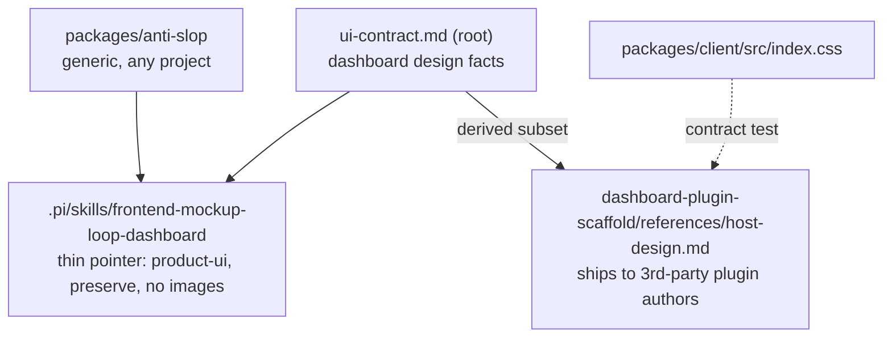

## Context

See proposal.md (Why). Current state the approach builds on:

- `packages/anti-slop` ships one skill, `anti-slop-frontend`. It is a 258-line flat checklist: dials at `.pi/skills/anti-slop-frontend/SKILL.md:47`, Part A universal at `:60`, Part B marketing at `:139`, pre-flight at `:210`. Provenance is only a frontmatter string, `adapted_from: "Leonxlnx/taste-skill (design-taste-frontend, MIT)…"` (`:8`), with no commit.
- The package has no source code and no tests. Its `package.json` lists `pi.skills: [".pi/skills/anti-slop-frontend"]`.
- `frontend-mockup-loop` owns the hard gates and the loop. Its step 1 GROUND (`packages/mockup-loop/.pi/skills/frontend-mockup-loop/SKILL.md:116`) grounds every decision in shipped UI plus documented public rules. Its extension embeds a generic anti-slop rubric line (`packages/mockup-loop/src/extension.ts:301`) that this change does not touch.
- Image generation exists in-repo as the `pi-nano-banana` CLI. Usage line: `packages/nano-banana/src/bin/nano-banana.ts:25`, with `--output`, `--file`, `--model`, `--flash`, `--backend gemini|pi`. It has a Gemini-key default and an opt-in pi/OpenRouter backend (archived change `2026-10-03-add-pi-runtime-image-generation`).
- Dashboard theming: 9 themes × dark/light = 18 palettes (`packages/client/src/lib/theme/themes.ts:761-769`). The `theme-gallery` spec already enforces a contrast floor over all 18. `site/` has System/Light/Dark (`openspec/specs/marketing-site/spec.md`).
- `scripts/check-skill-frontmatter.mjs` validates every SKILL.md frontmatter. It applies a 400-char description budget (`:47`) and pi's 1024 cap (`:44`).
- Upstream `Leonxlnx/taste-skill` is MIT, HEAD `18dfc928b135629e0eddfdd445a06400d04ed439` (2026-10-08). `skills/taste-skill/SKILL.md` is ~1000 lines across 15 sections plus appendices. Its §13 declares dashboards out of scope.

## Goals / Non-Goals

**Goals:**
- One install serves `product-ui`, `marketing` and `new-site`, and the profile decides which rules fire.
- Every non-image *rule* remains countable or binary. Design Read *inputs* (audience, mood) are declared context, not checks. "It looks better" is never a check.
- Image generation is a paid, opt-in direction aid that never bypasses the loop's gates.
- A future upstream refresh is a diff against a pinned commit, not a re-read.

**Non-Goals:**
- Porting upstream prose wholesale, its GSAP skeletons (§5), or the block library (§12).
- Changing mockup-loop tools, gates or rubric. Fixing the stale 4-theme list in `.pi/skills/theme-system/SKILL.md` (noted, separate change). The dashboard adapter's own stale line *is* fixed here (D10).
- A dashboard-server design-contract endpoint (possible later proposal).
- Any runtime code. A dashboard UI for image direction.

## Decisions

### D1. Four focused skills in one package, not one mega-skill
Ship `anti-slop-frontend` (refreshed), `anti-slop-redesign`, `anti-slop-image-direction` and `anti-slop-brandkit` under `packages/anti-slop/.pi/skills/`, all listed in `pi.skills`.
- *Why:* upstream's single ~1000-line file costs context on every load and mixes concerns. Separate skills trigger on distinct phrases ("redesign X", "generate design references", "brand kit"), and the checklist stays lean.
- *Alternative:* a separate package for image/brand skills. Rejected by the user in favour of one install.

### D2. Surface profile + Design Read gate everything
Before reviewing or generating, the agent states one line: `profile · audience · mood · VARIANCE/MOTION/DENSITY`.

| Profile | Part A | Part B | Layout discipline | Redesign default | Image direction |
|---|---|---|---|---|---|
| `product-ui` | ✓ | ✗ | ✗ | `preserve` | forbidden |
| `marketing` | ✓ | ✓ | ✓ | `preserve` | opt-in |
| `new-site` | ✓ | ✓ | ✓ | `greenfield` | opt-in |

- *Why:* our Part B is already scoped to marketing only (`SKILL.md:139`). Making the profile explicit turns an implicit judgment into a declared, reviewable input.
- *Alternative:* infer silently. Rejected, because an undeclared profile is exactly how marketing rules leak into dense UI.

### D3. Image direction = direction, not source
Upstream `image-to-code` treats the generated image as "the primary visual source of truth". We invert that.
1. **Plan:** list the sections, one image each. State the count, the backend and that it is paid. Confirm with the user via `ask_user`. Headless or no `ask_user` → generate nothing; write a text-only direction brief.
   `<mockupDir>` resolves the same way the mockup loop's MOCKUP step does:
   - in this repo: `openspec/changes/<name>/mockups/` when a change exists (flat, matching `.pi/skills/frontend-mockup-loop-dashboard/SKILL.md` MOCKUP binding), else `mockups/<slug>/`;
   - elsewhere: the loop's mockup directory.
   References go in its `refs/` subfolder.
2. **Generate:** call `pi-nano-banana "<prompt>" --output <mockupDir>/refs/<nn>-<section>.png`. The backend named in the confirmed plan is the backend used. Switching from Gemini to `--backend pi` (OpenRouter, a different bill) needs a fresh confirm and never happens silently. Prompts carry the upstream variation axes (composition anchor, hero scale, background mode, type character) and Part A bans (no purple glow, no fake-UI divs). Copy is described, never quoted.
   Interactivity is judged by whether the `ask_user` tool is in the agent's tool list, the same convention `openspec/config.yaml` rules already use ("if ask_user is unavailable (subagent or headless run)"). If it is absent, the run is headless and generates nothing.
3. **Analyze:** read each image and write `<mockupDir>/refs/direction.md`: layout family, rhythm/spacing scale, palette (hex), type character, plus Part A tells observed in the image.
4. **Hand-off:** `direction.md` becomes one input to mockup-loop GROUND. External rules and WCAG gates still win. Text visible in images is a placeholder, never transcribed (the same failure class as `veo-prompt-injection-cleanup`).
5. **Fallback:** if `pi-nano-banana` is not resolvable or has no credentials, report the reason and write `direction.md` from text alone. The skill's own variation-axes section (composition anchor, hero scale, background mode, type character, CTA variation) is applied as a written brief; this is a section of the skill, not separate code.
- *Why:* a picture cannot satisfy cite-a-source. Treating it as direction keeps the gates authoritative while still breaking default layouts.
- *Alternative:* mandatory image-first (upstream style). Rejected: paid, slow, and wrong for `product-ui`.

### D4. Brandkit is proposal-only
`anti-slop-brandkit` runs only for `new-site` with no existing brand assets. It uses the same plan + `ask_user` confirm (count, backend, paid) and the same headless and fallback rules as D3. It generates one brand-board image (a 3×3 panel layout in a single image; the confirmed count is 1 unless the user asks for variants) through `pi-nano-banana` plus a `brand.md` (palette, type pairing, logo concept rationale).
- Output lands in the mockup dir and is never written into project tokens. The user approves first, after which mockup-loop CONTRACT (`init_ui_contract`) adopts it.
- Logos are concepts, never final marks.

### D5. Redesign protocol with our preservation additions
`anti-slop-redesign`:
- detect the mode;
- audit the current surface (screenshot + list of tells found);
- pick levers in priority order (type → color → spacing → states → motion → layout);
- verify the never-change-silently list.
We add `data-testid` attributes and keyboard shortcuts to upstream's list (URLs, nav labels, form field names, wordmark, legal copy), because `tests/e2e/*.spec.ts` and users depend on them. `overhaul` requires explicit user confirmation.

### D6. Dashboard theme parity without 18 manual checks
Each profile's parity is a set of pass/fail items.
- **`product-ui`** (generic wording, any project):
  1. Zero **added** raw colour literals (`#hex`, `rgb(`, `hsl(`), diff-scoped: only `+` lines of the change's diff in shipped UI source (`*.tsx|*.jsx|*.css|*.html|*.vue|*.svelte`). Exclusions: tests, fixtures, stories, `*.svg`, and the token-definition files themselves (dashboard: `packages/client/src/index.css`, `packages/client/src/lib/theme/themes.ts`).
  2. The project's token guard (if one exists) reports no new violation.
  3. Screenshots exist for default-dark, default-light and one non-default palette.
  Human visual review of those screenshots is a non-gating note.
- **Dashboard binding:** the guard is `scripts/theme-token-guard.mjs`, whose arms are fallback-literal, undeclared token and accent-as-text (`scripts/theme-token-guard.mjs:1-25`). The non-default palette is any `themes.ts` entry other than `base`.
- **Honest scope:** the `theme-gallery` contrast floor covers `--text-secondary`/`--text-tertiary` and the `--accent-<hue>-text` tokens only (`openspec/specs/theme-gallery/spec.md:12`, `:124-131`). `--link`, `--border-*`, fills and status colours on the other 16 palettes are *not* guaranteed by tokens alone. That is an accepted gap, mitigated by item 3, not claimed as covered.
- **`marketing`:** screenshots in light + dark, plus item 1. **`new-site`:** one screenshot per shipped mode, plus item 1.

### D7. Provenance pin
`packages/anti-slop/UPSTREAM.md` holds:
- the repo, commit SHA, date and license;
- a table mapping upstream section → our skill/section or `dropped: <reason>`;
- a refresh procedure (`git diff <pinned>..<new> -- skills/taste-skill skills/redesign-skill skills/image-to-code-skill skills/imagegen-frontend-web skills/brandkit`, then update the table).
Each new SKILL.md frontmatter keeps an `adapted_from` naming the upstream skill and short SHA.

### D8. Authority unchanged
All four skills stay advisory. When mockup-loop runs, they feed its FIX step and never override a WCAG-AA or severity-4 gate. This matches the current `SKILL.md:25` relationship section.

### D10. Dashboard design layering (data / procedure / third-party)

- **Data** stays in root `ui-contract.md`, which already holds token roles, severity tokens, type/spacing scale and WCAG invariants. The change only reconciles its theme statement with `themes.ts` (CSS default layer vs runtime palette layer).
- **Procedure:** the adapter keeps only dashboard bindings (paths, isolated verification, mockup locations). It replaces its CONTRACT line (`.pi/skills/frontend-mockup-loop-dashboard/SKILL.md:14`, stale 4-theme authority) with "read `ui-contract.md`".
- **Third-party plugins:** `ui-contract.md` is not published in any npm package, so `dashboard-plugin-scaffold` ships `references/host-design.md`, a plugin-relevant subset (`files` already includes `.pi/skills/`).
- **Drift guards:**
  - A test extracts code-span tokens matching `^--[a-z0-9-]+$`; placeholders like `--accent-<hue>` are skipped by the regex. It asserts each is declared in `packages/client/src/index.css`.
  - Per-palette correctness (non-base palettes are runtime inline overrides via `applyThemeVars`, `packages/client/src/hooks/useTheme.ts:46-77`) stays screenshot-covered, not test-covered.
  - `host-design.md` opens with "Derived from root `ui-contract.md`; update together".
  - `ui-contract.md` gains the reciprocal note.
- **Theme statement:** `base` is pure CSS (`:root` / `[data-theme="light"]`), and 8 further palettes × dark/light are applied at runtime. Task 5.1 *rewrites* the "Two themes ship today" sentence (`ui-contract.md:12-15`) to this layer statement, so it no longer reads as contradicting `theme-gallery`.
- *Alternatives:*
  - Ship it via the bridge extension: rejected, because it would load dashboard rules in every project.
  - Serve it from a server endpoint: deferred; only worth it if plugin authors need live runtime palettes.

### D9. Verification = static contract tests
The package has no runtime code, so it is verified by static L1 contract tests. Exact location and rows come from `test-plan.md` (scenario-design). Skills are prose, so the tests assert that **the normative sentences exist verbatim**, not that the agent obeys them. Each spec scenario maps to a required MUST/NEVER sentence that the test greps. Examples: "image direction is forbidden for `product-ui`"; the next-steps blocks name `host-design.md`; the confirm step names count + backend + paid. Agent compliance is a manual-only scenario. The tests check:
- `pi.skills` ↔ skill dirs;
- required headings per skill;
- `UPSTREAM.md` SHA present, one map table per adapted upstream skill, and no row left unmapped or TBD;
- profile table present;
- the image skill names `pi-nano-banana` and the confirm step;
- `product-ui` forbids image direction.

Plus `host-design.md` tokens match `index.css`, and `UPSTREAM.md` is in package `files`. The existing frontmatter guard covers description length; the `anti-slop-frontend` description digest pin (`scripts/__tests__/skill-frontmatter.test.mjs:118`) must stay green unchanged.

## Risks / Trade-offs

- [Image prompts reproduce the very slop we ban (purple glow, fake UI)] → Part A bans are embedded in prompts, and the analysis step lists tells found in images; flagged tells are excluded from `direction.md`.
- [Paid calls surprise the user] → opt-in plus an explicit count/backend confirm; headless never generates.
- [Upstream v2 is "experimental" and rewords rules] → the pin plus section map makes drift visible; we take only countable rules.
- [Skill sprawl / context cost] → separate skills load only on trigger, and descriptions respect the 400-char budget.
- [Theme-parity sampling misses a palette-specific regression] → token-only rule + `theme-gallery` contrast floor.
- [Upstream license on future files changes] → `UPSTREAM.md` records the license at the pinned SHA; the refresh procedure re-checks it.

- [`host-design.md` is a hand-maintained subset of `ui-contract.md`] → reciprocal "update together" notes plus the token test. A generator script was rejected as code for a ~1-page subset; revisit if it drifts.
- [`pi-nano-banana` bin is a `.ts` entry and may not run from a global npm install] → task 4.2 decides. If it fails, README and both image skills state the monorepo/`npx` invocation, and the text brief is documented as the primary path, with images marked experimental.

## Migration Plan

- Version via the lockstep `release-cut` flow. The existing skill name and triggers are kept, so current installs only gain skills.
- Rollback: revert the package files and the adapter skill. No data or state.
