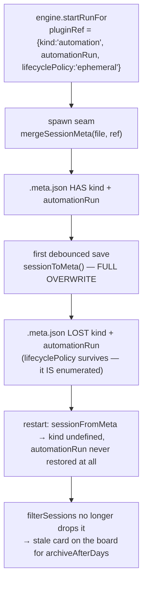

## Context

Two coupled problems, one story: a *service session* (machine work spawned by a
plugin) is indistinguishable from a user session after a restart, and the
archive subsystem has no concept of one.

Constraints that shape the design:

- `sessionToMeta()` is a full overwrite. Any dashboard-owned field not
  enumerated is wiped on the next unrelated save.
- Archiving **evicts** the session from the live set (`session-archive.ts:279`
  → `sessionManager.remove(id)`). Anything that reads the session after it ends
  must run first.
- The automation plugin does exactly that: `result.md` capture flushes on
  `agent_end`, and `ctx.onSessionEnded → engine.onSessionDeath` finalizes a run
  whose session died before a terminal event.
- `sessionManager.onEnded` is a **single-assignment slot**, already owned by
  `event-wiring.ts:492`, and it re-fires for an already-ended session whenever
  `closedReason` changes (`memory-session-manager.ts:472`, asserted by
  `session-end-orphan-heal.test.ts:171`).
- `archive-sweeper` exposes `start/stop/tick` — no `dispose` — and `stop()` is
  never called by `server.ts`.

## Goals / Non-Goals

**Goals**

- A finished service session leaves the board without waiting 30 days.
- A service session is still identifiable as one after a server restart.
- Existing orphaned runs are reclaimed without a name/heuristic match.
- No plugin end-of-session handler loses its session out from under it.

**Non-Goals**

- Deleting service session data. Archive is eviction + lazy re-read.
- Changing `archiveAfterDays` semantics for user sessions.
- Touching the idle reaper, which terminates *active* ephemeral sessions and
  never looks at ended ones.
- Changing `AutomationRunMonitor`. Its route has no in-app producer, and the
  automation board reads run-store records, not sessions.

## Decisions

### D1 — Disposability is DECLARED at spawn, not inferred from `lifecyclePolicy`

`PluginSessionLifecycle` (`server-context.ts:148`, mirrored in
`pending-plugin-ref-registry.ts:46`) gains `archiveOnEnd?: boolean`, beside the
existing `recover` and `finalizeOnSocketClose`. The automation engine declares
it on the run spawn; core reads only the generic flag.

*Rejected:* `lifecyclePolicy === "ephemeral"` as the steady-state predicate.
It is the wrong question, and the repo says so in two places:

- `embed-session-lifecycle` spec: *"The dashboard embed acquire path and
  automation/flow-triggered spawns SHALL set `lifecyclePolicy: "ephemeral"`"* —
  an embed visitor chat is a human conversation, not machine work.
- the same spec's acquire ladder step (b): *"resume the most recent compatible
  ended session when policy permits"*. Archiving removes the session from the
  live set that `visitor-session-registry.isSessionResumable` probes, so an
  ephemeral-keyed archive would silently break a specified resume path.

That the marker's only current producer is `engine.ts:695` makes the conflation
*invisible today* and *guaranteed later* — the worst kind of latent coupling.

*Rejected:* `kind === "automation"` — core naming a plugin's value, which
`detach-automation-goal-from-core` exists to prevent.

### D2 — Archive on the ended transition, behind a fixed grace window

Eligibility begins at the `→ ended` transition; the archive call is deferred by
`SERVICE_ARCHIVE_GRACE_MS` (30 s) and re-validated at fire time: still resident,
still ended, still declared disposable, `live !== true`, not currently viewed,
setting still enabled.

The grace exists for the eviction race, not as a fudge factor: `result.md`
capture and `engine.onSessionDeath` both read the session off the end fan-out,
and an immediate archive could evict it first, turning a completed run into a
silently empty result.

**Scheduling is idempotent per session id.** `onEnded` is not a one-shot: it
re-fires when an already-ended session learns a better `closedReason`. A pending
timer map keyed by session id makes a re-fire a no-op rather than a second
archive attempt.

**Wiring seam:** `sessionManager.onEnded` is a single-assignment slot already
taken by `event-wiring.ts`, so the sweeper does not subscribe to it. The
existing owner calls into the sweeper; no second subscriber is introduced.

*Rejected:* archiving inside `memory-session-manager.update()`'s ended seam —
re-entrant (the archive writes back through the same manager) and maximally
exposed to the race.
*Rejected:* teaching the sweeper `disposable ⇒ age 0` and nothing else —
correct, but the card lingers up to `archiveSweepIntervalMinutes` (default 60),
which does not read as "archived when it finished".
*Rejected:* a configurable grace — a knob no user can reason about.

Timers are owned by `archive-sweeper.ts` (it already holds `sessionArchive` +
`isViewed` and owns automatic-archive policy) and cleared in `stop()`. `stop()`
is currently never called, so this change also wires it into the server shutdown
path — otherwise the "no pending archive outlives the server" property is
unimplementable.

### D3 — One-time boot backfill, on the existing scan gate

The boot meta scan already archives aged-out sidecars in place. The backfill
reuses that exact path with the same gate the age rule uses —
`meta.live !== true && meta.archived === undefined` — plus
`lifecyclePolicy === "ephemeral"`, regardless of age.

Two deliberate details:

- **`live !== true`, not `status === "ended"`.** The scanner comment states the
  reason: *"The persisted status is deliberately ignored … because a clean
  server stop leaves a non-`ended` status behind"*. A status test would skip
  exactly the sessions that ended while the server was down.
- **`archived === undefined`, not `!archived`.** `unarchiveSession` writes
  `archived: false` (`session-archive.ts:313`); a falsy test would re-archive a
  session the user deliberately restored on the next boot, voiding the rollback
  path.

**Why `ephemeral` here and nowhere else:** the orphaned sidecars predate
`archiveOnEnd`, and their `kind`/`automationRun` were wiped — `ephemeral` is the
only surviving marker. It is safe *as a one-time migration* because
`engine.ts:695` is the sole producer in the repo today and the embed acquire
path is unimplemented and disabled by default. It is not safe as a steady-state
rule (D1), which is why it is not used as one.

### D4 — Persist `kind` + `automationRun`, and guard the projection

`sessionToMeta()` gains both fields with the same "MUST be enumerated,
full-overwrite" comment its neighbours carry, and `sessionFromMeta()` gains
`automationRun` — it restores `kind` today but has no reference to
`automationRun` at all, so persisting without restoring would fix nothing.

The regression guard is extended where it is blind: `meta-key-byte-identity
.test.ts:58` already passes `kind` through `sessionToMeta` but asserts only
`recover`. The new assertion round-trips `kind` + `automationRun` and fails if
either is dropped.

Both fields serialize to no key when undefined, so a plain user session's
sidecar bytes are unchanged (invariant E5 holds).

### D5 — `archiveServiceSessionsOnEnd` is orthogonal to `archiveAfterDays`

`archiveAfterDays = 0` disables *age-based* archiving only. Conflating them
would mean a user who wants to keep every conversation forever must also keep
every machine run forever.

### D6 — The archive reason is distinguishable in the log

`ArchiveReason` (`session-archive.ts:26`) is a closed union
`"manual" | "sweep" | "migration"` whose value the implementation currently
discards (`archiveSession(id, _reason)`). It gains a member for this path, and
the log line is emitted at the call site. Passing `"sweep"` would misattribute
an automatic eviction the user did not configure by age.

## Risks / Trade-offs

| Risk | Mitigation |
|---|---|
| Eviction races plugin end-handlers, truncating `result.md` | D2 grace + fire-time re-validation; covered by a scenario |
| `onEnded` re-fire double-schedules an archive | D2 pending-timer map keyed by session id |
| Backfill archives a session the user deliberately unarchived | D3 `archived === undefined`, not `!archived` |
| Backfill hits a human embed chat | Only automation produces `ephemeral` today; embed lifecycle disabled by default; archive is reversible |
| Default `true` changes behaviour on upgrade | Documented; nothing is deleted; reachable via the folder `Archive (N)` fold |
| Timer leak on shutdown | Timers cleared in `stop()`, which this change wires into server shutdown |

## Migration Plan

1. Land D4 (persistence + restore) — inert alone, no behaviour change.
2. Land D1 + D5 + D6 (declaration, config, log reason) — still inert until a
   plugin declares the flag.
3. Land D2 (on-end archive) and the automation engine's declaration together.
4. Land D3 (backfill). On the next server start the orphaned runs are reclaimed.

Rollback: set `sessionList.archiveServiceSessionsOnEnd: false` and unarchive
affected sessions. No data is deleted at any step.

## Open Questions

<!-- Resolved during planning: declaration vs marker (D1), grace vs sweeper
     (D2), backfill gate + predicate (D3), flag orthogonality (D5). -->
