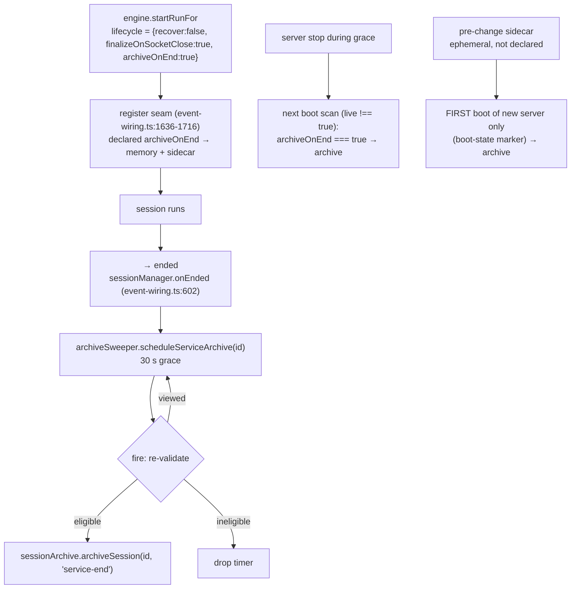

## Context

A *service session* (machine work spawned by a plugin) ends and then sits on the
board as an ordinary ended card for `archiveAfterDays`, because the archive
subsystem has no concept of one. A second, historical problem compounds it: run
sidecars written before `fix-automation-identity-persistence` (#710) lost
`kind` + `automationRun`, so only `lifecyclePolicy: "ephemeral"` still marks
them.


```mermaid
flowchart TD
  A["engine.startRunFor<br/>lifecycle = {recover:false, finalizeOnSocketClose:true, archiveOnEnd:true}"] --> B["register seam (event-wiring.ts:1636-1716)<br/>declared archiveOnEnd → memory + sidecar"]
  B --> C["session runs"]
  C --> D["→ ended<br/>sessionManager.onEnded (event-wiring.ts:602)"]
  D --> E["archiveSweeper.scheduleServiceArchive(id)<br/>30 s grace"]
  E --> F{"fire: re-validate"}
  F -- "viewed" --> E
  F -- "eligible" --> G["sessionArchive.archiveSession(id, 'service-end')"]
  F -- "ineligible" --> H["drop timer"]
  I["server stop during grace"] --> J["next boot scan (live !== true):<br/>archiveOnEnd === true → archive"]
  K["pre-change sidecar<br/>ephemeral, not declared"] --> L["FIRST boot of new server only<br/>(boot-state marker) → archive"]
```

Constraints that shape the design:

- `sessionToMeta()` is a full overwrite. Any dashboard-owned field not
  enumerated is wiped on the next unrelated save (`session-to-meta.ts`).
- Archiving **evicts** the session from the live set (`session-archive.ts`
  `archiveSession` → `sessionManager.remove(id)`). Anything that reads the
  session after it ends must run first.
- The automation plugin does exactly that: `result.md` capture flushes on
  `agent_end`, and `ctx.onSessionEnded` (`engine.ts:1164`) →
  `engine.onSessionDeath` (`engine.ts:1188`) finalizes a run whose session died
  before a terminal event. That fan-out runs inside `onUnregister`
  (`event-wiring.ts:649`, dispatch `:691`); an `update()`-path end fires only
  `onEnded`. The grace protects the unregister path; on the `update()` path no
  plugin read is at stake, and the grace is merely harmless.
- `sessionManager.onEnded` is a **single-assignment slot**, already owned by
  `event-wiring.ts:602`, and it re-fires for an already-ended session whenever
  `closedReason` changes (`memory-session-manager.ts:523`, asserted by
  `session-end-orphan-heal.test.ts`).
- `archive-sweeper` exposes `start/stop/tick` — no `dispose` — and `stop()` is
  never called by `server.ts` (started at `:4041`, `:4047`; server `stop()` at
  `:4217-4235` omits it).
- `/api/restart` deliberately leaves sessions RUNNING to reattach after the
  restart (`server.ts:700-705`); their sidecars keep `live: true`. A sidecar
  with `live: true` must therefore not be archived at boot, even when it is not
  a recovery candidate (`recover: false`, `session-meta.ts:281`) — it may be a
  run about to reattach.
- `pendingArchiveIntents` (`event-wiring.ts:695-699`) already archives a session
  immediately on unregister when the USER requested archive of a live session.
- Core MUST NOT read a plugin ref to make a lifecycle decision
  (`dashboard-plugin-loader` spec, "Core lifecycle decisions read a generic
  flag"). `lifecyclePolicy` arrives through the ref; the embed acquire path
  stamps it as a core spawn that never passes the plugin-ref register seam.
- `AutomationRunMonitor` (`/folder/:encodedCwd/automations/run/:sid`) receives
  the run `session` from the live map (`AutomationRunMonitor.tsx:27-43`); the
  engine persists each child's `sessionId` in the run store for the monitor link
  (`engine.ts:1127`, `:1137`). An archived run session is absent from the live
  map, so the monitor would render "running" with no result.
- `/session/:id?archived=1` already renders an archived transcript read-only
  through subscribe-by-id (`App.tsx:619-625`).

## Goals / Non-Goals

**Goals**

- A finished service session leaves the board without waiting 30 days.
- A service session's disposability is still known after a server restart.
- Existing orphaned runs are reclaimed without a name/heuristic match.
- No plugin end-of-session handler loses its session out from under it.

**Non-Goals**

- Deleting service session data. Archive is eviction + lazy re-read.
- Changing `archiveAfterDays` semantics for user sessions.
- Touching the idle reaper, which terminates *active* ephemeral sessions and
  never looks at ended ones.
- Changing `AutomationRunMonitor`. Its route has no in-app producer, and the
  automation board reads run-store records, not sessions.
- Re-doing `kind`/`automationRun` persistence — landed in #710
  (`session-to-meta.ts:109-110`, `session-scanner.ts:244`,
  `meta-key-byte-identity.test.ts` `#E2`).
- A Settings UI control for the new flag.
- The automation child-row "link to monitor that child's session": the client
  renders no session link today (`packages/automation-plugin/src/client` has no
  session navigation), so archiving changes nothing there.
- Ended sidecars stranded with `live: true` (process died across a restart and
  never reattached). Pre-existing gap shared with the age rule; 1 of 940
  ephemeral sidecars on the measured install.

## Decisions

### D1 — Disposability is DECLARED at spawn, not inferred from `lifecyclePolicy`

`PluginSessionLifecycle` (`server-context.ts:167`, mirrored in
`pending-plugin-ref-registry.ts:48`) gains `archiveOnEnd?: boolean`, beside
`recover`, `finalizeOnSocketClose` and `hidden`. The automation engine declares
it on every run spawn (`engine.ts:726`), hidden or shown — the
`automation-run-lifecycle` delta narrows "a shown run renders as a normal board
card" to "until archived on end"; the Automation view reads the run store, not
the session. Core reads only the generic flag.

Four details make the declaration actually travel:

- `file()`'s `hasLifecycle` (`pending-plugin-ref-registry.ts:196-200`) lists the
  lifecycle keys explicitly; `archiveOnEnd` joins it, or a declaration-only
  filing with an empty ref is silently dropped.
- `archiveOnEnd` joins `CORE_RESERVED_REF_KEYS` (`:27`), so it is settable only
  through the declaration, never through a plugin's ref body (which is merged
  verbatim onto the session and sidecar). The test-double copy in
  `packages/chat-gateway/src/server/__tests__/fake-seam.ts:15-31` mirrors it.
  (`hidden` is likewise absent from the set today; reserving it is out of scope.)
- The register seam's inline lifecycle type (`event-wiring.ts:1636`) and the
  engine's local spawn type (`engine.ts:175-176`) are widened, or the engine's
  `lifecycle` literal fails the excess-property check.
- The register seam persists the declaration in its own `mergeSessionMeta`
  write inside the `if (lifecycle)` block (like `recover: false` at `:1713`),
  NOT piggy-backed on the ref merge at `:1673` — that merge is skipped for an
  empty ref, so a declaration-only filing would otherwise never reach disk.

*Rejected:* `lifecyclePolicy === "ephemeral"` as the steady-state predicate.
It is the wrong question, and the repo says so in two places:

- `embed-session-lifecycle` spec: *"The dashboard embed acquire path and
  automation/flow-triggered spawns SHALL set `lifecyclePolicy: "ephemeral"`"* —
  an embed visitor chat is a human conversation, not machine work.
- the same spec's acquire ladder step (b): *"resume the most recent compatible
  ended session when policy permits"*. Archiving removes the session from the
  live set that `visitor-session-registry.isSessionResumable` probes, so an
  ephemeral-keyed archive would silently break a specified resume path.

That the marker's only current producer is `engine.ts:722` makes the conflation
*invisible today* and *guaranteed later* — the worst kind of latent coupling.

*Rejected:* `kind === "automation"` — core naming a plugin's value, which
`detach-automation-goal-from-core` exists to prevent.

### D2 — Archive on the ended transition, behind a fixed grace window

Eligibility begins at the `→ ended` transition; the archive call is deferred by
`SERVICE_ARCHIVE_GRACE_MS` (30 s) and re-validated at fire time: still resident,
still ended, still declared disposable, `live !== true` (the same in-memory test
the age tick uses; an ended session cannot be a recovery candidate, so the live
flag is the operative check), not restored since scheduling (`restoredAt` unset
or < scheduled-at), not currently viewed, setting still enabled.

The grace exists for the eviction race, not as a fudge factor: `result.md`
capture and `engine.onSessionDeath` both read the session off the end fan-out,
and an immediate archive could evict it first, turning a completed run into a
silently empty result.

**Scheduling is idempotent per session id.** `onEnded` is not a one-shot: it
re-fires when an already-ended session learns a better `closedReason`
(`memory-session-manager.ts:523`). A pending timer map keyed by session id makes
a re-fire a no-op rather than a second archive attempt. The map holds at most
one timer per session.

**Restored sessions are not re-scheduled.** A re-fire can also arrive for a
session the user restored from the archive (e.g. `closedReason: "manual"` set
on an ended session, `session-action-handler.ts:1250`, `:1266`). Scheduling is
skipped when `restoredAt` is set and ≥ `endedAt`: only a genuine end after the
restore re-arms the rule.

**Restore beats view.** Fire-time checks run in order; the restored-since-
scheduling check precedes the viewed check, so a restored session that is also
open in a browser is dropped, not re-armed.

**Viewed at fire time → re-arm.** A session open in a connected browser is not
skipped for good: the fire handler replaces its map entry with another
`SERVICE_ARCHIVE_GRACE_MS` timer and re-checks on that fire. Bound: archived
≤ 30 s after the last viewer leaves (as observed by `isViewed`). The age sweep
tick is *not* the retry path — it short-circuits on `archiveAfterDays <= 0`
(`archive-sweeper.ts` `tick`) and runs hourly by default.

**No cross-module cancellation.** `sessionArchive` does not call back into the
sweeper (that would be a dependency cycle — the sweeper already depends on
`sessionArchive`). A pending timer is defused at fire time instead: archived by
another path → not resident → dropped; archived then restored → `restoredAt` ≥
scheduled-at → dropped. A manual archive → unarchive inside the grace window
therefore cannot be followed by an automatic re-archive.

**User-requested archive of a live session** (`pendingArchiveIntents`,
`event-wiring.ts:695-699`) stays immediate on unregister: it is an explicit user
action, already exposed to the eviction race before this change, and not
touched here.

**Not retroactive.** Only the ended transition schedules. A session that ended
while the setting was `false` is not archived when the setting flips to `true`
by this rule; the boot backfill (D3, a separate rule) or the age rule reclaims
it. Every other re-validation failure drops the timer without re-arming.

**Wiring seam:** `sessionManager.onEnded` is a single-assignment slot already
taken by `event-wiring.ts:602`, so the sweeper does not subscribe to it. The
existing owner calls `archiveSweeper.scheduleServiceArchive(id)`; `wireEvents`
deps gain the sweeper handle. No second subscriber is introduced.

*Rejected:* archiving inside `memory-session-manager.update()`'s ended seam —
re-entrant (the archive writes back through the same manager) and maximally
exposed to the race.
*Rejected:* teaching the sweeper `disposable ⇒ age 0` and nothing else —
correct, but the card lingers up to `archiveSweepIntervalMinutes` (default 60),
which does not read as "archived when it finished".
*Rejected:* a configurable grace — a knob no user can reason about.

Timers are owned by `archive-sweeper.ts` (it already holds `sessionArchive` +
`isViewed` and owns automatic-archive policy; its `getConfig` type is widened to
carry the new flag) and cleared in `stop()`. `stop()` also sets a **stopped
latch** on that sweeper instance: after it, `scheduleServiceArchive` and
`start()` are no-ops. The latch matters because bridge teardown during shutdown
ends sessions (→ `onEnded` → schedule) and `start()` runs inside an async
discovery `.then` (`server.ts:4041`, `:4047`) that can resolve after shutdown
began. The latch is per instance: each server build creates a fresh sweeper via
`createArchiveSweeper`, so an in-process restart is unaffected. This change
wires `archiveSweeper.stop()` into BOTH teardown paths after
`piGateway.stop()`: the server `stop()` (`server.ts:~4299`) and the `start()`
failure teardown (`server.ts:2862-2870`).

### D3 — Boot backfill: declared leg every boot, legacy leg once

The boot meta scan already archives aged-out sidecars in place
(`session-scanner.ts:395-410`, `mergeSessionMeta(file, {archived:true,
archivedAt})`, index row, no broadcast). The backfill reuses that exact path and
the age rule's gate, as a **separate branch** (not nested in the age rule's `if`
at `:395`), regardless of age:

```ts
meta.live !== true && meta.archived === undefined && (
  meta.archiveOnEnd === true                                   // declared leg — every boot
  || (legacyPass && meta.lifecyclePolicy === "ephemeral"
                 && meta.archiveOnEnd === undefined)           // legacy leg — first boot only
)
```

- **Declared leg** — steady state. Reclaims a disposable session whose grace
  timer died with the server (stop during the grace window), ephemeral or not.
- **Legacy leg — one-shot.** `legacyPass` is true only when
  `~/.pi/dashboard/boot-state.json` has no `serviceArchiveBackfillAt` stamp.
  After the scan completes with the setting enabled, the server stamps
  `serviceArchiveBackfillAt: <now>` (new `boot-state.ts` export beside
  `stampBootStart`). Later boots never run the legacy leg. A boot with the
  setting `false` does not stamp, so enabling the setting later still gets one
  legacy pass. No sidecar ever needs an explicit `archiveOnEnd: false`, and core
  never reads a ref at register to decide one.
- **`live !== true`, not `!isRecoveryCandidate` and not `status`.** A status
  test would skip sessions that ended while the server was down (a clean stop
  leaves a non-`ended` status behind). `!isRecoveryCandidate` would archive
  every in-flight run at each `/api/restart`, which leaves sessions running to
  reattach; they would come back to a bare registration. The cost of `live`:
  an ended run stranded with `live: true` is not reclaimed (Non-Goals).
- **`archived === undefined`, not `!archived`.** `unarchiveSession` writes
  `archived: false` (`session-archive.ts`); a falsy test would re-archive a
  session the user deliberately restored on the next boot, voiding the rollback
  path. (That `archived: false` survives later saves relies on
  `meta-persistence.ts` `writeNow` carrying archive fields forward — existing
  behaviour, unchanged here.)

Each archived record logs `[archive] service-end-backfill archived <id>`, plus a
count line. `ScanOptions` gains `archiveServiceSessionsOnEnd` and `legacyPass`
(defaults from `loadConfig()` / `readBootState()`); the setting `false`
disables both legs.

**Why `ephemeral` here and nowhere else:** the pre-#710 sidecars lost
`kind`/`automationRun` — `ephemeral` is their only surviving marker. The single
pass bounds the blast radius to sidecars that exist at upgrade time;
`engine.ts:722` is the sole `ephemeral` producer in the code, and the embed
acquire path is disabled by default. It is not safe as a steady-state rule (D1),
hence one-shot.

### D4 — Persist + restore `archiveOnEnd`, only when declared

The register seam writes the declared value (D1) to memory and sidecar.
`sessionToMeta()` enumerates it as a plain pass-through
(`archiveOnEnd: session.archiveOnEnd`), with the "MUST be enumerated,
full-overwrite" comment its neighbours carry. `sessionFromMeta()` restores it,
so a session reattaching after a restart (the register `lifecycle` block does
not re-run on reattach) still schedules on end.

An undeclared session serializes no key, so a plain user session's sidecar bytes
are unchanged (invariant E5 holds); only a declaring plugin's sessions gain the
single additive `archiveOnEnd: true` byte. The `meta-key-byte-identity.test.ts`
matrix gains an `archiveOnEnd` row.

### D5 — `archiveServiceSessionsOnEnd` is orthogonal to `archiveAfterDays`

`archiveAfterDays = 0` disables *age-based* archiving only. The existing
`session-archive-sweeper` requirement says `0` "SHALL disable automatic
archiving" with a scenario "archive nothing, regardless of session age"; the
delta MODIFIES it to say age-based. Conflating them would mean a user who wants
to keep every conversation forever must also keep every machine run forever.
The Settings hint for `archiveAfterDays` ("0 disables auto-archive",
`settings-panel` spec) becomes "0 disables age-based auto-archive"; the
`settings-panel` delta carries it.

The flag is a plain boolean in `sessionList`: `DEFAULT_SESSION_LIST`,
`parseSessionListConfig` (`config.ts:1455`, non-boolean → default) and
`validateSessionListConfig` (`config.ts:1478`, non-boolean → 400) all learn it, or the opt-out would be silently dropped at
load and the rollback path below would not work.

### D6 — The archive reason is distinguishable in the log

`ArchiveReason` (`session-archive.ts:26`, not exported today — this change
exports it) is a closed union
`"manual" | "sweep" | "migration"` whose value the implementation currently
discards (`archiveSession(id, _reason)`). It gains `"service-end"`, and the log
line `[archive] service-end archived <id>` is emitted at the sweeper call site;
the boot backfill logs `[archive] service-end-backfill archived <id>` per record
(D3). Passing `"sweep"` would
misattribute an automatic eviction the user did not configure by age.

### D7 — The run monitor survives its session being archived

When the run session is not resident, `AutomationRunMonitor` resolves the run by
session id from the run store (the engine already persists each child's
`sessionId`) through the automation plugin's result endpoint
(`GET /api/plugins/automation/result`, extended to accept `sessionId` beside
`runId`), renders the terminal status and `result.md`, and links the transcript
to the read-only archived route `/session/:sid?archived=1`. A resident session
keeps today's behaviour. The fallback lives entirely in the automation plugin;
core is unchanged.

## Risks / Trade-offs

| Risk | Mitigation |
|---|---|
| Eviction races plugin end-handlers, truncating `result.md` | D2 grace + fire-time re-validation; covered by a scenario |
| Late automation event for an already-archived run session | `engine.ts` handlers are documented idempotent / no-op after death; covered by a scenario |
| `onEnded` re-fire double-schedules an archive | D2 pending-timer map keyed by session id |
| Manual archive → unarchive inside the grace window, then auto re-archive | D2 fire-time not-resident + `restoredAt` checks |
| Shutdown teardown ends sessions after `stop()` → new timers | D2 stopped latch; `stop()` called after `piGateway.stop()` |
| Shown runs no longer linger on the board after end | Intended; `automation-run-lifecycle` delta; run stays in the Automation view |
| Viewed session re-arms indefinitely | One map entry per id; bounded by the viewer leaving; cleared on `stop()` |
| Backfill archives a session the user deliberately unarchived | D3 `archived === undefined`, not `!archived` |
| Backfill archives a run whose pi process is still alive | D3 `live !== true` gate skips sidecars a `/api/restart` left running |
| Backfill hits a human embed chat | Legacy leg runs once, on the upgrade boot; embed lifecycle disabled by default; archive is reversible |
| Viewed session never archived | D2 re-arms while viewed; archived ≤ 30 s after unview |
| Operator had embed lifecycle enabled before this change → its ephemeral sidecars are archived on the upgrade boot | Accepted, once: `engine.ts:722` is the only `ephemeral` producer in the code; archive is reversible; tighter fences (`recover:false`) miss ~96% of the measured backlog |
| Run still live across the upgrade restart (pre-change, no declaration) | Not archived on end (no declaration); reclaimed by the age rule — the one-shot legacy pass has already run |
| Archived run opened in the monitor renders blank | D7 run-store fallback + `?archived=1` transcript link |
| Binary downgrade after upgrade | Old `sessionToMeta` drops `archiveOnEnd`; old code never archives on end; re-upgrade's legacy pass is already stamped — accepted, age rule still applies |
| Default `true` changes behaviour on upgrade | Documented; nothing is deleted; reachable via the folder `Archive (N)` fold |
| Timer leak on shutdown | Timers cleared in `stop()`, which this change wires into server `stop()` |

## Migration Plan

One release. On the first start of the new server the boot backfill reclaims
the orphaned runs and stamps `serviceArchiveBackfillAt`; from then on runs that
register under the new server are archived 30 s after they end.

Rollback: set `sessionList.archiveServiceSessionsOnEnd: false` and unarchive
affected sessions. No data is deleted at any step.

## Open Questions

<!-- Resolved during planning: declaration vs marker (D1), grace vs sweeper
     (D2), backfill gate + predicate (D3), flag orthogonality (D5).
     Resolved in plan-proposal scenario gate: viewed retry = re-arm grace timer,
     not retroactive (D2); backfill declared leg + legacy-leg fence via explicit
     ephemeral archiveOnEnd key (D3/D4).
     Resolved in doubt cycle 2: identity persistence already landed (#710,
     descoped); backfill gate = !isRecoveryCandidate; key written at the
     register seam; cancel on archive/unarchive; archiveAfterDays=0 MODIFIED.
     Revised after doubt cycle 2 (user decisions): all runs declare (automation spec MODIFIED);
     backfill gate back to live !== true (/api/restart keeps runs live);
     sessionToMeta pass-through; no archive->sweeper cancel (fire-time checks);
     stopped latch.
     Revised after doubt cycle 3 (escalated, user decisions): legacy leg is
     one-shot via boot-state stamp, no explicit-false writes (removes ref read +
     embed core-spawn gap); run monitor archived fallback in scope (D7). -->
