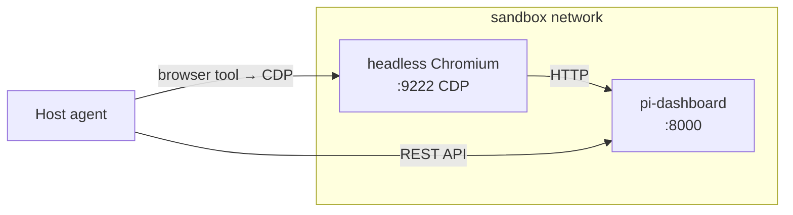

## Context

Today, OpenSpec proposals for UI changes are prose-only. The implementation model reads a text description and produces JSX — with no visual feedback until a human reviews the result. This causes visual drift, iteration loops, and missed edge-case states (empty, loading, error).

The proposal introduces a design sandbox: Docker + headless Chromium running `pi-dashboard` with fake-but-realistic seed data → browser automation captures before-screenshots → vision model produces Tailwind HTML mockups as visual contracts.

Key files involved:

| File | Role |
|---|---|
| `seed/` | Fake workspace data (JSONL sessions, .meta.json sidecars) |
| `sandbox/Dockerfile` | Docker image: pi + openspec + dashboard deps + Chromium |
| `sandbox/docker-compose.yml` | Two services: dashboard (port 8000) + browser (port 9222) |
| `sandbox/entrypoint.sh` | Startup: health-check dashboard → launch Chromium with --remote-debugging-port |
| `.pi/skills/sandbox-designer/SKILL.md` | Vision-capable agent: screenshots + story → mockup.html |
| `.pi/skills/browser-visual-debug/SKILL.md` | Modified: `--sandbox` + `--scenario` modes |
| `.pi/skills/openspec-propose/SKILL.md` | Modified: optional Design Phase |
| `.pi/skills/openspec-archive-change/SKILL.md` | Modified: seed merge on archive |

The dashboard server itself is NOT modified. The sandbox runs the production `pi-dashboard` binary, reading real session data in the same format it uses in production.

## Goals / Non-Goals

**Goals:**
- Provide a reproducible, Docker-based sandbox where `pi-dashboard` renders with fake workspace data covering all UI states.
- Automate before-screenshot capture via scenario-driven browser automation (`browser-visual-debug --sandbox`).
- Generate Tailwind HTML mockups from screenshots + user stories using a vision-capable model.
- Grow seed data organically: each archived change that adds new UI can contribute seed patches.
- Keep the dashboard codebase unchanged — the sandbox exercises the existing server and client as-is.
- Fail gracefully when Docker is absent: skip the design phase, proceed with text-only proposal.

**Non-Goals:**
- Modifying dashboard server or client code (this is infrastructure + skills only).
- Shipping the sandbox image in the Electron installer (developer tool, not user-facing).
- Automated visual regression testing in CI (local-only, design-time tool).
- Mockup → JSX code generation (mockup is a visual contract for a human + implementation model).
- Covering 100% of UI states on day 1 (seed grows organically).
- Supporting sandbox on CI/CD pipelines (Docker-in-Docker adds complexity without clear value for design mockups).

## Decisions

### Decision 1: Seed data format — native dashboard JSONL + .meta.json

Seed workspaces use the exact same format as real dashboard sessions: JSONL files for turn-by-turn events and `.meta.json` sidecars for session metadata.

**Why not a separate mock format:** The dashboard server already reads JSONL + `.meta.json` natively via `server-session-reader`. Using the same format means:
- Zero new code paths in the server.
- Seed data can be inspected with the same tools as real sessions.
- When the session format evolves, seed data evolves alongside (no drift between mock format and real format).

**Trade-off:** Hand-crafting JSONL is tedious. Mitigation: the initial 5 workspaces are authored once; subsequent growth is via archive-merge (adding real session data from completed changes).

### Decision 2: Docker composition — two services via docker-compose

The sandbox uses `docker-compose` with two services sharing a network:



**Why two services, not one:** Separating dashboard and browser lets us:
- Use the official Chromium image (`chromium/headless-shell` or `browserless/chrome`) without baking it into the dashboard image.
- Rebuild the dashboard image independently (seed changes don't invalidate browser layers).
- Kill/restart the browser without restarting the dashboard (useful during scenario development).

**Why not a single multi-process container:** Docker best practice is one process per container. Two containers with `docker-compose` are the standard pattern. The overhead of an extra container is negligible.

### Decision 3: Scenario format — JSON step array

Browser scenarios are JSON arrays of step objects:

```json
[
  { "action": "open",   "url": "http://localhost:8000" },
  { "action": "wait",   "condition": "networkidle" },
  { "action": "screenshot", "name": "01-sidebar" }
]
```

**Why JSON, not Playwright script or YAML:**
- JSON is trivially parseable by any agent (no runtime dependency).
- The step vocabulary is deliberately small (10 actions) — a full Playwright script is overkill.
- JSON is diffable in git (useful for reviewing scenario changes).
- The `openspec-propose` agent can generate JSON directly from user stories (simpler than generating a Playwright script).

**Why not recording-based scenarios:** Recording requires a human to click through the UI. The goal is automation — the agent derives scenarios from the user story text, then the browser executes them.

### Decision 4: Mockup format — Tailwind HTML with HTML comment annotations

The `sandbox-designer` agent outputs a single `mockup.html` file. Visual states are annotated with HTML comments:

```html
<!-- state: default -->
<div class="flex items-center gap-2 px-3 py-2">...</div>

<!-- state: error -->
<div class="flex items-center gap-2 px-3 py-2 bg-red-50 border-red-200">...</div>
```

**Why inline HTML comments, not a separate metadata file:**
- Single-file delivery — the implementation model opens one file and sees everything.
- Comments are invisible in browser rendering (can preview mockup.html in any browser).
- Comments are structural, not semantic — they label regions, they don't encode logic.

**Why Tailwind, not raw CSS:**
- The dashboard already uses Tailwind. The implementation model reads Tailwind classes and maps them to existing component patterns.
- Vision models are trained on Tailwind documentation and produce reliable utility combinations.
- Raw CSS would require the implementation model to reverse-engineer which Tailwind classes produce the same visual result — adding an unnecessary translation step.

**Why not a component-based format (JSX, Svelte):** The mockup is a visual contract, not production code. HTML is the lowest common denominator — previewable anywhere, requires no build step, and focuses the model on visual structure rather than framework-specific patterns.

### Decision 5: Sandbox lifecycle — per-propose start/stop

The sandbox starts at the beginning of the Design Phase and stops at the end. No persistent daemon.

**Why not a persistent sandbox:**
- The sandbox consumes ports 8000 and 9222 — would conflict with the developer's running dashboard.
- Seed data is read at startup; a persistent sandbox would require hot-reload of seed changes (complexity for no gain).
- Docker start/stop overhead is ~2-5 seconds — acceptable within a propose workflow that already takes 30-60 seconds.

**Why not skip Docker and screenshot the running dashboard directly:** The running dashboard reflects the developer's real sessions, not the seed data's controlled states. Screenshots of real data would include random session names, unpredictable states, and potentially sensitive information.

### Decision 6: Seed growth — unified diff patches (`seed.patch`)

Changes contribute seed data via `seed.patch` (unified diff against the `seed/` directory). At archive time, `git apply --directory=seed/ seed.patch` merges the contribution.

**Why patches, not additive directories:**
- Patches express deltas precisely (add this session, modify that .meta.json field).
- Patches can fail on conflict (two changes touching the same seed file) — this is desirable; the archiver resolves the conflict manually.
- Patches are git-native — no custom merge tool needed.

**Why not separate `seed-contrib/<change-name>/` directories:** Additive directories would grow without bound (every archived change leaves a directory). Patches are applied once and the change directory disappears — the seed is a single clean tree.

### Decision 7: Screenshot storage — ephemeral, not committed

Screenshots are written to `<change-dir>/screenshots/` during the design phase but are NOT committed to git. Only `mockup.html` is committed.

**Why not commit screenshots:**
- PNG files are binary blobs (100 KB – 1 MB each) that bloat the repository.
- Screenshots are intermediate artifacts — the mockup.html is the persisted output.
- Screenshots become stale the moment the dashboard UI changes; they'd be dead weight in git history.

**Why keep them in the change directory at all:** The `sandbox-designer` agent needs local file access to the screenshots. They are cleaned up when the change directory is archived (or can be `.gitignore`'d).

### Decision 8: Docker absence — graceful fallback

If Docker is not installed or not running, `openspec-propose` skips the Design Phase entirely and proceeds with text-only proposal generation (today's behavior). The skill emits a notice: "Design sandbox unavailable (Docker not found). Proceeding with text-only proposal."

**Why not error out:** Making Docker a hard requirement would break the propose workflow for developers who don't have Docker. The design phase is additive value — it should never block the core workflow.

**Why not install Docker automatically:** Docker installation is OS-specific, requires admin privileges, and is out of scope for a pi skill.

### Decision 9: Vision model — Claude Sonnet/Opus with vision

The `sandbox-designer` skill documents Claude Sonnet or Opus as the recommended model. These models have strong vision capabilities and produce reliable Tailwind output.

**Why not GPT-4o or Gemini:** They work too, but Claude's Tailwind generation has been more consistent in testing. The skill documents a model recommendation, not a hard requirement — any vision-capable model can be used.

**Mitigation for model variability:** The mockup is a contract, not production code. Minor spacing/color differences between model outputs are acceptable. The implementation model is expected to adjust spacing to match the dashboard's existing patterns — structure and state coverage are the invariant, not pixel-perfect reproduction.

## Proposed docker-compose.yml

```yaml
version: "3.8"
services:
  dashboard:
    build:
      context: ..
      dockerfile: sandbox/Dockerfile
    ports:
      - "8000:8000"
    volumes:
      - ../seed:/home/pi/.pi/agent/sessions:ro
    healthcheck:
      test: ["CMD", "curl", "-f", "http://localhost:8000/api/health"]
      interval: 1s
      timeout: 3s
      retries: 10

  browser:
    image: chromedp/headless-shell:latest
    ports:
      - "9222:9222"
    command:
      - --remote-debugging-port=9222
      - --remote-debugging-address=0.0.0.0
      - --no-sandbox
      - --disable-gpu
```

## Proposed Dockerfile

```dockerfile
FROM node:22-bookworm-slim

# Install pi and openspec globally
RUN npm install -g @mariozechner/pi @mariozechner/openspec

# Install dashboard dependencies (for dev mode)
WORKDIR /app
COPY package.json package-lock.json ./
RUN npm ci

# Dashboard source (read-only, for pi-dashboard --dev)
COPY . /app

# Seed data will be mounted at runtime via docker-compose volumes
# Entrypoint handled by docker-compose command
```

## Risks / Trade-offs

- **[Risk] Seed data becomes stale as dashboard UI evolves.** The dashboard's component structure changes, but seed data (sessions, flows, preferences) stays the same. The sandbox renders whatever the current dashboard code produces — if a component is removed, the seed's trigger for it becomes a no-op (worst case: no screenshot of that state). Mitigation: each seed workspace's README.md documents which UI states it covers; when a component is removed, the corresponding seed workspace is updated or archived.

- **[Risk] Docker build time on first run is 2-5 minutes** (installing pi, openspec, npm deps). Mitigation: Docker layer caching makes subsequent builds near-instant. The `COPY . /app` layer invalidates on any source change, but for design sandbox purposes, the dashboard code is stable within a propose session. Pre-built image shipping is possible future work but out of scope.

- **[Risk] `seed.patch` conflicts during archive-merge.** Two changes may patch the same seed file. Mitigation: `git apply` fails with a clear message. The archiver resolves the conflict manually (edit the patch, re-apply). This is expected to be rare (seed data is per-workspace, and changes rarely touch the same workspace).

- **[Risk] Headless Chromium may fail to render certain dashboard states** (WebSocket connections, animations, timing-dependent UI). Mitigation: the scenario format includes `wait` steps (`networkidle`, explicit `ms`) to handle timing. If a state is fundamentally un-renderable in headless mode, the scenario file documents it as a known limitation and the design phase skips that screenshot.

- **[Risk] Vision model produces unusable mockups** (wrong layout, hallucinated elements). Mitigation: the `sandbox-designer` skill includes a validation step — the agent opens the generated mockup.html in the browser and screenshots it, comparing against the original before-screenshots. If the mockup doesn't capture the user story's states, the agent regenerates.

- **[Trade-off] Screenshots are not committed → design decisions are not fully reproducible.** Someone checking out an old commit won't see the screenshots that informed the mockup. Acceptable — the mockup.html is the persisted artifact; screenshots are ephemeral diagnostic data. If reproducibility is needed, re-running the sandbox with the same seed data (which IS committed) produces equivalent screenshots.

## Open Questions

- **Should the sandbox support multiple viewports?** The proposal targets desktop (1280×720) only. Mobile viewports (375×667) could be added as a scenario file parameter. Defer until a mobile-specific change needs them.
- **Should `mockup.html` replace `design.md` or supplement it?** Current answer: supplement. `design.md` describes the how (architecture, decisions); `mockup.html` describes the what (visual contract). Both are useful for the implementation model.
- **Should the sandbox cache be shared across developers?** Docker layer caching is per-machine. A shared image registry would speed up first-run for new developers. Out of scope — the sandbox is infrequently rebuilt (only on seed changes).
- **Should `sandbox-designer` be a subagent or a standalone skill?** Current answer: standalone skill invoked by `openspec-propose`. A subagent would add subagent overhead (session spawn, intercom) for a single-turn vision task.
