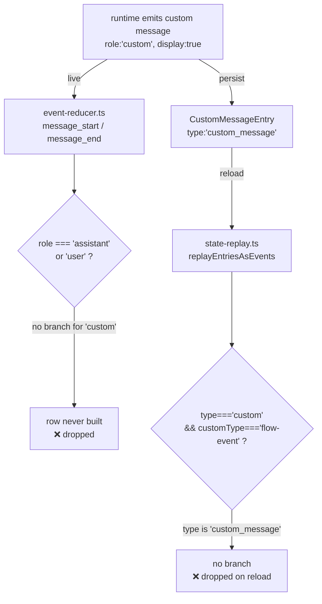

# Design: greet-as-assistant-message

## Context

A display-flagged custom message travels two independent paths to the chat view.
Both currently drop it:

The message is already delivered; the defect is purely in how the dashboard
**interprets** it at each end.

## Decision 1 — render as an assistant-side row (reuse `role:"assistant"`)

The built `ChatMessage` uses `role: "assistant"` so it renders through the
existing `MessageBubble` with **no ChatView change, no `ChatMessage` role-union
change, and no `isRowVisible` change** (the `assistant` role is already visible;
the row is not prefs-gated).

The `role:"custom"` event is handled in its **own** reducer branch, separate from
the `if (msg.role === "assistant")` branch. It therefore does NOT advance
`assistantInferenceSeq`, does NOT touch `streamingTextFlushed`, and does NOT run
the streaming-text flush — those are exclusive to real assistant inferences. The
custom row is a static, fully-formed bubble.

## Decision 2 — build the row exactly once, idempotently

A custom display message has no streaming phase: `message_start` and
`message_end` carry identical final content, and `state-replay` emits both. To
avoid a duplicate row, the reducer builds the row on **`message_end`** only and
uses a content-stable id (`custom-${entryId ?? messages.length}`); a re-replay of
the same entry finds the existing id and updates in place rather than pushing a
second row. `message_start` for `role:"custom"` is a no-op.

## Decision 3 — gate on `display`

Only `display` truthy produces a row. `display: false` / absent is a context-only
message (pi's TUI hides it too); the reducer and replay both skip it. This keeps
the dashboard's shown-set aligned with the runtime's stated intent.

## Decision 4 — not a turn boundary

The custom row is added to neither `TURN_BOUNDARY_ROLES` nor any assistant-turn
scan set. It belongs to no assistant turn: it must not terminate the
`reorderToolCardsForAssistantMessage` backward walk, must not be mistaken for a
`user` / `turnSeparator` boundary, and must not participate in
`findLastUserPrompt` (which scans `role:"user"` only). Because it renders as an
`assistant` row that sits before the first real turn (or between turns), the
surrounding `user` rows already bound any reorder window away from it.

## Decision 5 — state-replay mirrors the live path

For a persisted `entry.type === "custom_message"` with `display` truthy, replay
emits `message_start` + `message_end` with the same message shape the live path
produces, so a reloaded transcript is byte-identical to the live one. This
parallels the existing flow-event replay branch and keeps the reducer the single
place that decides how a custom message renders.

`type:"custom_message"` is a **distinct** entry type from `type:"custom"`
(`CustomEntry`, extension state that never renders as a message). The existing
"custom non-flow entries ignored" behavior for `type:"custom"` is unchanged; this
change adds handling only for `custom_message`.

## The contract this change owns

Any session message with `role:"custom"` and `display: true` — live or persisted
as `type:"custom_message"` — renders as a single assistant-side chat bubble,
identically across the live and reload paths.
