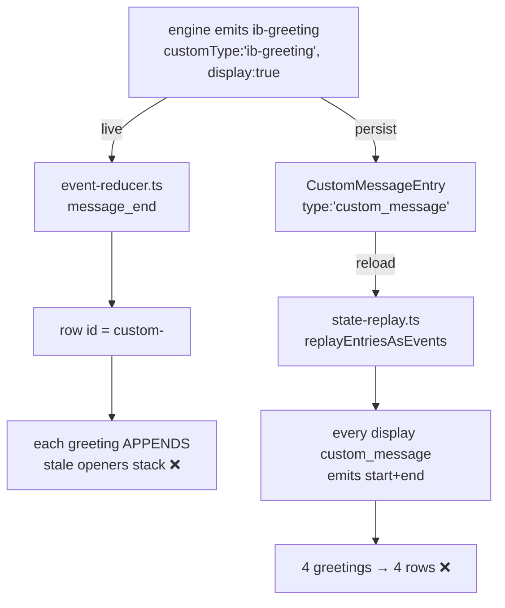

# Design: replace-replayed-greeting

## Context

An `ib-greeting` travels two paths to the chat view, and both treat it as history instead
of a replaceable overlay:

Both ends already funnel into ONE reducer branch (`msg?.role === "custom" &&
msg?.display`), which is the single place the row identity is chosen. Fixing the identity
there gives live/replay equivalence for free.

## Decision 1 — stable row id for greetings (reducer)

The custom branch currently keys the row on `custom-${entryId ?? length}`. For
`customType:"ib-greeting"` use the fixed id `custom-ib-greeting` instead. The existing
`findLastIndex` replace-in-place path then makes every newer greeting overwrite the prior
one in place, so the row keeps its original (opener) position and only its content/entryId
advance. No new branch, no `ChatMessage` shape change, no effect on other custom types
(their per-entry ids are untouched, so they are NOT collapsed).

`entryId` (a pi-generated UUID) can never equal the literal `ib-greeting`, so the fixed id
cannot collide with a real per-entry id.

## Decision 2 — emit only the latest greeting at the first slot (replay)

The replay loop must not emit greeting entries inline (that would reintroduce the history
stack). Instead it records, in one pass:

- `greetingSlot` — `messages.length` at the FIRST greeting entry (so the greeting stays the
  opener, not the tail).
- `latestGreeting` — overwritten with each greeting entry, so the LAST one wins (file order
  is append order, matching the live `message_start`/`message_end` order).

After the loop, if `latestGreeting` exists, ONE `message_start` + `message_end` pair is
spliced into `messages` at `greetingSlot`. Because the reducer (Decision 1) keys the
greeting row on the fixed id, the single replayed pair and the live replacements converge
on the same row.

Flow events remain appended after message replay (unchanged), and non-greeting custom
messages keep their inline emission, so ordering of everything else is preserved.

## Decision 3 — lock test, not a route change (query passthrough)

The `/query` route already forwards the full request body (`body as { view: string }`) to
`engine.query(cwd, args)` where `args` has an index signature — there is no `view`
whitelist and no reshaping. A new engine selector (`view:"current-greeting"` plus any
extra args such as `session_id`) therefore passes through verbatim today. The change adds
a lock test asserting that passthrough, and changes no route code.
