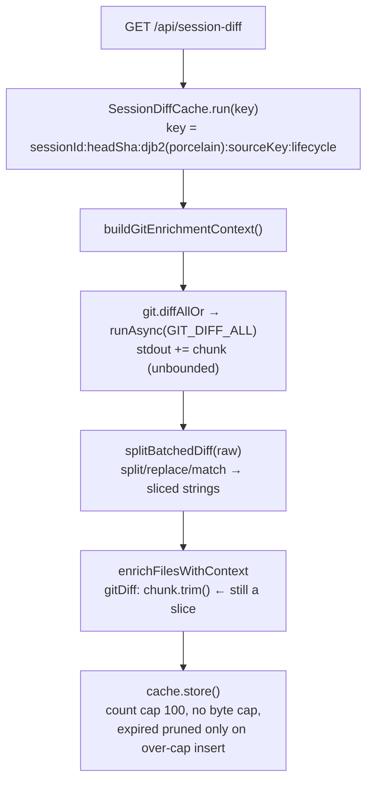

## Context

See proposal.md, "Why". Current request path:

Two things keep a batched-diff parent alive past its request:
1. **Per cached result** (the defect): `gitDiff: chunk.trim()` at `session-diff.ts:569`. It is a sliced string, so every cache generation pins its own parent. This is the part that multiplies.
2. **One global pin** (a V8 detail, verified on Node 24): the legacy RegExp last-match statics (`RegExp.input` / `$_`) hold the subject of the last successful regex. `splitBatchedDiff`'s last regex runs on a sliced chunk, so the most recent parent stays pinned until *any* later successful regex in the process. This is at most **one** parent, it is transient, and D3 bounds its size. It is not fixed in code, because resetting a process-global regex state from library code is a hack. Tests must neutralise it (see Test strategy).

Untracked synthetic diffs are fresh `join`ed strings (independent). With an empty diff map, tracked files fall through to counts-only, and untracked files still get synthetic diffs (`session-diff.ts:571-606`). The shared cache (`session-routes.ts:62`) serves all sessions.

## Goals / Non-Goals

**Goals:**
- Heap retained per cached result is O(its own content), independent of batched-diff size.
- Cache retention is bounded by `max(maxBytes, newest entry size)`. The tracked-diff part of any entry is bounded by D3. Entry size from event payloads and untracked synthetic diffs is **pre-existing and not newly bounded here** (see Risks).
- The batched diff is never buffered beyond a fixed byte limit.

**Non-Goals:**
- Changing the cache key or client refetch cadence (`diffChangeSignal` amplifier).
- A default `maxBuffer` for all `runAsync` callers, or any change to the sync `run()` path.
- Bounding memory for concurrent *in-flight* computations across distinct keys (see Risks).
- Streaming or paginated diffs.

## Decisions

### D1: copy at the storage site
`gitDiff: flattenString(chunk.trim())`, where `flattenString(s) = Buffer.from(s, "utf8").toString("utf8")`. The comment says not to simplify it back to `.trim()`.
- Copying only renderable chunks (≤ `TRACKED_DIFF_MAX_BYTES`) keeps the transient cost bounded. Dropped oversized chunks are never copied.
- Alternatives such as `(" " + s).slice(1)` and `JSON` round-trips rely on V8 heuristics that may still return cons or sliced strings. A Buffer round-trip always allocates a sequential string. Input is decoded git stdout (well-formed UTF-16), so the round-trip is byte-identical.

### D2: byte budget with a serialized-size estimate
`new SessionDiffCache<T>(ttlMs, maxEntries, { maxBytes, sizeOf })`. Entries store `{ value, expires, bytes }`, and the cache keeps a running `totalBytes`.
- Every removal path goes through one private `remove(key)` that decrements `totalBytes`: overwriting an existing key, the expired sweep, eviction, and `clear()`. This makes accounting drift structurally impossible.
- Eviction after insert: sweep expired entries, then evict oldest while `size > maxEntries || totalBytes > maxBytes` **and the candidate is not the entry just inserted**. The newest entry is always kept. So a single large session still caches (no recompute storm), and the bound is `max(maxBytes, newest)`.
- `sizeOf` for `SessionDiffResult` is `estimateRetainedBytes(value)`: an iterative walk over plain objects and arrays that sums `2 × string.length` plus a small constant per object, array and primitive. It covers `gitDiff`, `changes[].content`, `edits`, out-of-cwd payloads and metadata, without a hand-maintained field list, and it **allocates no copy**. `JSON.stringify` was rejected because it would materialise a second full copy of the result synchronously on the path being bounded. The walk runs once per compute, not per hit. The factor of 2 (UTF-16 worst case) errs toward safety.
- `maxBytes` = 64 MB. `sizeOf` is injected so the cache stays generic in `T`. The options type makes `sizeOf` required whenever `maxBytes` is set; without either, behaviour is unchanged (count cap only). The budget is enforced over the **estimate**. The walk treats any non-plain value as a constant, and `SessionDiffResult` is plain JSON data, so the estimate is conservative there.

### D4: expiry on access
`run()` sweeps expired entries (O(n), n ≤ 100) via `remove()` before the lookup. A timer-based sweeper was rejected: it adds a lifecycle to manage for no gain at this n.

### D3: opt-in `Recipe.maxBuffer` in `runAsync` only
- `Recipe.maxBuffer?: number`: a limit on **stdout bytes**, counted by summing `chunk.length` of each raw `Buffer` data event *before* `toString` (O(1) per chunk; exact bytes rather than UTF-16 units). stderr is unchanged (pre-existing; git diff stderr is small). There is **no** `RunCtx` override, so no caller can bypass a recipe's safety cap. The sync `run()` path is untouched, so existing `ENOBUFS → spawn-failure` behaviour is unchanged. The `Recipe.maxBuffer` doc comment states it is honoured by `runAsync` only (no sync caller of `GIT_DIFF_ALL` exists).
- Overflow in `runAsync`: stop appending, `clearTimeout(timer)`, then run the **same** SIGTERM → 3 s SIGKILL escalation as the timeout path, extracted into one local `terminate()` helper so the exited/recycled-pid guard is shared. Settle once (`settled` guard) with `{ kind: "output-too-large"; binary; limitBytes; message }`. `message` is required: `openspec-routes.ts:412-418` narrows `ExecError` down to a final `err.message` branch, and without the field that would stop compiling. Partial output is deliberately **not** carried on the error; carrying it would defeat the cap. The `close` handler returns early when already `settled`, so `recipe.parse` never runs on truncated stdout.
- `GIT_DIFF_ALL.maxBuffer = 32 MB`.
- `buildGitEnrichmentContext` calls `git.diffAll` (not `diffAllOr`, which `unwrap`s to `""` and would swallow the kind). On `output-too-large` it logs `[session-diff] batched diff exceeded <limit> bytes in <cwd>; serving counts only`, throttled to once per cwd per 10 min through a module-level `Map<cwd, lastWarnMs>`. Entries older than the window are pruned on each warn, so the map stays bounded by the cwds that are actively oversized. Tests use distinct temp cwds, so the throttle state never couples tests. It then continues with an empty diff map. Other errors keep the current `""` fallback.
- The `ExecError` union gains one variant. There is no `switch`/`assertNever` over `kind`, but narrowing chains that end in `err.message` exist (`openspec-routes.ts`), which is why the variant carries `message`. `*Or` helpers map it to their fallback like any other error. The workspace `tsc --noEmit` is the gate.

### Test strategy
- **Retention test (D1):** vitest spawns a child `node --expose-gc --import tsx <fixture>` (`execFileSync`). The fixture prints one JSON line last, and the test parses the **last** stdout line, which tolerates loader warnings. No process-wide V8 flag touches the vitest worker. The child always has `gc` because the flag is explicit, and a missing `gc` **fails** the test rather than skipping it. The fixture also measures N = 5 generations to cover the no-multiplication scenario. **Control arm, against vacuous passes:** the same fixture also measures a `chunk.trim()` copy held the old way and asserts it *does* retain (> 40 MB). If a future V8 stops slicing, the test fails loudly ("control no longer retains — revisit D1") instead of passing green. `execFileSync` runs with `cwd` = repo root (so `tsx` resolves) and `timeout: 60_000`. The fixture builds the batched diff inside a function scope, stores the cached value, runs `/a/.exec("a")` to reset the RegExp last-match statics, calls `gc()` three times, and asserts `retained < 5 MB`. Verified locally: current code retains 50.0 MB and the flattened version 0.0 MB under this exact procedure. Without the statics reset, *both* measure 50 MB, which is why the reset is required.
- The cache, runner and enrichment tests are ordinary deterministic unit tests (fake timers, stubbed children and git).

## Risks / Trade-offs

- [One global RegExp-statics pin of the latest parent] → at most one parent (≤ 32 MB via D3), transient, released by the next successful regex anywhere in the process. Accepted, and carved out explicitly in the ADDED requirement.
- [In-flight memory across concurrent distinct keys: each compute holds ≤ 32 MB raw plus the split plus copies] → bounded per compute by D3. N simultaneous large sessions → N × that. Accepted; single-flight already collapses duplicates of the same key.
- [One shared 64 MB budget across sessions can thrash between several large sessions and cost recomputes (CPU)] → the newest-entry rule prevents a full-miss storm for any single session. The budget is a named constant, easy to tune. This is the right trade against OOM.
- [Batched diff > 32 MB → *every* tracked file loses its text diff, not only the huge one] → accepted and now written into the modified spec. The throttled warning names the cause, and `.gitattributes -diff` (issue §7) restores per-file diffs.
- [New synchronous CPU on the request path: D1 memcpy per renderable chunk plus the D2 size walk, against the unmodified "Event-loop responsiveness" requirement] → both are linear and allocation-light, and bounded by D3 (≤ 32 MB of diff text, roughly ms-scale memcpy). This is the same order as the existing synchronous `splitBatchedDiff` regex pass over the same bytes. No new latency test; the existing responsiveness coverage is re-run in the full suite.
- [Result size from `otherChanges` (not capped by `MAX_FILES`) × untracked synthetic diffs (≤ 256 KB each), plus event payloads, is not bounded by this change] → pre-existing and not the #719 mechanism (no parent retention; these are independent strings). The byte budget still limits how many such results stay cached. A cap on the number of synthetic diffs is a follow-up, out of scope.
- [Migrating 18 `diffAllOr` mocks to `diffAll` is a **return-shape** change: mocks must resolve `{ ok: true, value: <diff> }`, not a bare string] → a rename-only migration would make `res.ok` undefined, sending every test down the error branch (empty diff map) while call-count assertions stay green. The migration task must assert a tracked file still carries `gitDiff` in at least one migrated test. `diffAllOr` loses its only caller, so it is removed as an orphan this change creates (along with its `git.ts` AGENTS row).

## Migration Plan

No persisted data. Deploy with a server restart (`/api/restart`). Rollback is a plain revert.
