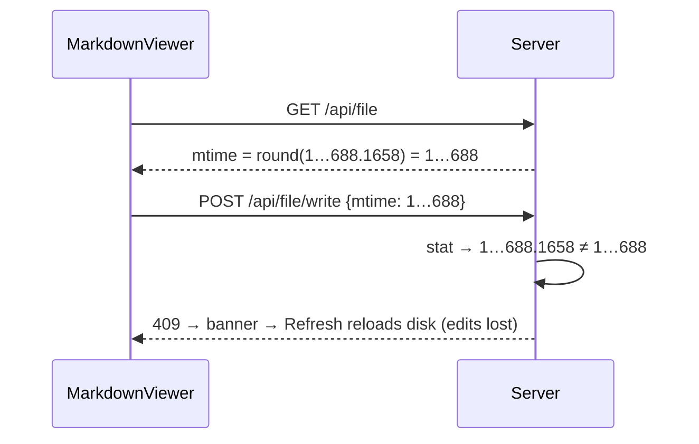

## Context

Two endpoints issue the write concurrency token, and they disagree:

| Endpoint | Token | Consumer |
|---|---|---|
| `GET /api/file` (`file-routes.ts` file branch) | `Math.round(stat.mtimeMs)` | `MarkdownViewer` (`EditableSpreadsheetTab` too, but its `.csv` writes 403 at `isWritableMdTarget` first; out of scope) |
| `GET /api/file/md-read` | `stat.mtimeMs` | `InstructionsEditorPane` |
| `POST /api/file/write` check | `current.mtimeMs !== mtime` | all |

Both came in with `397be9890` (directory-settings-page-and-scoped-md-editing). The write side deliberately uses full precision ("rounding could collapse two fast saves into one token"). APFS/ext4 report fractional `mtimeMs` (observed: `1789712521688.1658`), so the rounded token fails the check on every save.

## Goals / Non-Goals

**Goals:** a token from `/api/file`, echoed back unchanged, passes the write check. Genuine conflicts still return 409.

**Non-Goals:** self-write `file_changed` suppression; a 409 "overwrite" choice; viewer remount-on-refresh behavior.

## Decisions

- **Return full-precision `stat.mtimeMs` from `/api/file`.** One token format across both read endpoints and the write check.
  - Alt: round on the write side, or compare within `< 1ms`. Rejected because it reintroduces the fast-double-save collision the write side explicitly guards against.
  - Alt: an opaque server token (hash of `mtimeMs:size`). Rejected as more surface than the bug needs. We can revisit if precision ever becomes lossy.
- **JSON transport is exact.** `mtimeMs` is an IEEE-754 double from Node, and `JSON.stringify`/`parse` round-trips doubles exactly. The client stores and echoes it as a `number` without arithmetic.

## Risks / Trade-offs

- [Another `/api/file` consumer expects an integer `mtime`] → Grep before landing. The field is documented as the write token only. Display code, if any, should format it anyway.
- [A filesystem whose `mtimeMs` changes between two stats without a write] → Not observed. Such a filesystem would already break `md-read`, so this change adds no new risk.

## Migration Plan

Server-only. Restart through `POST /api/restart`. Old clients keep working because they echo the token back as-is. Rollback: revert the line.
