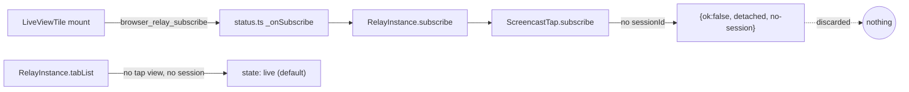

## Context

See proposal.md — Why. Observed on a live instance (`inst-ed51a5128ba5`, profile `Default`): the only known tab was `chrome-extension://…/connect.html` ("Welcome"). `GET /api/browser/profiles` reported it `state:"live"`; the audit held only `attach/extension` and no `viewer-subscribe` row, i.e. `ScreencastTap.subscribe` returned early and `RelayInstance.subscribe`'s result was discarded by `status.ts:_onSubscribe`.

Current flow:

Constraints:
- `relay/vendor/playwright-core/**` is hash-pinned; session ownership is read only through `sessionIdForTab()` (the `_tabSessions` accessor).
- A tab's debugger session appears inside the vendored model as a side-effect of CDP-client traffic (`Target.setAutoAttach` / attach responses), not via an extension event we already intercept — so today nothing calls `onStatusChange()` when a tab becomes viewable.
- `relay-store.ts` `dismissed` flag is module-level; the shell's `onClose` is a deliberate no-op.

## Goals / Non-Goals

**Goals:** truthful tab state; a refused subscribe is visible (UI + audit); automatic recovery when the tab becomes viewable; a way to re-open after Close; the gate reacts to plugin signals on idle sessions.

**Non-Goals:** mobile-layout content-view mount; per-session scoping of the global relay badge; making extension pages viewable (Chrome forbids `chrome.debugger` on them).

## Decisions

### D1 — Report truth in `browser_relay_status`, not a new reply message
`tabList()` gets a new branch: no `sessionIdForTab(tabId)` and not devtools-detached → `state:"detached", reason:"no-session"`. Precedence becomes: devtools → no-session → tap state → client-screencast → `live`.
*Alternative:* a per-socket `browser_relay_subscribe_result` reply. Rejected: adds a protocol message + client plumbing, and the tile already renders from status; status is broadcast, so every viewer (including ones that never subscribed) sees the same truth. `client-screencast-active` is already reported by status, so no refusal reason is lost.
`BrowserRelayTabStatus.reason` widens to `"devtools" | "no-session"` — additive.

### D2 — Broadcast when viewability changes
`RelayInstance` keeps `lastViewableSig` (sorted `tabId:hasSession` list). After every CDP-client message has been forwarded and after each extension event, it recomputes the signature and calls `deps.onStatusChange()` only when it differs. Cheap (≤ tens of tabs), no timer, no vendor edit.
*Alternative:* poll every N s. Rejected — latency + idle work.

### D3 — Tile re-subscribes on the viewable edge
The per-tab subscribe effect keys on `{instanceId, tabId, viewable}` where `viewable = !(state === "detached")`. Leaving `detached` re-runs the effect → one new subscribe; entering `detached` runs the cleanup unsubscribe (harmless: server-side unsubscribe of a non-subscriber is a no-op). Overlay text chosen by `reason` (`devtools` existing, `no-session` new); input forwarding blocked for any `detached`.

### D4 — Audit refused subscribes in `RelayInstance.subscribe`
On `{ok:false}` append `viewer-subscribe-refused` with detail `tab:<id> reason:<reason>`; add the kind to `AuditKind`. `status.ts` stays unchanged (no reply channel, per D1).

### D5 — Re-open via the badge
`relay-store.ts` gains `reopenLiveView()` (clears `dismissed`, bumps slot-claims version, notifies subscribers; no-op when not dismissed). `BrowserRelayBadge` renders a `<button type="button">` with `aria-label` ("Show live browser view"), calling `reopenLiveView()` and NOT stopping propagation, so the card click still selects the session. Same component serves every place the `session-card-badge` slot renders.
*Alternative:* a header menu entry. Rejected for now — more shell surface; the badge is already where the user looks.

### D6 — Gate subscribes to the invalidation store
Extract the `renderSession` gate in `App.tsx` into a small `SessionContentGate({id, session})` component that calls `useSlotClaimsVersion()` before computing `forSession(getClaims("content-view"), session)`. Subscribing in `App` itself would re-render the whole shell on every plugin bump; a leaf component keeps the re-render local.

## Risks / Trade-offs

- [D2 misses a session appearing through a path that is neither a CDP-client message nor an extension event] → the unit test drives attach through the fake CDP client + `FakeExtension`; any tab still stuck recovers on the next CDP message the agent sends.
- [`no-session` also covers a tab the agent will never attach (the connect page)] → the overlay text says so; the tile stays until the tab set changes, which is correct behaviour.
- [Old clients receive `reason:"no-session"`] → they render the generic `detached` path (DevTools wording) — misleading copy but no break; server and client ship together in this repo.
- [Badge button inside a clickable card → nested interactive elements] → button stays a real `<button>` with its own focus; no `stopPropagation`, so there is no swallowed selection; covered by an RTL test.

## Migration Plan

None — no persisted data. Deploy: client build + server restart (browser-plugin is server + client). Rollback: revert the commit.
