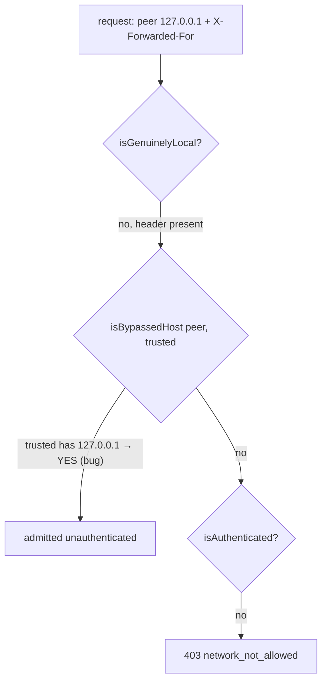

## Context

Pass conditions for an unauthenticated request, today (`hasNetworkPassCondition`, `localhost-guard.ts:262`):

1. `isGenuinelyLocal(ip, headers)` — loopback peer **and** no forwarding header.
2. local-IPC token.
3. `isBypassedHost(ip, trusted)` — **raw peer IP only**.
4. `isAuthenticated`.

Condition 1 was narrowed (D10) precisely so a tunnel presenting as `127.0.0.1` is not local. Condition 3 re-opens the same door whenever the trusted list covers loopback. The identical pattern is copy-duplicated at four more sites (auth-plugin bypassHosts skip, `validateWsUpgrade`, the no-auth WS branch in `server.ts`, `tierRefusalFor`).



Why users add a loopback entry: `tailscale serve` (private mode) relays tailnet clients from `127.0.0.1`, so a tailnet CIDR (`100.64.0.0/10`) in `trustedNetworks` never matches; adding `127.0.0.1` "makes it work" — and, as a side effect, trusts every other tunnel on the host.

## Goals / Non-Goals

**Goals**
- Relayed loopback traffic is never admitted by a trusted-network entry, at every peer-IP trust site.
- One predicate, so the sites cannot drift again.
- Operators learn their loopback entry is inert.

**Non-Goals**
- Marker-less tunnels (B14) — owned by `harden-trust-and-credential-boundaries`.
- Trusting the forwarded client IP (D2).
- Auto-removing config entries.

## Decisions

### D1 — `isTrustedSource(ip, headers, trusted)` in `localhost-guard.ts`

```ts
// auth/loopback.ts (leaf, import-free)
export function isLoopbackRange(ip: string): boolean; // 127.0.0.0/8, ::1, ::ffff:127.0.0.0/104

// auth/localhost-guard.ts
export function isTrustedSource(ip: string, headers: HeaderBag, trusted: string[]): boolean {
  if (trusted.length === 0) return false;
  if (isLoopbackRange(ip) && hasProxyForwardingHeaders(headers)) return false; // relayed: never trusted
  return isBypassedHost(ip, trusted);
}
```

Replace the five `isBypassedHost(peerIp, …)` trust calls. `isBypassedHost` stays exported (pure matcher; `cors-origin.ts` host matching and tests use it).

**Call order unchanged.** Each site keeps its current order — `hasNetworkPassCondition` still reads `readTrusted()` only after the genuine-local and local-token checks, so no snapshot `statSync` is added to loopback requests (D15).

**`isLoopbackRange` parsing.** Lower-case, strip an `::ffff:` prefix, then `net.isIPv4` + first octet `127`; else exact `::1`. Non-IP input → `false`.

**Range, not set.** `isLoopback` is the 3-address set `{127.0.0.1, ::1, ::ffff:127.0.0.1}`; `isBypassedHost` matches all of `127.0.0.0/8`. A relay bound to `127.0.0.5` with a `127.0.0.0/8` / `127.*` entry would slip past a set-based guard. `isTrustedSource` uses the range. `isLoopback` / `isGenuinelyLocal` are **not** widened here (widening admits more peers as genuine-local — a separate decision).

*Alternative rejected:* strip loopback entries at config load. Leaves the matcher unsafe for any future caller and for wildcard/CIDR entries that happen to cover loopback (`127.*`, `0.0.0.0/0`). Guarding at the predicate covers all shapes.

*Alternative rejected:* only fix `hasNetworkPassCondition`. The OAuth `bypassHosts` skip and WS branches would still admit — the audit already shows these sites drifting independently.

### D2 — Do not trust the forwarded client IP (yet)

Tempting fix for the tailscale-serve case: when the peer is loopback, evaluate trust against the rightmost `X-Forwarded-For` entry. Rejected for this change: `trustProxy` is deliberately `false` (audit: "XFF spoof defeated"); whether zrok/ngrok/tailscale append vs overwrite XFF, and whether an upstream client can inject a trusted-looking value, is unverified per provider. A per-provider, verified "trusted proxy" model is a separate change. Tailnet users get a supported path today: device pairing (bearer) or OAuth.

### D3 — Inert-entry warning + health flag

- Pure `loopbackCoveringEntries(list): string[]` — entries `e` where `isBypassedHost(p, [e])` for any probe `p` in `["127.0.0.1", "::1", "::ffff:127.0.0.1"]`, **or** `isLoopbackRange(base(e))` where `base` strips `/n` and maps `*` → `0` (catches `127.0.0.5`, `127.0.0.4/30`). Matcher facts: `0.0.0.0/0` covers `127.0.0.1` (flagged — correct); bare `"*"` matches nothing; IPv6 CIDR is unsupported by `matchCidr` (never matches), but `::1/128` is still flagged by the base check — harmless (the entry is inert either way).
- **Dedup key = sorted covering-entry signature**, not the config file stamp (the stamp changes on every unrelated write). Module-level `lastWarnedSignature`; log `[trusted-networks] entry "<e>" covers loopback — ignored for tunnel-relayed requests; local requests are already trusted` only when the signature is non-empty and differs from the last. Lives in `localhost-guard.ts` as `noteTrustedList(list)`, memoized on the **array reference**: `getConfigSnapshot()` returns the same `resolvedTrustedNetworks` array until a reparse, so the per-request cost on a cache hit is one reference compare. Called from the guard's trusted read and once at boot. `config-snapshot.ts` stays a leaf (no auth/Fastify import — would re-form the cycle `loopback.ts` was extracted to break).
- `/api/health` gains additive `trustPosture: { trustedHasLoopback: boolean } | null`, sibling of `accessGrants`, computed from `liveTrustedNetworks()` at request time and gated by the same `canDiscloseAccessPosture(request)`. `accessGrants`/`AccessGrantHealth` untouched.
- **Audience limit (accepted):** `auth-plugin` returns before cookie validation for `/api/health`, so an OAuth-cookie browser is not `isAuthenticated` there → gets `null`. Genuine-local and device-bearer callers get the flag. The operator who can fix the config is on the host; good enough.

### D4 — No network grant prompt for relayed-loopback denials

`sendNetworkDenied` calls `networkDenialObserver` → `grantCoordinator.onDenial({plane:"network", rawSubject: request.ip})`. For a tunnel visitor that offers "trust `127.0.0.1`?". Today accepting it trusts the whole tunnel; after D1 it writes an inert entry and re-denies (grant→deny loop). Skip the observer when `isLoopbackRange(request.ip) && hasProxyForwardingHeaders(headers)`. Block-event recording is unchanged (it already marks such peers `trustable: false` and `acceptTargetFor` returns `null`).

## Risks / Trade-offs

- **Tailnet users lose tokenless access** → documented BREAKING; the denial body's `hint` already names the remedy (sign in). Tutorial step covers pairing.
- **A header-less local reverse proxy** (e.g. user's own nginx on loopback without `X-Forwarded-*`) is unaffected — still genuine-local; that is B14's territory.
- **Same-host reverse proxy with `X-Forwarded-*`** (nginx/Caddy TLS front) admitted today only by a loopback entry → now needs sign-in/pairing. Documented BREAKING; unavoidable — indistinguishable from a tunnel agent.
- **Empty / array-valued forwarding header** counts as present (`!= null`) → fail-closed, identical to `isGenuinelyLocal` today. Accepted.
- **WS upgrade reads a boot-frozen list** (`server.ts:3008` `config.resolvedTrustedNetworks`, both WS branches) while HTTP sites read `liveTrustedNetworks()`. Pre-existing; not fixed here (surgical) — follow-up.
- **Block-event `trustable` stays set-based** (`isLoopback`). A header-less relay on `127.0.0.5` is marker-less (B14, non-goal); with a header it is `proxied` → non-trustable, and D4 suppresses the prompt via the range.
- **OAuth-skip list liveness** (`authState.bypassHosts` refreshed on reload) is unchanged by this change — only the predicate changes.
- **Header list coverage**: relies on `PROXY_FORWARDING_HEADERS` (core list). Tunnels injecting only exotic headers would slip through — same exposure as `isGenuinelyLocal` today; the plugin-scope extended list is not adopted here to keep both predicates consistent. Verify zrok v2, ngrok, `tailscale serve` each emit at least one core header (task).

## Migration Plan

No data migration. Deploy = server restart. Rollback = revert + `POST /api/restart`. Config stays valid in both directions.

## Open Questions

- Should the Settings → Servers trusted-network editor refuse to add a loopback entry (UI-level), or only warn? Default here: warn only (server warning + health flag); UI refusal can follow.
