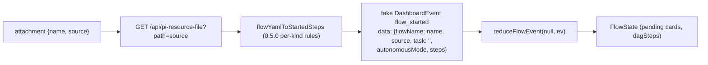
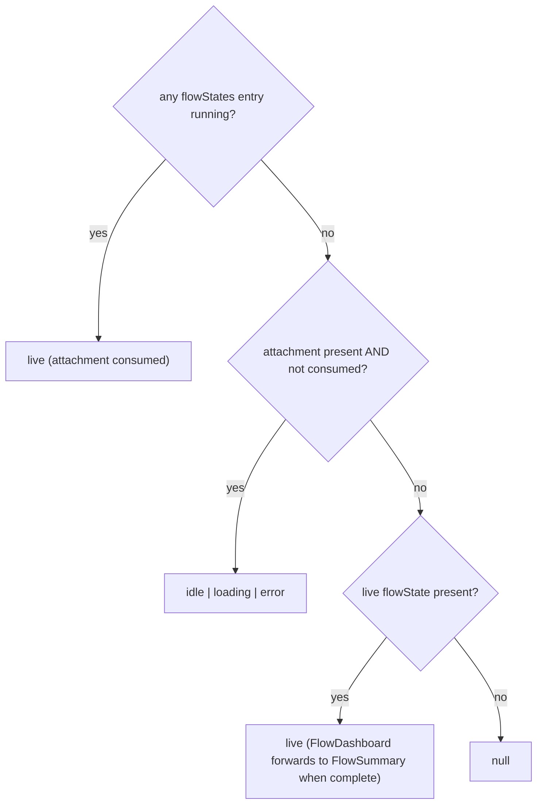

## Context

See proposal.md for motivation. Current wiring (pi-flows **0.5.0**, the installed = npm `latest` = GitHub `develop` version):

- `FlowInfo { name, description, taskRequired, source }` reaches the client as per-session data `flowsList`. pi-flows discovery sets `source` to the absolute `flow.yaml` path and `name` to the command id (`<ns>:<name>`, derived from the bundle dir, not the YAML `name:`). Unparseable flows are skipped by discovery, so they never appear in `flowsList`.
- pi-flows `onFlowStarted` (`flow-tui.ts` ~L576-603) emits `flow:flow-started { flowName, task, steps, source, autonomousMode, ... }`, where each step is `{ id, stepType, agent, blockedBy, branches, onError }`.
  - **No `onComplete`:** 0.5.0 removed `on_complete`. `tools/flow-validate.ts` rejects it and `flow-parser-yaml.ts` never reads it.
  - `type` is required (`flow-parser-yaml.ts`, "missing required type").
- `reduceFlowEvent(null, flow_started)` (`packages/flows-plugin/src/flow-reducer.ts`) builds `FlowState` with `status: "running"`: a pending card for every agent-bearing step plus `code` / `code-decision` steps, and `dagSteps` for the graph.
- `FlowDashboardClaim` (`content-header-sticky`, no `shouldRender` gate) renders `FlowDashboard` only when `useFlowsSessionState(id).flowState` is non-null.
- `FlowDashboard`:
  - treats `status !== "running"` as complete and returns `<FlowSummary>`
  - builds tabs from `flowStates`
  - clears `selectedStepId` whenever `displayState.agents` changes identity (`FlowDashboard.tsx:100-103`). The reducer creates a new `agents` Map on every event, so a live run drops the selection on every event.
- pi-flows' strict parser keeps a **different field subset per node kind**. `onFlowStarted` serializes what the parsed step kept, except that it always emits `blockedBy` (`|| []`):

  | kind | `agent` | `blockedBy` | `branches` | `on_error` |
  |---|---|---|---|---|
  | `agent` | required | yes | – | yes |
  | `code` | – | yes | – | yes |
  | `code-decision` | – | yes | yes | – |
  | `fork` | optional | – | yes | – |
  | `agent-decision` | required | – | yes | – |

  The strict parser also wraps a scalar `blockedBy` into an array and `String()`-coerces `agent`, `blockedBy` entries, `on_error` and branch targets. The dashboard's shallow `parseFlowYaml` (used for the `flow_write` Mermaid snapshot) reads all of these on every step and defaults a missing `type` to `agent`.
- pi-flows answers a start it cannot run (unknown flow, gate, another run in progress) with `flow:complete { flowName, status: "rejected", reason, stepCount: 0 }` and **no** `flow_started` (`index.ts` `buildDispatchRejection`).
- Autonomous mode: toggling (`flow_control toggle_autonomous` → `flow:toggle-autonomous`) works with no run in progress. pi-flows then emits `flow:autonomous-mode-changed { enabled }`. It's forwarded live as `flow_autonomous_changed`, but is **not** persisted in pi session entries (`flow-persist.ts` `FLOW_EVENT_NAME_MAP`). The engine loads the persisted value at activation and defaults to `true` when never configured. The reducer drops `flow_autonomous_changed` when `flowState` is null.
- pi-flows allows only one run at a time: `flow-manager.ts` throws "A flow is already running".
- `SessionFlowActions` (`session-card-flows`) and `FlowDashboardClaim` are separate slot claims, so shared per-session UI state needs a module-level store. The existing pattern is `FlowsUiStateContext` (`useSyncExternalStore` with a cached snapshot).
- `GET /api/pi-resource-file?path=` allows `<cwd>/.pi/**`, `~/.pi/agent/**` and `node_modules/**`, which covers project and package flow sources.
- Session events:
  - the client plugin store never trims
  - the **server** event store trims (`memory-event-store.ts` `trimBufferToLimit`) and replays a head/tail window (`subscription-handler.ts`), so an old `flow_started` can be missing on the client
  - `session_state_reset` clears the stream and replay rebuilds it
  - live timestamps come from the bridge (`Date.now()`); replayed ones from the persisted entry time
  - the client can't tell when hydration has finished (that flag is shell-only)
- If a flow registers extra dirs (`flow:register-flows-dir`), its `source` can sit outside the `/api/pi-resource-file` allow-list.

## Goals / Non-Goals

**Goals:**
- The not-started panel is the real `FlowDashboard`, and its graph and cards match exactly what a real start shows (no idle-only edges or cards).
- Idle → live for the same flow keeps the same React instance and the selected node.
- A replacing flow gets a fresh instance.
- Consumption is correct for live transitions, and on replay after the page was closed.

**Non-Goals:**
- Graph edge changes of any kind.
- Agent frontmatter enrichment of idle cards.
- Server, bridge, protocol or shared-type changes.
- The dead `FlowYamlPreviewClaim`.
- Exposing the shell's hydration state to plugins.

## Decisions

### D1 — Build the idle state by replaying a fake `flow_started` shaped exactly like pi-flows 0.5.0

A dedicated `flowYamlToStartedSteps(content)` in `flow-idle-state.ts` (not `parseFlowYaml`, which stays untouched for `flow_write`) produces `{ id, stepType, agent?, blockedBy, branches?, onError? }`:
- It applies the **per-kind field table** from Context, dropping any field the 0.5.0 parser drops for that kind.
- It uses the same coercions: a scalar `blockedBy` is wrapped; `String()` is applied to `agent`, `blockedBy` entries, `on_error` and branch targets; `blockedBy` defaults to `[]`.
- **`onComplete` is never set.**

The build fails (error state) wherever the 0.5.0 parser throws:
- **flow level:** missing `name` / `description`, or `steps` not an array
- **step level:** missing `id`; missing `type` or a type outside the five kinds; missing `agent` on `agent` / `agent-decision`; missing `task` on `agent-decision`; missing `question` or `options` on `fork`

The fake event goes through `reduceFlowEvent` exactly as a live one would.

**Why:** the real reducer decides which steps get cards and how `dagSteps` is shaped, so reusing it with a 0.5.0-shaped payload guarantees the idle topology equals the live one.

**Alternative:** a dedicated idle builder or card mode. Rejected because it drifts from the live panel.

The built state is memoized per `(source, fetched content)`, so its `agents` / `dagSteps` references stay stable across renders. Later overrides (AUTO, D8) are a shallow spread that keeps those references.

### D2 — Idle is a `FlowDashboard` prop and never enters the live path

`FlowDashboard` gets `idle?: { onRun(): void; onClose(): void }`, and computes `isRunning = !idle && status === "running"` and `isComplete = !idle && !isRunning`. The fake state (which says `status: "running"`) is only ever passed with `idle` set. `resolveFlowSlot` takes live and idle as separate inputs and never treats the fake state as live.

In idle mode:
- spinner and Abort are hidden
- the step counter reads "not started" (desktop header and mobile collapsed bar)
- **Run** and **Close** are shown
- **AUTO** is shown (see D8)
- no `flowStates` is passed, so the tab bar returns null (a single flow)
- `FlowQuestionsSection` renders **pending entries only** (a new `pendingOnly` prop). The full per-`flowId` transcript, answered entries included, would bring back an earlier run's questions. A still-pending question for that flowId, though, belongs to a real waiting run and must stay answerable (possible if that run's `flow_started` fell outside the replay window).
- The mobile collapsed bar reads "not started". Run, Close and AUTO live in the expanded header, the same as Abort and AUTO for a live run.
- **Entering** idle (`idle` goes from unset to set, i.e. a new attach or re-attach) resets transient panel state: selection, graph dialog, tab and follow state. Leaving idle for live keeps everything. This covers a re-attach of the same `flowName` after its summary, which the `key` alone would miss.

**Why:** `FlowStatus` is a shared type whose running and terminal checks are spread across the plugin. A prop keeps the change local.

### D3 — Slot resolution is a pure function; `key` gives continuity vs replacement

`resolveFlowSlot({ live, liveStates, attachment, idle, lastFlowStartedAt, flowsList })` returns `{ mode, flowState? }`. If `flowsList` is loaded (non-empty) and no longer contains the attachment's `name`, the mode is `error` ("flow no longer available") with Close. The claim renders one `<FlowDashboard key={flowState.flowName} …>`:
- idle X → live X: same key, so selection, collapse, dialog-open and tab state survive
- idle A → live B: new key, so transient state starts fresh. The per-session persisted collapse preference (`flow-panel-collapse-persistence`) still applies by design.

The fake event uses `FlowInfo.name`, and pi-flows emits the same command id as `flowName`.

### D4 — Consumption: observe live, catch up on replay with a guarded baseline

1. **Running wins (exact).** When the claim resolves `mode = live` with a running flow while an attachment exists, the attachment counts as consumed. This covers "attached flow starts" and "other flow starts" with no timestamps involved. A running flow that only reaches the client through replay also consumes: it really is running, so rule (c) "started → replaced" applies.
2. **Replay catch-up (event clock only).** For starts the tab never saw (page closed, reconnect), the attachment stores `baselineStartedAt: number | null`.
   - If the session stream has any events at attach time, the baseline is the latest `flow_started` timestamp in it (0 if none).
   - If the stream is **empty** (not replayed yet, e.g. attaching from an unselected session's card), the baseline stays `null`. The claim sets it from the **first non-empty snapshot** it sees. Replay arrives as a single batch (`publishSessionEvents`: one rebuild, one notify), so that snapshot is the pre-attach history.
   - Consumed if `baselineStartedAt !== null` and the stream has a `flow_started` with `timestamp > baselineStartedAt`.
   - No browser clock is involved.
   - Timestamps are coerced with `Number` / `Date.parse`, and non-finite values count as 0.
   - The comparison is a strict `>`, so a store that's been reset and is replaying never consumes.

An effect in the claim **deletes** the stored attachment whenever it is consumed by either rule, so a consumed entry never sits unused in storage. The delete is conditional on the attachment `id`: it removes the key only if the stored entry still has the id that was judged consumed, so a fresh attach written by another tab is never removed. `FlowsSessionState` gains `lastFlowStartedAt` (computed in `reduceFlowsSessionState`; plugin-internal).

**Alternatives:**
- A pure event-clock baseline: fails the empty-stream race.
- A `flow_started` count: breaks when replay loses unflushed events.
- Plumbing the shell's hydration flag to plugins: crosses the shell boundary, out of scope.

### D5 — Per-session attach store (`localStorage` + `useSyncExternalStore`)

`flow-attach-store.ts`: a module-level `Map<sessionId, FlowAttachment>` with `FlowAttachment = { id, name, source, baselineStartedAt: number | null }` (`id` is a random per-attach token), stored as JSON under `dashboard:flow-attached:<sessionId>`. It exposes `setAttachment`, `resolveBaseline(sessionId, id, ts)` and `clearAttachment(sessionId, id?)` (conditional when `id` is given).
- Follows the `FlowsUiStateContext` pattern: `getSnapshot(sessionId)` returns the **same cached object** until that session's entry is written or cleared, so React doesn't loop.
- `localStorage` access is wrapped in try/catch-swallow (as in `flow-collapse-storage.ts`), falling back to in-memory.
- A `window` `storage` listener reloads the matching session entry and notifies subscribers, so tabs in the same browser stay in sync (per-device semantics).
- `description` / `taskRequired` are looked up from `flowsList` by `name` at render time, not stored.

**Alternative:** server plugin state. Rejected: the user picked per-device persistence.

### D6 — Loading the flow definition

`useAttachedFlowState(attachment)` fetches `source` once per `source`, with a cancel-on-unmount guard following the `FlowAgentCard` fetch pattern, and returns `loading | error(message) | ready(FlowState)`.
- **Loading:** minimal header with the flow name, "loading…" and **Close**.
- **Error** (fetch failure, bad YAML, missing `type`, empty `source`): minimal header with the name, the message and **Close**.

### D7 — Open action and idle Run

`SessionFlowActions` gets **Open flow…** next to **Run Flow...**, plus a `SearchableSelectDialog` over `flowsList`.
- Disabled, with a tooltip, when any `flowStates` entry is running. `SessionFlowActionsClaim` passes `flowStates` down; today it only passes `flowState`.
- Selecting a flow writes the attachment (replacing any existing one).
- Idle **Run** opens `FlowLaunchDialog` with `session` passed so the gate decorators apply, and dispatches the existing `flow_management { action: "run", flowName, task }`.
- After submit, Run stays disabled until either the panel leaves idle, or a rejection for that flow arrives. `FlowsSessionState.lastRejection = { flowName, reason, timestamp }` is taken from `flow_complete` events with `status: "rejected"`. A rejection newer than the submit re-enables Run and shows `reason` inline in the idle header.
- The dialog closes automatically when the panel leaves idle.

This matters because a second start is **not** harmless today. pi-flows answers it with `flow:complete { status: "rejected" }`, and the reducer's `flow_complete` arm applies that to the current `flowState` without checking `flowName`. That's a pre-existing bug, also reachable from the subcard Run and from automation. It is fixed here in D10, because "running wins" and "Open disabled while running" depend on it.

### D8 — AUTO in idle mode shows the last known value

`FlowsSessionState` gains `lastAutonomousMode?: boolean`, taken from the latest of `flow_started.data.autonomousMode` and `flow_autonomous_changed.data.enabled`. It's captured in `reduceFlowsSessionState` even when `flowState` is null (the reducer drops that event).
- The idle state shows `autonomousMode = lastAutonomousMode ?? true`, applied as a shallow override on the memoized state (D1). `true` is the engine's default when the setting was never configured.
- Toggling sends `flow_control toggle_autonomous` (works with no run). The live `flow_autonomous_changed` updates `lastAutonomousMode`, and the override follows it.
- **Staleness:** the toggle event isn't persisted in pi session entries, so after a server restart "last known" comes only from the latest replayed `flow_started` (or the default) until the next toggle or run.

### D9 — Selection resets on a flow change, not on every agent update

Replace the `[displayState.agents]` reset effect in `FlowDashboard` with one that resets when `displayState.flowName` changes (tab switch or replacement), or when the selected step id is no longer in `displayState.dagSteps` / `agents`. Esc and re-click behave as before.

**Why:** this is needed for idle → live continuity, and the user chose it for live runs too, where selection used to vanish on every event. `FlowSummary` selection (`flow-summary-view`) is untouched: its agent set is frozen.

### D10 — A rejected start leaves the current state alone

In `reduceFlowEvent`, `case "flow_complete"` returns `flowState` unchanged (and `null` when there is none) if `data.status === "rejected"`. `reduceFlowsSessionState` records the event in `lastRejection` separately (D7).

**Why:** a rejection is emitted without any `flow_started`, so it never refers to the run held in `flowState`.

**Alternative:** apply `flow_complete` only when `data.flowName === flowState.flowName`. Rejected: a rejection *for the same flow name* ("A flow is already running" for X while X runs) would still clobber X.

This modifies the `flows-plugin` "flow_complete event handling" requirement (delta spec).

### D11 — Node files served by the plugin, not the host

Runtime-registered flow dirs (`flow:register-flows-dir` / `flow:register-agents-dir`: InvoiceBot, RackInspect) sit outside the host `/api/pi-resource-file` allow-list, so YAML, agent and handler buttons failed.
- The flows-plugin **bridge** (`bridge/flow-files-reporter.ts`) reads `flow:list-flows` + `flow:get-agents` and reports sources over the private plugin lane (`requestPluginServer`).
- The flows-plugin **server** (`server/flow-files.ts`) keeps an exact per-session allow-list: reported flow YAML, agent `.md`, and the code handlers pi-flows would run (`target` ? `resolve(cwd, target)` : `<dirname(flow.source)>/<id>.ts`, execute-code-step). It serves `/api/plugins/flows/files` and `/api/plugins/flows/file` behind `networkGuard`.
- Client `fetchFlowFile` uses the plugin endpoint first, then `/api/pi-resource-file`. `withNodeFiles` gives idle / pending cards their `sourcePath` / `codeTarget`, so the existing file buttons render before a run.
- No host-core flow code changes. The core `flow_*` event forwarding InvoiceBot's UI depends on is untouched. File buttons (flow YAML, agent `.md`, handler) open the file in the host's built-in editor via the existing `/session/:id/editor?file=<path>` route (wouter navigation, as goal-plugin does), replacing the source dialogs. The one core edit: `ROUTE_TIERS` rows (`observe`) for the two new plugin routes; unlisted routes fail closed to `operate` and refuse paired LAN devices.

## Risks / Trade-offs

- **[Risk]** Keying by `flowName` remounts when two different live flows run back to back (today the instance is reused). → Intended "replaced" semantics. Collapse persists per session. Covered by claim tests.
- **[Trade-off]** If the user attaches with an empty stream and then closes the page before any snapshot arrives, the baseline stays `null` until the next load. The first replayed batch then also swallows any flow that started and finished in between (catch-up only). → Benign: the idle panel stays until closed. A running flow still consumes the attachment (rule 1).
- **[Trade-off]** During `session_state_reset` → replay, an already-consumed attachment whose deletion effect hasn't run yet can flash idle for a moment. → The D4 deletion effect removes it on the first render where it's consumed. The window is a single render.
- **[Trade-off]** Replay windowing on the server can leave out the `flow_started` that should consume an attachment (catch-up only). → The idle panel stays until the user closes it or a newer flow starts. Benign.
- **[Trade-off]** The idle AUTO value can be stale after a server restart (D8). → It corrects on the next toggle or run.
- **[Trade-off]** Flows from extra registered dirs whose source is outside the `/api/pi-resource-file` allow-list show the error state. → The spec's error scenario covers this. Widening the allow-list is out of scope.
- **[Trade-off]** A file edited after discovery can differ from what pi-flows would run. → The builder mirrors every 0.5.0 parser throw (D1), so a bad edit shows the error state instead of a wrong panel.
- **[Trade-off, pre-existing]** On the **live** panel, `FlowQuestionsSection` still shows the full per-`flowId` transcript, including earlier runs of the same flow. Unchanged by this change.
- **[Trade-off]** Idle cards carry only what the YAML declares (id, kind badge, `waiting: <blockedBy>`). Model and label arrive at `flow_agent_started`. Intended ("stale and empty").
- **[Trade-off]** Per-device persistence.

## Migration Plan

Additive and client-only. Ships with the next client build (`npm run build` + `/api/restart`). Rollback: revert. Older builds ignore leftover `dashboard:flow-attached:*` keys.
