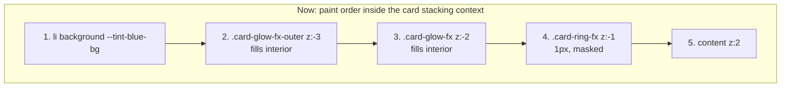

# Design — fix-selected-card-light-wash

## Context

Selected desktop `SessionCard` renders (inside `li.card-selected-ring`, `isolation: isolate`):



Layers 2 and 3 tint everything between the card background and its content.

## Goals / Non-Goals

- Goal: clean card interior in both themes; iridescent identity kept; selection legible at a glance.
- Goal: no new animated layers, no layout shift on select/deselect.
- Non-goal: tag palette light colors; accent-token AA audit; mobile card.

## Decisions

### D1 — Mask the glow on a static wrapper, not on the rotating layer

`.card-glow-fx::before` rotates via `transform`. A mask on the rotating element would rotate
with it. Instead each glow layer is placed inside a new non-rotating wrapper:

```html
<div class="card-glow-mask card-glow-mask-outer" aria-hidden="true">
  <div class="card-glow-fx card-glow-fx-outer"></div>
</div>
<div class="card-glow-mask" aria-hidden="true">
  <div class="card-glow-fx"></div>
</div>
```

`.card-glow-mask`: `position:absolute; border-radius:inherit; pointer-events:none;`
`inset:-6px; padding:6px;` (outer variant `inset:-14px; padding:14px;`) plus the rim's mask:
`mask: linear-gradient(#000 0 0) content-box, linear-gradient(#000 0 0); mask-composite: exclude`
(+ `-webkit-` xor). The content box equals the card rect, so everything inside the card is
carved out; only the outside band remains. Blur is applied on the inner glow (unchanged),
so the halo is cut cleanly at the card edge.

The wrapper carries the z-index (-2 / -3); `.card-glow-fx` keeps its existing class, blur,
opacity and `::before` rotation, so `idle-fx-pause.spec.ts` (`.card-glow-fx::before`
play-state) and the `ui-token-alignment` glow exclusion remain valid.
The wrapper must be `position:absolute` in the source-order override block
(`.card-selected-ring > *` would otherwise make it `relative` + z 2, the same trap the
existing `.card-stripes-fx, .card-ring-fx, .card-glow-fx { position:absolute }` rule fixes).

Alternative rejected: interior `background` on content (C) — changes look, still leaves the
wash under panels' borders; alternative rejected: disable glow in light (B) — hides the bug.

### D2 — 3px rim via `--neon-rim-width`

`.card-ring-fx`: `inset: calc(-1 * var(--neon-rim-width)); padding: var(--neon-rim-width);`
`--neon-rim-width: 3px` in `:root` (both themes). The rim overlays outward; no layout shift
(the card's own 1px border stays; the rim covers it). `--neon-rim-alpha` → `0.75` in both themes.
8px was considered and rejected: collides with the directory-rail tick (`-left-[11px]`) and
drag bead, 8× moving surface on the reading target, reads as AI-glow slop.
2px was mocked: slim in light mode, close to a focus ring; 3px chosen.

### D3 — Light-mode halo tokens

With the interior carved out, today's light glow is nearly invisible. `[data-theme="light"]`:
`--neon-glow-alpha: 0.30`, `--neon-glow-opacity: 0.65`. `--neon-glow-blur` unchanged (11px).
Dark tokens unchanged.

### D4 — Fallbacks unchanged in behaviour

- `@supports not (conic-gradient)`: rim flat `rgba(96,165,250,.5)` (now 3px); glow hidden —
  hide `.card-glow-mask` (the wrapper) instead of only `.card-glow-fx`.
- `prefers-reduced-motion` / `fx-idle` / `fx-offscreen`: target `::before` of the unchanged
  classes — no change needed.

Note: the spec keeps the historical scenario name "Browsers without @property fall back to
static rim with breathing glow" (OpenSpec MODIFIED blocks may not drop scenario names); its
body now describes the shipped behaviour — flat rim, glow hidden. `neon-breathe` is unused.

## Risks / Trade-offs

- Outer wrapper `inset:-14px` extends past the card: overflow on the list container. The
  existing outer glow already extends `-7px` + 22px blur; the ui-token-alignment scrollWidth
  check excludes glow layers via `[class*='card-glow-fx']` — the wrapper class
  `card-glow-mask` is NOT matched. → Test must extend that exclusion or the wrapper must not
  widen scrollWidth (absolute children inside `overflow` ancestors). Verify in E2E.
- Mask + blur cost: mask applied on a static layer, rasterized once; rotation stays
  compositor-only.

### D5 — Clip ancestors must clear the 14px halo

The outside halo reaches 14px past the card. Two ancestors clip it:
`.group-collapse > *` (`overflow: hidden`, required by the `grid-template-rows: 0fr` folder
collapse) sat flush with the card edge, and the `overflow-y-auto` list scroller (8px `p-2`
gutter). Fix: `.group-collapse > *` gets `padding-right: 14px; margin-right: -14px` (clip box
widened, content width unchanged; horizontal only so a collapsed group still reaches 0
height); the list `<ul>` gets `pr-4`.

## Migration / Rollback

Client-only CSS + JSX. Rollback = revert + rebuild + restart. No persisted state.
