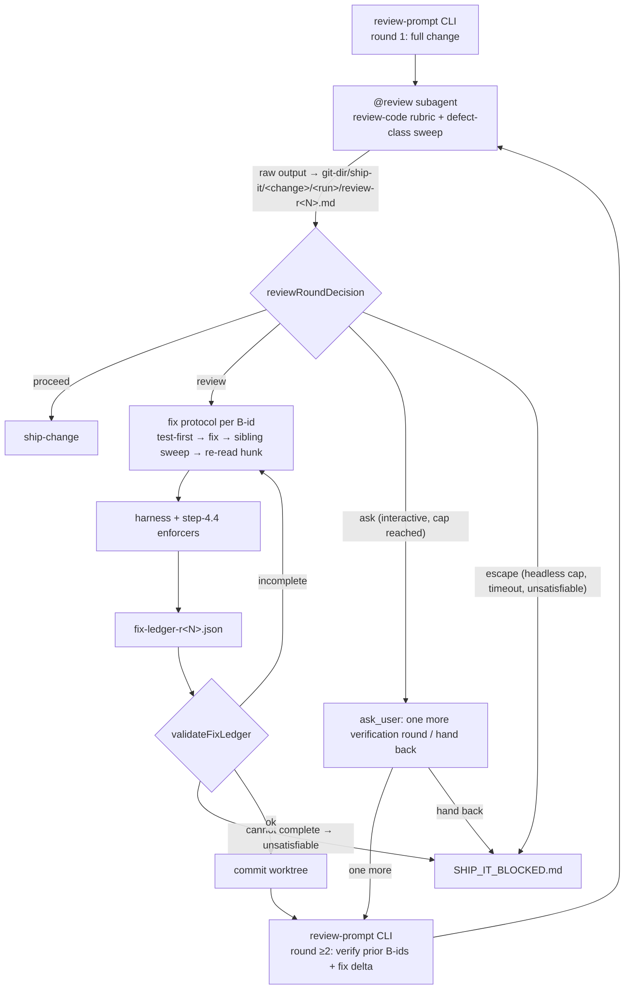

## Context

Step 4.5 of `ship-it` is prose the orchestrating model follows; its decision
helpers (`scripts/review-gate.ts`: `resolveReviewer`, `classifyFindings`,
`reviewRoundDecision`) are pure functions the model is told to "apply" but
never executes — there is no CLI. So everything that is not a one-bit decision
(what the reviewer is told, how a finding is fixed) is re-improvised per run.
Evidence and failure modes: see `proposal.md` → Why. Requirements: see
`specs/local-review-gate/spec.md` and `specs/ship-it-orchestrator/spec.md`.



## Goals / Non-Goals

**Goals:** make the reviewer's input deterministic and author-claim-free; make
each blocking fix carry evidence (test, sibling sweep) that round 2 can check;
make exceeding the cap an explicit human decision.

**Non-Goals (design-level):** parsing the reviewer's findings into structure
beyond the `BLOCKING_COUNT` line and `B<n>` ids; verifying mechanically that a
test failed before the fix (only that it exists in the change's diff);
persisting round counters across separate `ship-it` invocations.

## Decisions

### D1 — The prompt is generated by a CLI and passed verbatim

`scripts/review-prompt.ts` exports a pure `buildReviewPrompt(input)` and a thin
CLI (`npx tsx .pi/skills/ship-it/scripts/review-prompt.ts --change <c> --round
<n> [--prior <file>] [--ledger <file>] [--since <sha>]`). The CLI only resolves
which artifacts exist (`design.md`, `specs/**/spec.md`, `test-plan.md`) and
reads the `--prior`/`--ledger` files; all text assembly is in the pure function.

- **Artifacts are referenced by path; the rubric is inlined.** The reviewer is a
  subagent with read tools. Inlining large delta specs truncates the `Agent`
  prompt and spends tokens on files the reviewer may only need to grep
  (*alternative rejected:* inlining artifacts — size-unbounded). The
  `review-code` rubric is bounded (~10 KB) and is inlined, which is what the
  unmodified requirement "carrying `review-code`'s rubric as its prompt" asks.
- **No free-text field.** `ReviewPromptInput` has no `notes`/`context` string,
  so author assertions ("all fixed", "be precise") cannot enter as
  instructions. The only author-supplied strings are ledger fields (paths,
  search pattern, untestable reason, fix location); they are rendered inside a
  single fenced block headed *unverified records — check each against source*,
  serialised as JSON inside a fence one backtick longer than the longest
  backtick run in the payload (the CommonMark rule), so no field value can close
  the block early.
  *Alternative rejected:* a banned-phrase lint over hand-written prompts —
  unenforceable, because the model composes the `Agent` call, not a script.
- **Output contract.** Blocking findings are numbered `B1…Bn`; the reply ends
  with a per-class sweep table, `BLOCKING_COUNT: <n>` and `VERDICT: pass|block`.
  ship-it keys only on `BLOCKING_COUNT` and the `B` ids (already the de-facto
  format in the logs: "BLOCKING_COUNT: 0, VERDICT: proceed").
- **Enforcement point.** `skill-contract.test.ts` pins that step 4.5 invokes the
  CLI and says "verbatim"; the builder's tests pin the content.
- **The prompt is not the only channel.** `pi-dashboard-subagents` defaults
  `inheritContext: true`; only an agent definition with `inherit_context: false`
  spawns isolated. Step 4.5 names no `subagent_type` today, and the logs show
  62 of 69 `@review` spawns used labels with no definition (`review-code`,
  `review`, `Reviewer`, …) — each inherited a compressed copy of the author's
  conversation, which a claim-free prompt cannot undo. A new project agent
  `.pi/agents/CodeReviewer.md` (`model: "@review"`, `inherit_context: false`,
  tools `read, grep, find, ls, bash`) is the only spawn target step 4.5 may use.
  *Alternative rejected:* flipping the global setting — it changes every
  subagent in the repo (the expert agents rely on inheritance).

### D2 — Round ≥2 is a verification round

Before each round the orchestrator commits the worktree (squash-merge collapses
these commits), so every reviewed tree has a sha. The round-≥2 prompt carries
(a) the previous round's `B<n>` blocks as the reviewer wrote them — extracted by
id, so the prompt stays bounded however long the full reply was, and not an
author claim; (b) the fix ledger in the unverified-records block; (c) the fix
delta `<previous round sha>..HEAD`, alongside the full change range. Committing
first is what makes (c) exact: with uncommitted fixes, `HEAD` would not move and
a working-tree diff would mix pre-fix and fix edits. The reviewer must classify each prior `B` id as resolved / partial /
unresolved with evidence, sweep the fix delta across the defect classes, and
check every sibling site the ledger lists and that each ledger test exercises
its finding. New blocking findings outside the fix delta are still reported and
still block — restricting scope would hide real defects (observed: genuine new
round-2 findings in 3 runs).

Every reply ends: per-class sweep summary, then `BLOCKING_COUNT: <n>`, then
`VERDICT: pass|block`. `parseReviewReply(text)` (pure) turns a reply into
`{ blockingIds, count, verdict, hasSweepSummary, malformed }`. Malformed =
empty (the known subagent transport quirk), not exactly one `BLOCKING_COUNT` and
one `VERDICT` line, a count that disagrees with the distinct `B<n>` ids marked
`issue(blocking)`, or a verdict that disagrees with the count — so a reply
listing `B1` but ending `BLOCKING_COUNT: 0` fails closed. A malformed reply is
never a pass and never a round: it is kept as `review-r<N>.attempt-<k>.md`, the
round is re-invoked once, and a second malformed attempt halts like a timeout.
Only a well-formed reply becomes `review-r<N>.md`. A missing sweep summary is
only reported (round record + step report).

*Alternative rejected:* a fresh full review each round — that is today's
behaviour and the source of non-convergence.

### D3 — Fix ledger in the per-worktree git dir

Round outputs and ledgers live in
`$(git rev-parse --git-dir)/ship-it/<change>/<run-id>/` (`review-r<N>.md`,
`review-r<N>.attempt-<k>.md`, `fix-ledger-r<N>.json`, `approvals.log`;
`<run-id>` = invocation start timestamp, so a re-invocation
never overwrites the evidence a `SHIP_IT_BLOCKED.md` refers to). In a worktree
that resolves to `.git/worktrees/<name>/`: never committed, survives a session
restart, removed with the worktree. *Alternatives rejected:* the change dir (would be archived and
committed as noise); `/tmp` (lost across sessions, collides across worktrees).

One ledger per round (`fix-ledger-r<N>.json` answers `review-r<N>.md`), so a
finding id reused in a later round never inherits older evidence. Entry per
blocking id — deliberately **no status/verdict field**:

```ts
interface FixLedgerEntry {
  id: string;                                         // "B3"
  test: { path: string } | { untestable: string };    // reason ≥ 20 chars
  siblings: { searched: string; sites: string[] };    // pattern/command used; sites may be []
  fixedIn: string;                                    // /^[0-9a-f]{7,40}$/ or "worktree"
}
```

`validateFixLedger(blockingIds, ledger, inDiff)` is pure (`inDiff` is a
predicate the CLI supplies from `git diff --name-only`) and returns
`{ ok, missing[], incomplete[] }`: every blocking id has an entry; a `test.path`
is in the change's diff; an `untestable` reason is ≥ 20 characters;
`siblings.searched` is non-empty; `fixedIn` has the allowed shape; and no
free-text field matches the verdict-language pattern — the ledger is
evidence, never a verdict. The pattern targets *status assertions*, not words
(decided at scenario design, C1): `\b(is|are|was|were|been|now|already)\s+(fixed|resolved|verified|addressed|done)\b`,
`\bno further\b`, `\b(should|will|now)\s+pass\b` (case-insensitive). Bare
words stay legal, so a reason like "the race occurs when the second request
passes the lock check" or a search like `rg -w fixedIn` is not rejected. Each
failed validation is recorded; the third for the same round routes the finding
as `unsatisfiable`. Round 2 is not spent until `ok`. Validation checks presence and
shape only; substance (does the test exercise the finding, were the sibling
sites really checked) is the verification round's job (D2). A finding for which
the fix loop can produce neither a test nor a reason is routed as
`unsatisfiable` — the existing escape — so an incomplete ledger can never loop
a headless run. *Alternative rejected:* checking
"failed first" by replaying the test at the parent commit — costly, flaky for
harness-level tests, and not where the observed defects came from (they came
from missing sweeps and missing tests, not from tests that were green first).

### D4 — The cap becomes a human decision; self-reset is impossible by construction

`reviewRoundDecision` gains `interactive: boolean` and `approvedExtraRounds:
number` (default 0) and a new action `"ask"`:

| Condition (first match wins) | Action |
|---|---|
| timed out | `escape` (unchanged) |
| unsatisfiable under no-weakening | `escape` (unchanged) |
| no blocking | `proceed` |
| `round ≥ 2 + approvedExtraRounds`, interactive | `ask` |
| `round ≥ 2 + approvedExtraRounds`, headless | `escape` (unchanged) |
| otherwise | `review` |

`interactive` is defined operationally: **true exactly when the `ask_user` tool
is available in the session** — no self-declared flag, so a headless run cannot
wander into a question it cannot ask. After every review fix the harness and
the step-4.4 enforcers re-run before the ledger check, because a fix can break
an enforcer and the unmodified requirement forbids reviewing a tree that fails
one.

`ask` → one `ask_user` select: *one more verification round* / *hand back to
planning*; *one more* appends a line to `approvals.log`. If the `ask_user` call
itself fails, the run is treated as headless and escapes. "One more" increments `approvedExtraRounds` by exactly one; the
next round is a D2 verification round. "Hand back" writes `SHIP_IT_BLOCKED.md`
as today. The round counter never decreases within an invocation, and the only
input that raises the ceiling is an `ask_user` answer — so the observed "FRESH
two-round budget" reset has no legal path. A new `ship-it` invocation after a
hand-back starts at round 0 by design: planning has re-entered.

**State is derived, not asserted.** The CLI's `--state <runDir>` mode derives
`{ round, approvedExtraRounds, malformedRetries, ledgerFailures }` from the
run's files: round = number of well-formed `review-r<N>.md` files, approvals =
lines in `approvals.log` (written only right after an `ask_user` answer, never
from reviewer text), retries = `attempt` files for the current round, ledger
failures = recorded validation failures for the current round. `reviewRoundDecision` is fed that
output, so a miscount or a context compaction cannot silently renew the budget;
forging state now requires fabricating a recorded answer, which the transcript
exposes.

*Alternatives rejected:* raising `MAX_REVIEW_ROUNDS` (headless runs lose their
bound); a persisted cross-invocation counter (D6 closes the re-invocation path
more simply).

### D6 — A hand-back gates the next invocation

`SHIP_IT_BLOCKED.md` already in the change directory at entry means a human was
asked to act. Headless: exit non-zero naming the file — no fix loop, no review
round. Interactive: show its cause and `ask_user` resume/abort; on resume, copy
its content into the new run dir (evidence kept) and delete it. Deleting the
file by hand, or answering *resume*, is the human decision that starts a new
budget — so a wrapper that re-runs `ship-it` on failure can no longer farm fresh
two-round budgets. This applies to every escape cause, not only review: every
escape already means "needs a human", so a headless re-run without one could
only fail again. *Alternative rejected:* a persisted per-change round counter —
it would need its own reset rule, which is the same human decision with more
state.

### D5 — Defect classes live in `review-code`, referenced by the prompt

The eight classes (spec/task conformance; canonicalize-before-check;
degenerate/boundary input; stale state & reconciliation; error-path cleanup;
shared-helper blast radius; concurrency/interleaving; test fidelity) and the fix
protocol go into `review-code`'s rubric — the single source for both the inline
dev loop and the ship gate. Each class carries a one-line "how to sweep" so the
reviewer sweeps populations, not samples. Wording stays engine-agnostic (the
package is published). *Alternative rejected:* classes only in the ship-it
prompt — the inner loop, which runs more often, would not get them.

## Risks / Trade-offs

- [Ledger overhead slows the fix loop] → one entry per *blocking* finding only;
  non-blocking findings are exempt.
- [The ledger itself anchors round 2] → no verdict field; rendered as unverified
  records the reviewer must check against source; prior findings are the
  reviewer's own words.
- [Reviewer omits the sweep table] → advisory: reported as a gap, not a
  checkpoint failure; only `BLOCKING_COUNT` is load-bearing.
- [Model ignores "pass stdout verbatim"] → contract test pins the instruction;
  the prompt carries a fixed header line the skill tells the orchestrator to
  preserve, making hand-edits visible in the session log.
- [More interactive prompts] → only at the cap, which today already stops the
  run and waits for "go on"; the question replaces an unstructured nudge.
- [The orchestrator can still forge `approvedExtraRounds`] → accepted: the
  enforced party is the same model that supplies the input, so no pure function
  can prove an approval's origin. Mitigation: approvals exist only as
  `approvals.log` lines written right after an `ask_user` answer (auditable
  against the transcript), reviewer output is never parsed for approvals, the
  contract test pins the rule, and headless runs cannot reach `ask` at all.
- [A prior finding's unindented follow-on paragraph is not carried into the
  verification prompt] → accepted (human adjudication during ship-it): it is
  syntactically indistinguishable from the unlabelled non-blocking prose the
  bounded-prior rule (#E24) must exclude. Indented continuations are carried,
  and the generated reply format asks the reviewer to indent continuations.
- [Ledger evidence is validated by presence, not substance] → accepted by
  design (D3); the verification round owns substance.
- [`ask_user` in a session with no human watching blocks the run] → accepted:
  the same availability heuristic already drives `resolveReviewer`'s interactive
  bootstrap; `pi -p` headless runs have no `ask_user` and take the escape.
- [ship-change step 1.5 can merge a `develop` advance after the review] →
  pre-existing and specified in `ship-workflow` (no-op under ship-it except that
  race; the change's own three-dot diff is unaffected); out of scope.
- [Existing workflows that re-run `ship-it` over a stale `SHIP_IT_BLOCKED.md`]
  → they now stop at entry; the message names the file, and removing it is the
  documented resume step.

## Migration Plan

Skill text + scripts only; no persisted state, runtime, or protocol change.
In-flight worktrees pick up the new step 4.5 on their next `ship-it` invocation.
Rollback: revert the commit; stray `git-dir/ship-it/` files are inert and vanish
with their worktree.
