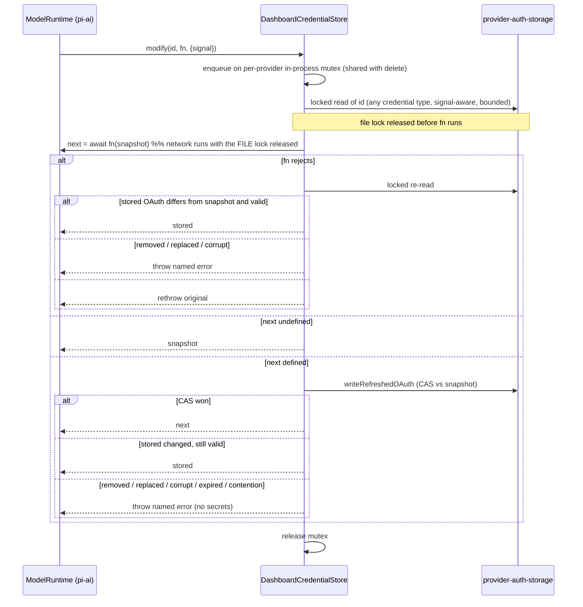

## Context

- Two runtimes today (see proposal.md, Why). The parallel stack exists because, before 0.99, the dashboard had to straddle two pi-ai generations and pi's `ModelRuntime` had no injectable store fit for a shared `auth.json`.
- `ModelRuntime` lives in pi-coding-agent (`dist/core/model-runtime.js`); `CredentialStore` lives in pi-ai (`dist/auth/credential-store.d.ts`). Verified against 0.99.1; the 1.0.0 floor (`update-pi-core-1-0-adopt-apis`) is assumed API-identical and SHALL be re-verified against the installed 1.0.0 dist before task 1.2.
- `ModelRuntime.create({ credentials?, authPath?, modelsPath?, allowModelNetwork?, refreshOnCreate?, ... })` (`model-runtime.js:79-104`). `modelsPath` defaults to `getAgentDir()/models.json`; `modelsPath: null` disables it and the `models-store.json` store (`:80-86`). `refreshOnCreate` defaults to **on** (`options.refreshOnCreate !== false`, `:104`). The runtime serializes its own credential operations per provider (`enqueueCredentialOperation`, `:379`) but not `getAuth`. `CredentialStore` = `read / list / modify(id, fn, {signal}) / delete`.
- pi `.modify(` callers (0.99.1): OAuth refresh `auth/resolve.js:61` and `models.js:239`; login `models.js:371` (`async () => credential`, ignores `current`). `setRuntimeApiKey` (`model-runtime.js:419`) writes an in-memory overlay only — no store write.
- pi-ai OAuth refresh (`auth/resolve.js` `resolveStoredOAuth`): `expiresSoon` = 5 min remaining; `store.modify(id, async current => current?.type!=="oauth" || !expiresSoon(current) ? undefined : await oauth.refresh(current, AbortSignal.any([signal, 15s])))`. A callback rejection is rethrown as `ModelsError("oauth")`; a store failure as `ModelsError("auth", …, {cause})`. pi does **not** re-read after a failed refresh. With pi's `FileAuthStorageBackend` the lock is held across the network call and the write is an in-place `writeFileSync`.
- When a stored credential is OAuth but the provider has no `auth.oauth`, pi returns `undefined` silently (`auth/resolve.js` `resolveProviderAuthWithSignal`).
- `ModelRuntime.registerProvider` merges over a previous registration, keeping fields the new config leaves undefined (`model-runtime.js:635-665`); `unregisterProvider` exists (`:671`).
- The dashboard's `provider-auth-storage.ts` already has the primitives: `LOCK_OPTIONS` (`stale 30s`, `realpath:false`, pinned to pi's), `readCredentialLocked` (bounded locked read that waits out a pi refresh), `writeRefreshedOAuth` (CAS persist), `writeCredential` / `removeCredential` (type-conflict refusal), and atomic write + quarantine in `locked-json-file.ts`.
- Today's consumers of `getModelRegistry()` / `InternalRegistry` use `find`, `getAvailable`, `firstAvailable`, `getApiKeyAndHeaders`, `getAll`, `getAllAnnotated`, `refresh`, `discover` (`internal-registry.ts:93-174`): `system-one-plugin/src/server/llm-caller.ts:104-115`, `grammar-plugin/src/server/backends/llm.ts:301,308`, `quota-plugin/src/server/index.ts:118`, `server/src/models-introspection-routes.ts:81`, `server/src/model-proxy-diagnostics-routes.ts:17`. `ModelRuntime` exposes none of `find` / `getApiKeyAndHeaders` / `getAllAnnotated`.

### Re-verification against the installed pi 1.0.0 dist (task 0.1)

Every citation above holds on 1.0.0. Deviations / additions:
- `getAuth(model, overrides)` gains `minOAuthValidityMs` (default window stays 5 min, 15 s refresh abort). Unused by the server.
- `.modify(` callers unchanged: `pi-ai/dist/auth/resolve.js:61` (request-path refresh), `pi-ai/dist/models.js:239` (catalogue refresh — runs ONLY under `refresh({ allowNetwork: true })`, never issued by the server), `models.js:371` (login, never called). `pi-coding-agent/dist/core/runtime-credentials.js` wraps the injected store and passes `modify` through unchanged.
- `registerProvider` / `unregisterProvider` each start a background `refresh({ allowNetwork: false })`: recompose + availability check, store `read` only, no write.
- `FLOW_TYPE_HINT` vs the 1.0.0 OAuth set: 8 ids (radius excluded), unchanged.
- pi-ai's published `index.d.ts` re-exports with `.ts` specifiers the repo's `tsc` does not follow; tests that drive `createModels` cast the namespace.
- `provider-catalogue-cache.ts` (D4): NOT redundant — it carries bridge-pushed `displayName` / `envVar` / `ambient` / `authLabel` the runtime does not expose. Kept; follow-up only if the bridge stops pushing it.

## Goals / Non-Goals

**Goals:** one runtime; delete `piai-compat` and the registry/refresh re-implementation; keep every existing `model-proxy-credential-routing`, `custom-provider-model-registry`, `agent-model-introspection` and `provider-quota-surfacing` guarantee.

**Non-Goals:** moving dashboard login flows (`provider-auth-handlers`) to `runtime.login()`; any proxy HTTP contract change; renaming or reshaping `InternalRegistry` / `InternalAuthStorage` public methods; roles as virtual models (would build on this runtime later).

## Decisions

### D1 — Inject `DashboardCredentialStore`; never pi's file store

- *Snapshot is read under the file lock* immediately before `fn`; that is the freshest value obtainable without holding the lock across the network, and CAS validates it at persist. pi's refresh callback re-checks `current` (`!expiresSoon`), so a request queued behind a successful refresh sees the new credential and does not refresh again.
- *Serialize `modify` and `delete` per provider* (pi's `CredentialStore` contract, `pi-ai/dist/auth/types.d.ts`). The mutex is in-process only; the file lock is never held across the network. Every waiter honours its own `signal`; callers of `runtime.refresh()` pass a bounded signal so the mutex cannot be held indefinitely (`models.js:239` uses the caller's signal only).
- *Refresh-once including failure* is the facade's job (D5): concurrent `getApiKeyAndHeaders` calls for one provider join one in-flight resolution (today's `refreshLocks` pattern), so a failing refresh is attempted once and its rejection is shared. The joined flight keeps today's `refreshLocks` signal behaviour (the initiating request's signal, bounded by pi's 15 s abort), so the base requirement "OAuth token refresh SHALL propagate a concrete abort signal" holds unchanged. The store alone does not give refresh-once on failure (a failed refresh leaves the credential expiring, so the next `modify` refreshes again) — the requirement is placed on the server, met by the facade.
- *Failed-refresh recovery* (base spec "Failed refresh recovers from a concurrently stored credential" / "…explained by a concurrent removal") lives in the store because pi does not re-read after a rejection.
- *Refresh-only semantics.* The server never calls `runtime.login()` (Non-Goal; dashboard login flows write through `provider-auth-storage.ts` directly), so every `modify` the server's runtime issues is pi's refresh. `setRuntimeApiKey` is overlay-only (`model-runtime.js:419`) and never reaches the store. A future bump that adds a non-refresh `modify` caller is caught by the re-audit in Risks.
- *Why not pi's default store:* its plain in-place write and lack of quarantine regress two tested guarantees.
- `read` returns any credential type (`api_key` and `oauth`): an unlocked checked read; on unparseable content (possibly a torn in-place pi write) it retries once through the bounded locked read, and stays tolerant (`undefined`) after that. It honours `options.signal`. The request path therefore does not wait on the file lock in the common case. `list` uses the checked read. `delete` uses `removeCredential` extended with a `createIfMissing` passthrough set to `false` (today it calls `withLock` with the default `createIfMissing = true`, `provider-auth-storage.ts:255`, `locked-json-file.ts:112`), so an absent `auth.json` is never created.
- New helper surface on `provider-auth-storage.ts` / `locked-json-file.ts`: a type-agnostic locked read, `AbortSignal` support in the lock-retry loop, and the `removeCredential` `createIfMissing` passthrough.

### D2 — Error surfacing
pi-ai wraps store errors (`ModelsError("auth", "Credential store modify failed for <id>", { cause })`). The proxy's error mapper SHALL unwrap `cause` to report the named outcome the spec requires. Pinned by the existing outcome tests.

### D3 — Catalogue composition stays in the dashboard; custom providers via `registerProvider`
- The runtime is created with `modelsPath: null`: it serves the built-in catalogue only and creates no `models.json` / `models-store.json` handle. The dashboard keeps its existing `models.json` reader (`flattenModelsJson`, legacy top-level shapes) and the `InternalRegistry` outer-join merge with `providers.json` discovery (native-wins metadata, built-in precedence, discovery-outage survival, `oauthCompatible` flags) — `custom-provider-model-registry` is unchanged.
- The merged non-built-in providers are projected onto the runtime with `runtime.registerProvider(id, { baseUrl, api, apiKey, models })` so `streamSimple` can route them. On change: `unregisterProvider(id)` then `registerProvider(id, …)` (registration merges, so a plain re-register would keep removed fields); `unregisterProvider(id)` for removed entries. `registerProvider` does not throw on an unresolved `$ENV` key (it composes a valid api-key auth and fails only at request time; composition errors are swallowed into `compositionErrors`, `model-runtime.js:151-167`). The facade therefore pre-resolves each key with the existing `resolveProbeApiKey` (as `registry-singleton.ts` `readCustomProviderCreds` does today) and skips registration for an unresolved one, logging without secrets (listed per the existing spec, not routable).
- `models.json` is never written. Recursion guard stays in front.
- Built-in-provider overrides in `models.json` (if any today) keep their current handling in the merge; task 2.1's recorded `/api/models` fixture pins parity.

### D4 — Catalogue freshness
Create with `allowModelNetwork: false` and `refreshOnCreate: false`. The default create-time refresh would run `checkAuth` → `resolveStoredOAuth` and could refresh a near-expiry OAuth token through the store at boot (`auth/resolve.js`); today's boot runtime cannot, because it holds `EMPTY_READONLY_STORE` (`provider-auth-registry.ts:53`). The runtime's availability snapshot is not needed: listing is facade-based (D5). Correct the wrong "refreshOnCreate defaults to false" comment in `provider-auth-registry.ts`. Let `runtime.refresh()` be triggered by the existing catalogue-refresh surfaces. Check whether `provider-catalogue-cache.ts` is then redundant with `getAllModels()` / `getProviderAuthStatus()`; delete it only if every consumer maps cleanly, otherwise leave it and record it as follow-up.

### D5 — Keep `InternalRegistry` / `InternalAuthStorage` as thin facades
Their public surface stays (see Context consumer list); only the bodies change.
- Availability stays **auth.json-based**: `getAvailable` / `getAllAnnotated` keep `hasAuth` / `canRouteModel` (private in `internal-registry.ts`) over `auth.json` + custom-provider credentials, plus the `oauth-compat.ts` override table. The runtime's own availability (which counts ambient env keys) is NOT used for listing, so "No credential excludes provider entirely" still holds. `excludedReason` enum unchanged.
- `find` / `getAll` / `firstAvailable` read the merged catalogue (D3).
- `getApiKeyAndHeaders` delegates to `runtime.getAuth`, single-flighted per provider (D1).
- **Proxy auth path:** the proxy awaits the facade's `getApiKeyAndHeaders` (refresh-once, named errors) and then calls `runtime.streamSimple(model, context, { signal, headers })` **without** an `apiKey` override; the runtime re-reads the now-fresh credential through the store and resolves auth via the provider's own OAuth/api-key path. `headers` carries the facade-resolved per-model custom headers (`model.headers`, today merged in `internal-auth-storage.ts:143-151` and forwarded by `streamer.ts`), which the runtime merges over its own (`prepareRequest` `mergeHeaders`), because the runtime has no `models.json` config to source them from. Plugin `streamSimple` (`PluginModelRuntime.streamSimple`, today `getStreamSimpleFn()` in `registry-singleton.ts`, wired in `server.ts`) is re-sourced from `runtime.streamSimple` with the same signature.
- **Missing OAuth capability:** in the facade's auth resolution, a stored OAuth credential whose runtime provider has no `auth.oauth` fails with a named missing-OAuth-capability error (no TypeError), and the model-proxy diagnostics surface lists the provider under a missing-OAuth field. Listing is unchanged (`excludedReason` keeps its meaning); api-key providers unaffected.
- `InternalAuthStorage` keeps the credential-read shape `provider-quota-surfacing` adapts (`quota-plugin`), backed by `DashboardCredentialStore` + the facade's auth resolution; its own refresh/coordination code is deleted.
- `PluginModelRuntime.getModelRegistry()` returns the `InternalRegistry` facade, so plugin consumers see the same shape.

### D6 — One runtime, one failure domain, injected
The single runtime is created once at server boot by `registry-singleton.ts` and **injected** into `provider-auth-registry.ts` (its deps are already injectable), avoiding an `auth/` ↔ `model-proxy/` import cycle. This deliberately merges two failure domains: a failed `ModelRuntime.create` now degrades both surfaces at once — provider-auth listing returns `{ ids: [] }` with `getRegistryError()` set, and the proxy / `/api/models` report the same registry error. `EXCLUDED_PROVIDER_IDS` and `FLOW_TYPE_HINT` are preserved. Pinned by a joint-degradation test.

## Risks / Trade-offs

- [Refresh timing changes] pi refreshes at 5 min remaining with a 15 s abort; the dashboard used a 30 s buffer and 30 s timeout. Accepted: earlier refresh is safer, and the base spec's lock-wait window is already defined relative to pi's 15 s abort. The base requirement's "refresh buffer" now means pi's window.
- [A future pi `modify` caller that is not idempotent on stale input] → contract test: a callback that ignores `current` loses a race, and the store must never persist the lost result. Re-audit pi `.modify(` call sites on every bump (three in 0.99.1, listed in Context).
- [Mutex held across a slow refresh delays a queued `modify`/`delete` for the same provider] → bounded by pi's 15 s refresh abort on the request path and by the signal the server passes to `runtime.refresh()`; every waiter honours its own signal.
- [pi-ai changes `CredentialStore` again] → it is a public, typed interface; the store is ~150 LOC behind it.
- [Facades keep more dashboard code than "delete the registry" suggests] → accepted: the merge, credential-kind filter and diagnostics are dashboard requirements pi does not implement; what is deleted is the module loading, dispatch, OAuth translation and refresh coordination.
- [Corrupt `auth.json` → tolerant `read`/`list` → runtime may resolve an ambient env key for a request] → listing stays auth.json-based (D5), so such a provider is not listed; a direct request may still resolve env. Refresh/write paths refuse corrupt content. Accepted, documented.
- [Cold-start cost of `ModelRuntime.create`] → already paid today by `provider-auth-registry.ts`; net zero.

## Migration Plan

1. After `update-pi-core-1-0-adopt-apis` lands, re-verify every Context citation against the installed pi 1.0.0 dist (repo is on 0.86.1 today; citations are 0.99.1), including the provider-auth flow list it changes (new OAuth providers vs `FLOW_TYPE_HINT`).
2. Land `DashboardCredentialStore` + contract tests (the existing coordination scenarios, re-pointed).
3. Back the `InternalRegistry` / `InternalAuthStorage` facades with the runtime behind the unchanged `getModelRegistry()` accessor; the proxy end-to-end suite stays green.
4. Merge `provider-auth-registry.ts` onto the same runtime.
5. Delete `piai-compat/` and the dead halves of `InternalRegistry` / `InternalAuthStorage`.

Rollback: revert; `auth.json` format is unchanged.
