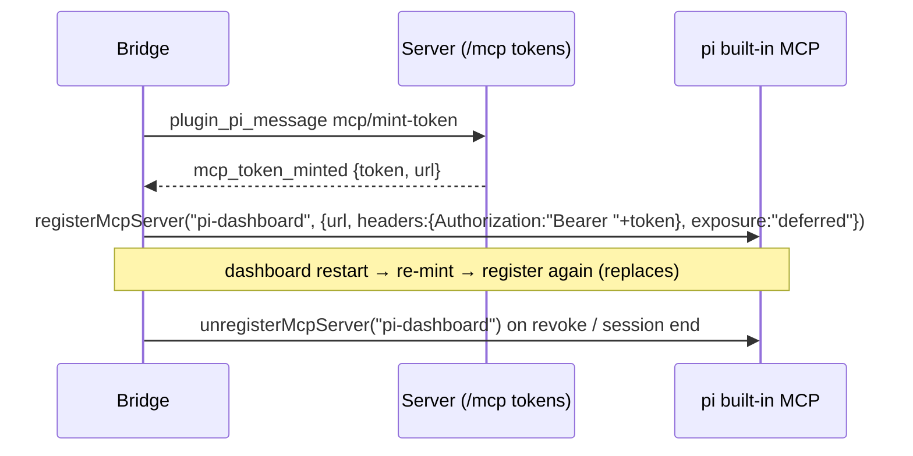

## Context

- Motivation and scope: proposal.md. Owner decision: **built-in only**.
- pi 1.0.0 built-in MCP (since 0.99; pi `docs/mcp.md`):
  - reads `~/.pi/agent/mcp.json` + trusted `.pi/mcp.json`; a project entry **replaces** the global entry of the same name;
  - HTTP entries without an `Authorization` header are treated as OAuth servers;
  - `pi.registerMcpServer(name, config)` is per session and not persisted; a later registration of the same name replaces the earlier one; an `mcp.json` entry of the same name **takes precedence** over a registration;
  - default exposure is `codemode`; pi activates the `codemode` tool when a `codemode` server connects and `tool_search` for a `deferred` server, unless `autoEnableCodemode: false` (1.0.0 `docs/mcp.md` "Control tool exposure");
  - `registerMcpServer` throws only for an invalid config or a name another extension registered; when no loaded extension handles MCP servers (adapter installed, built-in replaced) the registration is reported as an extension error, not thrown (1.0.0 `dist/core/extensions/types.d.ts` `registerMcpServer` doc);
  - `McpServerConfig` has no protocol-version field; pi 1.0.0's MCP client supports `2024-11-05` through `2025-11-25` and sends `2025-11-25` (`SUPPORTED_PROTOCOL_VERSIONS` / `LATEST_PROTOCOL_VERSION` in its dist bundle), i.e. the dashboard endpoint's **legacy era**;
  - pi parses `mcp.json` with strict `JSON.parse`; a file with comments or trailing commas is reported as an error and its whole layer is skipped (1.0.0 `dist/extensions/mcp/config.js`);
  - `-`/`_` collisions are checked across layers: global entries load first, then the trusted project layer, so a project `dev-radius` is rejected (dropped, global kept) once the global file holds `dev_radius` (same `config.js`);
  - `validateMcpServerConfig` (not exported) checks: object entry; name chars; `exposure` / `toolExposure` values; boolean `enabled`; string `description`; positive `timeout`; `type` in {stdio, http, streamable-http} (`sse` rejected); http(s) `url`; string-record `headers` / `env`; string-array `args`; string `cwd`; `oauth` field shapes incl. `callbackPort` range and `callbackUrl`; `auth.provider` string with https-or-loopback URL (1.0.0 `dist/core/mcp-servers.js`). Project `auth` is rejected only on URL entries (`dist/extensions/mcp/config.js`);
  - sessions decide project trust with `ctx.isProjectTrusted()` (recorded decision, else the `defaultProjectTrust` setting; `dist/core/agent-session.js`, `dist/core/settings-manager.js`), while `pi mcp list` uses only the recorded decision (`dist/extensions/mcp/cli.js`);
  - `pi.getMcpServers()` returns every extension-registered server config, headers included, to any loaded extension (1.0.0 `dist/core/extensions/types.d.ts`);
  - `validateMcpServerConfig` ignores unknown keys (1.0.0 `dist/core/mcp-servers.js`), so adapter keys such as `disabled`, `directTools`, `lifecycle`, `requestHeadersCommand` stay in the stored config but pi never acts on them — an adapter-`disabled: true` server becomes **active** under pi;
  - `pi mcp list --json` prints JSON and exits `1` whenever a config entry is invalid or an enabled server is not connected (1.0.0 `docs/cli.md`);
  - an installed extension that registers `/mcp` (e.g. `pi-mcp-adapter`) disables the built-in entirely.
  - 0.99.2: MCP tool/namespace names replace `-` with `_` (`mcp__my-server__x` → `mcp__my_server__x`); servers whose names differ only in `-`/`_` are rejected; new entry fields `description`, `oauth.clientName`, `"auth": { "provider": "<id>" }` (global `mcp.json` / extensions only, https except loopback); `codemode-deferred` is an alias of `codemode`;
  - 1.0.0: `oauth.authServerMetadataUrl`; MCP OAuth credentials keyed per server name + URL; Radius `/login` can write a global `mcp.json` entry with `"auth": { "provider": "radius" }`.
- Today (this user's machine): `~/.pi/agent/mcp.json` holds only the dashboard-provisioned `pi-dashboard` entry (`url`, `protocolVersion`, `requestHeadersCommand`); `pi-mcp-adapter` sits in `settings.json#packages`.
- Today (repo): the provisioned URL is `http://127.0.0.1:${host.httpPort}/mcp` (`packages/mcp-server-plugin/src/server/index.ts:242`); the bridge's own endpoint is a `ws://…:piPort` URL (`packages/extension/src/bridge.ts:1069`), a different port and scheme. `mcp-server-plugin` already imports the writer factory `createMcpClientConfigService` directly from `@blackbelt-technology/pi-dashboard-mcp-client-plugin/core` (`packages/mcp-server-plugin/src/server/provisioning.ts:33`). `ProjectTrustStore` is pi's class; the server reaches it via `getPiCore()` (`packages/server/src/pi/resource-toggle-trust.ts:114`); `mcp-client-plugin` has no pi dependency.

## Goals / Non-Goals

**Goals:** zero dependency on `pi-mcp-adapter`; dashboard MCP reachable in every session with no file writes; credential out of `process.env`; mcp-client UI faithful to pi's semantics.

**Non-Goals:** removing `pi-mcp-adapter` from a user's `settings.json` (their choice; doctor reports it); re-implementing adapter-only features; importing configs from other hosts.

## Decisions

### D1 — Registration lifecycle in the bridge

- The bridge keeps the token in a module variable and in the pi registration, nowhere else. `mcp-token-delivery.ts` stops writing `process.env.PI_DASHBOARD_MCP_TOKEN`; `header-command.mjs` is deleted.
- **URL:** the server sends the `/mcp` URL in `mcp_token_minted` (new optional `url` field in `packages/shared/src/protocol.ts`), built from `host.httpPort` exactly as provisioning builds it today (`http://127.0.0.1:<port>/mcp`). The bridge never derives it from its `ws://` endpoint. Scope stays "a session on the dashboard's machine", as today.
- **Exposure `deferred`:** pi auto-activates `tool_search` for it, and found tools are then called directly; it keeps the dashboard's large tiered tool surface out of the model's tool declarations. Alternatives: `direct` pollutes declarations; `codemode` makes the tools script-only and depends on codemode being active (the user can turn auto-activation off).
- **Guard:** if `pi.registerMcpServer` is missing or throws (invalid config, name taken), log once and report `mcp.dashboard_registration_unavailable` to the server for the doctor. The session otherwise works. The adapter-installed case does not throw (pi reports an extension error), so the bridge cannot see it; the doctor's "`pi-mcp-adapter` installed" row (task 3.2) covers it. A `mcp_token_minted` without `url` (older server) is treated the same way: no registration, one log line, unavailable reported.
- **Lifecycle end:** the protocol has no revoke message; the bridge unregisters on pi `session_shutdown`. A server restart invalidates tokens and re-delivers (existing re-mint path), which replaces the registration.
- **Exposure to extensions:** the bearer now sits in pi's registration, which `pi.getMcpServers()` hands to any loaded extension. Accepted: extensions are in-process trusted code that could read `process.env` before; subprocesses, the documented exposure, no longer see it.
- **Protocol era:** pi's registration has no protocol-version field and pi 1.0.0's client speaks only legacy revisions, so pi sessions reach `/mcp` in the dashboard's **legacy era**. Every request/response tool works there; `subscriptions/listen` streaming (modern-era only) is not available to pi sessions. See Risks.

### D2 — One-time migration of the provisioned entry
On server start, the `mcp-server` plugin removes `mcpServers["pi-dashboard"]` from the Pi-global file **only if** it matches the provisioned signature (`requestHeadersCommand.command === "node"` with `requestHeadersCommand.args[0]` ending in a dashboard `header-command.mjs`, per `provisioning.ts:88-95`). This goes through the writer built by the directly imported `createMcpClientConfigService` factory, as provisioning does today — no `dependsOn: ["mcp-client"]` (atomic, merge-only, refuses an unparseable file). A non-matching entry is kept and reported, since it would shadow the registration. The removal is idempotent and has no marker file.

### D3 — mcp-client rebuilt on pi's model
- **Reads:** parse the two Pi layers with strict `JSON.parse`, as pi does; a file pi cannot parse is shown as an unparseable layer (pi skips it) and is never written over. `strip-json-comments` goes away. The Pi-global path is `$PI_CODING_AGENT_DIR/mcp.json`, else `~/.pi/agent/mcp.json`, resolved in the plugin (the adapter path helpers go away).
- **Trust:** the service factory takes an injected `isProjectTrusted(cwd)` predicate. The dashboard server supplies it through a new `host.isProjectTrusted` service (`packages/server/src/server.ts`, next to `host.knownFolderCwds`) that mirrors a session's rule: the recorded `ProjectTrustStore` decision (class via `getPiCore()`), else the `defaultProjectTrust` setting; not the dashboard's toggle-trust policy. When the two pi rules disagree (`defaultProjectTrust: always`, no recorded decision), folder rows show live state as unknown because `pi mcp list` will not load that layer. The bridge also auto-trusts, per run and unrecorded, dashboard-spawned headless sessions in their activation cwd (`openspec/specs/bridge-extension/spec.md`, "Bridge auto-decides project_trust"), so an untrusted folder's servers still load in those sessions; the inactive notice says so; a hostless caller without one (the apple-tools CLI writes global only) treats every project as untrusted.
- **Live state:** `pi mcp list --json` through the shared safe-spawn helper, with a 30 s timeout and a 30 s per-cwd cache, inheriting the server's `PI_CODING_AGENT_DIR`. Folder views spawn it in that cwd; the global settings view spawns it in an empty dashboard-owned scratch directory so only the global layer loads. stdout is parsed regardless of exit code (exit `1` is normal when a server is disconnected or an entry invalid). Rows show "state unknown" only on spawn failure, timeout or unparseable stdout — never stale data.
- **Adapter leftovers:** pi ignores unknown keys. A row whose entry carries adapter-only keys (`disabled`, `directTools`, `lifecycle`, `requestHeadersCommand`, …) shows "ignored by pi"; the editor offers one action that converts `disabled: true` → `enabled: false` and removes the rest.
- **Writes:** whole-entry replace or delete per scope, atomic, via the existing writer core minus its adapter path helpers. Names `__proto__`, `constructor`, `prototype` stay refused. Folder "Override…" pre-fills the full global entry except secret-bearing fields (`headers`, `env`, `oauth.clientSecret`) and `auth`, which are blank and flagged, never copied silently. The same omission applies to the copy a folder-scope disable writes; re-enabling such a copy offers "remove the folder entry" (global entry applies again) or re-entering the omitted values.
- **Transport:** pi accepts an entry with both `command` and `url` and treats it as HTTP unless `type` is `stdio`. The writer refuses to create one; the reader shows an existing one with the transport pi picks and flags the ignored key.
- **Validation:** the writer mirrors every 1.0.0 `validateMcpServerConfig` check listed in Context (plus project `auth` on URL entries), so it never persists an entry pi rejects. The published schema and its `ajv` validator stay; `ajv` is not removed.
- **Refusals** keep a closed set: `unparseable`, `entry-not-object`, `invalid-name`, `name-collision`, `transport-conflict`, `invalid-entry` (a pi validation rule, project `auth` included), `write-failed`. apple-tools maps `write-failed` to `CONFIG_WRITE_FAILED` and the rest to `CONFIG_UNPARSEABLE`, as today.
- **Routes** keep host auth, the `networkGuard` pre-handler and path-name validation from today's HTTP surface.
- **pi 0.99.2–1.0 entry fields:** schema and editor add `description`, `oauth.clientName`, `oauth.authServerMetadataUrl` and `auth.provider`. The writer refuses `auth` at project scope (pi allows it only in the global file and from extensions) and refuses names that collide once `-` is mapped to `_` — excluding the entry being replaced: at project scope against that cwd's effective view; at global scope against the global file and the trusted project layers of every known folder (pi checks across layers). `codemode-deferred` is shown as `codemode` and kept as written unless the user changes exposure. pi does not export `validateMcpServerConfig` (the exports map has only `.`, `./rpc-entry`, `./client`, `./experimental/plugin`), so the dashboard mirrors these rules. MCP OAuth credentials are keyed by server name + URL (1.0.0), so renaming or changing the URL of an OAuth server needs a new sign-in; the editor warns about this. The dashboard's own server exposes tools as `mcp__pi_dashboard__*`; no production TypeScript source builds or matches `mcp__` names (only prose in `packages/flows-anthropic-bridge-plugin/{README,AGENTS}.md` and a comment in `qa/fixtures/faux-scenarios.ts`).
- **Disable:** `enabled:false`. A folder-scope disable of a global-only server writes a complete copy (pi replaces entries as a whole).
- **Removed:** `adapter-worker.ts`, adapter port, version floor, global-settings form, `adapterLoadTimeoutMs` (`configSchema.json`), shared/import provenance, and the `strip-json-comments` / `pi-mcp-adapter` dependencies.

### D4 — apple-tools
Ensure `mcpServers.iMCP = { command }` via the service. Preserve operator-set `enabled` / `exposure` / `toolExposure`. Drop `ensureAdapterPackage` and every `settings.json` write. The nine-state enumeration is unchanged; `READY` still means a live round trip, now through pi's built-in.

## Risks / Trade-offs

- [Adapter users silently lose dashboard MCP tools] → the registration guard, a doctor row, and a **BREAKING** CHANGELOG entry naming the fix (remove `pi-mcp-adapter` from `packages`).
- [`pi mcp list --json` connects to every server, so it is slow or has side effects] → call it only on explicit page view and refresh, with a timeout; the list view renders from files first.
- [Folder override drops secrets the operator expected to inherit] → an explicit editor warning plus the scenario test; pi semantics make inheritance impossible anyway.
- [A pi version whose `registerMcpServer` shape changes] → covered by the lockstep floor; feature-guard as in D1.
- [Adapter `disabled: true` is ignored by pi, so a server the user had turned off becomes active after the adapter is removed] → "ignored by pi" row flag, the one-click conversion to `enabled: false`, and a CHANGELOG migration note.
- [pi sessions lose `subscriptions/listen` streaming from the dashboard: pi's client speaks only the legacy era and the registration cannot pin a revision] → accepted; request/response tools are unaffected. Revisit when pi's client gains the `2026-07-28` revision. The provisioned entry's `protocolVersion` only had an effect through the adapter.
- [An adapter-era `mcp.json` with comments or trailing commas is skipped whole by pi, and D2 cannot remove the provisioned entry from it] → doctor row "`mcp.json` not strict JSON" naming the file; CHANGELOG migration note. The dashboard does not rewrite it.
- [Sessions still running the previous bridge lose dashboard MCP once D2 removes the entry] → accepted; the update flow reloads sessions (`npm run reload` / app restart). Rollback by revert re-provisions the entry, which works again only through `pi-mcp-adapter`.
- [`deferred` relies on pi's `tool_search` built-in; a user who disables it (`-builtin:`) cannot reach dashboard tools] → accepted, user's explicit choice; doctor row.
- [The adapter-installed case is invisible to the bridge] → doctor row; the CHANGELOG names the fix.

## Migration Plan

1. Bridge registration + credential out of `process.env` (D1), behind the guard. D1 and D2 ship in one release: without the adapter the registration replaces the removed entry; with the adapter installed, dashboard MCP tools stop until the user removes it (BREAKING, doctor row).
2. Migration removal of the provisioned entry (D2), in the same release as D1.
3. mcp-client rebuild (D3) and apple-tools (D4).
4. Remove `pi-mcp-adapter` from dependencies and recommended extensions; doctor row; CHANGELOG.

Rollback: revert. A reverted build re-provisions its `pi-dashboard` entry through the old path, and user-authored entries are never deleted.

## Open Questions

_None._ (Resolved: pi 1.0.0 ignores unknown keys — see Context and D3 "Adapter leftovers".)
