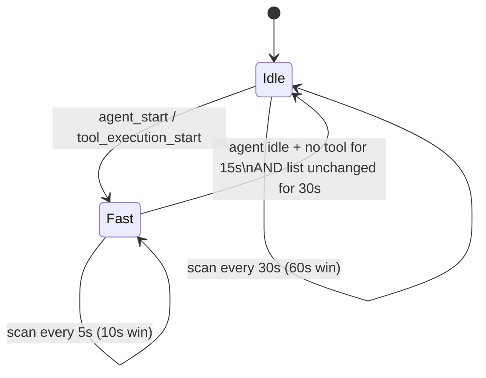
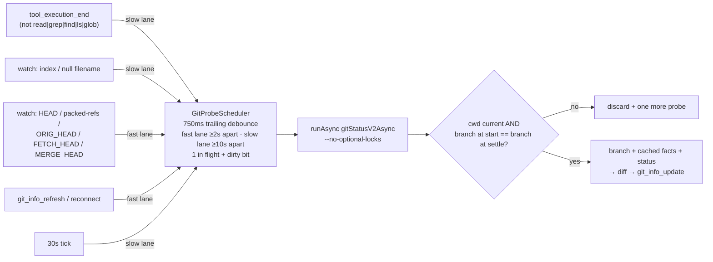

## Context

Polling inventory (from `setInterval` sites in `packages/extension/src` and `packages/server/src`):

| Poller | Where | Cadence | Cost today | This change |
|---|---|---|---|---|
| Process scan | bridge `processScanTimer` → `scanChildProcesses` | 5 s / 10 s win | (3 + k) sync `ps`; Windows 1 + k sync PowerShell | D1–D3 |
| Git + name/model/version | bridge `gitPollTimer` → `runGitPollTick` | 30 s | ~6 sync git spawns, ~220 ms; 2 `git status`/min | D4–D8 |
| pi-resources | server `piResourcesTimer` | `pollIntervalSeconds × 5` (default 300 s) | full walk + `PackageManager.resolve()` × every known cwd | D9 |
| OpenSpec + folder HEAD | server `pollTimer` | 60 s | async, mtime-gated, `fs.watch`-backed | unchanged (non-goal) |
| Heartbeat, keepalive, flush, reaper, sweeper | both | various | deliberate timers | unchanged |

Measured on macOS, 681 processes, this repo: `ps -eo …` ≈ 20 ms, `git status --porcelain=v2 --branch` ≈ 170 ms, `git rev-parse` ≈ 10 ms. All bridge spawns go through `spawnSync` / `runner.run` (sync) and block pi's event loop.

## Goals / Non-Goals

**Goals:** remove recurring blocking spawns from pi's event loop; cut spawns per session per minute by ≥ 5× when idle and keep `git status` within 6 + fast-lane probes/min when active; lower branch-change latency from ≤ 30 s to ~1–3 s and agent-edit dirtiness latency to ≤ 10 s, with no regression (≤ 30 s) for edits made outside pi; stop background pi-resource rescans without making the resources view slower; make the cost observable.

**Non-Goals:** see proposal (server OpenSpec/folder-HEAD polls, cross-session git dedupe, recursive working-tree watch, async pi-resource walk, PR cadence).

## Decisions

### D1 — One process-table snapshot per scan (Unix)

`ps -A -o pid=,ppid=,pgid=,etime=,args=` once per scan, parsed into `Map<pid, {ppid, pgid, etimeMs, args}>` + `children: Map<ppid, pid[]>`. Capture phase = direct children of `process.pid` and one level of grandchildren from the map (leaf-only rule unchanged); PGIDs come from the same rows (no `ps -p … -o pgid=`). Check phase filters the same rows by `trackedPgids`. Dead tracked/excluded PGIDs are reaped from the same snapshot.

Parsing splits on whitespace with a limit of four leading fields; the remainder is `args` and MAY be empty (`<defunct>`/zombie rows), so a row is never dropped for its args and no parent→child edge is lost. `-o pid=,…` with `=` header suppression and the `pgid`/`etime`/`args` keywords are BSD/procps (macOS and glibc Linux), not strict POSIX; BusyBox `ps` (Alpine) lacks them — the current scanner has the same dependency, so this is no regression; the parse failure path returns `[]`.

Pure `parseProcessSnapshot(stdout)` + `scanFromSnapshot(snapshot, parentPid, trackedPgids, minElapsedMs, excludedPgids)`. The exported `captureChildPgids` / `scanTrackedProcesses` (two-spawn helpers) are replaced by `scanFromSnapshot`; their unit tests (which inject `_spawnSync` call sequences) migrate to snapshot fixtures. `getChildPids` is deleted if `rg` finds no other caller. `getOwnPgid` (one sync `ps` at bridge start) stays — it is not on a recurring path.

Alternative rejected: `/proc` walk on Linux — faster, but a second code path with no macOS equivalent; the one-spawn snapshot already removes most of the cost.

### D2 — One CIM snapshot per scan (Windows)

`Get-CimInstance Win32_Process | Select-Object ProcessId,ParentProcessId,CommandLine,CreationDate | ConvertTo-Json -Compress` once per scan, same in-memory tree build. A few hundred rows ≈ tens of KB JSON — cheaper than 1 + k PowerShell start-ups. `windowsHide`, `-NoProfile`, `-NonInteractive`, `resolveSystemTool("powershell")` kept. Single-object JSON normalised to an array. Structural leaf-only rule as today (a child with children is replaced by them); like today, no shell-wrapper name filter on Windows. The Windows path now applies `excludedPgids` (PID-keyed; pgid = pid on Windows), closing the gap where the self-spawned dashboard server could surface on Windows.

### D3 — Async scan + adaptive cadence

- Fast while the agent is running (`agent_start`…`agent_end`, the existing `isAgentStreaming` flag), while any tool execution is in flight, within 15 s after the last of those ends, or within 30 s after the scanned list last changed. Otherwise idle.
- A self-rescheduling `setTimeout` chain whose next delay is computed after each scan; an idle→fast transition (`agent_start`, `tool_execution_start`) re-arms it immediately when the armed delay exceeds the fast interval, so a tool started during idle is scanned within 5 s. Creating the scheduler first disposes any existing one: `session_start` (new/fork/resume) re-runs the start-up body, which today unconditionally creates a new scan interval. Every timer is created through the bridge's one-shot `setTimer` registry pattern (bridge.ts ~line 360) AND the scheduler exposes `dispose()`; the chain re-arms only when `isActive()` and not disposed, and a scan resolving after `dispose()` does not send.
- A `bash` `tool_execution_end` schedules one extra scan 1 s later.
- Scan runs via async `execFile`; `scanInFlight` guard — a due scan while one is pending is skipped, not queued.
- Why not "only scan when the tracked set is non-empty": capture tracks every child, and long-lived sidecars (MCP servers etc.) keep the set non-empty forever, so that gate would never idle.
- **Trade-offs (accepted, documented):** (a) a long-lived process that dies while idle leaves the list within ≤ 30 s instead of ≤ 5 s; (b) capture happens only while a process is still a descendant of pi — a process spawned outside any agent/tool activity whose wrapper exits and reparents it to PID 1 within the 30 s idle window is never captured. Today's 5 s window makes that rarer, not impossible. Agent-driven work is fully covered by the fast window.

### D4 — Static git facts cached per cwd

`StaticGitFacts = { remoteUrl?, roots: GitCheckoutRoots | null, gitDir?, dotGitStamp }` cached in `BridgeContext` keyed by cwd. `GitCheckoutRoots` (`shared/src/platform/git.ts` ~411) exposes `thisCheckout`, `isLinkedWorktree`, `mainCheckout`, `commonDir` but not the per-worktree git dir; the resolver already probes `--git-dir` internally, so `GitCheckoutRoots` gains an optional `gitDir` field (additive; existing consumers unaffected).

- **First evaluation for a cwd is synchronous** (one-time ~40 ms): the registration handshake requires the first `git_info_update` after `session_register` to carry `gitWorktree` (`git-context` "Worktree identity propagation through session protocol"). Same on a cwd change and on a session change: `session-sync.ts` `handleSessionChange` (~297) already sends its own synchronous `git_info_update` after `session_register` — it becomes the first-evaluation path (cached facts + HEAD branch), requests a fast-lane probe for status, and additionally resets `lastGitStatusJson` (today it resets branch/PR/worktree caches only, ~247), so the resumed session's first status is never diffed away against the previous session's.
- Thereafter re-probed **asynchronously** (`checkoutRootsAsync`, new `remoteUrlOrAsync`) when: `git_info_refresh` received; `_resetReconnectCaches` runs; the cheap per-tick `dotGitStamp` check changes; every 10th tick (≈ 5 min).
- `dotGitStamp` = `fs.stat` (existence, type, mtime) of `<thisCheckout>/.git` and of `gitDir`. A `git worktree repair/move/remove` rewrites or deletes these, so worktree identity changes are still seen on the next tick (≤ 30 s, as today) without spawning git. For a non-repo cwd (roots `null`) the stamp is the existence of `<cwd>/.git`, so `git init` is seen on the next tick (≤ 30 s, as today).

### D5 — Branch from the HEAD file

`readHeadBranch(gitDir)`: read `<gitDir>/HEAD`, trim (CR/LF). `ref: refs/heads/<name>` → `<name>`. Anything else (40/64-hex SHA, `ref:` outside `refs/heads/`, read error, empty) → fall back to an **async** CLI branch detection (new `currentBranchOrAsync` + existing `headShaOrAsync`), which keeps git's own short-SHA abbreviation. While the fallback is pending, the previous branch value is kept. The fallback result is memoised per HEAD-file content (per error code + mtime for an unreadable file), so a persistently detached HEAD (bisect, CI checkout) costs one CLI detection, not one per probe. Pi's event loop never waits on it.

Rejected: computing the short SHA ourselves — git's abbreviation length depends on `core.abbrev` and object count.

### D6 — Async, event-triggered `git status`

- `GitProbeScheduler` (new module, pure, injected clock/timers created through the `setTimer` registry, `dispose()`): `request(lane, reason)`. Two lanes:
  - **fast lane** (first evaluation, branch-affecting `HEAD`/`packed-refs`/`*_HEAD` watch events, `git_info_refresh`, reconnect): ≥ 2 s between probe starts.
  - **slow lane** (dirtiness: every 30 s tick, mutating tool end, `index` watch event, `null`-filename events): ≥ 10 s between probe starts. The tick always requests one, so edits made outside pi (external editor, no git-metadata event) are seen within ≤ 30 s as today, and silently-dead watchers (Docker/WSL mounts) cost nothing extra.
  - A request inside its lane's spacing window is deferred to the window's end, never dropped (so the tick's ≤ 30 s guarantee for external edits holds). A pending fast request upgrades a pending slow one. One probe in flight; a request during a probe sets a dirty bit → exactly one follow-up.
- **Rate bound:** ≤ 6 slow + ≤ 30 fast probes/min worst case; idle = 2/min (the tick), same count as today but async and 1 spawn instead of ~6. The fast lane fires on checkout, fetch, merge and rebase steps (a commit rewrites the nested `refs/heads/<b>` and `index`, so it lands in the slow lane), rare outside rebases. Acceptance gate (task 8.2): an **active** session's `git status` count/min stays ≤ 6 + its fast-lane count, and its blocking git time on pi's loop is ~0.
- **Send ordering (no stale pairs):** the tick and watcher never send a `git_info_update` themselves for branch/status; they request a probe. A probe reads the branch (HEAD file) before it starts and again when it settles; a mismatch or a cwd change discards the result and requests one more probe. A matching result is sent as one coherent update (branch + cached facts + fresh status). A failed/timeout probe sends branch/worktree changes with `gitStatus` omitted (existing "inconclusive" semantics). **Exception — first evaluation:** at registration and after a cwd change the synchronous first evaluation (D4) sends immediately with branch + worktree and `gitStatus` omitted (the handshake requirement); the immediate probe sends status right after. The tick still runs cwd-missing, name, model, version checks and the static-facts stamp directly.
- **PR observation:** `prStatus.observe({branch})` is called whenever the branch is resolved — first evaluation, every tick, every settled probe **including failed ones** — independent of `git status` success (`PrStatusScheduler.refresh()` is a no-op until `observe` has set a generation, so status-coupled observation would silently disable forced PR refresh on repos whose status fails). It is never called from raw watcher events. Because a generation change in `PrStatusScheduler.observe` starts a `gh` probe immediately (`pr-status.ts` `pump`), resolving the branch up to 30×/min during a rebase could start up to 30 `gh` calls/min (today ≤ 2). So `pr-status.ts` gains one rule: generation changes caused by a branch change (same session + cwd) start at most once per 30 s, latest branch wins — reusing the existing forced-request window. Session/cwd changes are not throttled. Everything else in `pr-status.ts` (120 s cadence, back-off, forced-refresh coalescing) is unchanged.
- `PrStatusScheduler.onChange` (bridge.ts ~line 360) currently calls `sendGitInfoIfChanged` → a full sync probe. It changes to a send from cached state (branch, facts, last status, new PR tuple) — no git spawn.
- `--no-optional-locks` is a global git option: the recipe argv becomes `["git", "--no-optional-locks", "status", "--porcelain=v2", "--branch"]` (also changes the server's sync `gitStatusV2` consumer in `git-worktree/git-operations.ts` and the argv assertion in `shared/src/__tests__/platform-git.test.ts`; acceptable — the server never relies on status refreshing the index): without it `git status` may refresh and rewrite `.git/index`, which the watcher would see → self-trigger loop, cascading across N sessions in one repo. Added to the shared `GIT_STATUS_V2` recipe (git ≥ 2.15). A new `gitStatusV2Async` twin uses the same recipe via `runAsync`.
- Watcher: `fs.watch(gitDir, { persistent: false })` and, when `commonDir !== gitDir`, `fs.watch(commonDir, …)`. Filename routing per the flowchart; `null` filename → slow lane (rate-limited, so harmless). Attach failure (ENOENT/EMFILE/EACCES/EPERM) → not attached; the tick's slow-lane probe still covers it (today's 30 s behaviour, now async). A cwd change disposes the watcher and attaches one for the new cwd. `refs/heads/*` (nested) is not watched; a commit also rewrites `index` and the 30 s tick covers the rest.
- Read-only tool set is an allow-list (`read`, `grep`, `find`, `ls`, `glob`), compared case-insensitively (tool-name casing varies across pi builds; the client already matches case-insensitively); unknown/custom/MCP tools count as mutating (slow lane, ≤ 6/min, so misclassification costs little). The post-`bash` scan (D3) uses the same case-insensitive match.
- Registration: synchronous first evaluation sends branch + worktree immediately (status omitted), then one immediate fast-lane probe sends status. Today the initial update also carries status; now it follows within ~1 s.
- `runGitPollTick` has one call site (`startGitPollTimer`, bridge.ts ~3882); it becomes `Promise<void>` with `.catch(logOnce)`, and `GitPollDeps` changes accordingly. The other two `sendGitInfoIfChanged` callers (reconnect ~1649, session start ~3745) and `session-sync.ts` become first-evaluation / fast-lane-request paths, not ticks.

**Rejected alternative — reuse the server's folder-HEAD watcher.** The server already `fs.watch`es each folder's gitDir for `HEAD` (`folder-head-watcher.ts`). Pushing those events to bridges would avoid one watcher per session, but needs a new server→bridge message, folder→session matching on the server, and still leaves `index` (dirtiness) unwatched. One non-recursive watcher per session (two for linked worktrees) is cheap; revisit with the cross-session dedupe follow-up.

### D7 — pi version re-read on a slow cadence

`sendPiVersionIfChanged` reads the version on ticks 1, 11, 21, … (counter per bridge incarnation; `lastPiVersion` stays module-scoped as today, so a reload re-reads but sends only on change). This covers in-place reinstalls (`npm i -g` over the running tree rewrites `package.json`) without per-tick disk walks. A throw or empty read is retried on the next tick.

### D8 — `model_select` triggers the model-update check

Dashboard-initiated switches already push (`setModel` → `setTimeout(sendModelUpdateIfChanged, 50)`, bridge.ts ~1739), and `thinking_level_select` already calls `sendModelUpdateIfChanged()` (bridge.ts ~2445). Only pi-TUI-initiated model changes wait for the tick. Change: in the existing forwarder branch `if (eventType === "model_select")` (bridge.ts ~2431), after it forwards the enriched event, schedule `sendModelUpdateIfChanged()` 50 ms later through the one-shot `setTimer` registry — the same deferral `setModel` uses, because `getCurrentModelString` reads `cachedCtx.model`, which reflects the new model only after listeners run. No second `pi.on` subscription (the forwarder already subscribes unconditionally, so there is no old-pi concern and no listener-ordering race).

### D9 — pi-resources on demand, stale-while-revalidate

- Delete `piResourcesTimer` / `schedulePiResourcesTick` from `installTimers`/`stopTimers`. `openspec.pollIntervalSeconds` no longer governs when pi-resources are scanned (watch reconciliation still rides the OpenSpec tick).
- Cache entry `{ data, scannedAt, lastRequestedAt, stale }` per cwd (the cwd-less request path keys on `process.cwd()` as the route does today).
- `GET /api/pi-resources`:
  - **cold miss** → scan, await (as today's first request for an unwarmed cwd);
  - **entry stale** (invalidated by a watch event, or `now - scannedAt ≥ 5 min`) → return the stale entry immediately AND start a background rescan (deduped per cwd);
  - **fresh hit** → return it;
  - `refresh=true` → scan, await (explicit).
- Per-cwd in-flight dedupe (`Map<cwd, Promise>`).
- Interface: `DirectoryService.getPiResources(cwd)` changes from a plain `Map.get` to `{ data, stale } | undefined`, and the route (`routes/openspec-routes.ts` ~501) starts the background refresh when `stale` is true before responding.
- New `pi/pi-resources-watcher.ts`: non-recursive watches on `<cwd>/.pi` and its `skills|prompts|extensions|agents|themes` subdirs, plus one shared global set on `~/.pi/agent` + the same subdirs. An event marks entries stale when its filename is `settings.json`, any entry inside a watched resource subdir, a resource-subdir name appearing in a `.pi` dir (directory creation — also re-attaches the new subdir), or `null`. Global events mark every entry stale.
- **Reconcile + bounds, no new timer:** watcher attachment is reconciled on every cache access AND at the top of every OpenSpec poll timer firing, before `scheduleOpenSpecTick`'s in-flight and `cfg.enabled === false` early returns (directory-service.ts ~1428), so it runs with OpenSpec disabled: missing subdirs that now exist are attached; entries not requested for 10 min release their watchers but KEEP their data (served stale + revalidated next time, so a returning view never cold-blocks). At most 16 cwds keep watchers and 64 keep data (LRU). `stopPolling`/`stopTimers` close every pi-resource watcher.
- The scan itself remains synchronous `readdirSync`/`readFileSync` + async `resolve()` on the server loop (non-goal to convert). Net effect: it runs only for cwds someone is viewing, mostly in the background after the response is sent, instead of for every known cwd every 5 min. A request blocks on it only for the first view of a cwd in a server lifetime (or after > 64 cwds churn) and for `refresh=true`.

### D10 — Poll-cost counters

Flat optional scalars added to `ProcessMetrics` (`packages/shared/src/protocol.ts`, same convention as `droppedBufferedFrames` and the `tick*`/`fanout*` counters): `pollProcScanRuns`, `pollProcScanSpawns`, `pollProcScanMs`, `pollGitProbesTick`, `pollGitProbesTool`, `pollGitProbesWatch`, `pollGitProbesRefresh`, `pollGitSpawns`, `pollGitMs`, `pollGitWatchersAttached` (0/1 per session; summed = sessions with a watch). Cumulative per bridge. `/api/health` SUMS them across live sessions (unlike `droppedBufferedFrames`, which takes the max — totals are the meaningful aggregate for cost). Counters are per bridge and reset on reload/end, so before/after measurement (tasks 1.4, 8.2) reads each session's own counters over a fixed window, not the global sum. Task 1 lands the counter sink in the EXISTING sync call sites (`scanChildProcesses`, `sendGitInfoIfChanged`) so the baseline is captured on today's code; later tasks move the increments into the new paths as those sites are replaced.

### D11 — Teardown

`BridgeState.timers` is typed for `setInterval` handles and cleared with `clearInterval`; teardown (`state.cleanup` ~3983, `session_shutdown` ~3928) explicitly clears only `heartbeatTimer` and `gitPollTimer`. A `/reload` still clears the process-scan interval via the `prev.timers` drain in `initBridge` (~249), but a plain `session_shutdown` leaves it running. This change adds a `disposables: Array<() => void>` on the bridge state, drained in `initBridge`'s re-init block next to the `prev.timers` loop (after the `isBridgeReentry` early return, so a subagent re-entry never disposes the parent's schedulers), in `state.cleanup`, and in `session_shutdown`; the process-scan scheduler, the git probe scheduler and the git-dir watcher each register their `dispose()`. One-shot timers keep using the existing `setTimer` registry (clearing a `setTimeout` handle with `clearInterval` is valid in Node).

## Risks / Trade-offs

- **fs.watch unreliability** (Docker bind mounts, WSL `/mnt/*`, network FS) → events never fire. Mitigation: tool-end triggers do not depend on the FS; the 30 s tick probe and the 5 min pi-resource staleness bound it.
- **macOS FSEvents coalescing/latency** (~100 ms–1 s) → acceptable against a 750 ms debounce.
- **Async ordering:** one in flight + generation check; stale-cwd results discarded; sends only from the probe-result path.
- **Event storms** (rebase, `npm install` in bash): two-lane rate limits + in-flight guards bound work.
- **Idle process-list latency / reparent miss** (D3) — documented trade-off.
- **One-time sync facts probe** at registration/cwd change (~40 ms) remains on pi's loop by design (handshake requirement).
- **pi-resources first paint** for a cwd not viewed since server start blocks on a synchronous scan on the server loop (today the background tick usually pre-warmed it). Bounded: once per cwd per server lifetime; later views are stale-while-revalidate. Accepted rather than moving the walk to a worker (non-goal).
- **Spec drift fixes** restate shipped behaviour; reviewers should treat those deltas as reconciliation.

## Migration Plan

No data migration. Ship order inside one PR: counters (on old paths) → process scan → git → model/version → pi-resources → teardown, each behind its own tests. Deploy: `npm run reload` (extension) and `POST /api/restart` (server/shared). Rollback: revert + same two steps.

## Open Questions

- Should idle cadence / lane intervals be configurable (`~/.pi/dashboard/config.json`)? Proposed: no, constants until counters show a need.
