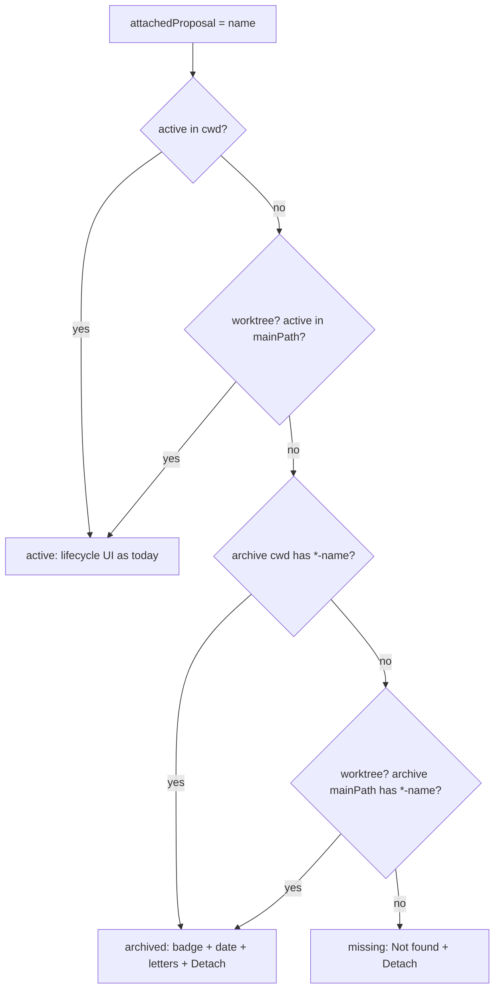

## Context

- `session.attachedProposal` is the bare change name. Nothing clears it on archive, and that is fine: the name is a durable key.
- Client lookup today is `changes.find(c => c.name === attached)`, where `changes` is the active `OpenSpecData` for `session.cwd`. On a miss, `SessionOpenSpecActions` renders name + `⋯ Detach`. `SessionCard`, `SessionHeader`, `ComposerSessionActions` and `MobileActionMenu` repeat the same find.
- `GET /api/openspec-archive?cwd=` → `scanOpenSpecArchive` returns `ArchiveEntry{name:"<date>-<change>", date, artifacts}`, newest first.
- `ArchiveBrowserView` holds reader state locally and has no deep link. It is routed at `/folder/:encodedCwd/openspec/archive`.
- Worktree sessions persist `gitWorktree.mainPath`. Example: `.worktrees/os-harden-review-and-fix-loop` → `mainPath=/…/pi-agent-dashboard`. After ship-change removes the worktree, `session.cwd` holds no `openspec/` at all.

## Goals / Non-Goals

**Goals**
- Archived attachments stay traceable from running and ended sessions.
- Sessions are reachable from an archive entry.
- No server or protocol change.

**Non-Goals**
- Rewriting `attachedProposal` to the archived directory name. Keep the bare name.
- Fetching archives that exist only on a remote and are not pulled. Those resolve `missing` until the user pulls.
- Unarchive / restore actions.

## Decisions

### D1 — Resolve on the client, not the server
A pure `resolveAttachment(session, activeByCwd, archiveByCwd)` returns:
`{kind:"active", change, cwd} | {kind:"archived", entry, cwd} | {kind:"missing"} | {kind:"unresolved", reason:"loading"|"disabled"|"error"}`.

`cwd` is the folder the hit came from, and the archive reader needs it.

*Alternative:* the server adds `attachedStatus` to session broadcasts. Rejected for now. It touches the poller, the protocol and persistence for data the client can fetch. The existing `openspec_get` supplies active data. It is an on-demand poll gated by the server (`server-openspec-polling`): the cwd must be in the session registry (any status) or pinned, and must have an `openspec/` dir; otherwise the reply is a `final:true` placeholder with readiness `GLOBAL_OFF` / `OPTED_OUT` / `ABSENT`. `GET /api/openspec-archive` supplies archives. `gitWorktree.mainPath` is on the session. One pure function serves all surfaces and is unit-testable.

### D2 — Lookup order and folder states
1. Active in `cwd`.
2. Active in `mainPath`.
3. Archive in `cwd`.
4. Archive in `mainPath`.

Active always beats archived, because a re-proposed same-name change is live work. Steps 2 and 4 run only when `gitWorktree` is set and `mainPath !== cwd`.

Each active step's folder is in one of three states:
- **known**: a settled `openspecMap` entry with `initialized: true`. Search its `changes`.
- **unavailable**: a settled gate placeholder (`initialized: false`, any readiness). Skip the step; it neither matches nor blocks. Examples: a removed worktree (no `openspec/`), or a `mainPath` that is not tracked.
- **unsettled**: no entry, or only a `pending: true` placeholder. Resolution stops with `unresolved{loading}`.

If `session.cwd` reports `GLOBAL_OFF` or `OPTED_OUT`, the result is `unresolved{disabled}`. The user turned OpenSpec off there, so no archived/missing UI is shown.

Archive steps run only after both active steps are known or unavailable. An unfetched archive yields `unresolved{loading}`. A failed one with no match elsewhere yields `unresolved{error}`, never `missing` (retry per D4).

`unresolved` renders exactly today's bare layout: paperclip + name + `⋯ Detach`, with no badge. There is no flash of `Not found`.

**Known limit:** a change still active in an untracked `mainPath` (neither pinned nor any session's cwd) cannot be seen. It falls through to the archive or to `missing`. In practice the parent repo of a worktree is pinned or has sessions.

### D3 — Same-name disambiguation
Candidates are entries whose `name` matches `/^\d{4}-\d{2}-\d{2}-<escaped name>$/`.

Let `startDay` = the **local** calendar date of `session.startedAt`, minus 1 day. The 1-day tolerance absorbs timezone skew between the browser and the date the archiving CLI stamps.
- Pick the newest candidate with `entry.date >= startDay`, compared as `YYYY-MM-DD` strings.
- Else pick the newest overall.

The result is deterministic for a given (session, listing).

*Trade-off:* the 1-day tolerance can also pick an entry archived the day before the session started over an older one. And a session attached to an already-archived change (archived before it started) will pick a LATER same-name archive if one exists. Accepted: this is rare, and the fallback still points at a real archive of that name.

### D4 — Shared archive cache
Module-level `Map<cwd, {status: "loading"|"ok"|"error", entries, promise, activeSig, fetchedAt}>` behind `useArchiveEntries(cwd | null)`. The hook re-renders subscribers on settle.
- **Dedup:** concurrent callers share one in-flight promise.
- **Invalidate on signature change:** `activeSig` = sorted active change names for that cwd from `openspecMap`. A changed signature means the next read refetches, which covers archive-while-running.
- **TTL:** an entry older than 5 min refetches on the next read. This covers cwds whose active set never changes, such as a removed worktree whose archive is under a quiet `mainPath`.
- **Error:** `status:"error"` keeps the `error` message for `useArchiveListing`. The next read after 30 s refetches. A rejected promise is never cached as a permanent value.
- **Lazy:** fetch only when resolution reaches an archive step.
- `useArchiveListing` keeps its exact return shape (`entries`, `isLoading`, `error`, …) and reads through the cache.

### D5 — Archived rendering
Desktop card, desktop header and composer actions:
- the `Archived <date>` badge;
- `ArtifactLetters` built from `entry.artifacts`, in its order (server emits P D T S), exactly as the archive browser renders it;
- `⋯` with only **Detach**.

There is no lifecycle bar and no primary action, whether running or ended. Workflow actions are meaningless on an archived change.

Mobile header chip and mobile card chip: the chip stays **read-only** (existing requirement). It shows the name, the `Archived <date>` badge, and the archive letters (navigation, like today's `ArtifactLettersButton`). Detach stays in the existing `MobileAttachButton` popover. `MobileActionMenu` hides workflow actions for archived attachments.

Letters push `buildArchiveArtifactUrl(resolved.cwd, entry.name, artifactId)`.

**Active elsewhere** (`kind:"active"`, `resolved.cwd ≠ session.cwd`; a removed worktree whose change is still active in `mainPath`): read-only. Shows the name, an `In main checkout` badge, the change's artifact letters linking to the existing preview route for `mainPath`, and `⋯` with only **Detach**. No lifecycle bar and no workflow actions, because they would send skills to a session whose cwd no longer exists.

`missing` keeps today's layout plus a muted `Not found` badge, titled "Not in active changes or archive (pull may be needed)".

### D6 — Deep link
- New route: `/folder/:encodedCwd/openspec/archive/:entry/:artifact`. The route builder sits next to `buildArchiveUrl` in `lib/nav/route-builders.ts`.
- **Route precedence:** wouter's `useRoute` calls in `App.tsx` match independently. Today `/folder/X/openspec/archive/<entry>` ALSO matches the preview pattern `/folder/:cwd/openspec/:changeName/:artifactId` (with `changeName="archive"`). The fix guards the preview match with `changeName !== "archive"` and adds `useRoute` for `/openspec/archive/:entry/:artifact` and `/openspec/archive/:entry`. Assumption: `archive` cannot be a change name, because `openspec/changes/archive/` is the CLI's archive directory, so a change of that name would collide with it. `/openspec/archive/:entry` (no artifact) and unknown entry/artifact both render the archive list.
- The reader receives `archive: true` and reads via the existing `fetchArtifactContent(..., archive)` path.
- **Back:** a deep-linked reader uses history back to the launching view. On cold load, the existing url-routing back-action table applies unchanged (`/folder/:cwd/openspec/*` → `/`). A reader opened from the list keeps today's local-state Back to the list. "Two-level navigation" is MODIFIED to say this.

### D7 — Reverse link
`ArchiveBrowserView` receives `sessions` (the existing session store selector). For each entry, it shows the sessions where all of these hold:
- the change name (entry name minus date prefix) equals `attachedProposal`;
- `cwd === folder` OR `gitWorktree?.mainPath === folder`;
- re-running the resolver for that session yields this exact entry. This keeps D3 consistent, so a session never appears under two entries.

Up to 3 chips (name + status dot), then `+N`. Clicking a chip navigates to the session route.

### D8 — Reconcile widening
The `renderedCwds` memo in `App.tsx` (which already adds `openspecPreviewCwd` / `openspecBoardCwd`) additionally adds:
- the `{cwd, gitWorktree.mainPath}` of every **rendered** session card with a non-empty `attachedProposal`, ended included;
- when the archive route is active: the archive cwd, plus the `{cwd, mainPath}` of every session in the store attached to a name present in that folder's archive (the D7 candidates). This includes sessions not currently rendered in the sidebar.

The hook's existing dedupe, in-flight and timeout rules apply unchanged.

*Freshness:* `openspec_get` does NOT add a cwd to the periodic poll set. An ended-only folder therefore never emits `openspec_update`, its `activeSig` never changes, and its archive listing refreshes only via the D4 TTL. Running sessions' cwds are polled, so the archive-while-running flip is signature-driven.

## Risks / Trade-offs

- **Fetch fan-out on first render of many ended sessions.** Mitigation: dedupe per cwd and fetch lazily. The worst case is one `openspec_get` + one archive request per distinct folder.
- **Archive fetch for a removed-worktree `cwd` returns `[]`.** Accepted. While the worktree is alive, ship-change archives inside it first, so step 3 is needed.
- **Unknown `mainPath`** (neither pinned nor any session's cwd). `/api/file` triggers the existing unknown-cwd access-grant prompt when the reader opens. Accepted, existing behavior.
- **Removed worktree whose `gitWorktree` was never recorded.** Resolves `missing`. Accepted.
- **Name regex.** Escape regex metacharacters.
- **5 min TTL staleness** for quiet folders. Accepted; the next poll-driven signature change or a page reload refreshes.
- **Induced server work.** No server code, protocol or persistence changes, but the widened reconcile triggers mtime-gated `openspec` CLI polls (one per newly requested cwd, under the existing spawn cap) on first render and on each reconnect for unsettled cwds. Bounded by the number of distinct folders.

## Migration Plan

- None. The change is purely additive client behavior.
- Rollback: revert the client commit.
