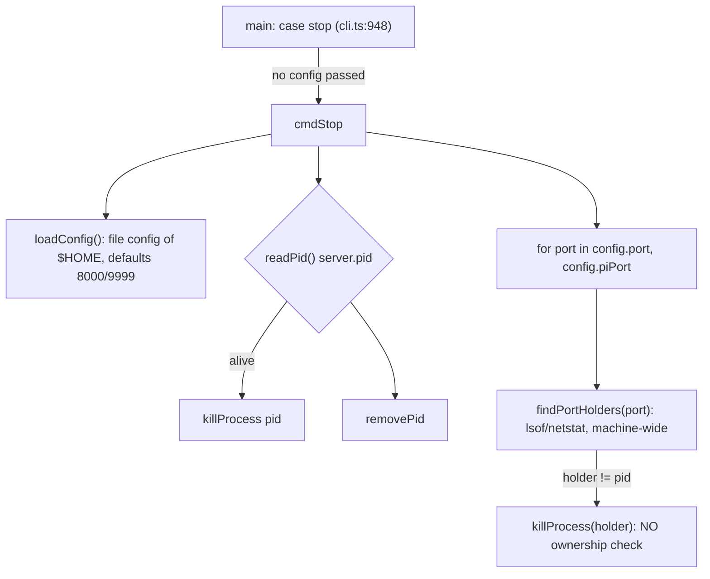

## Context

See proposal.md (Why) for the two incidents. Current shape of `cmdStop()` (`packages/server/src/cli.ts:456-484`):

Facts the design relies on:
- **The incidents went around the temp-HOME guard.** `buildConfig` routes the port through `guardTempHomePort` (`cli.ts:150-176`), which rewrites 8000 → 0 when `HOME` is under `os.tmpdir()`. `cmdStop` never calls `buildConfig`; it reads `loadConfig()` raw, so a temp HOME swept 8000.
- **On POSIX the gateway is a Unix socket by default.** TCP is opt-in (`packages/server/src/pi/gateway-transport-policy.ts:19-21`). So `/api/health.piGatewayPort` is `piGateway?.address()` (`system-routes.ts:1089`), which is the **socket path string**, not a port. On the live host it reports `/Users/robson/.pi/dashboard/gateway-9999.sock`, and nothing listens on TCP 9999. The server writes its instance id under `config.piPort` (`system-routes.ts:959`, `ensureInstanceId(undefined, config.piPort)`).
- **Lock path and the HOME spec diverge.** The lock sidecar path is deliberately rooted on the `$HOME`-honouring `getDashboardConfigDir()` (`packages/server/src/lifecycle/home-lock.ts`, `getLockPath` and its doc comment). That diverges from `instance-coordination` "HOME canonicalization", which says lock paths are `$HOME`-immune. The divergence predates this change.
- **The PID file is advisory.** `instance-coordination` "Server PID file remains advisory": the lock is authoritative.
- **`ensureInstanceId` writes when the file is missing.** It creates the id file (`instance-id.ts:57-88`). The non-creating `readInstanceId(file)` is private (`instance-id.ts:111`).
- **`cmdRestart`'s local fallback calls `stopFn()` with zero arguments** (`cli.ts:506,512,552`). The tests inject zero-arg stubs (`cli-restart.test.ts:26-69`).
- **`ParsedArgs.flags` is `Partial<ServerConfig>`** (`cli.ts:81-91`). `ServerConfig` has no `force` field.
- **`main()` builds config before the switch.** It calls `buildConfig(flags)` once for every subcommand (`cli.ts:941-942`), so `stop` already prints the isolation warning today.
- **Lock metadata `httpPort` is the configured port, not the bound one.** `buildMeta` takes `config.port`, so an ephemeral (`0`) server records `0` (`server.ts` lock acquisition, `home-lock.ts` `buildMeta`).
- **`cmdStop` is module-private** (`cli.ts:456`).

## Goals / Non-Goals

**Goals:**
- The port sweep never terminates a TCP listener it cannot attribute to the current HOME, unless `--force` is given. The PID-file step is out of scope; see Non-Goals.
- `stop` targets the ports `start` would bind under the same flags, env and HOME.
- Ownership evaluation writes no identity, lock or PID state.

**Non-Goals:**
- Changing the PID-file kill step, including its existing pid-reuse exposure. It stays an ownership-unverified kill of whatever `server.pid` names. A HOME that contains a copied `server.pid` can still kill the pid it names (see Risks). It is also the only path that stops a server bound to an OS-assigned port (`port 0`), which is the same as today.
- Fixing `restart-helper.ts`'s `dashboard.pid` path (follow-up, see proposal).
- Changing `/api/restart`, `start`, `status`, or the platform kill primitives. `restart`'s delegation path is untouched. Its local fallback (dashboard not reachable) now calls the scoped `stop` with the restart config. It still runs stop, then start, but with one intended observable change; see D8.
- Reconciling the lock-path vs "HOME canonicalization" divergence. The delta spec deliberately says "the location a server under the current HOME writes the metadata to" and makes no claim about canonical vs `$HOME` roots, so it adds no new contradiction. If the divergence is ever reconciled toward canonical paths, the task 1.1 pin fails first. A follow-up should reconcile `instance-coordination` / `home-lock-single-instance` with the shipped code.
- Multiple instances under one HOME sharing `server.pid` (pre-existing).

## Decisions

### D1. `stop` resolves ports through `buildConfig`, including the temp-HOME guard
`main()` passes a no-op `warn` into its single pre-switch `buildConfig(flags, warn)` when `subcommand === "stop"`, and calls `cmdStop(config, { force })`. `cmdStop` stops calling `loadConfig()` itself. Its signature is `cmdStop(config: ServerConfig, opts: { force?: boolean } = {}, injected?: StopDeps)`, so `stopFn(config)` stays valid. `StopDeps = { findPortHolders, killProcess, readPid, removePid, isProcessAlive, collectOwnedPids }`, following the `cmdRestart` pattern; the module-local functions cannot be intercepted with `vi.spyOn`.

Under a temp HOME this resolves 8000 → 0. The sweep skips any non-positive port, so a temp-HOME `stop` never looks at 8000. That is correct, because a temp-HOME `start` can never bind it. The guard's `[isolation] … refusing to bind` message is about binding, so it is misleading during `stop`. `buildConfig` gains an optional `warn` parameter (it defaults to the current `console.warn`), and `stop` passes a no-op. Because `main()` builds config once before the switch, the no-op is chosen there by subcommand; a second `buildConfig` call would not suppress the first warning.

`--force` is parsed for every subcommand (`parseArgs` does not know about subcommands) but only `stop` reads it. Every other subcommand ignores it, including `restart`, deliberately: a forced kill must be a separate, explicit command. The usage block documents it only under `stop` and says `restart` ignores it.

Alternative: a stop-specific port resolver without the guard. Rejected, because it would be a second precedence chain, and it would put 8000 back in scope for temp HOMEs only to have B skip it.

`parseArgs` learns `--force`. `ParsedArgs.flags` widens to `Partial<ServerConfig> & { force?: boolean }`, so `force` never enters `ServerConfig`.

The `packaging` "Dashboard server CLI" flag list (`openspec/specs/packaging/spec.md:23`) already omits shipped flags (`--host`, `--ephemeral`), so it is representative rather than exhaustive. No delta is needed.

### D2. Ownership is a pid set computed once, before any kill
The new module `packages/server/src/lifecycle/stop-ownership.ts` exports:
- `collectOwnedPids(config, deps): Promise<Set<number>>`, with injectable `readLockMeta`, `peekInstanceId`, and `fetchHealth`. It gathers:
  1. **Lock proof:** `meta.pid` from `readMetadata(getMetaPath(getLockPath()))`, but only when `meta.httpPort === config.port`. That path is today rooted on the `$HOME`-honouring `getDashboardConfigDir()`, the same root as `server.pid`. Task 1.1 asserts that, for a temp HOME, the path resolves under `<tempHOME>/.pi/dashboard/`. If anyone later moves `getLockPath` to the `$HOME`-immune canonical home (per "HOME canonicalization"), that test fails instead of letting a temp HOME silently read the real HOME's sidecar.
  When `config.port <= 0` it returns the empty set immediately: no sidecar comparison against `0` and no probe.
  2. **Health proof:** `health.pid` from a single 2 s `GET /api/health` on `config.port` (aligned with `server-identity.ts`'s 2000 ms default), when `health.instanceId === peekInstanceId(undefined, config.piPort)`. The key is `config.piPort`, the same key the server writes, and **never** `health.piGatewayPort`, which is a socket path on POSIX. The host is `127.0.0.1` when `config.host` is empty, `0.0.0.0`, `::`, `[::]`, `localhost` or `127.0.0.1`; otherwise it is `config.host`. A server bound only to a specific non-loopback or IPv6 address that the probe cannot reach fails closed, and the lock proof still applies.
- `partitionHolders(holders: Map<pid, port[]>, owned): { owned: Holder[]; foreign: Holder[] }`, where `Holder = { pid, ports }`. It is pure, and keeps the port association that the messages need.

`cmdStop` computes the set **before** the PID-file step, because after that kill the health probe can no longer answer. It then:
1. runs the PID-file step unchanged;
2. collects holders across the positive resolved ports into a `pid → ports[]` map, excluding the PID-file pid only if step 1 actually stopped it (`killProcess` returned ok). A PID-file pid that step 1 failed to stop is partitioned like any other holder;
3. kills `owned` holders;
4. kills `foreign` holders only when `force` is set, each with a warning; without `force` it prints the skip line.

**The PID file is not a proof** (spec: advisory). A holder that step 1 stopped successfully is gone; one it failed to stop gets no pass from being named in the PID file.

Alternatives considered:
- **PID file as a proof.** Contradicts `instance-coordination`, and widens pid-reuse exposure to the sweep.
- **Health `instanceId` only.** Fails when the owned server is wedged (event-loop stall); the lock proof covers that.
- **Compare the holder process's environment `HOME`.** Not portable, and needs elevated access for other users' processes.

### D3. The identity proof requires a pid match, and is a guard, not an entitlement
`instance-id.ts` says the id is published unauthenticated and "SHALL never grant entitlement". Here it does not authorize anything against an adversary. It narrows a kill the *same OS user* is already permitted to perform, so that kill is not aimed at the wrong target. The pid conjunct means a process can only "prove" ownership of itself. Forging it would require same-user read access to the 0600 id file, and that user could already kill the process directly.

### D4. Non-creating instance-id read
`instance-id.ts` exports `peekInstanceId(env, piPort): string | null`. It wraps the existing private `readInstanceId(getInstanceIdPath(env, piPort))`, is not memoized, and never writes. `stop` never calls `ensureInstanceId`. A running server memoizes its id (`idCache`). If the id file is deleted while that server runs, `/api/health` still reports the cached id, but `peekInstanceId` reads `null`. The health proof then fails closed and the lock proof still applies.

### D5. Failure means "not owned"
These all contribute nothing to the owned set: missing, unreadable or invalid sidecar or id file; a sidecar with a port mismatch; a health error, timeout, non-200, non-JSON reply, or missing fields. The worst case without `--force` is a skipped kill plus a clear message. The exit code stays 0, so `stop && start` chains keep working, and the following `start` reports the port conflict as it does today.

### D6. `--force` messaging
- Skip line: `port(s) <p1>[,<p2>] held by pid <x>, not owned by this HOME (<configDir>); not killing. Re-run with --force to kill it anyway.`
- Force warning: `--force: killing pid <x> on port(s) <p1>[,<p2>], NOT owned by this HOME (<configDir>)`.

The danger statement lives in the `cli.ts` usage block, the README command table, `docs/faq.md`, the Windows install guide, and the `debug-dashboard` known-issues entry. `--force` does not widen the resolved ports: a temp HOME still never sweeps 8000.

### D7. Caller fix (proposal D)
`assert-bundled-server-plugin-load.mjs`: `main()` declares `let port` and assigns it from `freePort()`. The `finally` teardown adds `--port <port> --pi-port <port+1>` (matching the boot argv) only when `Number.isInteger(port)`, so an early throw never emits `--port undefined`. It boots under `mkdtemp(tmpdir())`, so the guard already keeps it off 8000. The explicit `--port` makes the HTTP sweep target its own server. On POSIX the gateway is a socket, so `--pi-port` names no TCP listener there; it is passed only to mirror the boot argv and to cover TCP-gateway platforms. The temp HOME's PID file still stops the server itself.

### D8. Restart fallback
`cmdRestart`'s injected `cmdStopImpl` type becomes `(cfg: ServerConfig) => Promise<void>`, and the fallback calls `stopFn(config)`. A test asserts that the same config object is passed. A zero-arg stub would still type-check, so only the assertion catches a regression. `force` is never set from `restart`.

One observable change: before, when `restart` found the port held by a **non-dashboard** service (a port conflict, so it fell back), the blind sweep killed that service and `start` succeeded. Now the scoped sweep leaves it running, and `start` reports the port conflict and exits 1. This is intended: `restart` killing an unrelated service was the same bug. The recovery is an explicit `stop --force`. The `server-restart` requirement (fall back to stop, then start) still holds.

## Risks / Trade-offs

- **[Cloned HOME claims the live server]** If someone copies `~/.pi/dashboard` into a fake HOME, the copy includes `server.pid`, `server.lock.meta.json` and `instances/`. The PID-file step then kills the live server, and the sweep proves ownership. → Accepted: the copy is a claim of the same identity. The `isolated-verification.md` and `frontend-mockup-loop-dashboard` pitfalls tell agents not to copy `server.pid`, `server.lock*` or `instances/`.
- **[Bundled Electron server copy]** `packages/electron/resources/server/**` is a git-ignored build output regenerated by `bundle-server.mjs`. It picks up the fix on the next bundle; no separate task.
- **[Behavior change for scripts relying on the blind sweep]** → `--force`. Marked BREAKING in the proposal.
- **[Wedged owned server, sidecar missing or on a different port]** It is reported as foreign. → This is the explicit `--force` use case, and the message names it.
- **[Stale sidecar pid reused by an unrelated listener on the same port]** → Very unlikely: it needs a pid collision *and* the same port; the httpPort match narrows it further.
- **[Server bound to a specific non-loopback host while stop resolves a different host]** The health proof fails closed (not owned). → The lock proof still applies.
- **[Health probe latency]** At most 2 s, single attempt, only on `stop`, and skipped when the resolved port is `0`.

## Migration Plan

No data or protocol migration. `stop` runs fresh CLI code on its next invocation, so no server restart is needed for the fix itself. Rollback is a git revert. Servers from older versions that have no `instanceId` on health are still stopped by the PID-file step or covered by the lock proof (the sidecar exists since `home-lock-single-instance`).
