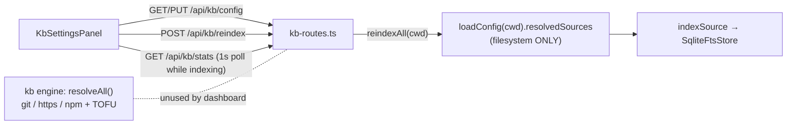
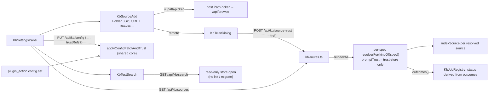

# Design — improve-kb-settings-sources-and-search

## Context

Current flow (as of this change):



Verified facts about the existing code:

- **Add source.** `KbSettingsPanel.addSource` hardcodes `kind: "filesystem"` (`packages/kb-plugin/src/client/KbSettingsPanel.tsx:153`).
- **Reindex gate.** `canIndex = resolvedSources.length > 0` (`KbSettingsPanel.tsx:130`).
- **Filesystem-only resolution.**
  - `resolvedSources` keeps only specs whose `kind ?? "filesystem"` is `filesystem` (`packages/kb/src/config.ts:275-278`).
  - A kind-less `https://…` ref is therefore resolved as a *local path*, `resolve(cwd, "https://…")`, which indexes nothing.
- **Dashboard reindex.** `reindexAll` walks `cfg.resolvedSources` and returns `{changed, chunks}` (`packages/kb-plugin/src/server/kb-routes.ts:108-132`).
- **Job registry.**
  - `KbJobRegistry` stores `{status, changed, chunks, error}`, and status becomes `error` only when `fn` throws (`packages/kb-plugin/src/server/job-registry.ts:57-81`).
- **Store open side effects.**
  - `openStore` calls `store.init()` (`kb-routes.ts:77-81`).
  - `init()` runs `migrateChunksSchema()`, which on a stale schema **drops `chunks` and clears `files/nodes/edges/properties`** (`packages/kb/src/sqlite-store.ts:124-141`).
  - The constructor `mkdir`s and creates the DB file (`sqlite-store.ts:100-108`).
- **Trust store** (`~/.pi/dashboard/kb-source-trust.json`, `packages/kb/src/trust.ts`):
  - `save` writes non-atomically and **swallows** errors with `console.warn` (`trust.ts:58-66`).
  - `load` degrades to `{}` on parse error (`trust.ts:49-56`).
  - `recordTrust` returns `void` (`trust.ts:72`).
  - Each `isTrusted` call re-reads the file (`trust.ts:68`).
  - Grant is CLI stdin only (`defaultPromptTrust`). Revoke is `DELETE /api/kb/source-trust` (`kb-routes.ts:243`), which is global and not cwd-scoped.
- **Trust hash.** `sourceHash(spec)` hashes canonical `{kind ?? "filesystem", ref, subdir, pin}` (`trust.ts:17-24`).
- **Engine dispatch and identity.**
  - Resolver dispatch uses `spec.kind ?? classifyRef(spec.ref)` (`packages/kb/src/sources.ts:216-221`).
  - `cacheKey` is module-private (`sources.ts:77`).
  - `sourceIdentity` is computed but **never compared** by the engine; nothing dedups on it.
  - Every resolver returns `id: spec.ref` (`sources.ts:103,122,169,199`), and the index root is `src.id` (`kb-routes.ts:113`).
  - `indexSource` deletes every path under `src.root` it did not see in this walk (`packages/kb/src/indexer.ts:220-224`).
  - **Consequence:** two specs sharing a `ref` share one index root and erase each other's chunks.
- **Query quoting.** `toMatch` quotes every query token (`sqlite-store.ts:83-87`), so FTS operator characters in `q` are matched as text, not syntax.
- **Picker data source.** `/api/browse` lists directories only (`packages/server/src/browse.ts:74-92`), but `PathPicker` single-select also confirms a typed path (`PathPicker.tsx:375-395`).
- **Search options.**
  - `searchOptsFromConfig` derives `rootPriority` from its `sources` argument (`packages/kb/src/search-opts.ts:29-52`).
  - `docType` and `limit` are separate `SearchOpts` fields, not overrides (`packages/kb/src/cli.ts:280-286`).
- **Hit shape.** `KbHit` carries `root, path, headingPath, chunkId, docType, score, snippet, suppressedSections?, akaPaths?, parent?` (`packages/kb/src/types.ts:66-82`).
- **Verdict enrichment.** `enrichHits` uses sync fs plus `execFileSync("git")` (`packages/kb/src/verdict.ts`).
- **Package exports.** `@blackbelt-technology/pi-dashboard-kb` exports only `"."` → `src/index.ts`, which pulls `node:sqlite` and `node:child_process`. It is **server-only**.
- **`config.set` plugin action.** It calls `applyConfigPatch` directly (`packages/kb-plugin/src/server/index.ts:67-83`).

Target flow:



## Goals / Non-Goals

**Goals**
- Pick folders instead of typing them.
- Add git and URL sources from the UI with explicit trust consent.
- Make the dashboard reindex honour every configured source kind.
- Run test queries against the saved index from the settings page.

**Non-Goals**
- npm sources in the add UI. Existing npm entries still resolve and display; the toggle offers Folder / Git / URL.
- Private-repo credential management. Git uses the server user's ambient credentials.
- Live search while typing; search runs on submit.
- Searching unsaved form state.
- Opening a hit in the file viewer. A hit click copies the path instead.
- **Trust verdicts in test search.** `enrichHits` performs sync fs/git work on the server event loop; the CLI keeps `--verdicts`.
- Changing engine `classifyRef` or `config.ts` `resolvedSources`. CLI semantics stay intact.
- Showing the remote cache path in the trust dialog (`cacheKey` is private).

## Decisions

### D1 — Folder picker via a new `ui:path-picker` primitive

- Add `UI_PRIMITIVE_KEYS.pathPicker = "ui:path-picker"` with this contract:
  ```ts
  interface UiPathPickerDialogProps {
    open: boolean;
    initialPath?: string;
    title?: string;
    onSelect: (absPath: string) => void;
    onCancel: () => void;
  }
  ```
- `main.tsx` registers a thin host wrapper: `Dialog` + single-select `PathPicker`, the same composition as `PinDirectoryDialog`.
- Before calling `onSelect`, the wrapper verifies that the confirmed path is a directory with `GET /api/browse?path=`. A non-directory gets an inline error and no `onSelect`.
- The plugin calls `useUiPrimitiveOrNull`. A `null` result (older host) hides Browse…, and typing still works.

**Why a primitive and not the intent protocol:**
- The registry spec forbids plugin `useUiPrimitive` "as a renderer of their own state" (`openspec/specs/plugin-ui-primitive-registry/spec.md:157-161`). The concern there is multi-client state coherence.
- A picker is transient per-client input with no shared state.
- Prior art: `packages/automation-plugin/src/client/AutomationSettings.tsx:42` reads `modelSelector` through the *strict* hook. That is non-conforming under the new exception and is noted, but not fixed here (out of scope).
- The deprecation is documentation-only.
- Recorded as MODIFIED requirements in **both** capabilities that state the rule: `plugin-ui-primitive-registry` and `plugin-intent-protocol`. The exception covers a transient input primitive, soft hook only, with null handled.

### D2 — Relative vs absolute ref storage; `outside` ownership

The pure client helper `toSourceRef(cwd, picked) → { ref, outside }` maps:

| Picked path | Stored `ref` | `outside` |
|---|---|---|
| `cwd` itself | `.` | false |
| under `cwd` | `relative(cwd, picked)`, `/` separators | false |
| elsewhere | absolute | true |

- **Boundary rule.** The same rule is used on both surfaces: `rel = relative(cwd, abs)`; `outside = rel === ".." || rel.startsWith("../") || isAbsolute(rel)`.
  - It is separator-aware, so `/a/bc` is outside `/a/b`.
  - The client must not use `node:path`: Vite externalizes it and the SPA crashes. See the `packages/shared/src/platform/paths.ts:1-24` header and `no-node-only-shared-imports.test.ts`.
  - New isomorphic string helpers `isAbsolutePath(p)` and `relativePath(from, to)` are added to `packages/shared/src/platform/paths.ts`. They handle POSIX and Windows drive/UNC forms, with drive-letter case-normalized.
  - The server uses the same helpers, so both surfaces run one implementation.
- The comparison is lexical: it follows no symlinks, because this is a label and not a guard.
- **Ownership of `outside`:**
  - For **saved** rows, the server-computed `outside` from `/api/kb/sources` is authoritative. It applies the boundary rule below to `resolve(cwd, ref)`.
  - For a **pending (unsaved)** row, the client uses the helper result.
  - Both surfaces call the same shared helpers, so the two implementations cannot drift.

### D3 — Kind toggle, git fields, input validation, dedup

**Modes:**
- **Folder** → `kind:"filesystem"`. Input that the engine would classify as non-filesystem is **rejected** with a hint ("choose Git repo or URL"; for `npm:`, "npm sources are not added from the UI").
  - The rejected forms are any `^[a-z][a-z0-9+.-]*://` scheme, `git@`, `git:`, and `npm:`. This mirrors `classifyRef` (`sources.ts:40-45`).
  - This prevents a remote ref from being saved as a filesystem path.
- **Git** → `kind:"git"` plus optional `pin`, `subdir`, and `refresh` (`manual` | `on-index` | `{ttlMs: 86_400_000}`). The ref is stored as typed.
- **URL** → `kind:"https"`. Hint: single `.md` file, or a `.tar.gz` / `.tgz` / `.zip` archive.

**Auto-detect:**
- `^(https://(github|gitlab)\.com/|git@|git:)` switches the toggle to Git.
- Rationale: engine `classifyRef` would treat `https://github.com/org/repo` as an `https` file fetch and download the HTML page.
- Other hosts are not auto-detected; the user picks Git, and Folder mode refuses URL input.

**One source per `ref`:**
- The index root is `spec.ref`, so two specs with the same `ref` would erase each other's chunks (see Context).
- The UI therefore refuses a second source with an existing `ref` and hints "change the existing source's pin/subdir instead".
- Different pins of one repo need distinct refs. That is a deliberate limitation: re-keying roots on `{ref,pin,subdir}` would change chunk roots for every existing index, which is a migration and out of scope.
- The server treats a legacy config that already holds duplicate refs as ambiguous for trust (409, D4). Reindex keeps engine behavior.
- The client imports **nothing** at runtime from `@blackbelt-technology/pi-dashboard-kb`, which is server-only. Imports stay type-only (`kb-plugin-types.ts:5-8`). Helpers live in a pure `source-ref.ts`.

### D4 — Trust consent (atomic, reported, symmetric)

**Engine fix (`packages/kb/src/trust.ts`):**
- `save` writes atomically: tmp + `rename` in the same dir. A failed write leaves the prior file intact.
- `recordTrust(spec)` returns `boolean`: `false` on a persist failure, still logged.
- `recordTrust` stays synchronous (load → mutate → save with no `await`), so grants within the dashboard process cannot interleave.
- A cross-process race with a concurrent CLI TOFU grant can lose one entry. That is an accepted trade-off: the loser is simply asked again.
- The CLI `ensureTrusted` ignores the boolean (the user consented for this run; the failure is logged). "Never claimed as success" applies to the dashboard surfaces.

**Trust scope:** trust is global, keyed by `sourceHash(savedSpec)`. Trusting a spec in folder A also trusts the identical spec in folder B, and the dialog says so. The cwd guard limits *which folder's saved config* may be granted from. It does not scope the grant itself.

**Hash consistency:**
- Trust is recorded on the saved spec object exactly as stored. `canonicalSource` defaults a missing `kind` to `filesystem` inside the hash.
- Reindex's `ensureTrusted` hashes the same stored object, so grant and check always agree.
- `kindOf(spec) = spec.kind ?? classifyRef(spec.ref)` is used only to *classify* (remote vs filesystem, resolver choice), never to rewrite the spec before hashing.

**Grant endpoint — `POST /api/kb/source-trust?cwd=` `{ ref }`:**
1. cwd guard.
2. Load the folder's **saved** config.
3. Collect specs with `spec.ref === ref` from the folder's **effective** config. That is `loadConfig(cwd).allSourceSpecs`: project merged over global, the same list reindex walks and `GET /api/kb/config` returns. Global-only sources are grantable from any admitted folder; trust is global anyway.
4. Exactly one, and remote by `kindOf` → `recordTrust(savedSpec)`.

| Status | When |
|---|---|
| 404 `{error}` | no match |
| 409 `{error}` | more than one saved spec has that `ref` (legacy duplicate) |
| 400 `{error}` | match is filesystem |
| 500 `{error}` | `recordTrust` returned false |
| 200 `{hash, subject}` | success |

**Shared core — `applyConfigPatchAndTrust(cwd, patch)`** (in `kb-routes.ts`):
- Used by **both** `PUT /api/kb/config` and the `config.set` plugin action.
- Steps:
  1. `applyConfigPatch`. On failure, nothing is trusted.
  2. For each ref in `trustRefs: string[]`, run the same match + grant rules as the grant endpoint against the merged saved config.
- It returns `untrustedRefs`: unmatched, ambiguous, filesystem, or failed persist.
  - `PUT` adds `untrustedRefs` to its response. The addition is additive; existing fields are unchanged.
  - `config.set` has no response channel, so it logs `untrustedRefs` at `warn`.

**Consent model:**
- The trust *decision* is the dialog in the authenticated dashboard UI.
- The server cannot tell a dialog click apart from another authenticated dashboard client. That is acceptable: any authenticated dashboard client can already spawn pi sessions that run arbitrary commands, including `git clone` of any URL. Granting KB trust adds no authority beyond what the dashboard already holds.
- What the TOFU gate protects against is **unattended** fetches of sources the user never approved, for example a config file committed by someone else. That property is preserved: reindex never fetches an unrecorded source.
- Fetch-side SSRF / zip-slip protection is the `harden-untrusted-content-ingestion` guard. That is why it is a hard dependency.

**Dialog:**
- Shows kind, ref, pin, subdir, the agent-visibility warning, and a "trust applies in every folder on this machine" note.
- Shows no SSRF line: the guard runs at connect time, so a pre-check would be a misleading second resolve.
- Shows no cache path.

**Add without trusting:**
- The source is saved, skipped by reindex, and shown as `⚠ not trusted` with a **Trust…** action.
- Kept so config can be staged for review. Reviewed under `doubt-driven-review`.

**Revoke:** the existing global `DELETE /api/kb/source-trust`. It is unchanged and not cwd-scoped.

### D5 — Reindex resolves all kinds; outcomes drive job status

```ts
// reindexAll(cwd) → { changed, chunks, outcomes }
for (const spec of cfg.allSourceSpecs) {
  const kind = kindOf(spec);
  try {
    const src = await resolverFor(kind).resolve(spec, {
      cwd,
      cacheDir: cfg.cacheDirAbs,
      promptTrust: async () => false, // trust-store only
    });
    changed += (await indexSource(store, { root: src.id, dir: src.dir }, opts)).changed;
    outcomes.push({ ref: spec.ref, status: "ok", revision: src.revision, at: Date.now() });
  } catch (e) {
    outcomes.push({ ref: spec.ref, status: e instanceof KbUntrustedSourceError ? "untrusted" : "error", error: msg(e), at: Date.now() });
  }
}
```

- **Per-source isolation.** Each spec is resolved on its own, not via `resolveAll`. `resolveAll` aborts on the first throw (`sources.ts:216-221`).
- **Result shape.** `KbReindexResult` gains `outcomes: KbSourceOutcome[]`. The `/stats` and `/reindex` wire shapes are unchanged.
- **Registry changes:**
  - `KbJobRegistry` retains `outcomes` from the last settled job.
  - It derives status from the result: any `error` outcome → `status:"error"`, with `lastError = "N source(s) failed: <ref>: <msg>; …"` truncated to 500 chars.
  - `untrusted` outcomes alone leave the job `done`.
  - A thrown `fn` still yields `error`, as today.
- **Prior chunks kept.** A skipped or failed source keeps its previously indexed chunks. Indexing only deletes within a source the walker actually visited (`indexSource` sweeps its own root).
- **Behavior change for filesystem-only configs, error path only.** Today a throwing `indexSource` aborts the whole walk (`kb-routes.ts:110-127`). After this change the other sources still index, and the job still settles `error`. The success path is identical. `indexSource` already swallows missing dirs (`indexer.ts:110-116`), so only genuine throws are affected.
- **Behavior change, documented.** A kind-less remote ref (for example `{ref:"https://…"}`) was previously walked as a nonexistent local path. Now it is classified `https` and needs trust. Filesystem specs, with or without a kind, behave exactly as before.

### D6 — Async remote resolvers

- In `packages/kb/src/sources.ts`, the git and archive-extract calls move from `execFileSync` to promisified `execFile`. The argv array and no-shell invocation are unchanged.
- `rev-parse` also becomes async. Resolver signatures are already `async`.
- Each git call gets `timeout: 120_000` and `maxBuffer: 16 MiB`.
- A not-trusted failure throws `KbUntrustedSourceError`, defined in `sources.ts` and re-exported from `packages/kb/src/index.ts`. The package exposes only `"."`.
- Sequenced **after** `harden-untrusted-content-ingestion`. Its git hardening flags (`-c protocol.allow=never …`, `http.curloptResolve`, `http.followRedirects=false`) are kept verbatim; this change only swaps sync for async.

### D7 — Per-source status route

`GET /api/kb/sources?cwd=`:

```ts
{ sources: Array<{
    ref: string; kind: KbSourceKind;
    files: number;
    trusted: boolean | null;   // null when kindOf === "filesystem"
    outside: boolean;          // filesystem ref resolving outside cwd
    lastStatus?: "ok" | "untrusted" | "error";
    lastError?: string; revision?: string; lastAt?: number;
  }> }
```

- **Files count:** `SELECT root, COUNT(*) FROM files GROUP BY root`, which is cheap because it uses the `(root, path)` primary key.
- **No chunk count.** `chunks` is FTS5 with `root UNINDEXED`, so a per-root count would be a full content scan.
- **Trust:** one `listTrustedSources()` read builds a hash set, and each spec is checked against `sourceHash(spec)`. That is one file read per request.
- **Store:** opened with the existing-only open (D8). A missing DB file means every `files` count is 0, and no file is created.
- `outside` uses the D2 boundary rule on `resolve(cwd, ref)`.
- Outcomes are matched to specs by `ref`.
- **Not folded into `/stats`**, which is polled every second and shared with the sidebar row. The client fetches `/sources` on mount, after save, and on job settle.

### D8 — Test search route; read-only store open

**Existing-only open (no side effects):**
- `SqliteFtsStore` gains a static `openExisting(dbPath)`. It returns `null` (callers treat it as empty) when the file is missing or 0 bytes.
- Otherwise it constructs the store with an `existingOnly` constructor option, which skips:
  - `mkdir`;
  - `PRAGMA journal_mode=WAL` (a mode change rewrites a DELETE-mode file header);
  - `init()` (no DDL, no `migrateChunksSchema`).
- It sets only connection-scoped `busy_timeout`.
- A read-write handle (not `readOnly`) is used. A `readOnly` connection cannot create the WAL `-shm` sidecar after the writer has checkpointed and removed it, which fails with `SQLITE_CANTOPEN`. The route issues only `SELECT`s.
- **Schema probe:** `PRAGMA table_info(chunks)`.
  - Missing table → empty.
  - Missing `start_line` → `needsReindex: true`, with no further queries.
- **Spike test:** open-existing then `SELECT` on (a) a WAL file after the writer `close()` and (b) a DELETE-mode file. Assert no error, an unchanged db header/journal mode, and an unchanged file size and mtime.

**`GET /api/kb/search?cwd=&q=&limit=&docType=`:**
- Validation:
  - cwd guard first;
  - `q` is trimmed, 1–512 chars, else `400`;
  - `limit` is an integer clamped to [1, 50], default 10;
  - `docType` ∈ `doc | agents | source-md`, else `400`.
- Ranking:
  - `searchOptsFromConfig(cfg, { sources })`, where `sources` is built from **all** saved specs as the narrow `config.ts` `ResolvedSource` `{ id: spec.ref, dir: "", priority: spec.priority ?? 0 }` (`config.ts:117-121`). Only `id` and `priority` feed `rootPriority`, so remote roots rank with their configured priority, as in the CLI.
  - `docType` and `limit` are set as separate `SearchOpts` fields.
- **Never reindexes** (the CLI auto-reindexes before search; this route does not). There is no verdict enrichment.
- Response:
  ```ts
  { hits: Array<{ root, path, headingPath, chunkId, snippet, score, docType, suppressedSections? }>,
    tookMs: number,
    needsReindex?: true }
  ```
- `snippet` is returned as stored. The client renders match markers as text nodes, never as HTML.
- `store.search` is a **synchronous** multi-pass FTS5 query (`sqlite-store.ts:342-431`), so it runs on the event loop.
  - Accepted trade-off: it is user-initiated on submit only, never polled, with `q` ≤512 chars and `limit` ≤50.
  - The p95 is measured under `performance-optimization` (budget <100 ms on this repo's index).
  - If the budget is exceeded, the follow-up is a worker-thread search. That is not in this change.
- `q` with FTS operator characters is safe: `toMatch` quotes tokens. Any unexpected store error maps to `500 {error}`.
- During a running reindex, WAL readers see the last committed state.

### D9 — Reindex gate (modifies `kb-folder-slot`)

- `kb-folder-slot` "KB source management UI" requires the gate to follow "server-resolved sources — the same list the reindex job walks". After D5, the job walks `config.allSourceSpecs`.
- The gate therefore becomes `config.allSourceSpecs.length > 0`, read from the saved config and never from the form. A MODIFIED delta on `kb-folder-slot` records this.
- It ships **with** D5 (group 6), never before, so an enabled Reindex always has a walker that honours it.

### D10 — Client composition

`KbSettingsPanel` stays the page shell. New files:

- `KbSourceAdd.tsx`
- `KbTrustDialog.tsx` (`ui:dialog` primitive)
- `KbTestSearch.tsx`
- `useKbSources.ts`
- `source-ref.ts`, holding the pure `toSourceRef`, `isOutside`, `detectGitRef`, and `looksLikeUrl`

`kb-api.ts` gains `fetchKbSources`, `grantSourceTrust`, and `searchKb`. All strings go through `useT` with `i18n.ts` keys (EN defaults, plus HU and ZH).

## Risks / Trade-offs

| Risk | Mitigation |
|---|---|
| UI makes SSRF / zip-slip one click away | Hard dependency on `harden-untrusted-content-ingestion`; groups 5–7 gated |
| Trust endpoint abused to trust arbitrary URLs | Trusts only saved-config specs (exact `ref`, ambiguous → 409); cwd guard; same auth as config write, so no capability beyond it; symmetric REST/`plugin_action` core; fetch guarded by the hard dependency |
| Same-`ref` specs erase each other's chunks | One source per `ref` enforced in UI; legacy duplicates → 409 on grant |
| Global trust surprises across folders | Dialog states trust scope |
| Sync search on event loop | Submit-only, bounded `q`/`limit`, p95 budget measured |
| Trust write lost or reported falsely | Atomic save; `recordTrust` → boolean; 500 / `untrustedRefs` on failure |
| "Read-only" route mutates store | Existing-only open: no init / migrate / mkdir; stale schema → `needsReindex`; WAL spike test |
| Large clone stalls server | Async `execFile` + 120 s timeout inside the non-blocking job |
| Failing remote source empties KB | Per-source isolation; untouched roots keep chunks |
| Kind-less legacy remote ref now needs trust | Documented behavior change; it previously indexed nothing |
| Client bundle pulls Node-only kb | No runtime kb import in client; pure `source-ref.ts` |
| Snippet XSS | Text-node rendering |
| Plugin-side primitive use vs registry rule | MODIFIED requirement adds transient-input exception (soft hook only) |

## Migration / Compatibility / Rollback

- No schema or config migration.
- Filesystem specs are unaffected.
- **Additive API surface:**
  - New routes: `/api/kb/search`, `/api/kb/sources`, `POST /api/kb/source-trust`.
  - New request field: `PUT` `trustRefs`.
  - New response field: `PUT` `untrustedRefs`.
  - `KbReindexResult.outcomes` is server-internal.
- `recordTrust` return type `void → boolean` is source-compatible for existing callers.
- Rollback = revert. Trust entries remain and are revocable in Access. Cached clones are inert.

## Open Questions

None blocking.
