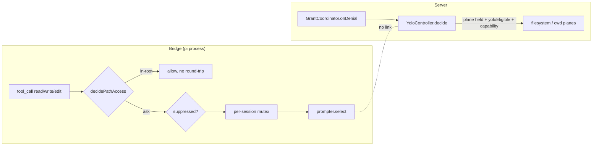
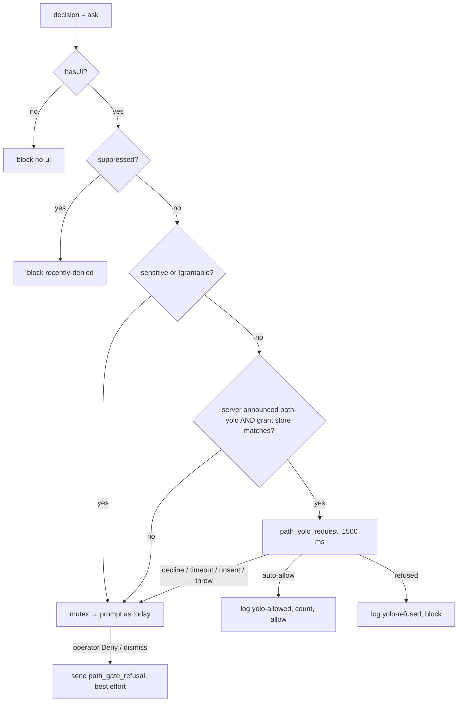

## Context

See proposal.md — Why. Current wiring:

Facts the design relies on:

- `YoloController.decide` requires `plane.mode === "held" && plane.yoloEligible` and `requestHoldsCapability`, then `realpathOrNull(subject)` → `isSubjectWithin(real, root)` → `isRefused` → `record()` (`packages/server/src/access/yolo-session.ts:211-232`). `record()` feeds the bounded history + cumulative `autoAllowed` (`yolo-session.ts:247-256`) that `/api/health` reads (`packages/server/src/access/access-health.ts:56-72`).
- `isSubjectWithin` re-canonicalises BOTH sides with strict `fs.realpathSync` and answers `false` for an unresolvable side (`packages/shared/src/canonical-subject.ts:116-134,151-166`). So a non-existent candidate is never "within" — swapping only the pre-resolution is not enough.
- `realpathNearestAncestor` is exported from `packages/shared/src/forbidden-subjects.ts:24`. `isUngrantableSubject` (`forbidden-subjects.ts:182`) = `isForbiddenGrantSubject` (`:126-138`: `whole` set `/`, `$HOME`, system dirs by EXACT match; `sensitive` `~/.ssh`, `~/.pi` exact or descendant) OR ancestor-of-forbidden. Descendants of `/etc` etc. are NOT ungrantable (`:66-72` explains why).
- Existing bridge↔server request/reply: `path_grant_request` → `path_grant_result` (`packages/extension/src/path-gate/grant-link.ts`; server `packages/server/src/access/agent-grant.ts`, wired at `packages/server/src/event-wiring.ts:981`). `sessionId` there is the gateway's socket key, never taken from the body.
- `dashboard_identity` is sent only when a grant-store id is announceable (`event-wiring.ts:547-550`); `grantStoreId` is required in the type (`packages/shared/src/protocol.ts:803-806`).
- Gate outcomes are a closed union (`packages/extension/src/path-gate/handler.ts:26-34`); in-root returns before any prompt logic (`handler.ts:262-265`); the outer catch fails closed with `block("error")` (`handler.ts:293-297`). `settleDeny` is shared by the select Deny/dismiss, an unknown answer and a declined confirm (`handler.ts:197-218`).
- `AccessPlaneId` is closed on purpose — the plane registry keys on it (`packages/shared/src/browser-protocol.ts:2391-2396`). The refusal ledger hard-filters to the four plane ids (`packages/server/src/access/refusal-ledger.ts:41,72`) and the clear route requires a registered plane (`packages/server/src/routes/access-prompt-routes.ts:253`). Client maps keyed by `AccessPlaneId` exist in `GrantPromptDialog.tsx:45,52,59` and `AccessPromptsSection.tsx:55`.
- `agent-confirm-registry.ts` records `agent-path-gate-confirm` prompts at first sight (`event-wiring.ts:2277-2283`) and lets one later `path_grant_request` consume a matching entry (`agent-confirm-registry.ts:1-14`, cap 32/session).
- Refusal matching is exact on the canonical subject (`refusal-ledger.ts:124-127`); a coordinator deny records a refusal (`packages/server/src/access/grant-coordinator.ts:281`).

## Goals / Non-Goals

**Goals:**
- One YOLO authority (server); the bridge never caches YOLO state.
- Zero cost on in-root calls; bounded, fail-safe cost on would-prompt calls; zero added wait against a server that does not support the question.
- Gate denials become durable refusals that YOLO honours.

**Non-Goals:**
- `bash` / custom / MCP tools (path-gate scope unchanged).
- YOLO for headless (no-UI) sessions.
- Containment-based refusal matching (a deny on `/a` does not refuse `/a/b`); refusals stay exact-subject like the existing ledger.

## Decisions

### D1 — Pull at the prompt point, not push
Bridge sends `path_yolo_request { requestId, sessionId, path, access, tool }`; server replies `path_yolo_result { requestId, verdict: "auto-allow" | "refused" | "decline" }`.

Latency lands only on calls that would otherwise block on a human. Server evaluates expiry/end/roots/refusals/record in place, so "end takes effect immediately" and counters/history come free.

Alternative — push `yolo_state` to bridges: needs change events on `activate/addRoot/end` plus expiry timers, trusts the bridge clock, copies trust state into agent-process memory, and needs a second message to count auto-allows. Rejected.

### D2 — `YoloSurfaceId`, not a wider `AccessPlaneId`
Add `type YoloSurfaceId = AccessPlaneId | "agent-path"` in `browser-protocol.ts`. `AccessPlaneId` stays closed (registry invariant intact; prompt-dialog maps untouched). `YoloLogEntry.plane`, `Refusal.plane`, `isRefused/recordRefusal/clearRefusal`, the refusals list payload and the YOLO history payload widen to `YoloSurfaceId`. Client: only verdict/refusal label maps gain an `agent-path` entry.

Alternative — add `"agent-path"` to `AccessPlaneId`: breaks the documented closure and every exhaustive `Record<AccessPlaneId,…>`. Rejected.

### D3 — `YoloController.decideAgentPath({ path, hostGateMode })`, sharing a private core
Extract the tail of `decide()` into a private `answer(surface, { resolved, subject })`, fixed order: forbidden (`resolved`) → system-dir rule (agent-path only, D9) → scope (`resolved`) → refusal (`subject`) → record. `decide()` keeps its plane/capability preamble and now passes `resolved = realpathNearestAncestor(path.resolve(input.subject))`, `subject = input.subject` — replacing the `!real` early return with an empty-subject guard, so the planes get the not-yet-existing fix too (ADDED requirement is surface-general; filesystem `subjectOf` can yield a non-existent path, `planes.ts:70-76` → `access-grants.ts:210-217`).

`decideAgentPath({ path, hostGateMode })` requires `path.isAbsolute(path)` (else `null`), checks session + `enforce`, then resolves ONCE: `resolved = realpathNearestAncestor(path.resolve(path))`; `subject = isDirectory(resolved) ? resolved : dirname(resolved)` (the gate/`agent-grant.ts:64-65` rule). Each check consumes:

| check | value |
|---|---|
| scope (`isResolvedSubjectWithin`) | `resolved` |
| forbidden (`isUngrantableSubject`) | `resolved` (sensitive descendants) |
| system-dir rule (D9) | `resolved` |
| `isRefused("agent-path", …)` / `record` | `subject` |

Returns `"auto-allow" | "refused-by-prior-refusal" | null`.

The capability proof is replaced, not dropped: the MODIFIED "could have been prompted" requirement defines the agent-path proof as the session's authenticated bridge connection (D5 binding) plus the bridge's attached-UI precondition.

### D4 — Containment on a resolved subject
Extract the component-wise `path.relative` test of `isSubjectWithin` (`canonical-subject.ts:151-166`) into a private `withinCanonical(cc, ca)`. Add `isResolvedSubjectWithin(resolved, ancestor, opts?)`: the ancestor is canonicalised strictly (a root must exist); the candidate is NOT re-realpathed — it is NFC-normalised and case-folded by the volume rule of its nearest existing ancestor (same `volumeCaseInsensitive` probe `canonicalSubject` uses, same `caseInsensitive` test seam). `isSubjectWithin` keeps its strict contract (asserted by `canonical-subject.test.ts`).

`resolved` comes from `realpathNearestAncestor` over a `path.resolve`d input: every symlink in the existing portion is resolved; the tail does not exist, so it holds no link and no `..`.

### D5 — Server handlers: session-bound, re-derived, prompt-bound refusals
New `packages/server/src/access/agent-yolo.ts` (sibling of `agent-grant.ts`), wired in `event-wiring.ts` next to `path_grant_request` (`event-wiring.ts:981`). `wireEvents` runs before `YoloController` is constructed (`server.ts:1495` vs `:1707`), so `EventWiringDeps` (`event-wiring.ts:101`) gains a lazy `decideAgentPath?: (path: string) => YoloAgentVerdict` closure passed from `server.ts` as `(p) => yolo.decideAgentPath({ path: p, hostGateMode: resolveHostGateMode(process.env.PI_DASHBOARD_HOST_GATE, liveHostGateMode()).mode })` (same source as `server.ts:1639`) (invoked only on a live frame; absent → `decline`). Both handlers validate field types like `agent-grant.ts:44-52` and refuse a non-absolute `path`; the bridge always sends `d.canonical`.

- `handlePathYoloRequest(connectionSessionId, msg {requestId, sessionId, path})`: malformed or `msg.sessionId !== connectionSessionId` → `decline`; else `decideAgentPath` and map `auto-allow`/`refused-by-prior-refusal`/`null` → `auto-allow`/`refused`/`decline`.
- `handlePathGateRefusal(connectionSessionId, msg {sessionId, promptId, path, subject})`: session binding; then consume a registry entry (below) for `promptId` whose path matches; re-derive the subject from `path` by the gate rule and refuse on mismatch with `msg.subject` (same guard as `agent-grant.ts:64-66`); then `recordRefusal("agent-path", subject)` — unconditionally, including ungrantable subjects (spec requires every Deny be remembered; harmless). Fire-and-forget; no reply.
- Registry (`agent-confirm-registry.ts`): `observe`/`consume` gain a `kind` (`"select" | "confirm"`); `handlePathGrantRequest` consumes `"confirm"` only (else a select prompt id could redeem a persisted grant), `handlePathGateRefusal` consumes `"select"` only; caps are per kind so select pressure never evicts a pending confirm. It also observes `agent-path-gate` select prompts at first sight (`event-wiring.ts:2277-2283` gains the second kind; the select prompt's metadata gains `subject: d.subject` in `handler.ts`, since today it carries only `path`), keyed by kind so a select entry can only be consumed by a refusal report and a confirm entry only by a grant request. Existing TTL, single use and 32/session cap apply. This bounds forged reports to prompts the server actually saw raised — and bounds ledger growth to the prompt rate.
- Log lines control-char stripped at the single emission point, like `agent-grant.ts:39-41`.

### D6 — Bridge ordering and error handling

- Same-host gate: the bridge asks (and reports refusals) only when `link.storeMatches()` — the existing `grantStoreId` equality used for "Always allow" (`grant-link.ts:64-68`) — is true. The server resolves paths, forbidden sets (`os.homedir()`, `process.platform`) and `os.tmpdir()` on its own host; for a remote dashboard those checks would run on the wrong filesystem. No proof → no question → ordinary prompt.
- Before the mutex, so in-scope calls never queue behind an open out-of-scope prompt.
- Block reason for a refusal: `path-gate: yolo-refused — <subject> was denied earlier; clear it in Settings ▸ Access`.
- New `yolo-link.ts` (sibling of `grant-link.ts`): pending map, timeout, `reset()` → `decline`. `ask()` NEVER rejects — every failure resolves `decline` — and the handler also wraps the call so a throw maps to the prompt, not to the outer fail-closed catch.
- `yolo-allowed` / `yolo-refused` are new `GateOutcome` members emitted through the existing `log()` helper (keeps `sensitive=` and sanitisation). `counters` gains `yoloAllowed`, carried alongside the existing path-gate counters on the heartbeat (`bridge.ts:3915-3918`; no server consumer exists today — the authoritative cumulative count is the server's `autoAllowed`).
- The deny report is sent only from the select step's Deny / dismiss branch (`answer === undefined || answer === OPT_DENY`), NOT from the shared `settleDeny()` — an unknown answer or a declined always-allow confirm records nothing; never from `settleTimeout()`. Carries the select prompt id. Non-buffering `send`; failure ignored.
- Suppression precedence is unchanged: a recent deny blocks before the YOLO question (spec scenarios state the elapsed-window precondition).

### D7 — Version skew via a capability flag
`dashboard_identity` gains `features?: string[]`; `grantStoreId` becomes optional. The server sends the frame on every bridge connect with `features: ["path-yolo"]`, adding `grantStoreId` only when announceable (`grant-link.handleIdentity` already treats a missing id as no-match). `yolo-link` defaults to unsupported until it sees the flag (accepted only when `Array.isArray(features)` and it contains the exact string). The flag is bound to the connection that delivered the identity: it is cleared when that connection closes or is replaced (including a `/dashboard-connect` move), without broadening `grant-link`'s existing reset (`bridge.ts:1274-1278`). The server sends identity on every `session_register` (`event-wiring.ts:547`), which the bridge sends on every (re)connect. Pre-existing gap fixed here: after a `/dashboard-connect` move the target connection's frames go to the move coordinator (`session-move.ts:199-223`), which drops `dashboard_identity`, and only the primary connection routes to `pathGate.onServerMessage` (`bridge.ts:1352`) — so both `grant-link`'s store match and the new flag would be lost until restart. The coordinator forwards `dashboard_identity` to `pathGate.onServerMessage`, and the rebound connection keeps routing it.

- Old server + new bridge: no flag → no question, no wait, prompt as today; gate denies not remembered (old server ignores the unknown frame).
- New server + old bridge: never asks, never reports → behaviour unchanged.

### D8 — Copy and Access surface
- All indicator copy (`YoloIndicators.tsx` keys `yolo.pill*`, `yolo.pillTitle*`, `yolo.session*`, lines ~75-126) and its locale entries (`i18n.tsx`, `i18n-hu.ts`): name "agent + dashboard file access".
- Access page (`YoloAccessCard.tsx`): body copy `yolo.cardBody` (`:61-65`, "file and working-directory prompts") and planes line (`:95-99`, `data-testid="yolo-access-planes"`, hard-coded to filesystem + cwd) name the agent path gate.
- Widen to `YoloSurfaceId`: `access-prompts-types.ts:49,58` (`YoloVerdictView.plane`, `RefusalView.plane`; `OperatorVerdictView.plane` at `:36` stays `AccessPlaneId`), `access-prompts-api.ts:58` (`clearRefusal`), `AccessPromptsSection.tsx:73` (`planeLabel`) with an `agent-path` label in its map (`:55`). `GrantPromptDialog.tsx` maps stay `AccessPlaneId` (prompt dialog never sees `agent-path`).
- Server: refusal loader accepts `agent-path` (`refusal-ledger.ts:41`); clear route accepts `agent-path` besides registered planes (`access-prompt-routes.ts:253`).

### D9 — System-directory exclusion for the agent surface
`answer()` for `agent-path` additionally declines when `resolved` lies inside a platform system dir: the canonicalised `forbiddenGrantSubjects().whole` list with the entries EQUAL (by value) to the canonical filesystem root and home removed — on Windows the drive root is removed and `SystemRoot`, program-files and program-data stay, compared with the D4 helper — unless `resolved` lies inside `realpath(os.tmpdir())`. The temp exemption is mostly a backstop: `os.tmpdir()` and `/tmp` are already read-write session roots (`packages/extension/src/path-gate/roots.ts:132`), so those calls are in-root and never reach YOLO. Decline → bridge shows the ordinary prompt. HTTP planes unchanged (their existing exact-match behaviour is out of scope).

## Risks / Trade-offs

- [No-UI is enforced only by the bridge] → accepted: the bridge runs in the agent process, which can already bypass the gate (`bash` is ungated), so a server-side check against bridge-reported `hasUI` (`packages/server/src/pi/pi-gateway.ts:880`) would add no real assurance. Session binding + server-side scope/forbidden/refusal rules are the meaningful guards.
- [Forged `path_gate_refusal` from an agent] → bounded by D5 prompt binding (one report per observed select prompt); a forged report can only suppress auto-allows, clearable on the Access surface.
- [Slow/wedged server adds up to the budget per would-prompt call] → bounded (1.5 s), only when the server announced support, only on calls that would otherwise wait on a human.
- [Log/history noise from an agent loop: one server line per auto-allow, 200-entry ring] → accepted; matches existing per-outcome gate logging; cumulative counter stays exact. Revisit if reported.
- [Refusals are exact-subject] → a deny on `/a` does not stop auto-allow under `/a/b`; consistent with the existing ledger. Stated in Non-Goals.
- [Remote dashboards get no agent-path YOLO and no durable gate refusals] → accepted: same-host proof is required (D6) because the server's path checks are host-local; matches how "Always allow" is already withheld for a remote dashboard.
- [Server records the auto-allow when it answers, before the bridge applies it; a lost reply counts an auto-allow that then times out into a prompt] → accepted: local WS, rare; an apply-ack round-trip would double the latency for a counter's precision.
- [Planes now auto-allow a not-yet-existing descendant of a system dir (e.g. `/etc/new`) under unscoped YOLO, previously refused by the `!real` guard by accident] → consistent with the aligned forbidden-subject wording (system dirs exact for planes); D9 applies only to the agent surface. Called out so it is not mistaken for a regression.
- [Denies answered while the bridge is disconnected from the dashboard are not remembered durably] → accepted: the server never saw the prompt, so it cannot bind the report; YOLO is server state and also unavailable then. Recent-denial suppression still applies.
- [A PromptBus cancel that is not the gate timeout (e.g. adapter teardown) arrives as `undefined` and is recorded as a dismiss] → accepted: the spec treats dismissal as Deny; a stray refusal is fail-safe and clearable.
- [Every gate Deny now persists to `access-refusals.json`, even with YOLO off] → mirrors the coordinator (`grant-coordinator.ts:281`); refusals only affect YOLO, so non-YOLO behaviour is unchanged.

## Migration Plan

`access-refusals.json` gains entries with `plane: "agent-path"`; the loader must accept it. A rollback to the old server drops those rows on load (old filter) — fail-safe, as refusals grant nothing. No other persisted data. Extension → `npm run reload`; server/shared → `/api/restart`; client → build + restart. Rollback = revert.
