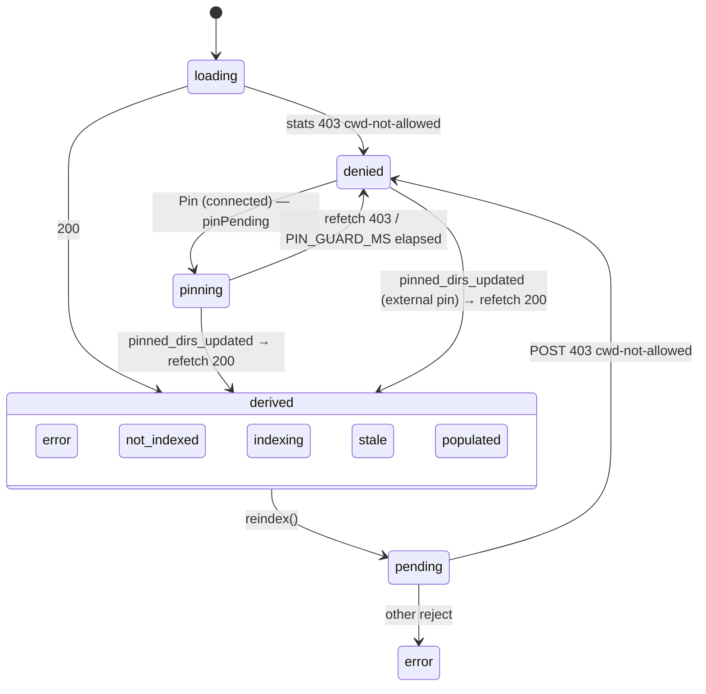

## Context

- Sidebar folder set ⊋ server `host.knownFolderCwds` (live sessions ∪ pinned, `packages/server/src/server.ts:1357`). An archived-only folder (sessions evicted from `sessionManager` by `archive-sessions-lazy-load`) still renders its folder group, OpenSpec card and KB slot.
- `isAllowedCwd` (`packages/shared/src/cwd-guard.ts`) refuses such a cwd → every `/api/kb/*` returns `403 { error:"cwd not allowed", reason, hint }` (`packages/kb-plugin/src/server/kb-routes.ts:86-92` `denyCwd`).
- OTHER 403s reach the same routes and are NOT cwd refusals: `403 { error:"network_not_allowed" }` (`packages/server/src/auth/localhost-guard.ts:355,367`), `403 { error:"host_not_allowed", reason, hint }` (`packages/server/src/auth/host-gate.ts:263,375`; HTML variant `:373`), `403 { error:"forbidden" }` (`packages/server/src/identity/identity-road-gate.ts`).
- Client today: `kb-api.ts:52-59` `parseJson` — non-JSON content-type → plain `Error("HTTP …")` BEFORE status check; JSON non-ok → `Error(json.error)`; status lost. `kb-stats-store.ts:198-210` `onStatsError` treats a stats 403 as a poll miss: `MAX_POLL_MISSES`=3 retries at `POLL_MS`=1s, then `error`. Reindex reject (`:122-126`) → `reindexError`. `FolderKbSection.tsx:78` maps both → red "index failed" + Retry.
- Consumers of the shared per-cwd store: `FolderKbSection` (sidebar + card), `KbSettingsPanel.tsx:152`. The panel ALSO loads `/api/kb/config` (`useKbConfig`, `:149`), which 403s for the same cwd → early return rendering the refusal text (`:194`) — the panel already shows the refusal independently of the stats store.
- Remedy contract: `openspec/specs/pinned-directories/spec.md` "A cwd-allowlist denial offers pinning as its remedy" names the KB plugin HTTP routes and pinning as the `allow-always` remedy ("Pinning from the remedy surface"). KB routes do not `hold` requests (`kb-routes.ts` `denyCwd`), so no access-grant dialog is raised for them — the KB row is the remedy surface, no duplicate prompt.
- Pin plumbing: `pin_directory` WS verb (`packages/shared/src/browser-protocol.ts:1731`), sent by `App.tsx:2008,2674`; server `directory-handler.ts:24-54` persists + broadcasts `pinned_dirs_updated { paths }` (`:54`). Plugin seams: `usePluginSend` (`plugin-context.tsx:414`, fire-and-forget, no ack; THROWS outside `PluginContextProvider`), `usePluginMessage(type, handler)` (`:436`), `useShellConnectionStatus` (`:298`, soft-returns `disconnected` without provider). Send before `connected` is silently dropped (`:123-124`). `pin_directory` requires `workspace.write` scope (`packages/server/src/identity/ws-road-classification.ts:37`).
- Husks: `kb-routes.ts:96-101` `openStore` → `new SqliteFtsStore(cfg.dbAbsPath)` → `packages/kb/src/sqlite-store.ts:113` `mkdirSync(dirname(dbPath), {recursive:true})` + creates `index.db`. `GET /api/kb/stats` uses it (`kb-routes.ts:300`); `/search` and `/sources` already use the side-effect-free `SqliteFtsStore.openExisting` (`:400`, `:442`; `sqlite-store.ts:121-135`, null for missing/0-byte). A removed worktree whose sessions still render is a known session cwd → admitted → resurrected. Observed: 11 husks under `.worktrees/` (only `.pi/dashboard/kb/index.db`, birth time = worktree removal time), deleted 2026-10-07.
- Zero-source no-op: no `knowledge_base.json` → `loadConfig` `origin:"defaults"`, `allSourceSpecs: []` (`packages/kb/src/config.ts:273`) → `reindexAll` loop (`kb-routes.ts:148`) runs zero times → job settles `idle`, `chunks:0`. Config writes go through `writeProjectConfig` (`kb-routes.ts:186-193`, `mkdirSync`) from both `PUT /api/kb/config` (`:499`) and `plugin_action config.set` (`server/index.ts:72`).
- Reproduced live: `GET /api/kb/stats?cwd=/Users/robson/Project/rackinspect` → 403 `cwd not allowed`; all `.worktrees/*` of this repo → 200.

## Goals / Non-Goals

**Goals:**
- Cwd-refusal 403 → distinct `denied` state, non-error styling, server `reason` in tooltip, no Retry.
- One-click **Pin folder** from the KB slot that recovers the real state.
- `denied` clears whenever the folder gets pinned — by this control or any other pin path.
- Cwd-refusal 403 stops polling at once (definitive, not transient).
- KB never recreates a removed folder; a missing folder or a folder with zero sources shows an honest state and never offers a dead `Index now`.

**Non-Goals:**
- Server guard / `knownFolderCwds` widening (archived-only admission = option B, separate decision).
- Server cwd guard / admission changes; persistence changes. (Server changes are confined to D8–D10.)
- `KbSettingsPanel` — untouched (already shows the refusal via its config load, see Context).
- `KbTestSearch`, mcp-client's identical guard behavior, unpin.
- Re-probing `denied` when a SESSION (not a pin) starts in the folder — deliberately not keyed on `session_added` (see Risks).

## Decisions

**D1 — Typed refusal error, discriminated by body code.** In `kb-api.ts` `parseJson`, inside the JSON branch: `!res.ok && res.status === 403 && json.error === "cwd not allowed"` → throw `KbCwdDeniedError extends Error` (`message = json.error`, `reason?`, `hint?`). Every other failure unchanged — including non-JSON 403 (proxy/host-gate HTML) and the `network_not_allowed` / `host_not_allowed` / `forbidden` 403s → plain `Error` → existing error channels. Alternative — status-only `403`: rejected, misclassifies the auth/host/tier gates and would offer a Pin that can never help. The literal is already contractual (`kb-routes.ts:89`, asserted by `kb-routes.test.ts:148`). Blast radius: `parseJson` is shared by all eight kb-api calls (`fetchKbConfig`, `fetchKbSources`, `searchKb`, `saveKbConfig`, `grantSourceTrust`, …); their consumers only test `instanceof Error` and render `message` (`useKbConfig.ts:47,65`, `kb-stats-store.ts:65`), so they are byte-identical. The error also carries `code = "cwd_not_allowed"`; the store discriminates on `code` (robust to duplicated module copies in bundled builds), not `instanceof`.

**D2 — `denied` = scalar snapshot fields; `pending` semantics untouched.** `KbStatsSnapshot` gains `denied: boolean`, `deniedReason: string | null`, `pinPending: boolean`; all three added to `update()`'s field-wise equality (`kb-stats-store.ts:235-249`) so identity stays load-bearing. Fields also added to `EMPTY_SNAPSHOT` (`kb-stats-store.ts:56-62`) and `UseKbStatsResult` (`useKbStats.ts:29-45`); the hook additionally exposes `beginPinWait: () => void` (a `useCallback` over `store?.beginPinWait()`, like `reindex`/`refetch`). Set by `onStatsError` — the refusal branch runs AFTER `this.inFlight = false` (`:199`) and BEFORE `misses += 1`, otherwise `onSubscribed`'s `inFlight` early-return (`:144`) wedges revalidation — and by the reindex `.catch`, both on `code === "cwd_not_allowed"`, with patch `{ denied:true, deniedReason, loading:false, pending:false, pinPending:false, error:null, reindexError:null }` + `stopPoll()` + `clearGuard()` + clear pin timer + `misses = 0`. Clearing the two error channels is deliberate: a pre-refusal failure is obsolete once the folder must be re-admitted, and leaving it would force `error` after re-admission. `onStats` success additionally sets `denied:false, deniedReason:null, pinPending:false` + clears the pin timer; its existing `pending` rule (clear only on `indexing:true`, `:184-192`) is UNCHANGED. Non-403 semantics of both error channels (fix-kb-index-feedback) unchanged. Mid-index refusal (folder unpinned while a job runs): `denied` wins and polling stops; the job's outcome becomes visible after re-admission.

**D3 — Precedence (full order in D11) `denied > missing > error > pending/indexing > loading > no-sources > not-indexed > stale > populated`; `denied` has a `pinning` sub-presentation.** `FolderKbSection` call site: `state = denied ? (pinPending ? "pinning" : "denied") : clientError ? "error" : pending ? "indexing" : deriveKbRowState(stats)`. `deriveKbRowState` stays pure over stats (returns `loading` on null stats; `denied` outranks it because a refusal leaves stats null).

**D4 — Pin via existing WS verb, sent by the component.** `FolderKbSection` calls `usePluginSend()({ type:"pin_directory", path: cwd })` — same verb App.tsx sends; no new route. The store never holds `send`. Pin affordance (card sibling AND sidebar menu item) is disabled unless `useShellConnectionStatus() === "connected"`. `usePluginSend` throws without `PluginReactContext` (`plugin-context.tsx:414-417`; `CurrentPluginLayer` does not supply it). Slots render inside `PluginContextProvider` in production; `FolderKbSection.test.tsx` renders the component at three provider-free sites (`:50-60`, `:63-72`, `:358`) — all three gain a stub provider supplying `send`, `ws`, and connection status.

**D5 — Recovery keyed on ANY `pinned_dirs_updated` while denied + bounded pin window.**
- Listener mounted ONLY while denied: `FolderKbSection` renders a tiny child `<PinnedDirsWatcher onUpdate={refetch} />` when `denied`; the child calls `usePluginMessage("pinned_dirs_updated", onUpdate)`. `usePluginMessage` attaches one `ws` listener that `JSON.parse`s every frame (`plugin-context.tsx:436-456`), so an unconditional subscription per mounted section (one per sidebar folder + worktree card) would add N parses per frame; conditional mount keeps the cost at zero for admitted folders and makes the denied condition structural (no stale closure). No path matching — broadcast paths are server realpath-canonical (`directory-handler.ts:21-31`) and the client cannot canonicalize; one cheap refetch is self-correcting (still 403 → stays denied). Covers the KB Pin AND every other pin path. Multiple mounted placements each call `refetch`; the store's epoch abort (`kb-stats-store.ts:162-170`) coalesces them.
- Store gains `beginPinWait()`: no-op if `pinPending` or `!denied`; else `pinPending:true` + a dedicated tracked timer `PIN_GUARD_MS` (3000), cleared in `dispose()`. Elapse → `pinPending:false` + `refetchIfObserved()` (never fetch at zero subscribers, mirroring the reindex guard, `kb-stats-store.ts:115-121`). `onStats` success / `KbCwdDeniedError` clear it (D2).
- Alternative — blind refetch ladder (0/500/1500 ms): rejected; racy and misses external pins. Alternative — reuse `pending`: rejected; it is the shared reindex-optimism channel (`useKbStats.ts:36-40`) and would disable reindex in every consumer.

**D6 — Presentation.** `SlotAccent` (`SlotPill.tsx:30`) has no neutral member → keep `cyan` (accepted trade-off, no runtime change); distinguish by label in `--text-tertiary` + pin glyph on the control.
- `denied`: label `t("labelNotAllowedShort","not allowed")`; `activateTitle` = localized `t("titleDenied", …)` ("Folder not admitted — pin it to enable the knowledge base"). The server `reason` is constant English (`kb-routes.ts:90`) and is NOT shown (ui-i18n-coverage: server emits codes, not display English); `deniedReason` is kept in state for diagnostics only.
- `pinning`: label `t("labelPinningShort","pinning…")`; control disabled.
- Card sibling: `mdiPinOutline`, aria-label/tooltip `t("pinFolder","Pin folder")`; offline → disabled, tooltip `t("pinOffline","Pin folder — offline")`.
- Sidebar menu item: same id `kb-reindex` (one-KB-item invariant), icon `mdiPinOutline` in `denied`/`pinning` (else `mdiDatabaseRefreshOutline`), label "Pin folder" (unchanged during `pinning`), `disabled = pinPending || !connected`, `badge = t("labelOffline","offline")` when not connected (contribution has no tooltip field, `folder-menu-contributions.tsx:261-279`), `onSelect` = pin handler. Pin handler `useCallback`ed; `useMemo` deps add `denied`, `pinPending`, `connected`, the pin handler (`FolderKbSection.tsx:101-114`).

**D7 — (withdrawn in review: the KbSettingsPanel one-line edit; the panel already shows the config-load refusal).**

**D8 — Read routes never materialize.** `GET /api/kb/stats` opens via `SqliteFtsStore.openExisting(cfg.dbAbsPath)` inside try/catch, like `/sources` (`kb-routes.ts:440-447`) and `/search` (`:398-422`). `null`, a throw, or a stale schema — `const sc = store.hasCurrentSchema(); !sc.table || !sc.current` (returns an object, `sqlite-store.ts:138-144`; same probe shape as `/search`, `kb-routes.ts:400-404`; replaces the `init()`→`migrateChunksSchema()` side effect the old creating open performed, `:148-171`) → `{files:0, chunks:0}` → the row falls back to an actionable not-indexed state. No `mkdir`, no WAL mode change, no DDL. Only a reindex (after D9 preflight) creates or migrates the store.

**D9 — Write preflight, one helper, every entry point.** `preflightWrite(cwd, { needsSources })` in `kb-routes.ts`, called AFTER `isAllowedCwd` — and for reindex AFTER the `registry.isRunning(cwd)` coalescing short-circuit, so an in-flight job still answers `202` (`kb-folder-slot` "Concurrent reindex is coalesced") — by `POST /api/kb/reindex`, `PUT /api/kb/config`, and both `plugin_action` cases (`server/index.ts` `reindex`, `config.set`); mirrors "Uniform enforcement across entry points" of `kb-plugin-cwd-guard`.
- `folderExists(cwd)` = `statSync(cwd).isDirectory()`; ANY stat failure (ENOENT, EACCES, EPERM, …) counts as missing. Missing → `409 { error: "folder missing" }` (plugin_action: warn log, no-op).
- Chained reindex: `PUT /api/kb/config` (`kb-routes.ts:503-506`) and `config.set` (`server/index.ts:80-81`) with `reindex:true` re-run the `needsSources` check AFTER the patch is written; zero sources → the config is saved, NO job is registered, and the PUT response carries additive `reindexSkipped: "no sources configured"` (action path: warn log).
- TOCTOU: `reindexAll` re-checks `folderExists(cwd)` immediately before `openStore` (missing → job ends `error`, `lastError: "folder missing"`), and `writeProjectConfig` (`kb-routes.ts:186-193`) re-checks it immediately before its `mkdirSync` (missing → `409 { error: "folder missing" }`). Nothing is created under a removed folder on any path.
- `needsSources` (reindex only) and `loadConfig(cwd).allSourceSpecs.length === 0` → `409 { error: "no sources configured" }`.
- Runs before `registry.start` / `writeProjectConfig`, so nothing is created and no job is registered. Alternative — 202 + no-op job: rejected; indistinguishable from success (the reported bug).

**D10 — Stats carry presence + source count.** `KbStats` gains optional `folderMissing?: boolean` and `sourceCount?: number` = `folderMissing ? 0 : cfg.allSourceSpecs.length`. `loadConfig` merges DEFAULTS + GLOBAL + project (`packages/kb/src/config.ts:262-273`), so sources defined in the user's global `knowledge_base.json` count for every existing folder (such a folder is indexable and never shows `no-sources`). `loadConfig`'s `opts.configPath` overrides only the PROJECT layer; the global path is `join(homedir(), ".pi","dashboard","knowledge_base.json")` (`config.ts:247-248`). Server route tests stub `HOME` + `USERPROFILE` to a temp dir via `vi.stubEnv` so zero-source cases are environment-independent (Windows runner: `USERPROFILE` covers `os.homedir()`). Optional on the wire: a new client against an old server treats `undefined` as unknown (no `missing` / `no-sources` presentation). `staleCount` is `0` when missing (no `dox-staleness.json` read).

**D11 — Client states `missing` and `no-sources`.** Full precedence: `denied` (with its `pinning` sub-presentation, D3) `> missing > error > pending|indexing > loading > no-sources > not-indexed > stale > populated`. `missing` outranks a client-side error, like `denied`.
- `missing` (`stats.folderMissing === true`): label `t("labelFolderMissingShort","folder missing")`, `--text-tertiary`; card control + menu item rendered DISABLED with label "Folder missing" (one-KB-item invariant); settings link still works (read-only view).
- `no-sources` (`stats.sourceCount === 0` and `chunks === 0`): label `t("labelNoSourcesShort","no sources")`; action **Configure sources** (`t("configureSources")`) navigates to `kbSettingsUrl(cwd)` instead of `reindex()`.
- `sourceCount === 0` with `chunks > 0` (sources removed after an index): count states unchanged, action label "Configure sources" → settings (a reindex would 409).
- A precondition 409 reaching the client anyway (race: config changed, folder deleted mid-session): `parseJson` throws `KbPreconditionError` (`code` `folder_missing` | `no_sources`, discriminated on the body `error` literal like D1). The store does NOT set `reindexError` (it is cleared only by a new `reindex()`, `kb-stats-store.ts:111`, so setting it would stick in `error` with a Retry that always 409s); it clears `pending` and calls `refetch()`, and the fresh stats render `missing` / `no-sources`. Other 409s keep the existing `reindexError` path.
- Action override: whenever `sourceCount === 0` and the row is not `denied` / `missing` / busy, the single action is **Configure sources** — this overrides `error`'s Retry too (the label stays `index failed` for a failed job; the action never re-POSTs a guaranteed 409).

## Risks / Trade-offs

- [Pin widens admission for ALL path-guarded features of that folder] → explicit user click; label "Pin folder", not "Allow KB"; identical to the existing sidebar pin; matches the spec'd remedy (`pinned-directories` "A cwd-allowlist denial offers pinning as its remedy").
- [Pin side effects beyond admission: `directory-handler.ts:24-78` re-keys the archive index, imports historical on-disk sessions via `directoryService.onDirectoryAdded`, folder becomes a durable pinned sidebar entry] → same as any pin; manual check verifies sidebar stays coherent.
- [Workspace-owned folder: the sidebar hides its pin item (`pinned-directories-ui`), but server pin is valid and leaves workspace membership intact (`pinned-directories` "Pinning a folder that is in a workspace")] → KB Pin offered there too; folder additionally appears in the pinned list. Accepted.
- [Sidebar pin indicator lags the KB pill (plugin send skips App's optimistic `setPinnedDirectories`; shell catches up on the broadcast, `useMessageHandler.ts:1721`)] → transient, accepted.
- [Folder admitted by a new SESSION (no pin) stays `denied` until the consumer remounts / page reload] → deliberate: not subscribing to `session_added` (high-frequency, unrelated to most folders). Rare; starting a session usually remounts the folder group.
- [KbSettingsPanel opened with a loaded config, then folder unpinned: reindex click → `denied` only, panel's error line shows nothing] → rare edge; panel untouched by design; next panel load shows the config 403.
- [Neutral styling limited to label color — accent remains cyan] → accepted (D6).
- [`pinned_dirs_updated` delivery is itself grant-filtered (`packages/server/src/identity/bootstrap-grants.ts:51` `workspace` family; `browser-gateway.ts:1418`)] → a client lacking the `workspace` grant never sees the broadcast: its own pin recovers via the `PIN_GUARD_MS` elapse refetch; an external pin is only picked up on remount. Accepted.
- [Any broadcast while denied — including unpins of unrelated folders — costs one 403 refetch per denied folder] → bounded by the number of denied folders; accepted over unreliable client-side path matching.
- [Connection status is consumer-local (not in the shared snapshot)] → both placements render under one shell provider, so they agree in practice; the shared invariant covers `denied`/`pinPending` only.
- [Worktree card offering Pin for a worktree cwd] → a worktree is denied only when its main checkout is not known (`cwd-guard.ts:66-95`); pinning creates a durable pin on a transient directory that dangles after worktree removal. Accepted — same as pinning it from the sidebar; unpin remains available.
- [Settings page for a denied folder still renders the config 403 as red raw text (`KbSettingsPanel.tsx:194`)] → visually inconsistent with the non-error pill; panel is out of scope. Accepted.
- [`pin_directory` lacks `workspace.write` scope for the client (`ws-road-classification.ts:37`)] → no broadcast → `PIN_GUARD_MS` elapses → back to `denied`; no false success.
- [Denied AND already-removed folder: the 403 hides `folderMissing`, so the row offers Pin; `pin_directory` accepts a non-existent path (`directory-handler.ts:20-33` `safeRealpathSync` fallback)] → after the pin, the refetch reports `folderMissing:true` and the row shows `missing`; a dangling pin remains (user can unpin). Accepted.
- [`GET /api/kb/config` for a missing folder still returns the merged config (global sources), so the settings page may list sources while the pill shows `missing`] → panel out of scope; accepted.
- [Removed-worktree session cards still render KB pills] → after D8 they no longer resurrect the directory; the pill shows `missing`. Hiding cards of removed worktrees is out of scope.
- [`statSync` per stats request] → one syscall per poll; negligible vs the SQLite open.
- [A folder deleted while `KbSettingsPanel` is open with a loaded edit → Save → 409] → surfaces via the panel's existing config-save error text.
- [Existing tests asserting 403 → `reindexError` / "index failed" and provider-free `FolderKbSection` renders] → updated intentionally in the same commit.

## Migration / Rollback

kb-plugin server + client. Additive optional stats fields and two new 409 bodies; no persisted data. Rollback = revert commit + `npm run build` + `curl -X POST http://localhost:8000/api/restart`. The 11 husks were deleted manually; nothing to migrate.
