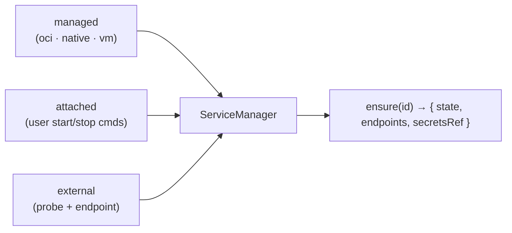
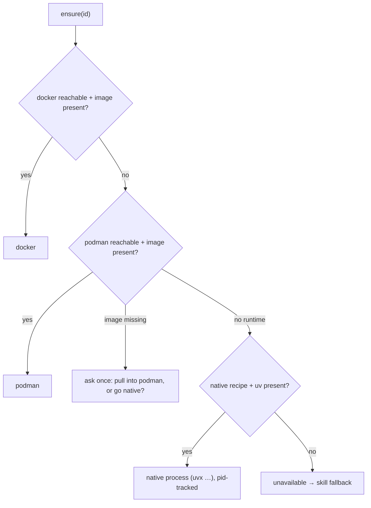
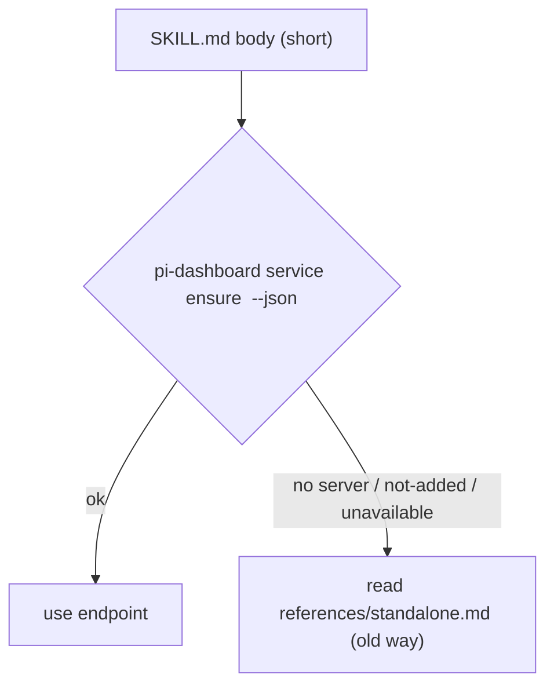

## Context

See proposal.md (Why). This design records the **working hypotheses** from the
explore session. The spike exists to confirm or falsify them, and
`add-service-registry-core` adopts whatever survives. Each decision names the
spike question (S1–S7) that tests it.

Existing machinery the layer builds on:

- `packages/shared/src/tool-registry/`: `ToolRegistry`, `pi.tools` manifest
  ingestion, `docker-image` probe strategy. Rule inherited from
  `add-skill-tool-provisioning`: **a manifest carries no shell strings.**
- `plugin-credential-store` spec: 0600 sibling file, cross-process lock, atomic
  replace, corrupt-file backup. Shared lock/atomic module extracted from
  `provider-auth-storage.ts`.
- `add-connector-layer` key decision 4: reuse the credential machinery and do
  not invent a vault.
- `spike-mcp-credential-delivery` findings: secrets expanded into spawn argv are
  visible in `ps`.
- `packages/server/src/spawn-process/idle-timer.ts` and the `embed-lifecycle`
  reaper: existing idle/reap patterns.

## Goals / Non-Goals

**Goals:**
- Settle the hypotheses below with measured evidence on this macOS host
  (Docker Desktop 29.1.3, podman 5.8.6 applehv machine, qemu, VirtualBox,
  VMware Fusion, uv/uvx, OBS with obs-websocket on `:4455`).
- Produce a capability matrix and a `services.json` shape concrete enough to
  write `add-service-registry-core` specs against.

**Non-Goals:**
- Production code, UI, or spec deltas.
- Linux/Windows measurements (recorded as not-measured follow-ups).
- VM provisioning. VMs are detection + capability listing only.
- A reverse proxy (`/svc/<id>/*`) or traffic-based idle detection.

## Decisions (hypotheses under test)

### H1 — Three ownership modes behind one consumer contract
> **Spike verdict: CONFIRMED.** See findings S3.3 and S1.3.

- **managed**: the dashboard creates, owns, and idle-stops the service.
- **attached**: the service already exists (for example OBS). The dashboard may
  start or stop it using user-authored commands, and idle-stops it **only when
  it started the instance itself** (`startedBy: dashboard`).
- **external**: health probe + endpoint + secrets only; no lifecycle.

Alternative considered: containers only. Rejected because OBS and user REST
services are a stated requirement, and the consumer contract is the same.
Tested by: S1, S2, S3.

### H2 — Definitions live in a separate, user-owned `services.json`
> **Spike verdict: CONFIRMED (shape).** See findings S3.4. VM entries need secrets too (S7: the encrypted VM requires a password).
- File: `~/.pi/dashboard/services.json` (separate from `config.json`).
- Plugins **offer** templates via `package.json` `pi.services` (sibling of
  `pi.tools`). An offered template does nothing until the user clicks **Add**,
  which copies it into `services.json` after review (image digest, ports,
  volumes, driver).
- A newer plugin template shows **Update available** with a diff; the file is
  never rewritten silently.
- Trust follows from this: everything in `services.json` is user-approved.
  User-authored entries may carry shell start/stop commands, because the user
  wrote them. Plugin templates are declarative only: image pinned by digest,
  named volumes, ports bound to `127.0.0.1`, no privileged mode, no host
  network.

Alternative considered: auto-registering plugin services. Rejected because it
would bring implicit code execution back.
Tested by: S6 (shape), S7 (UI matrix).

### H3 — Driver fallback chain, silent only when cheap
> **Spike verdict: REVISED.** See findings S1.1, S1.4, S2. On macOS, podman is not a drop-in fallback: the credHelper auth trap requires an isolated `DOCKER_CONFIG`, published ports are not host-reachable (an `ssh -L` tunnel via the machine works), and the image architecture differs per store. The native driver is viable (docling-serve on Python 3.14, about 10 s warm start). Host VM: never auto-stop Docker Desktop (non-interactive restart failed); stop only a host VM the dashboard started, and only when no foreign containers or clients are active (incident: another session's E2E was interrupted).

- Image stores are per-runtime, so falling back can mean a multi-GB pull.
  Expensive transitions ask once and the answer is stored as
  `preferredDriver`.
- On macOS/Windows, the host VM (Docker Desktop / `podman machine`) is part of
  the lifecycle and may itself be started on demand.

Tested by: S1, S2.

### H4 — Lease-based idle with TTL heartbeat
> **Spike verdict: CONFIRMED + AMENDED.** See findings S4, S1.2, S1.3, S3.3. Amendments: pin/unpin resets the idle clock; re-read endpoints after every start (docker reassigns ephemeral ports); a stop is verified by observed exit with a timeout, and on failure the state becomes `stop-failed`.
- `ensure` returns a `leaseId`. Holders heartbeat; a lease expires after its TTL
  if the holder dies.
- A service is idle when `leases = 0`. Idle-stop fires after
  `idleStopMinutes`. `pin` disables idle-stop.
- Attached services default to `idleStopMinutes: null`.
- Containers are labelled `pi.service=<id>` and `pi.owner=<dashboard-id>`, so a
  restarted server adopts running instances instead of orphaning or duplicating
  them.

Alternative considered: a traffic-based proxy. Deferred because it does not
cover bolt (Neo4j) or stdin jobs.
Tested by: S1 (adoption), S4.

### H5 — The skill fallback text is never loaded while the dashboard is up
> **Spike verdict: CONFIRMED (one model).** See findings S5: 0/10 wrong reads with glm-5.3-flash.

This relies on pi's progressive disclosure: references are read only on
demand. Alternative considered: the bridge swaps SKILL.md variants via
`resources_discover`. Rejected as fragile.
Tested by: S5.

### H6 — Secrets: storage is conventional, delivery is the control
> **Spike verdict: CONFIRMED + AMENDED.** See findings S6. `--env-file` is ELIMINATED for secrets on both docker and podman, because the value persists in `inspect` Config.Env and the process environ. The portable path is a mounted 0600 file; `podman secret` works on podman only, and `docker secret` needs swarm. `service exec` and `ensure` showed 0 leaks across 10 sessions.
- **Storage:** `~/.pi/dashboard/services-secrets.json`, 0600, written with the
  shared lock + atomic-write module (`plugin-credential-store` convention).
  An optional `keychain:` ref resolver may come later. A ref may also be
  `env:NAME`. **No encrypted file**, because the key has to live somewhere: on
  disk it is mere obfuscation, a passphrase breaks unattended on-demand start,
  and the keychain is the keychain backend under another name.
- **Delivery rules** (the actual protection):
  1. `ensure` / REST / UI never return secret values. They return only
     `configured: true` and a `secretsRef`.
  2. Skills receive secrets through `pi-dashboard service exec <id> -- <cmd>`,
     which injects env into that child process only.
  3. Containers receive secrets through `--env-file` (0600 tmp file, deleted
     after start) or a mounted file, **never** through `-e KEY=value` in argv.
  4. Secret writes are accepted only from local or authenticated callers (ACME
     precedent).
- **Sources:** generated (Neo4j password), imported with consent (OBS
  `config.json` `server_password`), user-entered, or an env reference.

Tested by: S3 (import + exec), S6 (leak check).

### H7 — Runtime detection and capability matrix are data, not code paths
> **Spike verdict: CONFIRMED.** See findings S7 (`s7-matrix.json` shape). qemu has no VM inventory, so VMs need dashboard-owned definitions.
A driver advertises its capabilities (`prune`, `snapshot`, `suspend`, `logs`,
`stats`, `exec`, `hostVm`), and the Settings UI renders whatever is advertised.
VMs show as detected with listed capabilities. Their actions are deferred to
roadmap change 4.
Tested by: S7.

### Worked example — OBS (attached)
```jsonc
{
  "id": "obs",
  "mode": "attached",
  "endpoint": { "ws": "ws://127.0.0.1:4455" },
  "health": { "kind": "obs-websocket-hello" },
  "secrets": { "password": { "ref": "store:obs/password" } },
  "lifecycle": {
    "start": { "darwin": ["open", "-a", "OBS", "--args", "--minimize-to-tray"] },
    "stop":  { "darwin": ["osascript", "-e", "quit app \"OBS\""] }
  },
  "idleStopMinutes": null
}
```
Observed during explore: obs-websocket listens on `*:4455` (all interfaces),
with `auth_required: true`. The health probe should flag exposure beyond
loopback.

## Risks / Trade-offs

- [S5 depends on model behaviour, not code] → run with and without the
  dashboard, 5 times each, and record which files were read. A non-zero
  wrong-read rate is a valid finding that pushes toward the bridge-swap
  alternative.
- [The spike disturbs the user's OBS] → launch/quit probes run only when OBS
  is not already running, or with the user's explicit go-ahead.
  `startedBy: external` is verified first.
- [A multi-GB image pull during S1] → use small public images (for example
  `nginx:alpine`, which is already present in podman) for lifecycle mechanics.
  `pi-doc-engine` is used only for an `image present?` probe and never pulled
  or copied.
- [A probe leaks a real secret] → use marker values (`SVCSPIKE-*`) everywhere
  except the single consented OBS import check, whose output is redacted in
  `findings.md`.
- [macOS-only evidence] → Linux and Windows behaviour is recorded as
  not-measured and carried as an explicit risk into `add-service-registry-core`.

## Migration Plan

None. Nothing ships. Teardown: remove `/tmp/svc-spike/` and all containers
labelled `pi.spike=managed-services`, and confirm that pre-existing images and
the OBS config are unchanged.

## Open Questions

- Should the `keychain:` resolver be part of the core change or deferred as
  opt-in? This does not affect the spike, because S6 tests the store-file path.
