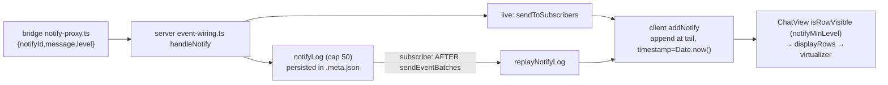

## Context

Notify path today (change `split-notify-from-prompt-request`, level gate `gate-notify-rows-by-level`):

Facts the design rests on (verified in source):

- Bridge-forwarded transcript rows carry `timestamp` = the bridge's `Date.now()` at emit (`event-forwarder.ts`, `event.timestamp`, epoch ms). These are most rows, but not all. `addInteractiveRequest`/`addNotify` rows and `historyGap` dividers use the **client** clock, and some server-synthesized events (`stats_update`, `command_feedback`) use the **server** clock. `messages` order is insertion order and is not guaranteed to be timestamp-sorted.
- `replayNotifyLog` runs after `sendEventBatches` completes at all four replay sites in `subscription-handler.ts`, so on replay the transcript rows are already in `messages` when the notify rows arrive. The branches that emit a terminal `event_replay` without a store (`hydrationSource === "none"`) do not replay the notify log. That gap exists today and is out of scope.
- `addNotify` is shared by `useMessageHandler` and `useSessionState` (embed).
- `ChatView` filters hidden rows into `displayRows` (the exact list the virtualizer counts, CR-5) and already runs render-time dedup helpers (`collapse-retried-errors.ts` returns id sets that the render branch consults). No existing pass collapses rows inside `displayRows`, so D3 is new there and is pinned by a chat-view delta.
- `NotifyRenderer` receives only `InteractiveRendererProps` (`params`, …). It renders `params.message`, falling back to `params.title` for rows reduced from a legacy `prompt_request`.
- History backfill splices each older segment at the `historyGap` divider (`useMessageHandler.ts`, `at + 1`). The divider sits at the head→tail boundary: leading in a tail-only window, mid-list in a head-tail window.
- `reorderToolCardsForAssistantMessage` treats `interactiveUi` as a trailing role. Within the open turn's suffix it re-tails unclaimed trailing rows at `message_end`.

## Goals / Non-Goals

**Goals:**
- A replayed notify renders where, and with the time at which, it originally arrived.
- A run of identical adjacent notifies costs one row, and the count stays visible.
- Additive and backward compatible in every client/server/bridge version pairing.

**Non-Goals:**
- Collapsing non-adjacent repeats, or fuzzy/number-normalized matching (the user chose exact text + adjacency).
- Rate-limiting or dropping notifies server-side (the log cap stays 50; nothing is discarded).
- Fixing noisy extensions upstream (pi-blackhole's per-run warning is tracked separately).
- Replaying the notify log on the no-store `event_replay` branches (a pre-existing gap).
- Changing `reorderToolCardsForAssistantMessage`.
- A user preference to disable the collapse.

## Decisions

### D1 — `ts` is stamped by the bridge, validated and backfilled by the server

The bridge sets `ts: Date.now()` in `createNotifyProxy`. `handleNotify` is the single place where the server logs a notify, so the validate-or-stamp rule lives there. It also covers server-created notifies (e.g. the out-of-folder OpenSpec notice at `event-wiring.ts`), which are built without `ts`. That is the clock of the bridge-forwarded transcript rows a notify is ordered against, so ordering stays right for remote bridges whose clock differs from the server's. The server accepts `ts` only when `typeof ts === "number" && Number.isFinite(ts) && ts > 0`. Otherwise it stamps `Date.now()` at receipt. That covers an old bridge, the legacy `prompt_request` path (`fromLegacyPromptRequest`) and garbage values. Every entry the server logs from here on carries `ts`. `ts` stays optional only for entries persisted before this change.

*Alternative:* server-only stamping. It needs no extension change, but for remote sessions it orders a server-clock value against bridge-clock rows. Rejected because the bridge edit is one line. The server fallback keeps that skew only for old bridges (see Risks).

### D2 — Chronological insert helper

A pure `insertByTs(messages, row, ts)` in `event-reducer.ts`:

1. Scan `messages` **from the end, in array order**, skipping `historyGap` rows (a divider carries a client timestamp and is never an anchor). Stop at the first row whose `timestamp <= ts`.
2. Found → insert immediately after that row. On equal timestamps the existing row stays first.
3. Not found → insert immediately before the first non-`historyGap` row, i.e. right after a leading divider, or at index 0 when there is no divider. When there is no non-`historyGap` row at all (e.g. `[historyGap]`), append.

Because the scan is by array order, the result is well defined even when `messages` is not perfectly sorted: the row goes after the latest-positioned row that is not newer than it. A live notify is usually the newest, so step 1 stops at the tail. The pre-existing `notifyId` dedup check stays linear.

`addNotify(state, notifyId, message, level?, ts?)`:
- `ui-<notifyId>` already present → return `state` (unchanged dedup).
- `ts` absent → today's behaviour: append with `timestamp: Date.now()`.
- `ts` present → `timestamp: ts`, placed via `insertByTs`. The row's `params` also carry `ts`, so later re-seating (D5) can recognise a time-placed row.

### D3 — Collapse is a pure render-time pass over `displayRows`

New `collapseRepeatedNotifies(rows)` in `lib/chat/collapse-repeated-notifies.ts`. `ChatView` calls it **inside the existing `displayRows` memo**, as its final step, on both return paths (normal and frozen-tail). It is not a separate downstream list. Every index-keyed consumer therefore reads one array: virtualizer `count`, `rowTextChars`/`estimateSize`, `buildTurnToFirstRowIndex`, the selection-span refs and `prevRowCountRef`, anchor `findIndex`, and the render lookup `displayRows[vi.index]`. This preserves the CR-5 invariant. A chat-view delta amends the `displayRows` derivation sentence accordingly.

- **Match key** = normalized level (`normalizeNotifyLevel`) + *rendered text*. The rendered text comes from a helper shared with `NotifyRenderer`: `params.message` when it is a string, else `params.title` when it is a string, else `""`. Two legacy rows with different titles therefore never collapse. A row with empty rendered text never joins a run, because `NotifyRenderer` renders nothing for it and so could not show a count.
- A *run* is ≥2 consecutive display rows that are all notify rows (`role:"interactiveUi"`, `content:"notify"`, `args.method:"notify"`) with equal match keys. Any other display row breaks the run: a burst or group item, a message, or a notify with a different key. Rows hidden by `notifyMinLevel` or prefs are already absent from `displayRows`, so they don't break a run.
- **Output:** the run becomes a **new shallow-cloned** first member whose `args.params` gains `repeat: { count, firstTs, lastTs }` (member `timestamp`s). The original `ChatMessage` objects are never mutated. The clone keeps the first member's `id`, so `virtualRowKey` stays stable while a live run grows.
- The annotation travels in `params`, the only field `NotifyRenderer` receives. `InteractiveRendererProps` is unchanged.

*Alternative:* merge in the reducer (bump a counter on the last row). Rejected. It changes state semantics, the embed reducer would need the same logic twice, and the result would depend on arrival order, which differs between live delivery and replay.

### D4 — Rendering the count

`NotifyRenderer` reads `params.repeat`. When `count > 1` it adds a text badge `×N` and the first–last time range inside the existing `InlineMessage` (level icon, word and accent unchanged). The badge carries an accessible label such as "Repeated 10 times, 17:27–18:57", so the repeat is conveyed as text, not colour. Chat rows have no shared time formatter today, so the time range uses `Intl.DateTimeFormat(<active UI language>, { hour: "2-digit", minute: "2-digit" })`, adding a short date only when first and last fall on different calendar days. Without `repeat`, or with `count === 1`, the output is identical to today.

i18n follows the repo's actual mechanism. The `en` catalog is intentionally empty; English lives in the `t(key, vars, fallback)` call-site fallback. New keys are hand-added to the `zhCN` literal in `i18n.tsx` **and** to `huCatalog` in `i18n-hu.ts`. `scripts/i18n-parity.mjs` checks only that the two catalogs agree, and a key missing from both passes, so a test asserts the new keys resolve in both languages.

### D5 — Re-seat time-placed notifies after a history-backfill splice

After a backfill segment is spliced at the divider, the splice site in `useMessageHandler.ts` (the embed reducer has no backfill path) removes every notify row whose `params.ts` is a number and re-inserts each one via `insertByTs` in ascending `ts` order. Backfill is user-initiated and rare, so an O(n) pass per splice is acceptable. After re-seating, a notify older than the previously loaded window moves below backfilled rows that are older than it. In a head-tail window, a notify whose `ts` falls in the elided middle sits at the head→tail boundary: D2 places it after the last older head row, and the divider is not an anchor. Later splices move it into the correct spot.

## Risks / Trade-offs

- **Mixed clocks in `messages`.** Client-stamped rows (pending asks, other time-less notifies) and server-synthesized rows can differ from the bridge clock, so a remote-bridge notify may be misplaced relative to *those* rows. Accepted. Bridge-forwarded rows, the majority, share the notify's clock, and local bridges share one clock anyway.
- **Old bridges and legacy `prompt_request` get server receipt time.** For a remote bridge with a skewed clock the offset can be minutes, not milliseconds. Accepted as degraded but still better than today, where the row goes to the tail stamped with the client's time.
- **Mixed-provenance log right after rollout.** A pre-change entry without `ts` is appended at the tail, and a later ts-bearing entry is then inserted *above* it, so the two can appear inverted. This is one-time and ends once pre-change entries age out of the 50-entry cap. Accepted.
- **Live vs. replay offset inside one assistant turn.** On the live path, a notify that arrives mid-turn is appended. `reorderToolCardsForAssistantMessage` then re-tails unclaimed `interactiveUi` rows to the end of that turn's suffix at `message_end`, after the turn's tool cards. On replay the same notify is placed by `ts`, which can fall between those tool cards. So a refresh can shift a notify *within its own assistant turn*, never across turns and never to the transcript end. Accepted: the replay position is the chronologically faithful one, and changing the reorder helper is a Non-Goal. The spec states the guarantee at turn granularity.
- **Array disorder.** `insertByTs` scans by array position, so where `messages` itself is out of timestamp order (mixed clocks, compaction-boundary replays, rows pending a backfill re-seat), a notify can land below a row with a newer timestamp. Accepted: the rule is deterministic, it never does worse than today's tail append, and bridge-clock rows are in order in practice.
- **Copy of a collapsed row** copies one message plus the badge text, not N copies. Accepted: the badge states the count, and state keeps every row.
- **Selection retention** stores display-row indices and remaps only on history splices. The collapse *reduces* churn: a growing run no longer changes `displayRows.length`. A chronological insert above an active selection only happens on replay, when there is no live selection. No new risk.

## Migration Plan

None. The fields are additive and optional, and persisted logs without `ts` keep today's behaviour. Rollout order doesn't matter: bridge (`npm run reload`), server (`/api/restart`), client (build + restart). Rollback = revert; an older reader ignores the extra `ts` JSON key.

## Open Questions

None.
