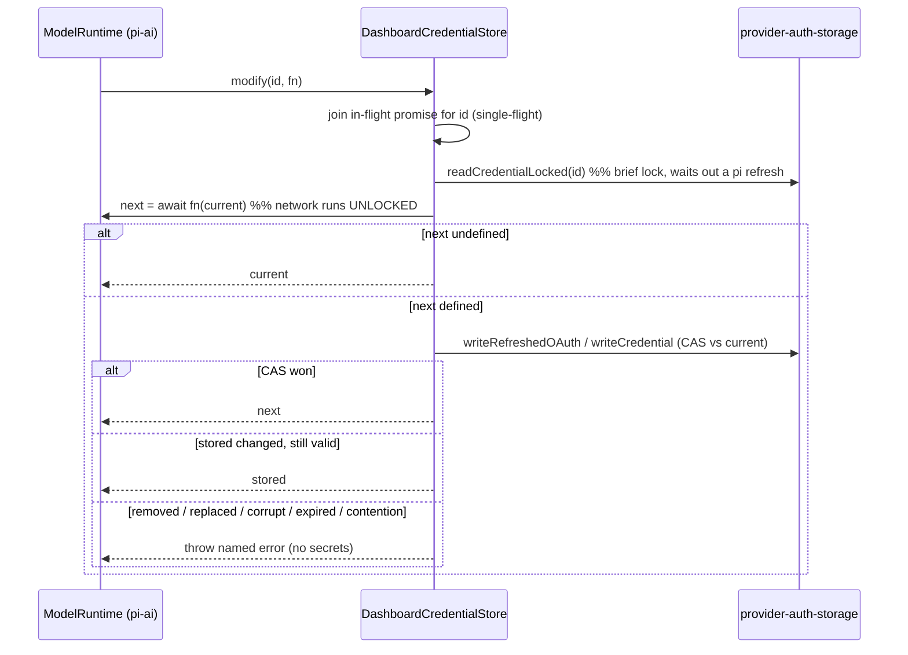

## Context

- Two runtimes today (see proposal.md, Why). The parallel stack exists because, before 0.99, the dashboard had to straddle two pi-ai generations and pi's `ModelRuntime` had no injectable store fit for a shared `auth.json`.
- pi-ai 0.99 `ModelRuntime.create({ credentials?: CredentialStore, authPath, modelsPath, allowModelNetwork, refreshOnCreate, ... })`. `CredentialStore` = `read / list / modify(id, fn) / delete`.
- pi-ai OAuth refresh (`auth/resolve.js` `resolveStoredOAuth`) = double-checked locking: `store.modify(id, async current => expiresSoon(current) ? await oauth.refresh(current, signal /*15s*/) : undefined)`. With pi's own `FileAuthStorageBackend`, that holds the `proper-lockfile` lock across the network call and writes with a plain in-place `writeFileSync` (no temp-file rename, no quarantine).
- The dashboard's `provider-auth-storage.ts` already has the primitives: `LOCK_OPTIONS` (`stale 30s`, `realpath:false`, pinned to pi's), `readCredentialLocked` (bounded locked read that waits out a pi refresh), `writeRefreshedOAuth` (CAS persist), `writeCredential` / `removeCredential` (type-conflict refusal), and atomic write + quarantine in `locked-json-file.ts`.

## Goals / Non-Goals

**Goals:** one runtime; delete `piai-compat` and the registry/refresh re-implementation; keep every existing `model-proxy-credential-routing` guarantee.

**Non-Goals:** moving dashboard login flows (`provider-auth-handlers`) to `runtime.login()`; any proxy HTTP contract change; roles as virtual models (would build on this runtime later).

## Decisions

### D1 — Inject `DashboardCredentialStore`; never pi's file store

- *Why CAS instead of pi's lock-held model:* the spec already requires "never hold the lock across the network" and lists every lost-race outcome. pi-ai's callback re-checks `expiresSoon(current)`, so running it on a snapshot and then validating with CAS is equivalent for refresh.
- *Why not pi's default store:* its plain in-place write and lack of quarantine regress two tested guarantees.
- `read` / `list` serve from a checked read (tolerant `{}` on corrupt content, as today). `delete` uses `removeCredential`.
- Non-refresh `modify` callers (runtime login, `setRuntimeApiKey`) go through the same path. Their callbacks ignore `current`, so CAS reduces to "write unless corrupt".

### D2 — Error surfacing
pi-ai wraps store errors (`ModelsError("auth", "Credential store modify failed for <id>", { cause })`). The proxy's error mapper SHALL unwrap `cause` to report the named outcome the spec requires. Pinned by the existing outcome tests.

### D3 — Custom providers via `registerProvider`
`registry-singleton.ts` today synthesizes api_key credentials for `providers.json` entries. Instead, map each entry to `runtime.registerProvider(id, { baseUrl, api, apiKey, models })`, fed by the existing `custom-provider-discovery.ts` (cached `/v1/models` listing). Re-register on `providers.json` change. Recursion guard stays in front.

### D4 — Catalogue freshness
Create with `refreshOnCreate: false`, `allowModelNetwork: false` (today's behavior: bundled catalogue + `models.json`, no network at boot). Let `runtime.refresh()` be triggered by the existing catalogue-refresh surfaces. Check whether `provider-catalogue-cache.ts` is then redundant with `getAllModels()` / `getProviderAuthStatus()`; delete it only if every consumer maps cleanly, otherwise leave it and record it as follow-up.

### D5 — Plugin model runtime
`PluginModelRuntime.getModelRegistry()` keeps its public shape; the backing becomes the runtime. Verify the `system-one-plugin` `llm-caller.ts` path end to end.

## Risks / Trade-offs

- [A future pi `modify` caller that is not idempotent on stale input] → contract test: a fake runtime calls `modify` with a non-idempotent callback, and the store must still never write a lost-race result. Re-audit pi-ai `.modify(` call sites on every bump (three in 0.99: `auth/resolve.js`, `models.js` ×2).
- [pi-ai changes `CredentialStore` again] → it is a public, typed interface; the store is ~100 LOC behind it.
- [Refresh dedupe hides a failing provider] → a single-flight shares the rejection with every waiter; nothing is cached after settle.
- [Cold-start cost of `ModelRuntime.create`] → already paid today by `provider-auth-registry.ts`; net zero.

## Migration Plan

1. Land `DashboardCredentialStore` + contract tests (the existing coordination scenarios, re-pointed).
2. Swap `registry-singleton.ts` to the runtime behind the unchanged `getModelRegistry()` interface; the proxy end-to-end suite stays green.
3. Merge `provider-auth-registry.ts` onto the same runtime.
4. Delete `piai-compat/` and the dead halves of `InternalRegistry` / `InternalAuthStorage`.

Rollback: revert; `auth.json` format is unchanged.
