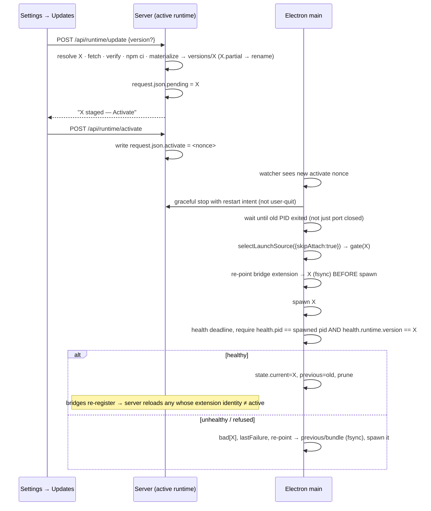

## Context

See proposal.md for motivation. Constraints that shape the approach today (checked against the code):

- `eliminate-electron-runtime-install` made `<resourcesPath>/server/` an immutable, fully installed bundle. Its only update path is `electron-updater`, which replaces the whole app. That decision said pi version bumps ride app releases. This change reverses that for users who opt in (see D1).
- `launch-source.ts` resolves `attach → devMonorepo → bundled`. Electron re-resolves the source only through `requestServerLaunch()` in `server-lifecycle.ts`. `/api/restart` re-spawns from `process.argv[1]`, the same entry, without re-resolving. `/api/electron/reextract` is a stub that returns 202, and nothing in Electron consumes it. **There is currently no path from server to Electron to "switch runtime".** D3 adds one.
- `bridge-register.ts` writes the bundled extension path (`resources/server/packages/extension`) into `~/.pi/agent/settings.json`. pi sessions load the bridge extension from that path.
- The client directory is resolved by `packages/server/src/lib/client-dist.ts`: `require.resolve("@blackbelt-technology/pi-dashboard-web/package.json")` → `dist/` first, with a workspace fallback to `packages/client/dist`. It therefore follows whichever `node_modules` the server runs from.
- First-party plugins are found by `discoverPlugins()`: monorepo `packages/`, `~/.pi/dashboard/plugins/`, and a walk-up from `loader.ts` to `resources/plugins/`. `bundle-server.mjs` copies the `BUNDLED_PLUGINS` list into `resources/plugins/` at build time. A plain `npm install` does not create that directory.
- All published workspace packages share one version. The meta package `@blackbelt-technology/pi-agent-dashboard` depends on `-server`, `-web`, `-extension` with **caret ranges**. The server depends on pi/openspec/tsx with **caret ranges**. So a plain `npm install` is not deterministic.
- Repo security convention (`system-routes.ts` accept-path review, the `never-trust-loopback` test): a loopback or proxy-terminated peer is never trusted for widening trust, because a tunnel (zrok) also shows up as loopback.
- `pi-core-updater.ts` provides `runExclusive`, progress WS events and npm execution with the bundled Node on PATH. `scripts/reload-all.sh` reloads sessions through the server's WS.

## Goals / Non-Goals

**Goals:**
- Update server + client + bridge extension + first-party plugins + pi/openspec/tsx together, deterministically, without an app release.
- Three sources (npm, GitHub, local link) plus `bundled`.
- A bad runtime can never stop the app from starting: the bundle is the last fallback.
- One activation path for every source, owned by Electron main.

**Non-Goals:**
- Updating the Electron shell or its bundled Node (`electron-updater`; `manage-node-runtime-updates`).
- Local snapshot mode.
- Third-party plugins/extensions, including recommended ones (they keep the pi-install path).
- Changing `devMonorepo`.
- Per-package in-place updates inside an overlay. The existing pi-core "Core" group stays hidden under Electron (see D10).
- Delta updates. Signing runtime assets (see Risks).

## Decisions

### D1. Unit of update = locked runtime release X

A runtime release is fully described by a **runtime lockfile** (`runtime-lock.json`, npm lockfile v3) that the release pipeline generates and ships **inside the `@blackbelt-technology/pi-dashboard-server@X` npm package** as a plain file. It is not `npm-shrinkwrap.json`, so `npm i -g` for Standalone users is unaffected. The lock pins every package exactly: meta, server, web, extension, `dashboard-plugin-runtime`, every first-party plugin, and pi/openspec/tsx and all transitive dependencies.

- The first-party plugin set lives in `packages/server/package.json#piDashboard.bundledPlugins`. `bundle-server.mjs` reads that field too (one source of truth), and the release pipeline generates the lock from it.
- Consequence, stated openly: overlay users get the pi/openspec/tsx versions locked in release X, independent of the shell. This is the deliberate, opt-in reversal of the eliminate change's "pi rides app releases". Users on source `bundled` keep today's behaviour.
- Rejected: resolving at install time (not deterministic; defeats the lockstep check). Reusing the bundle's pi (version skew, and it needs module-resolution hacks).

### D2. Overlay layout

```
~/.pi/dashboard/runtime/
  request.json                  # SERVER-owned: source (bundled|npm|github), sourceEpoch (uuid), sourceSeq (int ≥1), channel, pin, pending, activateNonce
  state.json                    # ELECTRON-owned: localPath, localBinding{epoch,seq}, current, previous, bad{id:{reason,snapshot}}, attempts{id:n}, handledNonce, lastFailure
  versions/<X>/
    package.json                # synthetic root, deps = lock roots
    package-lock.json           # = runtime-lock.json of X
    node_modules/...            # npm ci result (server, web, extension, plugin packages, pi, …)
    resources/plugins/<id>/     # materialized first-party plugins (copies of node_modules/<pkg>)
    runtime-manifest.json       # { version, minShellVersion, nodeEngines, origin, integrity, piVersion }
```

- Server entry: `versions/X/node_modules/@blackbelt-technology/pi-dashboard-server/src/cli.ts`. Client: resolved by `client-dist.ts` through `node_modules/@blackbelt-technology/pi-dashboard-web`, with no special case. Bridge extension: `versions/X/node_modules/@blackbelt-technology/pi-dashboard-extension`.
- Plugins: `findBundledPluginsDir()` walks up from `versions/X/node_modules/@blackbelt-technology/dashboard-plugin-runtime/...` and reaches `versions/X/resources/plugins/`. **The materialize step** copies each `bundledPlugins` package there, exactly as `bundle-server.mjs` does. The logic is extracted into one shared helper used by both.
- **One writer per file.** The server only writes `request.json`. Electron only writes `state.json`. Each write is atomic (tmp + rename, with a Windows EPERM retry). A missing or corrupt file means defaults (`source: bundled`, empty state) and never throws in the resolver.
- **Runtime identity** `id` is `X` for overlays, `local:<realpath>` for a linked folder and `bundled` for the bundle. `current`, `previous`, `bad` and `attempts` are keyed by `id`, so local links get the same gate, commit and rollback as overlays. For local, the git SHA + dirty flag are a **snapshot** stored alongside (in `bad[id].snapshot` and the health/UI identity). They are informational and not part of the key.
- **Clearing `bad`.** An explicit user action on an `id` clears its `bad` entry and its `attempts`: Update/Activate of X in Settings, or re-picking or re-selecting a local folder from the app menu. Automatic paths (cold start, pending retry) never clear it. A fixed checkout is therefore retried as soon as the user re-selects it, and a broken one is never retried in a loop.
- **Effective source (fail-closed).** Neither process writes it; it is derived. `local` only if `state.localPath` is set **and** `state.localBinding` deep-equals `{epoch: request.sourceEpoch, seq: request.sourceSeq}` with both values present and valid (uuid, integer ≥ 1); otherwise `request.source`.
  - The server creates `request.json` with a fresh random `sourceEpoch` and `sourceSeq = 1`, and increments `sourceSeq` on every source selection in Settings. That turns local off.
  - The app-menu pick binds to the current `{epoch, seq}`. If `request.json` is missing or unparsable at pick time, the pick is **refused** with an error and nothing is bound.
  - A reset or recreated file gets a new epoch and cannot match. A missing, corrupt or legacy file (no epoch) has no valid values and cannot match. So local can only ever turn **off** without a menu action. No clock is involved, so NTP steps don't matter.
  - Writers of either file MUST preserve keys they don't recognise (forward compatibility across runtime versions).
- **Request handling without cross-writes.** Electron never clears `request.json`. A `pending` X counts as handled once `state.current === X` or `X ∈ bad`. An `activateNonce` counts as consumed once it equals `state.handledNonce`. `attempts[X]` is incremented only when a spawn of X starts and has not yet been committed, so a committed X is never retried or marked bad because of a stale `pending`.

### D3. Activation transport (new)



- **Explicit user steps.** The checker (24 h cache, plus a manual "Check now") only **notifies**: a badge plus the Settings row "X available". Staging (Update) and activation (Activate) are separate, explicit user actions. Nothing stages or activates automatically.
- **Old-server exit deadline.** `SWITCH_OLD_EXIT_DEADLINE_MS = 60_000`. If the old PID has not exited by then, the switch aborts (D3 "Environmental spawn failures").
- Electron main watches `request.json` (`fs.watchFile`, 2 s polling; robust on every OS and network home directory). Only a changed `activate` nonce triggers a switch. Source/channel edits alone do nothing until activation.
- **Local link uses the same flow.** Choosing "Runtime → Use local folder…" or "Stop using local folder" in the app menu calls the same in-process `switchRuntime()` directly (no nonce needed, since Electron is the caller). A linked checkout is therefore gated, health-checked, committed as `local:<realpath>` or rolled back, and D8 applies to it too.
- `/api/restart` under Electron keeps its current meaning (re-spawn the same entry). For local link that is the edit → restart loop, since the same path is re-spawned with new code. It never switches runtimes.
- App launch goes through the same `selectLaunchSource`, so an unhandled `pending` X also activates on a cold start.
- **New primitive `switchRuntime()`** in `server-lifecycle.ts`. It is NOT `requestServerLaunch({force})`, which waits for the port rather than the PID and attaches first. It does not touch the global graceful flag. Instead the watchdog gains **PID-scoped ownership**:
  - `expectExit(pid)`: a planned stop. The watchdog treats that PID's exit as graceful, and the entry is removed when the PID exits or the switch aborts.
  - `claimCandidate(pid)`: until commit or rollback, a candidate's exit is handled by `switchRuntime()` (rollback), not by the watchdog, so there is no double handling.
  - At commit, the claim is released and the committed PID becomes watchdog-owned like any spawn.
  - Every path (commit, rollback, abort) ends in a `finally` that clears both sets. The existing `setGracefulShutdownInProgress` / `quit()` semantics are unchanged, so a crash of the surviving or committed runtime always reaches the watchdog.
- **Which PID to wait for.** `switchRuntime()` probes `/api/health` at the start and waits for **that** `pid` (falling back to `storedSpawnedPid` only if health does not answer), plus the port being free. `/api/restart` re-spawns through a detached orchestrator, so `storedSpawnedPid` can be stale. The live health PID is authoritative.
- **Environmental spawn failures don't poison.** A candidate that fails with port-in-use or while the old PID is still alive aborts the switch (old runtime stays current, nothing marked bad). Only a candidate that started and then failed its own health gate is marked bad.
- **No false commits.** Activation never attaches. The resolver gets a `skipAttach` option. Stop waits for the old server **PID** to exit, with the deadline extended past `/api/shutdown`'s tunnel teardown. The health gate accepts only a server whose `pid` equals the spawned child and whose `runtime.version`/`origin` equals the candidate. If the old server refuses to exit, activation is aborted and the old runtime stays current. The fallback does the same, so it never commits a server it did not spawn.
- **Stop intent.** Activation stops the server with the force-relaunch/restart shutdown intent (sessions re-attach), not `USER_QUIT_SHUTDOWN_INIT`.
- **Deadlines.** `getServerReadyDeadlineMs` maps `localLink` → `SERVER_READY_DEADLINE_DEV_MS` (60 s: the same TS checkout cold boot as `devMonorepo`) and `overlay` → the bundled 15 s (the same installed-tree shape as the bundle).
- `/api/electron/reextract` stays as it is. This change does not depend on it.

### D4. Launch-source precedence

`attach → devMonorepo → localLink → overlay(pending|current) → bundled`. `localLink` requires effective source `local` (D2). `overlay` requires effective source `npm` or `github`. Activation calls the resolver with `skipAttach`. A candidate that fails its gate falls through and records `lastFailure`. The `DASHBOARD_PREFER_SOURCE` pinned semantics are unchanged. `devMonorepo` stays first.

### D5. Sources

| Source | Resolve X | Fetch | Integrity |
|---|---|---|---|
| npm | `npm view @blackbelt-technology/pi-dashboard-server dist-tags` (`latest` / `beta`) or the pin | `npm pack` the server@X → extract `runtime-lock.json` → write synthetic `package.json` + lock → `npm ci --omit=dev` with the bundled Node/npm, honouring `.npmrc` | npm `integrity` per locked package |
| github | Releases API: latest non-prerelease / latest prerelease / tag `vX` | Download the runtime asset (a tree installed from the same lock) + `.sha512` | sha512 before extraction |
| local | none (id = `local:<realpath>`; git SHA + dirty flag as snapshot) | none: link in place | none: trust decision (D7) |

After install, a **lockstep check** requires every `@blackbelt-technology/*` package in the tree to be at exactly X, otherwise staging fails. The UI never accepts free-form package specs; names come from a fixed allowlist. The release pipeline MUST publish prereleases under the npm `beta` dist-tag and as GitHub prereleases.

### D6. Compatibility gate + preflight (Electron, before spawn)

- `runtime-manifest.minShellVersion <= app.getVersion()`.
- The shell's bundled Node version satisfies `runtime-manifest.nodeEngines` (the server's `engines.node` range). node-pty 1.x is N-API, so this is a range check rather than an equality check. A shell Node bump that leaves the range sends the user back to bundled, with the reason shown.
- Files exist: server `cli.ts`, `pi-dashboard-web/dist/index.html` (via the same resolution as `client-dist.ts`), extension entry, `resources/plugins/`.
- Local link: `packages/server/src/cli.ts`, `packages/client/dist/index.html`, `packages/extension`, `node_modules`. The Node check uses the outcome of spike 1.2.

### D7. Local link: Electron-only trust boundary

The local path is set **only** from the Electron app menu, "Runtime → Use local folder…", with a native folder picker, and written by Electron to `state.json`. The server has **no** route that sets a local source or path. `/api/runtime/*` shows the local source read-only, and Settings shows "Set from the app menu". This avoids trusting loopback (consistent with the repo convention) and exposes no new renderer IPC. The path is stored as a realpath and must contain `packages/server/src/cli.ts`. "Runtime → Stop using local folder" clears it, and so does choosing another source in Settings (an incremented `sourceSeq`, see D2).

### D8. Bridge extension + session reload

**Before spawning** any runtime (candidate, rollback target or bundle fallback), Electron registers that runtime's extension path, durably written, so a bridge that reloads at any point after the spawn reads the matching extension. It registers it through the shared helper behind `registerBridgeExtension` (the same helper the `switch-extension-source` **skill** uses). `settings.json#packages[]` then holds exactly one dashboard-extension entry. Session reload is **convergent, not a one-shot broadcast**:
- Each bridge reports its extension identity (resolved package dir + version) when it registers.
- The server knows the active runtime's extension identity, passed by Electron at spawn through an env var.
- On every bridge register or re-register, if the bridge's identity differs from the active one, the server sends that session `/reload`. This is the same message `scripts/reload-all.sh` sends over `/ws`.
- Guard: at most one reload per session per active runtime id, so a failed re-point cannot cause a reload loop. A mismatch that persists after the one reload shows up in the Doctor row.

Bridges that reconnect late (after `SHUTDOWN_QUIESCE_MS`) converge when they register. No Electron → server reload call and no WS client in main are needed. Mid-run sessions get the existing `/reload` behaviour.

### D9. Retention and disk

Keep `current` + `previous`. Prune other `versions/*` after commit. Staging uses `X.partial/` and is renamed on success. Peak disk is about 3× the runtime size during staging (partial + current + previous), 2× at steady state.

### D10. `/api/health.runtime` and UI gates

`{ origin: "bundled"|"overlay"|"local"|"devMonorepo"|"npmGlobal", version, updatable, source?, channel?, gitSha?, dirty?, lastFailure? }`. `updatable` means "runtime overlay updates available": true only for the Electron starter with origin ≠ `devMonorepo`. It is false for Standalone and Bridge.

`updatable` drives **only** the new Settings → Updates section and the runtime update badge. The existing gates (`UnifiedPackagesSection` Core group, the `App.tsx` pi-core badge, `PiRuntimeSection`) are **not** migrated. They express "per-package in-place pi-core update" and stay hidden under Electron, because an overlay is replaced as a whole. `add-bundle-immutable-health-flag` therefore stays valid and is not superseded: its `bundleImmutable` concept (no in-place package mutation) is orthogonal. `/api/runtime/*` mutating routes return 403 unless the starter is Electron (the same pattern as `reextract`), so Standalone and Bridge are unaffected.

## Risks / Trade-offs

- [GitHub `.sha512` sits on the same release as the asset: integrity only, not authenticity] → Accepted. It is the same trust level as `electron-updater`'s `latest*.yml` and npm registry integrity. Signing is a follow-up.
- [Overlay passes health but misbehaves later] → manual "Roll back" and "Use bundled"; Doctor row.
- [Re-pointing global `settings.json` also affects pi sessions started outside Electron] → same as today's bundle registration; reverted on rollback.
- [`fs.watchFile` polling delay] → at most 2 s before activation; acceptable.
- [Crash between pending and commit] → retry once, then mark bad.
- [pi version now differs between overlay and bundle] → shown in the UI and the Doctor row (`piVersion` from the manifest).
- [Beta dist-tag not maintained] → release-pipeline task plus CI assertion.
- [User-installed third-party plugins in `~/.pi/dashboard/plugins/` load into any overlay; the plugin-runtime API may drift faster now] → Accepted. Third-party plugins are a non-goal; this exposure already exists at app-release cadence. Plugin load failures already surface through `/api/health.plugins[]`.

## Migration Plan

1. Ship with default `source: bundled`. No behaviour change.
2. The release pipeline starts publishing `runtime-lock.json` inside the server package, plus runtime assets. Older shells ignore them.
3. Rollback of the feature: pick "Use bundled" or delete `~/.pi/dashboard/runtime/`. On the next launch the bundled runtime runs and the bundled extension is re-registered.

## Open Questions

1. **GitHub asset shape** (spike 1.1 → moved to change `electron-runtime-release-pipeline`): one platform-independent tree vs one per platform. It depends on whether every native dependency in the lock ships prebuilds for all six platform/arch combinations. D5 is unchanged either way; only the asset-name lookup differs.
   - **Interim decision (spike deferred, needs linux-x64 + win32-x64 hosts):** assume **one asset per platform/arch** (`pi-dashboard-runtime-<X>-<platform>-<arch>.tgz` + `.sha512`). Conservative: correct whatever the spike finds; collapsing to one asset later is a lookup change only.
2. **Local-link Node** (spike 1.2): whether a pnpm checkout runs under the shell's bundled Node. The outcome only changes the D6 local preflight rule (refuse on mismatch vs allow system Node).
   - **Interim decision (spike deferred):** **preflight refuses on mismatch.** A linked checkout always runs under the shell's bundled Node (never system Node); it is refused with `node_engines <range>` when that Node falls outside the checkout's root `package.json#engines.node`. Implemented in `packages/shared/src/runtime-overlay/compat.ts`. Relaxing to "may use system Node" stays possible once the spike runs.
