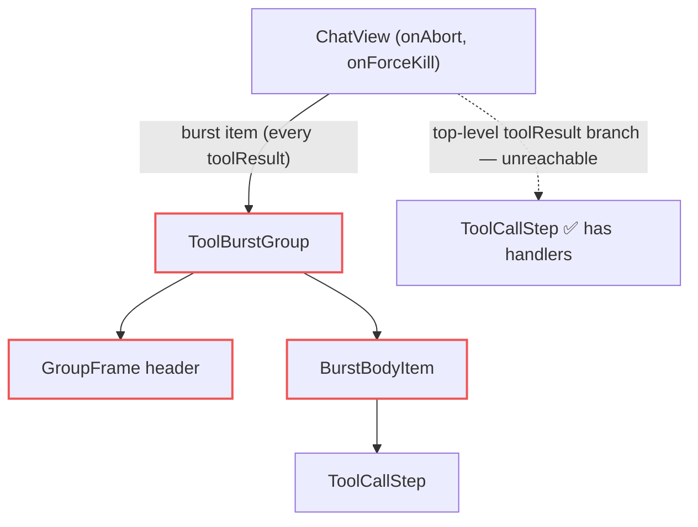

## Context

- `groupToolBursts` wraps every `toolResult` run (threshold 1); only a lone `×N` group renders bare via `CollapsedToolGroup`, and `×N` never holds `running`/`elided` members (`group-tool-calls.ts`).
- `ToolCallStep` owns the Stop UI today: local `stopState: "idle" | "aborting" | "killing"`, reset when `status !== "running"`; `` controls nested INSIDE the header `<button>`, relying on `stopPropagation`; escalates to `aborting` only `if (onForceKill)`; renders nothing in `killing`.
- The composer (`CommandInput`) uses the same immediate idle→aborting escalation (no timer), real `<button>`s, `min-w/h-[44px]`, `aria-label`, i18n `command.forceStop` / `command.killing`. (`play-stop-controls` spec describes a 3 s grace the composer does not implement — pre-existing drift, out of scope.)
- `ToolBurstGroup` renders its body only when `expanded` → anything mounted in the body loses local state on collapse.
- `App.tsx` passes `handleAbort` (`abort` + clears optimistic `pendingPrompt`) / `handleForceKill` (`force_kill` + same clear) to `ChatView`.

## Goals / Non-Goals

**Goals:** Stop reachable from the chat view for any *visible* running tool, collapsed or expanded; one stop state per burst shared by header + rows; real accessible buttons; 44 px mobile targets.

**Non-Goals:** reconciling `play-stop-controls`' 3 s grace wording (the new control deliberately matches the composer's shipped immediate escalation; stated in the ADDED requirement); per-toolCall abort (wire stays session-scoped); a grace-period escalation (match the composer's immediate escalation); stop for a running tool whose kind is hidden by display prefs (no visible member → no header, by existing design); changes to `CollapsedToolGroup`, session card, server, extension; extending the burst's visibility gate beyond the per-tool-kind pref (bursts already bypass `hiddenToolResultIds`; a Stop shown next to a running interactive tool still aborts the turn correctly).

## Decisions

1. **Hook + presentational control** in `components/chat/ToolStopControl.tsx`:
   - `useToolStopState({ active, onAbort, onForceKill }) → StopController | null` — owns `state`, resets to `idle` when `active` goes false; returns `null` unless `active && onAbort` (same rule as today's `ToolCallStep` + composer `canStop`; keeps `ToolCallStep.test.tsx` onAbort-only case green). `stop()` sends abort and moves to `aborting` only when `onForceKill` exists (else stays `idle`, as today); `forceKill()` sends force_kill + `killing`. Each transition guards on current state → a double click cannot send twice.
   - **Rules of hooks:** the hook is ALWAYS called unconditionally at component top — in `ToolBurstGroup` BEFORE the `visibleMembers.length === 0` early return; in `ToolCallStep` as `useToolStopState({ active: status === "running" && !stopController, onAbort, onForceKill })`, rendering `stopController ?? own`.
   - `<ToolStopControl controller testIdPrefix compact />` — renders `null` for null controller; else one real `<button type="button">` per state: Stop (`tool-stop-button`), Force Stop (`tool-force-stop-button`), Killing (`disabled`, `tool-killing-button`). `aria-label` = `title`; i18n `common.stop` / `common.forceStopKillTheProcess` / `command.killing`, each call with an explicit English fallback (`command.killing` is absent from `i18n-en-source.json` → fallback `"Killing process..."`, as `CommandInput` does). Killing uses the real `disabled` attribute (matches `CommandInput`). Mobile (`useMobile`) → `min-w-[44px] min-h-[44px]`; desktop keeps compact `p-0.5` sizing. `testIdPrefix` default `tool`; header uses `tool-burst` (`tool-burst-stop-button` …).
   - *Alternative:* duplicate the state machine in `GroupFrame` → rejected (drift).
2. **Controls sit beside, not inside, the toggle button.** `GroupFrame` and `ToolCallStep` wrap the header in `
`: toggle `<button class="flex-1 min-w-0 …">` (unchanged content incl. chevron; keeps `data-testid="tool-burst-header"` — relied on by `ToolBurstGroup`, `CustomEntryAbsorption`, `ChatView` tests) + stop control sibling. Valid HTML (no interactive-in-button), keyboard reachable, clicks never bubble into the toggle (fixes the Killing click-through). Live-command text already truncates (`max-w-[240px]` + `truncate`); `min-w-0` lets it shrink at 320 px.
3. **Burst owns the state.** `ToolBurstGroup` props gain `onAbort?`, `onForceKill?`; it calls `useToolStopState({ active: isRunning, … })` once, renders `<ToolStopControl controller … />` in `GroupFrame`'s new `stopSlot`, and passes the same `controller` to `BurstBodyItem` → `ToolCallStep` (new optional prop `stopController`) only for rows with `toolStatus === "running"`. Rows render the controller instead of creating their own → header and rows can never disagree, and state survives body collapse/re-expand (it lives in `ToolBurstGroup`, which stays mounted while its body toggles; virtualizing the whole burst off-screen resets it — acceptable, the tool is still visibly running on return).
4. **Standalone `ToolCallStep`** (unreachable top-level branch; kept for safety and existing tests): when no `stopController` prop is given it calls `useToolStopState` from its own `onAbort`/`onForceKill` — same hook, same markup.
5. **`ChatView.tsx` burst branch** passes `onAbort` / `onForceKill` through. The custom-only vanish path (`visibleMembers.length === 0`) has no running visible member → no controller.

## Risks / Trade-offs

- [Row Stop reads as per-tool but aborts the whole turn] → accepted: identical to session-card Stop; tooltip stays "Stop" for consistency with the composer and `ToolCallStep`. Shared state makes the session-wide effect visible (header + all running rows escalate together).
- [`force_kill` after the session already died] → server replies `force_kill_result {success:false}`; client ignores it. The controller's state guard prevents a second send from the same burst; separate surfaces (composer, session card) can still send one each — harmless.
- [`ToolCallStep` header DOM restructure] → may affect layout snapshots; testids unchanged. Covered by existing `ToolCallStep.test.tsx` + visual check in manual QA.
- [`killing` is terminal while the tool runs] — the client has no `force_kill_result` handler, so a failed kill leaves the burst in disabled Killing until the tool stops. Known limitation, same as today's `ToolCallStep` and composer; recovery via composer / session card.
- [Sibling bursts] — each burst owns its own state; aborting from burst A leaves a concurrently-running burst B showing Stop. A second `abort` is idempotent.
- [Severity-literal guard coverage] — the red destructive-button literal moves from `ToolCallStep.tsx` to `ToolStopControl.tsx`; add the new file to `GOVERNED` in `scripts/__tests__/severity-literal-guard.test.mjs` and carry the `severity-exempt: destructive-action control` marker, else coverage silently drops.
- [Header crowding on narrow mobile] → control placed after the chevron as a sibling; title/meta shrink via `min-w-0`.

## Migration Plan

Client-only. `npm run build` + `curl -X POST http://localhost:8000/api/restart`. Rollback: revert commit, rebuild, restart. No persisted state touched.
