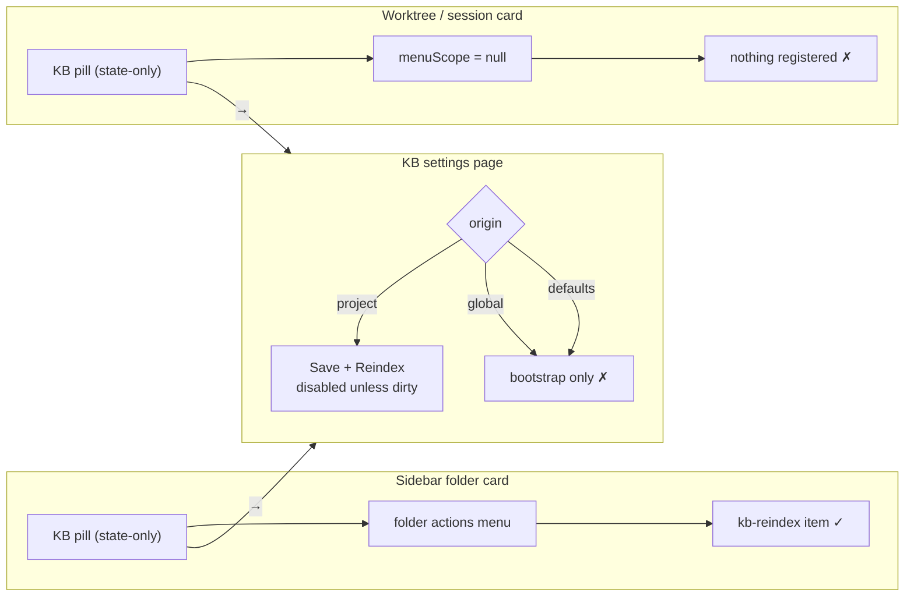

# Design — fix-kb-settings-reindex-gate

Follow-up to `openspec/changes/archive/2026-08-24-move-slot-actions-to-menu/design.md`
decision D-B ("only sections in the folder placement register"). D-B is correct and
survives. This change repairs the consequence D-B did not trace: the settings page it
implicitly nominated as the fallback path cannot actually trigger a reindex.

## Context

Reindex reachability today, by surface:

Both pills route to the panel. The panel is a dead end for a clean config.

## Goals / Non-Goals

**Goals**
- A user with a correct-but-stale KB config can rebuild it without editing the config.
- Every config origin that has usable `sources[]` offers that control.
- An origin with no usable `sources[]` explains why it cannot, instead of hiding the control.

**Non-Goals**
- Restoring a one-click reindex on the worktree card (see proposal Non-Goals).
- Any change to `SlotPill`, the folder actions menu, or `directory-card-layout`.
- Any server-side change.

## Decisions

### D1 — Gate on `sources.length`, not on `origin`

The footer currently branches on `isProject = origin === "project"`. That predicate
answers "is there a project config file?" but is being used to answer "can this
folder be indexed?". Those diverge for `origin === "global"`, which has real sources
and no reindex control.

The honest gate is the one `FolderKbSection`'s header comment already names:

> `Index now` over empty sources is a perpetual no-op

So the control is **rendered in both footer branches** and **disabled when
`edit.sources.length === 0`**, with a title explaining the reason.

| origin | sources | before | after |
|---|---|---|---|
| `project` | non-empty | `Save + Reindex`, disabled unless dirty | + `Reindex now`, enabled |
| `project` | empty | same | + `Reindex now`, disabled + reason |
| `global` | non-empty | no reindex control at all | + `Reindex now`, enabled |
| `defaults` | empty | no reindex control at all | + `Reindex now`, disabled + reason |

**Alternative rejected — gate on `isProject`.** Smaller diff, but leaves `global`
stranded and preserves the origin/sources conflation that caused the bug. It would
also make the panel's behaviour depend on a fact (which file the config came from)
the user has no reason to connect to whether a button works.

**Alternative rejected — hide when sources are empty.** Reproduces the original
defect in a new place: an invisible control is indistinguishable from a missing
feature. Disabled-with-a-reason is diagnosable; absent is not.

### D2 — `Reindex now` complements `Save + Reindex`; it does not replace it

Disabled condition is `saving || busy || sources.length === 0`, where
`busy = pending || stats?.indexing === true`. Deliberately **not** `!dirty`.

The two controls partition the form-state space rather than overlapping:

- **dirty** → `Save + Reindex` is the correct action (persist, then rebuild).
- **clean** → `Save + Reindex` is meaningless (nothing to save) and correctly stays
  disabled; `Reindex now` is the correct action.

`Reindex now` is left enabled while dirty as well. It is truthful — it rebuilds from
the config **on disk**, which is what the server will read regardless of unsaved form
state. Disabling it while dirty would re-introduce a state with no enabled rebuild
path the moment a user types a character and reconsiders.

### D3 — Reuse the already-mounted `useKbStats`; add no new state

`KbSettingsPanel.tsx:63` already calls `useKbStats(cwd)` and destructures only
`{ stats, refetch: refetchStats }`. The hook already returns
`{ stats, loading, error, reindexError, pending, reindex, refetch }`
(`useKbStats.ts:165`).

Everything this change needs is already built and hardened:

| capability | source | shipped by |
|---|---|---|
| optimistic `pending` on click | `useKbStats.ts:51,142` | `add-kb-index-optimistic-pending` |
| `REINDEX_GUARD_MS` = 4000 wedge guard | `useKbStats.ts:27,154` | `add-kb-index-optimistic-pending` |
| `MAX_POLL_MISSES` = 3 blip tolerance | `useKbStats.ts:21,118` | `fix-kb-index-feedback` |
| `reindexError` (trigger reject) vs `error` (poll outage) | `useKbStats.ts:32-35` | `fix-kb-index-feedback` |
| reset on unmount / cwd change | `useKbStats.ts:73` | `add-kb-index-optimistic-pending` |

So the panel inherits the double-submit guard and the no-flicker spinner for free.
Introducing a second, panel-local reindex path would fork that hardened behaviour and
is rejected.

`doSave(true)` keeps its existing `setTimeout(() => refetchStats(), 300)` hand-off
(`:157`) — it goes through the config `PUT`, not through `reindex()`, and is
unchanged by this design.

### D4 — This does not touch the retired pill clause

`move-slot-actions-to-menu` retired the *"each slot section SHALL keep its own …
secondary actions (refresh, create)"* clause of `directory-card-layout`, and asserts
tier 3 is state-only via tests `E1` (no focusable elements in the pill grid beyond
pill roots) and `E2` (no `mdiRefresh` inside a pill).

`KbSettingsPanel` renders on the `shell-overlay-route` `/folder/:encodedCwd/kb`. It is
not a pill, not inside the pill grid, and not a slot section. `E1`/`E2` are unaffected
and must stay green untouched — that is the regression check that this change is
genuinely orthogonal to `move-slot-actions-to-menu`, not a partial revert of it.

The glyph audit from that change still applies within the panel: `mdiRefresh` is
already used by `kb-save-reindex` (`:291`). Reusing it on a second button in the same
footer would give one glyph two meanings in one visual region. `Reindex now` therefore
takes `mdiDatabaseRefreshOutline` — the same glyph the folder menu item uses for the
same verb (`FolderKbSection.tsx:97`), which makes the two surfaces read as one action.

## Risks / Trade-offs

- **[Two rebuild-ish buttons in one footer could confuse]** → Mitigated by D2's
  partition: exactly one of them is enabled in the common cases, and their labels name
  the difference (`Save + Reindex` vs `Reindex now`). Accepted.
- **[A disabled button with an empty-sources reason is still a dead end for that
  folder]** → True, and correct: the fix for empty sources is `Create project config` /
  `Copy from parent repo`, which sit in the same footer. The disabled control points at
  them rather than pretending to work.
- **[Reindex-while-dirty rebuilds the on-disk config, not the form]** → Deliberate
  (D2). The label says `Reindex now`, not `Apply`. `Save + Reindex` remains the
  apply-then-rebuild path and is enabled in exactly that state.
- **[Reviewer may read this as re-adding a moved action]** → Addressed by D4 and the
  proposal's Non-Goals; `E1`/`E2` staying green is the objective evidence.

## Open Questions

None. D1 was resolved in favour of the `sources.length` gate before drafting.
