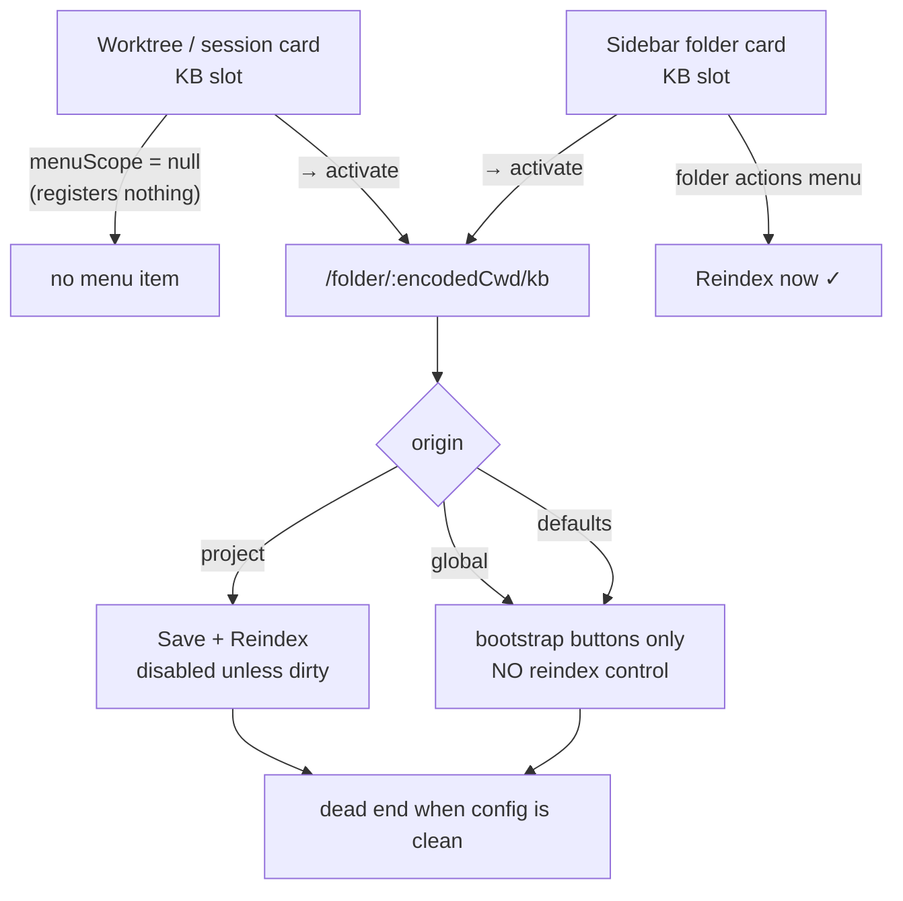

# Ungate reindex in the KB settings page — restore a reachable rebuild path

> A folder whose KB config is already correct cannot be reindexed from the
> settings page. The only enabled rebuild control is `Save + Reindex`, and it is
> disabled unless the form is dirty.

## Why

`move-slot-actions-to-menu` (archived `2026-08-24`, commit `680846f0b`) folded the
KB pill's three state-variant controls — `folder-kb-reindex` / `folder-kb-index-now`
/ `folder-kb-retry` — into one folder-actions-menu item. Its `design.md:43` correctly
observed that the worktree-card placement has no folder actions menu and therefore
must register nothing:

> A worktree card has no folder actions menu, so a card-placement section SHALL NOT
> register — otherwise its items land in a scope with nothing to render them.

`packages/kb-plugin/src/client/FolderKbSection.tsx:89` implements exactly that
(`const menuScope = placement === "card" ? null : cwd;`), and test `F4` locks it.

The reasoning is sound. The gap it leaves was never followed up: **the settings page
was assumed to be the escape hatch, and it is not one.**

`FolderKbSection.tsx`'s own header comment asserts the escape hatch exists:

> The `KB ·` label opens the per-folder settings page in EVERY state (via the `→`)
> — including `not-indexed` / `error` — so a fresh worktree can always reach
> Create-config / Copy-from-parent to define `sources[]`

It can reach *config bootstrap*. It cannot reach *reindex*. Two independent defects:

**1. The only reindex control is gated on `dirty`.**
`packages/kb-plugin/src/client/KbSettingsPanel.tsx:287` — `disabled={saving || !dirty}`
on `kb-save-reindex`. There is no standalone reindex button. A user whose config is
already correct — the common case for "my index went stale" — must dirty the form
with a throwaway edit (add an exclude chip, remove it, save) to trigger a rebuild.

**2. Two of the three config origins get no reindex control at all.**
The footer branches on `isProject = origin === "project"` (`:112`), but the server
returns three origins — `project`, `global`, `defaults`
(`packages/kb-plugin/src/server/__tests__/kb-routes.test.ts:296`). A folder resolving
its config from a **global** file has perfectly usable `sources[]` and still renders
only `Copy from parent repo` / `Create project config`. `isProject` is being read as
"has usable sources" when it means "has a project file".

Compounding both: the worktree/session-card KB slot (`placement: "card"`) has no
reindex path of its own by design, so it routes users to precisely this page.

## What Changes

Add a standalone **`Reindex now`** action to the KB settings footer, present in both
footer branches, gated on what actually makes a reindex meaningful — a non-empty
`sources[]` — rather than on form dirtiness or config origin.

The two footer actions become complementary rather than overlapping:

| form state | `Save + Reindex` | `Reindex now` |
|---|---|---|
| dirty | enabled — apply edits, then rebuild | n/a, `Save + Reindex` is correct here |
| clean | disabled | **enabled — rebuild from the saved config** |

`Reindex now` covers exactly the cell `Save + Reindex` leaves empty.

No new client state machine is introduced. `KbSettingsPanel` **already mounts**
`useKbStats(cwd)` (`:63`) and discards most of its return value; `useKbStats` already
exports `reindex`, `pending` and `reindexError` (`useKbStats.ts:165`) with the
optimistic-pending spinner, the `REINDEX_GUARD_MS` wedge guard, the
`MAX_POLL_MISSES` blip tolerance and the double-submit guard already hardened and
tested by `add-kb-index-optimistic-pending` and `fix-kb-index-feedback`. This change
wires an existing capability to a button.

## Impact

- `packages/kb-plugin/src/client/KbSettingsPanel.tsx` — destructure `reindex` /
  `pending` / `reindexError` from the already-mounted hook; add the footer action
  outside the `isProject` ternary; surface `reindexError` inline.
- `packages/kb-plugin/src/client/__tests__/` — new cases for the enable/disable
  matrix across origin × dirty × sources-empty.
- `openspec/specs/kb-folder-slot/spec.md` — `KB source management UI` gains reindex
  reachability scenarios.
- `packages/kb-plugin/src/client/AGENTS.md` — purpose row for `KbSettingsPanel.tsx`.

## Non-Goals

- **The card placement stays unregistered.** `menuScope = placement === "card" ? null
  : cwd` and test `F4` are deliberately untouched. This change makes the card's
  reindex path *reachable* (card → `→` → `Reindex now`, two clicks), not *equal* to
  the sidebar's one click. Giving the worktree card its own actions menu re-opens the
  question `move-slot-actions-to-menu` closed and belongs in its own change.
- **The pill stays state-only.** `directory-card-layout`'s retired "secondary
  actions" clause governs *slot pills*. The settings page is neither a pill nor a
  slot, so this adds no interactive element to any pill and does not re-litigate
  `move-slot-actions-to-menu`.
- No change to `POST /api/kb/reindex` or any server route.

## Discipline Skills

- `review-code` — a non-trivial client change landing before commit; the
  enable/disable matrix is the kind of conditional that regresses silently.
- `doubt-driven-review` — applies narrowly to D1 (gate on `sources.length` rather
  than `origin`), the one decision here that changes behaviour for a config origin
  nobody reported a bug against.

Not applicable, stated explicitly rather than omitted: `security-hardening` (no
auth, untrusted input, secrets or PII — the underlying route already enforces cwd
admission), `performance-optimization` (no latency or throughput budget; the reindex
job is already non-blocking and server-owned), `observability-instrumentation` (no
new endpoint, job or external call — the existing job registry already reports
state through `/api/kb/stats`), `systematic-debugging` (root cause is already
established by direct source reading, not inference).
