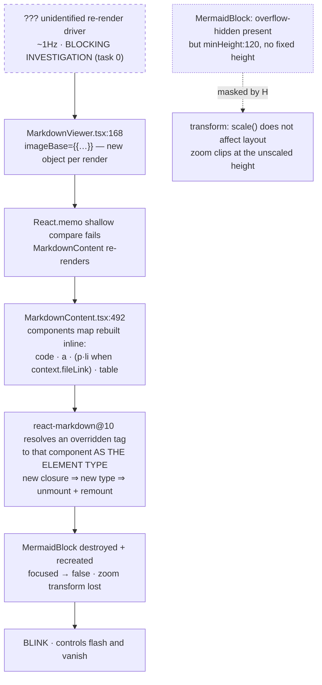

# Design

## Context

A user reported Mermaid diagrams blinking and zoom controls that vanish on
click. Measurement established a genuine remount (0 of 21 stamped DOM nodes
survived 20s). Source reading established the amplifier that turns any re-render
into a DOM teardown. The **trigger** for those re-renders is not yet known and is
deliberately not guessed here.

An earlier revision of this design placed a server-side `openspec_update`
broadcast storm at the top of that chain. It is gone: the de-duplication it
proposed already ships (`directory-service.ts` `pollAndBroadcastIfChanged`), is
already required by `openspec/specs/server-openspec-polling/spec.md`, and the
machine's `pollIntervalSeconds` is 300, which makes the observed frame rate
impossible to attribute to that tick. Node D is the highest link this change can
honestly claim.

## Goals / Non-Goals

**Goals**
- Identify the re-render driver by measurement before fixing anything.
- Zero remount waves and stable DOM-node identity on a static markdown file.
- Zoom/pan state survives application re-renders.
- Zooming reveals the diagram rather than clipping it.

**Non-Goals**
- No change to the zoom/pan *algorithm*, the click-to-activate focus model, the
  zoom bounds and clamping, the mermaid render queue, `_svgCache`/`_errorCache`,
  or `colorizeDefaultNodes`.
- No server change. The server half of the previous revision is withdrawn.
- No general React render-performance pass.

**Deliberately widened non-goal.** The previous revision froze `useZoomPan`
entirely. That is incompatible with the fitted-view requirement, because `reset`
and `onDoubleClick` hardcode `{scale: 1, translateX: 0, translateY: 0}` inside
the hook (`useZoomPan.ts:170-180`). D4 therefore permits an **additive** change
to `useZoomPan` — a new optional fit scale — with its existing tests updated.
Panning, wheel/pinch zoom and clamping remain untouched.

## Decisions

### D0 — Identify the re-render driver before writing any fix (BLOCKING)

The previous revision named a driver from code reading and was wrong on three
independent counts. The observed WebSocket frames are real but their source and
their causal link to the remount waves are both unestablished.

**Decision:** instrument first. Determine what re-renders `MarkdownContent` at
the observed rate, and whether the WS frames cause it at all. Nothing in D1–D5 is
authored until this resolves and is recorded.

**Deliberately open:** the driver may turn out to be client-local (an ancestor
remount, a changing `key`, a context provider) rather than event-driven at all.
The investigation must not start from the assumption that WebSocket traffic is
involved — that assumption is what produced the withdrawn revision.

**Consequence if the driver proves benign and unfixable:** D1 and D5 still stand
on their own. A stable `components` map is correct regardless of how often the
component renders; it converts an expensive teardown into a cheap update. D0
determines whether additional work is warranted, not whether D1 is.

### D1 — Hoist every override to a stable identity, including `p`/`li`

`react-markdown@10` resolves an overridden tag to the supplied component and uses
it as the element type (`hast-util-to-jsx-runtime`: `own.call(state.components,
name) ? state.components[name] : name`). Identity churn therefore remounts that
subtree. The real map (`MarkdownContent.tsx:492`) is:

| override | defined inline? | closes over | must hoist? |
|---|---|---|---|
| `code` | yes | `processedContent`, `syntaxStyle`, `context` | **yes** — handles **inline** (`:525`) *and* fenced |
| `p`, `li` | yes | `context` | **yes** — conditional spread gated on `context?.fileLink` (`:549-558`) |
| `a` | yes | loopback click handler | **yes** |
| `table` | yes (`:559`) | nothing | **yes** — identity churns regardless of capture |
| `img` | no | — | no — already module-scope `PiAssetImg` |

**Closure capture is not the criterion — identity is.** React compares element
*types*. An inline override that captures nothing is still a new function object
on every render, so it still forces a remount. An earlier revision of this design
excused `table` for capturing nothing; that was wrong, and would have left every
GFM table remounting while the mermaid symptom appeared fixed.

**Decision:** move `code`, `a`, `p`, `li` **and `table`** to module scope and
supply the per-render values through context, following the `ImageBaseContext`
pattern already present in the file rather than inventing a second mechanism.
`table` is the cheapest of these — it needs no context at all, only relocation.

**`p`/`li` are not optional.** They are gated on `context.fileLink`, which is
present in chat (`ChatView.tsx:329`, `:1983`, `ToolBurstGroup.tsx:311`) and
absent in the file viewer. Omitting them would leave chat — the surface the user
reported first — still remounting every paragraph and list item.

**The conditional spread must be preserved, not flattened.** `p`/`li` may only be
supplied when `context.fileLink` exists; supplying them unconditionally would
linkify with a missing renderer. Keep the gate, but make each branch yield a
stable object identity rather than a fresh literal.

**Rejected:** `useMemo(() => ({…}), [processedContent, syntaxStyle, context])`.
`processedContent` changes on every streaming token, so chat would still remount
per token — the worst case rather than the incidental one.

**Review hazard (for `review-code`):** hoisting can be made to "work" by
capturing a per-render value in a module-level binding, which would leak state
across every `MarkdownContent` on the page. Any module-level mutable binding
introduced by this change is a defect.

### D2 — Route `processedContent`, `syntaxStyle` and `context` through context, on separate providers

Hoisting removes closure access to values the overrides genuinely need:
`isFencedBlockComplete(processedContent, codeString)` decides the `complete` prop
that suppresses mid-stream parse-error flicker; `linkifyChildren(children,
context)` and `renderInlineString(codeString, context, "code")` need the
`ToolContext`. `table` needs nothing and is a pure relocation.

**Decision:** publish them on context — but **not** on `ImageBaseContext`.

That context is memoized on `[imageBase?.cwd, imageBase?.dir]` with an explicit
comment stating its purpose is to avoid re-rendering every image. Folding
`processedContent` (which changes per streaming token) into it would invalidate
it on every token and re-render every `PiAssetImg`, contradicting the decision
the file documents. Use a separate provider for the per-render values and leave
`ImageBaseContext`'s memo dependencies exactly as they are.

**Correction to the previous revision:** it listed `imageBaseValue` among the
closed-over values. No override closes over it — `img` is module-scope and reads
`useImageBase()` itself. It also omitted `context`, which is required.

### D3 — Stable `imageBase` at three call sites

`MarkdownViewer.tsx:168`, `MarkdownPreview.tsx:52` and
`FilePreviewOverlay.tsx:257` each pass a fresh object literal. `React.memo`
shallow-compares props, so the guard fails on that prop every render.
`MarkdownContent`'s internal `useMemo` on `[imageBase?.cwd, imageBase?.dir]`
protects the *context value*, but runs only after `React.memo` has already
admitted the render — it guards a different boundary.

**Decision:** memoise `imageBase` on `[cwd, path]` at each call site. Do not
change `MarkdownContent`'s prop shape; three one-line `useMemo`s are less
invasive than flattening the prop, and the existing internal memo documents the
intended identity contract.

### D4 — Fixed-height viewport, fitted initial view, additive `useZoomPan` fit scale

`specs/zoomable-mermaid/spec.md` already requires a fixed-height viewport.
`MermaidBlock:381` already has `overflow-hidden` — the clipping half is present;
only the height is missing (`minHeight: 120`, `:385`).

**Decision:** set an explicit viewport height, compute a fit scale from the SVG's
intrinsic size, and add an optional fit scale to `useZoomPan` used as **both the
initial scale and the reset target**.

**The initial scale is not optional.** `useZoomPan.ts:29` hardcodes
`useState({scale: 1, translateX: 0, translateY: 0})` and exposes no setter for
scale; `reset` (`:145-146`) and `onDoubleClick` (`:164-165`) hardcode the same
literal. Supplying the fit only to `reset`/`onDoubleClick` — as an earlier
revision of this design proposed — would leave the first paint unfitted, making
the "Initial view is fitted" requirement undeliverable and untestable. The option
must seed the initial state as well.

**Resolved at the scenario-design gate** (these were spec gaps; the values are
now normative in the `zoomable-mermaid` delta):

- **Fit semantics = contain**, `min(widthRatio, heightRatio)`. The whole diagram
  stays visible; residual space on one axis is accepted. Width-only fitting was
  rejected because a tall narrow diagram would overflow vertically on first
  paint, which is the very framing problem this decision exists to fix.
- **Viewport height = `clamp(240px, 50vh, 640px)`.** Bounded at both ends so a
  short window does not collapse the viewport and a tall one does not hand a
  single diagram the whole screen.

**Four constraints the implementation must respect:**

1. **The fit scale must be clamped into the existing `[minScale, maxScale]`
   band.** A very tall diagram could compute a fit below the 0.5× floor. Clamping
   preserves the bounds non-goal; the alternative — widening the floor — would
   change the zoom bounds and is rejected.
2. **`scale === 1` is currently load-bearing UI state.** `ZoomControls` gates its
   percentage readout on `scale !== 1`, and `MermaidBlock` picks its cursor on
   `zoom.scale > 1`. If fitted ≠ 1, both comparisons must move to the fit scale
   or they will misreport. This is the subtle way to ship a "working" fix with a
   wrong readout.
3. **Derive the intrinsic size from the markup, and handle `width="100%"`
   explicitly.** The SVG arrives as a string via `dangerouslySetInnerHTML`
   (`:417`). Measuring the *mounted* rect is circular for the `useMaxWidth`
   types, whose rendered width is container-constrained by construction — fitting
   to a container-constrained measurement yields 1.0 and no fitting at all.

   **The common case is not the simple one.** Mermaid's `useMaxWidth` output
   (flowchart, sequence, gantt — `:195-202`) does **not** omit its dimensions; it
   carries `width="100%"` plus the true intrinsic size in `style="max-width:…"`
   and `viewBox`. A rule of "parse the markup, measure only when dimensions are
   absent" therefore falls through to the circular measurement for exactly the
   most common diagram shape. The resolution order must be explicit:
   1. `viewBox` (always present on mermaid output; gives true intrinsic w/h),
   2. `style` `max-width` when `viewBox` is unusable,
   3. absolute `width`/`height` attributes,
   4. a mounted-rect measurement only as a last resort, and never for a
      `width="100%"` SVG.

   Task 3.9 verifies a diagram type *outside* the `useMaxWidth` set; a second
   check inside it is required, since that is the path this constraint exists for.
4. **`translate` is unclamped**, so clipped content is reachable by panning
   today. The defect is the shrunken usable window, not unreachable content —
   do not justify this work with an unreachability claim.

**Narrowed premise.** The previous revision claimed `useMaxWidth: true` already
fits diagrams to the container. It is set only for `flowchart`, `sequence` and
`gantt` (`:195-202`); other diagram types keep their intrinsic width. Fit logic
cannot be skipped on the assumption that width-fitting is universal.

**Backward compatibility.** The fit scale is an **optional** `useZoomPan` option.
The hook has **four** other consumers, not one: `FlowGraph`, `DiagramPreview`,
`ImagePreview` and `ImageLightbox` (the last passing `{minScale: 0.25, maxScale:
10}`). All omit the option and are unaffected. Separately, `ZoomControls` is rendered by
**three** surfaces — `MermaidBlock`, `DiagramPreview` (which gates `cursor` on
`scale > 1` and passes only `scale`) and `FlowGraph` (through the
`ui:zoom-controls` registry, typed by `UiZoomControlsProps`). Moving the
`scale !== 1` comparison (constraint 2) changes that shared component's props, so
the registry type in `packages/shared` changes too — which is why this change is
not client-only — and every one of the three must be checked.

The hook's existing tests assert reset-to-1.0 and must be extended to cover
initial-scale-when-supplied, reset-to-fit-when-supplied, and the unchanged
reset-to-1.0-when-omitted regression.

### D5 — Withdrawn

The server-side `openspec_update` diffing decision is removed. It proposed
behaviour that already ships, is already specified by
`openspec/specs/server-openspec-polling/spec.md`, and is already covered by
`__tests__/cold-boot-openspec-broadcast.test.ts`. Retained here as a numbered
tombstone so the deletion is legible rather than silent.

## Verification strategy

Re-run the instrumentation from `proposal.md` against the same URL. The pass
threshold was set at the scenario-design gate and is deliberately **identity- and
wave-based, not mutation-count-based**:

- `.mermaid-diagram` removal waves after initial mount: **0**
- stamped DOM-node survival: **every node**
- zoom state survives a forced application re-render
- the D0 driver is identified and recorded, whether or not it is fixed here

**Raw mutation counts are explicitly NOT a gate.** The baseline shows them
varying by orders of magnitude with fleet activity, so any threshold loose enough
to avoid false failures would be loose enough to pass trivially. Wave count and
node identity are binary and environment-independent.

**Measurement hazard.** The first investigation recorded 2 waves/25s on one run
and continuous waves for 36s on another. Rate varies with conditions not yet
understood — which is precisely what D0 exists to pin down. Do not accept a quiet
run as a pass until D0 has explained what makes runs differ, or the post-fix
measurement is meaningless.

## Risks

- **Hoisting leaks state (D1).** The highest-probability way to ship a wrong fix
  that looks right. Mitigated by `review-code` and by a test asserting two
  simultaneously-mounted `MarkdownContent` instances with different `imageBase`
  resolve different image sources.
- **Dropping `p`/`li` from the hoist.** Would leave chat broken while the file
  viewer looks fixed — and the file viewer is where the verification runs.
  Verification must cover chat explicitly.
- **`scale === 1` comparisons missed (D4.2).** Ships a working zoom with a wrong
  percentage readout and wrong cursor — and because `ZoomControls` is shared,
  a missed update regresses `DiagramPreview` and `FlowGraph` too.
- **`table` omitted from the hoist.** Mermaid would look fixed while every GFM
  table kept remounting, and the verification file would not necessarily catch
  it. Task 1.3 tests it explicitly.
- **The D0 driver is never found.** D1/D3 still stand; the change degrades to a
  narrower but still correct fix, and the trigger moves to its own change.
- **The inline-`code` explanation of the P/LI mutation targets is wrong.** It is
  currently a hypothesis (task 0.4). If falsified, an ancestor remount is in play
  that this design does not address, and D0 widens.
- **The `.mmd` path was never reproduced.** `MermaidViewer → MermaidBlock` has no
  markdown layer and no `components` map, so D1 cannot help it. If it blinks, a
  separate driver exists. Task 5 closes this.
