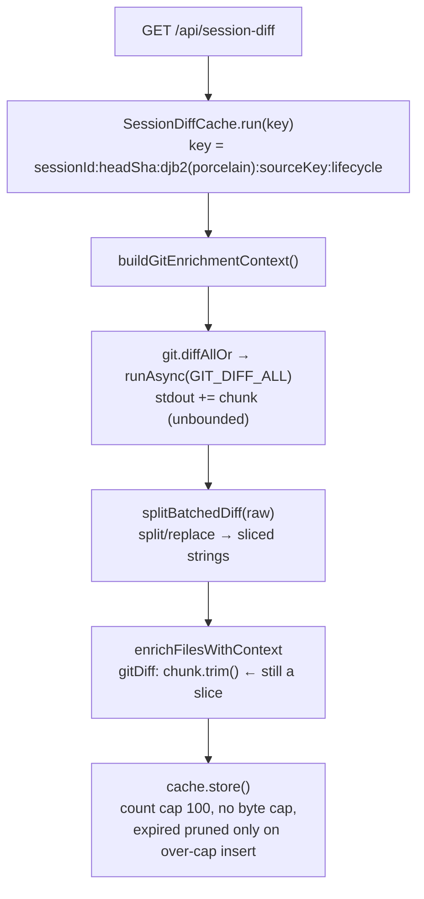

## Context

See proposal.md, "Why". Current request path:

`enrichFilesWithContext` (`session-diff.ts:569`) is the only place a slice of the batched diff outlives the request. Untracked synthetic diffs come from `readFileSync`, so they are independent strings capped by `SYNTHETIC_DIFF_MAX_BYTES`. The shared cache (`session-routes.ts:62`) serves all sessions.

## Goals / Non-Goals

**Goals:**
- Retained heap per cached result is O(its own `gitDiff` bytes), independent of batched-diff size.
- Hard upper bound on total cache retention.
- The batched diff is never materialised beyond a fixed byte limit.

**Non-Goals:**
- Changing the cache key or the client refetch cadence (the `diffChangeSignal` amplifier). With D1 + D2 the amplifier costs CPU, not memory; making it cheaper is separate work.
- A global default `maxBuffer` for every `runAsync` caller (22 call sites). That changes shared behaviour broadly and deserves its own change.
- Streaming or paginated diffs.

## Decisions

### D1: copy at the storage site, not in `splitBatchedDiff`
`gitDiff: flattenString(chunk.trim())`, where `flattenString(s) = Buffer.from(s, "utf8").toString("utf8")`. The comment warns not to simplify it back to `.trim()`.
- Why at the storage site: `splitBatchedDiff` also yields oversized chunks, which are dropped. Copying those would waste up to `TRACKED_DIFF_MAX_BYTES` each. Copying only renderable chunks (≤ 5 MB each) costs a bounded transient.
- Alternatives: `(" " + s).slice(1)` and `JSON.parse(JSON.stringify(s))` rely on V8 heuristics and can still produce cons/sliced strings. The Buffer round-trip always allocates a fresh sequential string. That is what the issue measured (50.0 → 0.0 MB), and the reproduction in this repo gave the same result.
- The helper lives next to `splitBatchedDiff` (single call site, no shared util).

### D2: byte budget via an injected size function
`new SessionDiffCache<T>(ttlMs, maxEntries, { maxBytes, sizeOf })`. `store()` records each entry's size and keeps `totalBytes`, then evicts expired entries and then oldest entries while `size > maxEntries || totalBytes > maxBytes`. This mirrors the existing `diagram-render.ts:87` pattern.
- `sizeOf(SessionDiffResult)` ≈ `2 × Σ (gitDiff?.length ?? 0)` over owned + other files, plus a small per-entry constant. The factor of 2 approximates UTF-16 worst case. This is an estimate, not exact accounting, but it is conservative for diff text, which dominates.
- Default budget: 64 MB (issue suggestion). It sits well above a normal session's diff size and far below any observed crash ceiling.
- An entry bigger than the whole budget is returned to its requester but evicted immediately. Single-flight coalescing is unaffected, because in-flight promises are tracked separately.
- The size function is injected so the cache stays generic (`T`).

### D4: expiry on read
`run()` deletes the looked-up key when it has expired, and does a cheap expired sweep (O(n), n ≤ 100) on every call. Rejected alternative: a `setInterval` sweeper. It adds a timer lifecycle to manage (`clear()`, tests) for no gain at n ≤ 100.

### D3: opt-in `Recipe.maxBuffer` → `output-too-large`
- `Recipe.maxBuffer?: number` (bytes) and an optional `RunCtx.maxBuffer` override. In `runAsync`, count received bytes. Past the limit: stop appending, kill the child (reuse the SIGTERM→SIGKILL escalation), and settle with `{ kind: "output-too-large"; binary; limitBytes }`. The sync `run` path passes `maxBuffer` through to `spawnSync` and maps `ENOBUFS` to the same kind, for parity.
- `GIT_DIFF_ALL.maxBuffer = 32 MB`. At that size the transient heap is ~64 MB (UTF-16), and it is released at the end of the request once D1 has cut the slices.
- The `diffAllOr` fallback `""` already gives the desired degradation (numstat-only entries, no `gitDiff`). `buildGitEnrichmentContext` calls `diffAll` directly, so it can see `output-too-large`, log `[session-diff] batched diff exceeded <limit> in <cwd>; serving counts only`, and continue with an empty map.
- Why opt-in: many recipes (e.g. `git log`, file listings) have no natural limit today. Imposing one silently would risk regressions outside this fix.

## Risks / Trade-offs

- [A new `ExecError` variant breaks exhaustive `switch`/`never` checks] → Task: `tsc --noEmit` across the workspace, plus grep for `error.kind` switches. Callers that use `unwrap` (`*Or` helpers) are unaffected.
- [`sizeOf` underestimates non-diff fields] → Diff text dominates, and the 64 MB budget leaves headroom. Metadata-only entries cost KBs.
- [Heap tests are flaky because GC is non-deterministic] → Run 3 × `gc()` and assert a wide margin (< 5 MB vs. ~50 MB). Gate `gc` through `v8.setFlagsFromString("--expose-gc")` + `vm.runInNewContext("gc")`, so no special vitest flags are needed. Skip with a clear message if `gc` is unavailable.
- [Repos with a batched diff between 32 MB and the old behaviour lose text diffs for all tracked files, not just the huge one] → This is accepted, because a crash is worse. The warning log names the cause, and the `.gitattributes -diff` workaround (issue §7) restores per-file diffs.
- [The Buffer round-trip costs CPU] → Only renderable chunks (≤ 5 MB each) are copied. Cost is linear and small next to the `git diff` spawn itself.

## Migration Plan

No persisted data. Deploy through a server restart (`/api/restart`). Rollback is a plain revert of the commit; no data cleanup is needed.
