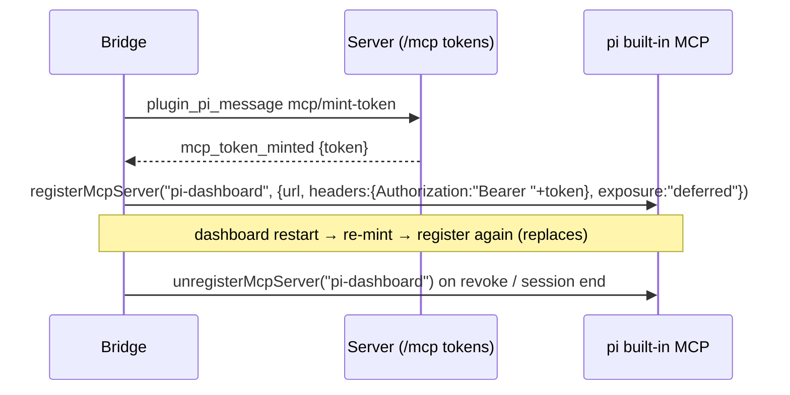

## Context

- Motivation and scope: proposal.md. Owner decision: **built-in only**.
- pi 0.99 built-in MCP (pi `docs/mcp.md`):
  - reads `~/.pi/agent/mcp.json` + trusted `.pi/mcp.json`; a project entry **replaces** the global entry of the same name;
  - HTTP entries without an `Authorization` header are treated as OAuth servers;
  - `pi.registerMcpServer(name, config)` is per session and not persisted; a later registration of the same name replaces the earlier one; an `mcp.json` entry of the same name **takes precedence** over a registration;
  - default exposure is `codemode`, but the `codemode` tool is **off** unless `defaultTools` includes it;
  - an installed extension that registers `/mcp` (e.g. `pi-mcp-adapter`) disables the built-in entirely.
- Today (this user's machine): `~/.pi/agent/mcp.json` holds only the dashboard-provisioned `pi-dashboard` entry (`url`, `protocolVersion`, `requestHeadersCommand`); `pi-mcp-adapter` sits in `settings.json#packages`.

## Goals / Non-Goals

**Goals:** zero dependency on `pi-mcp-adapter`; dashboard MCP reachable in every session with no file writes; credential out of `process.env`; mcp-client UI faithful to pi's semantics.

**Non-Goals:** removing `pi-mcp-adapter` from a user's `settings.json` (their choice; doctor reports it); re-implementing adapter-only features; importing configs from other hosts.

## Decisions

### D1 — Registration lifecycle in the bridge

- The token lives in a bridge module variable only. `mcp-token-delivery.ts` stops writing `process.env.PI_DASHBOARD_MCP_TOKEN`; `header-command.mjs` is deleted.
- The URL comes from the bridge's resolved dashboard endpoint (same source as its WebSocket), so remote and tunnel setups keep working.
- **Exposure `deferred`:** reachable without codemode (pi auto-activates `tool_search`) and keeps the dashboard's large tiered tool surface out of the model's tool declarations. Alternatives: `direct` pollutes declarations; `codemode` is unreachable when codemode is off.
- **Guard:** if `pi.registerMcpServer` is missing or throws (built-in disabled by an adapter or `-builtin:mcp`), log once and report `mcp.dashboard_registration_unavailable` to the server for the doctor. The session otherwise works.
- The protocol era is declared the way pi's config allows. If pi negotiates only by `MCP-Protocol-Version`, the server's dual-era endpoint already handles it.

### D2 — One-time migration of the provisioned entry
On server start, the `mcp-server` plugin removes `mcpServers["pi-dashboard"]` from the Pi-global file **only if** it matches the provisioned signature (`requestHeadersCommand.command` pointing at a dashboard `header-command.mjs`). This goes through the `mcp-client.config` writer (atomic, merge-only, refuses an unparseable file). A non-matching entry is kept and reported, since it would shadow the registration. The removal is idempotent and has no marker file.

### D3 — mcp-client rebuilt on pi's model
- **Reads:** parse the two Pi layers directly (JSONC-tolerant, as today). Trust comes from pi's trust store through the already-exported `ProjectTrustStore` (the same symbol the resource-activation gate uses). Live state comes from `pi mcp list --json`, run through the shared safe-spawn helper with a timeout and cached per cwd for a short time. If it fails, rows show "state unknown", never stale data.
- **Writes:** whole-entry replace or delete per scope, atomic, via the existing writer core minus its adapter path helpers. Folder "Override…" pre-fills the full global entry. Secret-bearing fields (`headers`, `env`, `oauth.clientSecret`) are blank and flagged, never copied silently.
- **Disable:** `enabled:false`. A folder-scope disable of a global-only server writes a complete copy (pi replaces entries as a whole).
- **Removed:** `adapter-worker.ts`, adapter port, version floor, global-settings form, `adapterLoadTimeoutMs` (`configSchema.json`), shared/import provenance, and the `ajv` / `strip-json-comments` / `pi-mcp-adapter` dependencies where unused.

### D4 — apple-tools
Ensure `mcpServers.iMCP = { command }` via the service. Preserve operator-set `enabled` / `exposure` / `toolExposure`. Drop `ensureAdapterPackage` and every `settings.json` write. The nine-state enumeration is unchanged; `READY` still means a live round trip, now through pi's built-in.

## Risks / Trade-offs

- [Adapter users silently lose dashboard MCP tools] → the registration guard, a doctor row, and a **BREAKING** CHANGELOG entry naming the fix (remove `pi-mcp-adapter` from `packages`).
- [`pi mcp list --json` connects to every server, so it is slow or has side effects] → call it only on explicit page view and refresh, with a timeout; the list view renders from files first.
- [Folder override drops secrets the operator expected to inherit] → an explicit editor warning plus the scenario test; pi semantics make inheritance impossible anyway.
- [A pi version whose `registerMcpServer` shape changes] → covered by the lockstep floor; feature-guard as in D1.
- [Unknown adapter keys (`directTools`, `lifecycle`, `disabled`) left in user entries may make pi skip the entry] → verify pi 0.99's behavior. If entries are skipped, the mcp-client list shows pi's reported error for the row and the editor offers "remove unsupported fields".

## Migration Plan

1. Bridge registration + credential out of `process.env` (D1), behind the guard; the old file entry is still present, so sessions keep working either way.
2. Migration removal of the provisioned entry (D2), in the same release as D1.
3. mcp-client rebuild (D3) and apple-tools (D4).
4. Remove `pi-mcp-adapter` from dependencies and recommended extensions; doctor row; CHANGELOG.

Rollback: revert. A reverted build re-provisions its `pi-dashboard` entry through the old path, and user-authored entries are never deleted.

## Open Questions

- Does pi 0.99 skip an `mcp.json` entry that carries unknown adapter keys, or ignore the keys? Verify on the pinned runtime during implementation. Either answer fits D3's handling; only the error text shown to the user differs.
