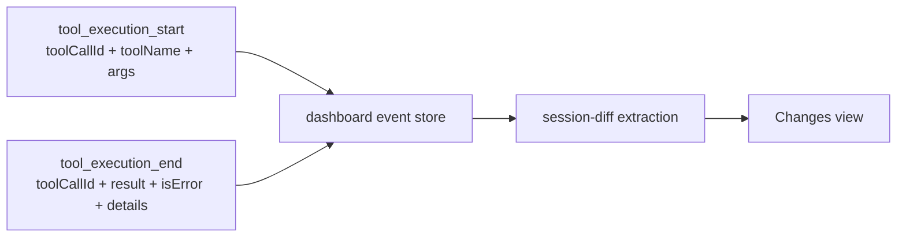

## Context

The bridge already forwards pi's provider-neutral tool lifecycle contract:



Live events retain the `ToolResult` object under `result`; replay events flatten its text into `result` and lift persisted structured data into `details`. Both paths retain `toolCallId` and `isError`. Current session-diff extraction ignores failure data and recognizes only Write/Edit for direct file events plus Bash for output and mtime attribution.

This produces three gaps:

- a failed Write/Edit call can contribute a file row but cannot explain its failure;
- Grok aliases such as `Shell` and `StrReplace` fall outside Bash/Write/Edit matching;
- Codex `apply_patch` is not directly recognized, and its successful partial changes can arrive with `details.status: "partial_failure"` while `isError` remains false.

The adjacent `fix-session-diff-open-nongit-and-preview` change normalizes paths and repairs diff/preview rendering. This change assumes that normalized relative-posix path contract and adds tool lifecycle correlation after it.

## Goals / Non-Goals

**Goals:**

- Preserve real file changes made before a file-affecting tool reports failure.
- Correlate starts, results, affected paths, and failures by `toolCallId`.
- Produce equivalent session-diff output from live and replayed events.
- Support shipped mutation tool families without branching on provider id.
- Show concise failure context beside affected files in the Changes view.
- Avoid claiming unrelated working-tree edits from timestamp proximity alone.

**Non-Goals:**

- Replace the chat's model, provider, or general tool error surfaces.
- List failures from Read, search, auth, model calls, or other operations with no changed file.
- Change `pi-codex-conversion` or `pi-grok-cli` event contracts.
- Reconstruct files that a failed operation never changed.
- Add deleted-file diff support; existing session-diff deletion behavior remains unchanged.

## Decisions

### 1. Correlate lifecycle events on the server

`buildSessionDiff` will perform provider-neutral lifecycle correlation while it already owns event scanning, path normalization, git status, filesystem metadata, and ownership classification.

The extraction pass will index mutation starts by `toolCallId`, including normalized candidate paths and the tool execution window. A result pass will pair each end event with that index, normalize failure state, and attach only paths that remain present in the composed session diff.

Rejected alternatives:

- **Bridge enrichment:** duplicates session-diff policy in every active pi process and cannot repair stored history.
- **Client correlation:** requires shipping raw event details into the diff component and risks live/replay divergence.
- **Nearest preceding tool:** parallel tools and retries make temporal proximity ambiguous.

### 2. Classify mutation tools by tool family, not provider

A shared case-insensitive name set will cover the shipped names needed by both server extraction and the client's refresh signal:

| Family | Initial names | Path evidence |
|---|---|---|
| Direct file | `write`, `edit`, `strreplace` | `path` or `file_path` args |
| Shell | `bash`, `shell`, `exec_command` | explicit output tokens |
| Patch | `apply_patch` | structured applied/changed result paths |

Provider ids and model ids will not appear in this classifier. New aliases require a fixture and one classifier entry, not a provider branch.

Structured `appliedFiles` and changed/created/moved result paths are proof of applied work. `failedFiles` can explain an error but cannot create a changed-file row by itself. The dashboard will not parse patch prose or patch headers; provider versions that omit structured applied paths retain their chat error but gain no file-failure association.

### 3. Normalize failure semantics without error-text heuristics

A tool end is a failure when either:

1. pi emits `isError === true`; or
2. a mutation tool emits structured `details.status === "partial_failure"` at the top level or under the live `result` object.

The second rule covers Codex partial patch application, which intentionally returns details rather than throwing after some actions have succeeded. The implementation will not infer failure from words such as `error`, `failed`, HTTP codes, or provider-specific prose.

When both signals exist, `isError === true` wins and produces `kind: "error"`; `partial_failure` applies only when `isError !== true`. Other structured status strings are not interpreted as failures unless pi sets `isError`; adding them requires an observed provider contract and fixture.

Failure text will be extracted from replay strings or live `result.content` text blocks, normalized to plain text, stripped of terminal and non-printing control sequences, redacted for common credential shapes, and capped before entering the API response. Cwd and home-directory prefixes will collapse to `.` and `~` without removing useful relative paths. Structured `details.error` is the first fallback; `<toolName> failed` is used when the name is non-empty, otherwise `Tool operation failed`. The client will render the value as text, never HTML.

### 4. Require exact file evidence before exposing a failure in session diff

The server will emit a file-operation failure only when at least one affected path is also present in `files` or `otherChanges` after path normalization and git/session composition.

For each paired `toolCallId`, the server will union candidate paths from direct-tool arguments, structured applied/changed result paths, and explicit shell output tokens. Every candidate must pass the existing cwd-containment `normalizePath` function before union or intersection. The normalized union is intersected with the final `files` plus `otherChanges` key set. Existing mtime windows can continue to classify session ownership, but mtime alone will never associate a failure with a file.

For non-git cwd values, classified direct-file and patch paths do not have git status as a discovery source. The server will admit normalized in-cwd candidates only when the path exists, is not noise, and comes from direct args or structured applied paths. Failed-only patch targets remain insufficient. This allows real StrReplace/apply_patch changes to enter the response without treating every intended patch target as changed.

An end event with no `toolCallId`, no matching start, or no surviving affected path will be skipped. A start with no end is still running or dropped, not a proven failure. After the existing `MAX_FILES` cap, affected paths will be filtered again to surviving response rows and failures left empty will be dropped.

General failures and mutation failures with no changed file remain in chat only.

### 5. Extend the response additively

The shared response gains an optional field so old clients continue to ignore it:

```ts
interface FileOperationFailure {
  toolCallId: string;
  toolName: string;
  timestamp: number;
  kind: "error" | "partial_failure";
  message: string;
  affectedPaths: string[];
}

interface SessionDiffResponse {
  // existing fields
  fileOperationFailures?: FileOperationFailure[];
}
```

Failures are deduplicated by `toolCallId`; the latest end timestamp wins. Equal timestamps resolve deterministically by preferring `isError`, then `partial_failure`, then the lexically smaller normalized message. The failure timestamp always comes from the selected end event. Affected paths use the existing cwd-relative posix key space, and output order is newest end first with `toolCallId` as the stable secondary key.

The response will cap failures at 100 newest entries and affected paths at 50 per failure after intersection with surviving changed-file rows. These bounds prevent response amplification beyond the existing changed-file cap. The API does not expose raw tool args or complete structured details.

Rejected alternative: embedding an error object in every `FileDiffEntry`. One tool can affect multiple files, and one file can be touched by multiple failed operations; a separate normalized list avoids duplication and preserves that many-to-many relation.

### 6. Render one failure section plus per-file status

`DiffFileTree` will derive an affected-path index from `fileOperationFailures`.

- Affected file rows receive a visible error badge with an accessible label.
- A `Failed operations` section shows failure count, tool name, concise message, timestamp, and affected paths.
- Activating an affected path opens the existing file diff; no new viewer or route is introduced.
- The section renders only when correlated file-operation failures exist.
- A session with only unrelated errors does not gain a Changes surface.

This keeps failure explanation close to the file list while avoiding pseudo-files.

### 7. Refresh after every classified mutation result

The current client refresh signal recognizes only Edit, Write, and Bash. It will use the shared mutation name set so `Shell`, `StrReplace`, `apply_patch`, `exec_command`, and failed results schedule the same serialized trailing refresh.

Read/search results remain excluded because `buildSessionDiff` performs synchronous git work. The existing one-in-flight plus one-trailing-request behavior remains the load bound.

## Risks / Trade-offs

- **External tool alias changes** -> Keep one shared classifier and add captured start/end fixtures for each shipped integration.
- **Live and replay result shapes differ** -> Normalize both shapes in one server helper and run identical expectations against both fixtures.
- **Shared-cwd edits occur during a failed shell window** -> Never use mtime alone for failure association; require direct, structured, output-token, or patch-target evidence.
- **Patch details disappear in an older provider version** -> Keep its general chat error and existing git-detected files; omit file-failure association rather than parse patch prose.
- **Error output contains secrets, local paths, or excessive data** -> Expose only capped plain text, redact common bearer/JWT/key/credential-URL/env-assignment shapes, collapse cwd/home prefixes, cap list cardinality, and omit raw args/details.
- **More mutation aliases increase diff requests** -> Keep the mutation-only filter and existing serialized trailing refresh.
- **Adjacent session-diff change edits the same files/specs** -> Land or rebase after `fix-session-diff-open-nongit-and-preview`; preserve its normalized path and shared-fetch contracts.

## Migration Plan

1. Land after the adjacent session-diff path/preview fix or rebase onto its final contract.
2. Deploy shared, server, and client changes together through the normal monorepo build.
3. Old persisted sessions require no migration; replay correlation derives failures on demand from existing events.
4. Rollback removes the optional response field and client rendering; stored session data remains unchanged.

## Open Questions

None required before implementation. Captured Codex and Grok fixtures remain implementation evidence, not new runtime dependencies.
