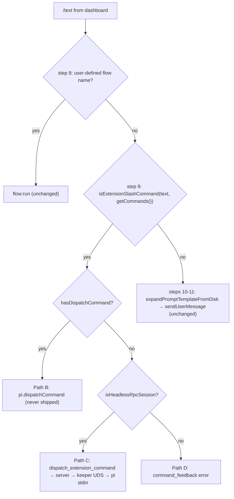
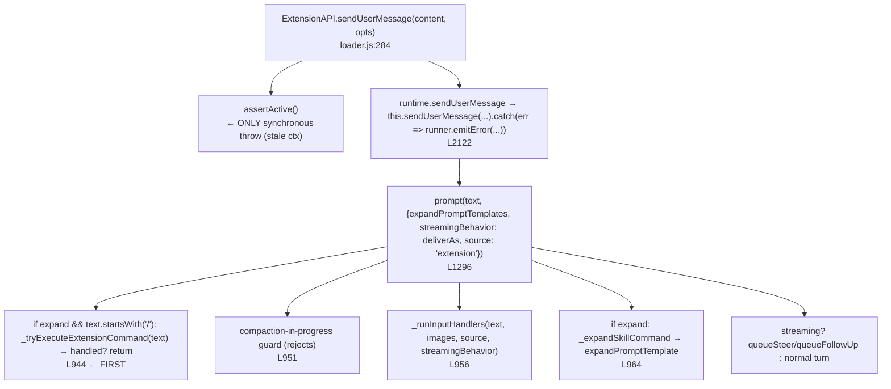

# Design — retire-slash-dispatch-via-expand-prompt-templates

## Context

`docs/slash-command.md` routing order, step 9 today (steps 10–11 untouched by
this change):



pi ≥ 0.84.2 `agent-session.js` (verified on 0.86.1):



Consequences the design must respect:
- `sendUserMessage` returns `void`; every failure inside `prompt()` is a
  swallowed rejection routed to `runner.emitError` → `errorListeners`. The
  `ExtensionAPI` exposes no `pi.on(...)` for it, and the bridge has no
  `extension_error` consumer (only rpc-mode emits that JSON line). Handler
  outcome is unobservable from the bridge.
- Extension commands run before the compaction guard, so compaction can never
  block one.

## Decisions

### D1 — One in-process call replaces B/C/D

```mermaid
flowchart TD
  X{"step 9: isExtensionSlashCommand?"} -->|yes| G{"piVersion >= 0.84.2?"}
  G -->|no| PD["emit started → error 'Extension slash commands from the dashboard require pi 0.84.2+'  (replaces Path-D RPC_KEEPER_HINT text)"]
  G -->|yes| E["emit started → pi.sendUserMessage(text,{expandPromptTemplates:true, deliverAs}) → emit completed"]
  E -.->|sync throw (stale ctx)| ER["emit error <thrown message>"]
  X -->|no| S10["steps 10-11 unchanged"]
```

Feedback contract: `started` before the call; `completed` immediately after a
call that returned (pi accepted the text for dispatch — fire-and-forget);
`error` only on a synchronous throw. Exactly one `started` and exactly one
terminal event per invocation (the version read and the `sendUserMessage`
call both sit inside the try so no throw can escape between them; the
existing `emitFeedback` no-ops when `sink` is undefined — both production
call sites pass one). `deliverAs` is forwarded for uniformity but pi
consults `streamingBehavior` only AFTER `_tryExecuteExtensionCommand`, so for
an extension command it is inert — the handler runs immediately whether
streaming or not. Handler failures are not surfaced — accepted
trade-off, identical in kind to Path C's optimistic `completed`, and now
uniform across session kinds.

### D2 — Passthrough (steps 10–11) and `prompt-expander.ts` untouched

An earlier draft added `expandPromptTemplates: true` to the unresolved
passthrough. Rejected because:
- pi's resource loader scans `.pi/prompts`, so an exec-mode template
  (`executable: bash`) that the dashboard runs as bash is ALSO a pi prompt
  template; on the multi-line / image passthrough (where `tryExecSlashTemplate`
  does not run) the flag would expand the bash body into the model.
- `expandPromptTemplateFromDisk` returns the original text for miss, read
  failure AND exec — the caller cannot distinguish a miss.
- The disk resolver already consults `pi.getCommands()` (skills, global and
  package prompt templates), so a genuine miss is text pi cannot expand
  either.
- Four `sendUserMessage` sites (idle, steer, buffered follow-up drain, image
  passthrough) would each need the flag; the drain deliberately carries no
  options (`fix-bridge-followup-image-drop` D6).

Zero value, non-zero risk → out of scope.

### D3 — Old-pi gate via the bridge's own pi version

`package.json` peer range is `>=0.80.10` (earendil) and `>=0.73.1`
(mariozechner); `pi-core-version-check` says the publishable range is NOT
raised in lockstep with the enforced 0.85.1 floor. Below 0.84.2,
`sendUserMessage` hard-codes `expandPromptTemplates: false`, so the raw slash
would become an LLM turn while the bridge reports `completed` — a silent
regression where Path D was a loud error.

Gate reader — two traps the existing `defaultReadPiVersion()` has:
1. it resolves `@earendil-works/pi-coding-agent` by NAME via
   `import.meta.resolve`, i.e. the nearest `node_modules` copy. This monorepo
   hoists a pinned earendil at the root, so a user-launched tmux session on an
   old host pi (or a `@mariozechner` build) with earendil co-installed reads
   the hoisted NEW version and waves the command through — the hoisted-copy
   probe bug `pnpm-workspace.yaml` documents for `/api/health`;
2. `resolveEntry` THROWS on an uninstalled package (no try/catch in the
   reader; only `sendPiVersionIfChanged` catches). A throw after `started`
   and before any terminal event is a stuck pill.

New `readRunningPiVersion()` (in `model-tracker.ts`, beside the existing
reader): anchor on `process.argv[1]` — the CLI entry of the pi process the
bridge is executing inside — and walk up with `readPkgVersionByWalkUp`,
accepting a manifest whose `name` is EITHER pi package. Whole read in
try/catch → `undefined`. Comparison is a local six-line triplet compare
(`isAtLeast(v, [0,84,2])`); `node-version.ts` is deliberately NOT reused —
it is the canonical **Node** predicate and returns `false` for unparseable
input, which would misclassify a weird pi version as "too old". Outcomes,
kept distinct:
- `undefined` (no argv[1] manifest / bun-compiled binary / read threw) →
  treat as new, `console.warn` once per process;
- parseable and below 0.84.2 → `started` + `error` "Extension slash commands
  from the dashboard require pi 0.84.2+";
- unparseable but non-empty → treat as new, `console.warn` once (distinct
  message);
- parseable and ≥ 0.84.2 → dispatch.
The reader is injectable in the helper for tests. Enforced dashboard floor
0.85.1 makes the `undefined` branch the only realistic non-dispatch case in
dashboard-spawned sessions.

This is a version gate, replacing the retired "no version sniffing" rule that
existed only for feature-detecting `dispatchCommand`.

### D4 — Server: delete the router, tombstone the arm, drop `writeRpc`

`dispatch_extension_command` had one producer (bridge Path C) and one consumer
(`dispatch-router.ts`). The router goes. The `event-wiring.ts` arm becomes a
tombstone for one release: on receipt, call the existing
`emitCommandFeedback(sessionId, command, "error", "bridge outdated — reload
the session")` closure (persists via `eventStore.insertEvent` AND broadcasts
— `dispatch-router.ts` L18–23 documents why a broadcast-only terminal
re-creates the stuck pill on reattach) and log a warning. Without it an
un-reloaded bridge (server restarted before `npm run reload`) would leave a
stuck "in progress" pill. `DispatchExtensionCommandMessage` in
`shared/protocol.ts` stays with a `@deprecated` JSDoc pointing at this change;
a follow-up removes both.

`headlessPidRegistry.writeRpc` and `keeperManager.writeRpc` have no other
caller → removed, together with the orphans that removal creates:
`keeperManager.writeRpcToSockPath`, `KeeperWriter.writeRpcToSockPath`, the
`describe("KeeperManager.writeRpc")` block in `keeper-manager.test.ts`, the
`writeRpc` cases in `headless-pid-registry.test.ts`, the mock in
`cwd-policy-funnel.test.ts`, and the `server.ts` `setKeeperWriter` comment
that says `writeRpc` forwards `dispatch_extension_command`. `keeper.cjs` is
untouched (its UDS listener becomes idle but the keeper's job — owning pi's
stdin durably — is unchanged).

The `extension-rpc-dispatch` main spec would be left with zero requirements,
which does not validate (`docs/architecture.md` § OpenSpec main-spec
integrity). The delta therefore ADDS one `**DEPRECATED**` tombstone requirement
naming `command-routing` "Extension slash command dispatch via
sendUserMessage" as successor.

### D5 — Supersedes `retire-rpc-keeper-when-dispatchcommand-available`

That change (no tasks, 2026-05) gates on an upstream `dispatchCommand` PR that
`expandPromptTemplates` makes unnecessary. This change delivers its Phase 1
outcome without the upstream dependency. Its Phase 2 (retire the keeper) is
NOT adopted here — the keeper's durability role stands. User decision at
planning: withdraw that change (delete its directory) in this change.

### D6 — Routing order and detection unchanged

Step 8 (user-defined flow fast-path, `bridge.ts` L~1749) still precedes step 9.
`isExtensionSlashCommand` keeps both exclusions: `DASHBOARD_NATIVE_COMMANDS`
(`{"roles"}`) AND the `__` prefix rule (`bridge-context.ts` L~144) — the
spec's requirement text is corrected to name both. `getCommands()` throwing on
a stale ctx still returns `false` → passthrough (existing behaviour).

`delivery` is plumbed: `bridge.ts` call site passes it (today it omits the
argument); the helper forwards it as `deliverAs`, default `"followUp"`.
Detection (`getCommands()` + `isExtensionSlashCommand`) stays INSIDE the
helper's try so a stale-ctx throw returns `false`; callers never evaluate
detection themselves.

## Removed surface

- `slash-dispatch.ts`: Path B, Path C, Path D branch logic, `connection`
  parameter, `DispatchConnection` type.
- `bridge-context.ts`: `hasDispatchCommand` (+ the `describe("hasDispatchCommand")`
  block in `extension-slash-command-detection.test.ts`; the detection tests in
  that file stay). `isHeadlessRpcSession` STAYS (live caller `bridge.ts`
  `isHeadless:`).
- `server`: `rpc-keeper/dispatch-router.ts` + its tests,
  `dispatch-extension-command-router.test.ts`; `writeRpc` in
  `keeper-manager.ts` and `spawn-process/headless-pid-registry.ts`.
- Tests to rewrite: `bridge-slash-command-routing.test.ts` (Path B/C/D
  assertions + its own `describe("hasDispatchCommand")` at L~444); there is
  no `slash-dispatch.test.ts`. `process-manager-keeper-spawn.test.ts` `km`
  literal loses `writeRpc`/`writeRpcToSockPath`/`writeCalls`.
- Stale doc-comments: `slash-dispatch.ts` `crypto` import; `headless-pid-registry.ts`
  `HeadlessEntry.keeperSockPath`; `process-manager.ts` L~219;
  `dispatch-reload.ts` L~27–40 (qualify "on pi < 0.84.2");
  `openspec/specs/extension-rpc-dispatch/spec.md` `## Purpose` (hand-edit at
  archive; `Purpose` is outside delta sync).

## Risks

- Un-reloaded bridge after server restart → tombstone `error` row (D4), not a
  stuck pill. Rebuild order documented: reload before restart.
- A dashboard/pi command-list drift (detected as extension command, not
  registered in pi's map) → `completed` while pi sends the text to the model.
  Same exposure Path C had; `getCommands()` is pi's own list so drift is
  bounded to reload windows.
- Extension handlers that assume TUI (`ctx.ui.*`) — unchanged; PromptBus
  wrappers + `hasUI` flip already cover headless.
