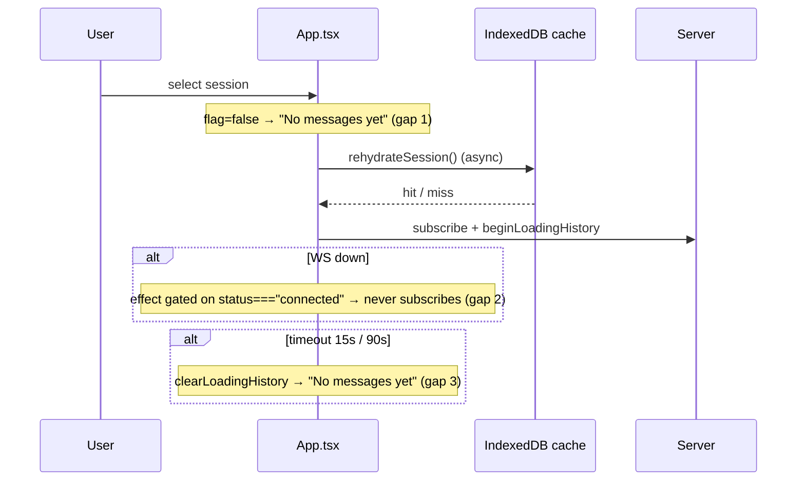

## Context

See proposal.md — Why. Today the client owns two per-session flags in `App.tsx`:
`loadingHistory` (clears on first content) and `replayInFlight` (clears on the
terminal batch), both armed by `beginLoadingHistory` / `beginReplayInFlight` in
`doSubscribe()` and torn down by `clearLoadingHistory` in
`lib/replay/loading-history.ts`. Only `ChatView` consumes them, and only for the
selected session. Three gaps:



Facts the design relies on (verified in source):
- `SessionList` computes `now = Date.now()` once per render — it does **not** tick.
- `SessionList` / `DashboardSession` carry no message content; `sessionStates` +
  `sessionStatesRef` live only in `App`. `sessionStates.get(id)` is `undefined`
  until the first event for that session is reduced.
- ChatView's empty-branch gate is `messages.length === 0 && !streamingText &&
  !pendingPrompt && !pendingSteering?.length`; `pendingSteering` comes from
  `DashboardSession.pendingQueues.steering`, not `SessionState`.
- `refreshChat` (`lib/chat/refresh-chat.ts`) never clears the loading flag; it
  resets state/cursor then calls `beginLoadingHistory` again.
- `useMessageHandler` has exactly one `rearmLoadingHistory` call for
  `loadingHistory` (shared by the cold start marker and every heartbeat) and one
  for `replayInFlight`.
- `clearInMemoryState` (server switch) does not clear the loading maps/timers.
- `EmptyState` (`packages/client-utils`) exposes no `role` prop.
- The status chip has `title="<source> — <status>"` in two branches: desktop
  (`w-4 h-4` chip) and mobile (a bare icon span, ~12 px, no fixed size).
- `.animate-spin` is exempt from the `fx-idle` pause, paused under
  `app-hidden` / `.fx-offscreen` (`index.css`).
- State updaters must stay pure under StrictMode (repo convention,
  `useMessageHandler.ts`).

## Goals / Non-Goals

**Goals:** one derived phase per session, computed in one place and read by both
the chat view and the card; no false empty state; the card ring (mockup design
A); a full-re-request Retry.

**Non-Goals:** percent-done progress (heartbeats carry no size); any
server/protocol change; indicators for sessions never subscribed in this tab;
prefetching; a show-delay on the chat skeleton (it stays immediate, as today).

## Decisions

### D1 — Pure phase derivation, computed once in `App`

New `lib/replay/history-load-phase.ts`:

```ts
export type HistoryLoadPhase = "idle" | "waiting" | "loading" | "failed";
export const SLOW_LOAD_MS = 10_000;
/** The exact gate ChatView's empty branch uses today, extracted so both agree. */
export function hasChatContent(
  state: SessionState | undefined,
  pendingSteering?: readonly unknown[],
): boolean  // steering counts even when state is undefined; undefined state + no steering → false
export function deriveHistoryLoadPhase(i: {
  selected: boolean; connected: boolean; hasContent: boolean;
  loading: boolean;          // loadingHistory || replayInFlight
  failed: boolean;
}): HistoryLoadPhase
```

Precedence (first match wins):
1. `selected && !connected && !hasContent` → `waiting`
2. `loading && connected` → `loading` (includes streaming: content + replayInFlight)
3. `failed && connected && !hasContent` → `failed`
4. else → `idle`

`App` builds `historyPhaseMap: Map<sid, { phase, startedAt? }>` in a `useMemo`
over the ids whose value is **`true`** in `loadingHistory`, `replayInFlight` or
`historyLoadFailed`, plus `selectedId` (the maps keep `false` entries after a
clear, so iterating keys would be O(every session ever loaded)), with
`hasContent = hasChatContent(sessionStates.get(id), sessions.get(id)?.pendingQueues?.steering)`.
Only non-idle entries are stored. Memo deps: `[loadingHistory, replayInFlight,
historyLoadFailed, historyLoadStartedAt, sessionStates, sessions, selectedId,
status]` — `status` alone drives waiting, so it must be a dep. It recomputes on
every reduced event over a handful of ids, while `App` already re-renders on
those events. Both `ChatView` (selected entry) and `SessionList` (whole map) read
this one map; neither re-derives.

*Alternative:* replace the two boolean maps with one enum map. Rejected — their
clear edges are specified and tested separately; deriving on top is additive.

### D2 — Failed + started-at bookkeeping in `App.tsx`

New state: `historyLoadFailed: Map<sid, boolean>`,
`historyLoadStartedAt: Map<sid, number>`.

**Pure updates.** Any "was it already loading?" decision reads
`loadingHistoryTimersRef` / `replayInFlightTimersRef` (timer presence is the
existing invariant proxy for "flag set") **before** calling setters; setters get
plain values, never read one map inside another map's updater.

**Timer wiring** — `beginLoadingHistory` closes over `markHistoryLoadFailed`
and always passes it as the `onTimeout` of the timer it arms, so every begin
site (lazy-subscribe `doSubscribe`, the D3 layout effect, `refreshChat`) gets
failure marking without per-call plumbing.

**Mark failed** — `markHistoryLoadFailed(id)` in `App` (has
`sessionStatesRef` + `sessionsRef`): if `!hasChatContent(...)`, set failed and
also `clearLoadingHistory(setReplayInFlight, replayInFlightTimersRef, id)` (no
content ⇒ the replay is dead too; avoids a frame where `loading` masks
`failed`). Called from:
- the `loadingHistory` timer callbacks via a new optional
  `onTimeout?: (id) => void` on `rearmLoadingHistory` and on the timer
  `beginLoadingHistory` arms. `useMessageHandler` receives
  `markHistoryLoadFailed` as a dep and passes it at its **single**
  `loadingHistory` rearm site (start marker + heartbeats share it). The
  `replayInFlight` rearm site never receives it.
- the `dataUnavailable` branch in `useMessageHandler`: capture
  `const wasLoading = loadingHistoryTimersRef.current.has(id)` **before** the
  existing two `clearLoadingHistory` calls (which delete the timer), then
  `if (wasLoading) markHistoryLoadFailed(id)`. Unopened / already-loaded
  sessions never get a failed mark.

**Clear failed** — on `beginLoadingHistory`, on any non-empty `event_replay`
batch, on the terminal `isLast: true` batch (a late empty terminal after a
timeout then shows "No messages yet", preserving the base requirement), and for
**all** sessions on the transition to `connected` (a failure caused while
offline is not a real failure; unselected cards would otherwise keep a red ring).

**Reconnect reset** — on the transition to `connected`, the existing reconnect
effect also clears `loadingHistory` / `replayInFlight` **and their timers** for
all sessions (alongside failed + startedAt). Only the selected session is
re-subscribed, and the D3 layout effect re-arms it; without this a non-selected
session's pre-disconnect timer would fire after reconnect and mark a false
failure.

**startedAt** — `beginLoadingHistory(id, opts?: { restart?: boolean })` writes
`Date.now()` when (a) no timer was armed for `id`, (b) `restart` is true, or
(c) no `startedAt` exists. `historyLoadStartedAt` is mirrored into
`historyLoadStartedAtRef` (same pattern as `sessionStatesRef`) so rule (c) reads
fresh data inside the stable `useCallback`. Cleared when **both** flags are clear (the later,
`replayInFlight` edge) and for all sessions on the transition to `connected`, so
a reconnect's re-subscribe measures the new attempt via rule (c).

**Server switch** — `clearInMemoryState` clears `historyLoadFailed`,
`historyLoadStartedAt`, and also `loadingHistory` / `replayInFlight` and their
timer refs (clearTimeout each). The latter pair was a pre-existing leak, but
`onTimeout` makes a stale timer harmful (false failure against server B).

### D3 — Arm at selection, before paint (gap 1)

A `useLayoutEffect` on `[selectedId, status]` calls `beginLoadingHistory(sid)` +
`beginReplayInFlight(sid)` when the selected session is connected, not yet in
`subscribedRef`, and has no chat content. Layout effects flush before paint, so
the first painted frame already shows the skeleton — no "No messages yet"
frame. The existing lazy-subscribe `useEffect` is unchanged: `doSubscribe()`
arms again (idempotent: re-arms the short timer, `startedAt` kept). A cache read
hanging past `SUBSCRIBE_ACK_MS` surfaces `failed` + Retry.

### D4 — Waiting (gap 2) is derived, not stored

`connected = status === "connected"` feeds D1. While `waiting`, the slow notice
and failed state are suppressed. On reconnect: D2 clears failed + startedAt for
all sessions; the existing effect re-subscribes the selected session.

### D5 — Retry = `handleRefreshChat` with a restarted clock

`handleRefreshChat`'s `beginLoadingHistory` dep becomes
`(id) => beginLoadingHistory(id, { restart: true })` — a refresh is always a new
load, for the header action and for Retry alike. Retry therefore calls
`handleRefreshChat(sid)` directly. `refreshChat` already drops the persisted
cache, resets state + cursor carrying interactive requests, marks subscribed,
sends `subscribe { lastSeq: 0 }`, and arms both flags — no second reset path.

### D6 — Card plumbing and clocks

`SessionList` passes `historyPhase` + `historyStartedAt` primitives from the map
to each `SessionCard` (same pattern as `inflightBashMap`).

Both card branches' status chips are extracted into one
`SessionStatusChip` component (desktop and mobile variants via a prop, existing
markup preserved). It owns:
- **Show-delay** — a `setTimeout(REPLAY_PILL_DELAY_MS)` keyed on
  `(sessionId, phase)` for `loading`; `waiting` / `failed` paint immediately.
- **Clock** — `useNow(phase === "loading")` (1 s interval, off otherwise), used
  for the tooltip's `· Ns` once `now - startedAt >= SLOW_LOAD_MS`.
- The `title` (it owns the chip element, so the per-second tooltip updates
  without re-rendering `SessionCard`).

`useNow` moves from `lib/access-grants/yolo-status.ts` to
`lib/time/use-now.ts`, re-exported from the old path so existing callers are
unchanged.

### D7 — Ring rendering

Inside `SessionStatusChip`, an `absolute -inset-[3px] rounded-full` span
rendered **before** `StatusShapeBadge` in DOM order so the badge (opaque
background) paints on top. The chip is already `relative` on desktop; on mobile
the icon span gets `relative inline-flex` only — **no** size change, so the ring
hugs the ~12 px icon and nothing reflows.
- loading: `border-2 border-[var(--accent)] border-t-transparent animate-spin motion-reduce:animate-none`
  (repo spinner shape, e.g. `HistoryGapDivider.tsx`, with the accent token).
- waiting: `border-2 border-dashed border-[var(--text-tertiary)]` (≥3:1 on
  `--bg-primary`/`--bg-tertiary` in every theme palette, light and dark).
- failed: `border-2 border-[var(--status-error)]`.

Motion: the arc keeps spinning under `fx-idle` (existing deliberate exemption),
pauses under `app-hidden` / offscreen, stops under `prefers-reduced-motion`
while remaining a ¾ arc.

Text: `title` = existing `"<source> — <status>"` + `" · <ring text>"` while a
ring shows. A visually-hidden span carries **static** ring text (no seconds);
`role="status"` only when `isSelected`.

### D8 — Chat states

`ChatView` gets `historyPhase`, `historyStartedAt`, `onRetryHistory`. Its
empty-branch gains two branches **ahead of** the existing ones:
`historyPhase === "waiting"` → waiting; `historyPhase === "failed"` → failed;
otherwise the existing `loadingHistory ? skeleton : "No messages yet"` logic runs
unchanged (so existing skeleton / pill tests keep passing).

- **Waiting**: `EmptyState` (static icon) inside `<div role="status">`
  (`EmptyState` has no role prop).
- **Failed**: `EmptyState` + Retry action inside `<div role="alert">`.
- **Slow notice**: a self-contained `SlowLoadNotice` child rendered above the
  skeleton, taking `startedAt` + `onRetry`. It owns `useNow(true)`, renders
  `null` until 10 s elapse, so only it ticks — `ChatView` never re-renders per
  second. Live region = `role="status"` span with static text ("Still loading
  history"); the `· Ns` sibling is `aria-hidden="true"`; Retry button follows.

## Risks / Trade-offs

- [Flag armed before the cache read could hit the 15 s window on a very slow
  IndexedDB] → surfaces Retry instead of a false empty; honest.
- [Ring on the chip reads as colour+motion at a glance] → three distinct shapes,
  appended tooltip, sr-only text, and the chat pane's text states (WCAG 1.4.1).
- [Extracting `SessionStatusChip` touches both card branches] → markup moved
  verbatim; existing `session-status-icon` test ids preserved.
- [New maps are not pruned on archive/removal] → accepted; one boolean / number
  per ever-loaded session, same as the existing two flags.
- [Existing tests asserting "No messages yet" after a safety-net timeout] →
  intended behaviour change; updated with the spec delta. Skeleton and pill tests
  stay valid because D8 keeps their branches intact.

## Migration Plan

Client-only. Deploy = `npm run build` + restart. Rollback = revert the commit.
No persisted data shape changes; the replay cache format is untouched.
