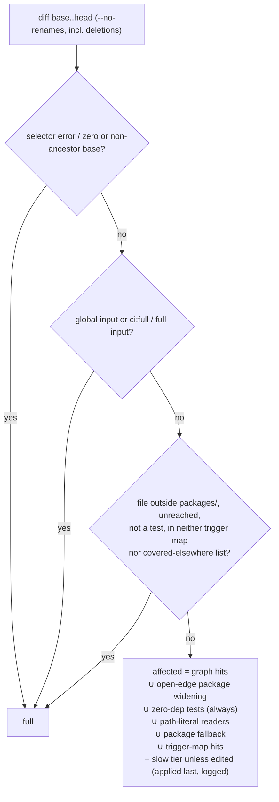
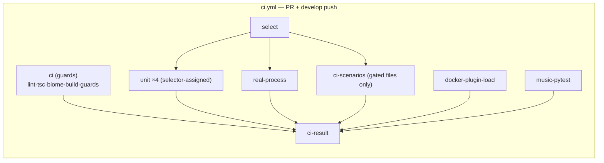

## Context

See proposal.md, Why, for the measured baseline and the spike results. Constraints that shape the approach:

- **Runner:** `ubuntu-latest` on a public repo has 4 vCPU, and `PARALLEL_MAX_WORKERS = "50%"` gives 2 forks. In the sampled run, file-time summed to 30.2 min against 31.4 min wall. Per-shard wall time is what we can control.
- **Measured install cost:** the `Install dependencies` step takes 0.9 min. That already includes `packages/client`'s `prepare` script (a full vite build), so every runner that installs gets `packages/client/dist/`.
- **Vitest 4.1 internals the selector reuses:** `createVitest("test", { watch:false, run:false, config? })`, `globTestSpecifications()`, and each project's `vite.environments.ssr.transformRequest()` / `moduleGraph`. The stock `filterTestsBySource` walks the same graph but throws on the first transform error, and its default `forceRerunTriggers` include `**/package.json/**`.
- **Two test configs:** the real-process project (`packages/server/vitest.real-process.config.ts`, `root: __dirname`) is deliberately absent from root `projects`, and the main server project excludes exactly its files. A selector reading only the root config would never select a real-process file.
- **Workspace resolution:** workspace packages export `./src/*`, and the client config aliases `shared` / `client-utils` / runtime to source. Cross-package edges therefore appear in the graph as real repo paths, not `node_modules` paths.
- **Type-only imports are erased by the transform.** `tsc` in the `ci` job covers type-level breakage.
- **Build- and browser-conditional tests.**
  - Client bundle-budget tests (`mdi-`, `monaco-`, `markdown-chunk-size`, `eml-bundle-exclusion`, `lazy-feature-preload`) return early without `packages/client/dist/`.
  - deck3d browser rows are `describe.skipIf(!chromiumAvailable())`, and today's `ci.yml` installs chromium right before `pnpm test`.

  Both kinds pass silently when their precondition is missing.
- **`RUN_CI_SCENARIOS` gating.** `test:ci-scenarios` runs the whole `scripts` project with `RUN_CI_SCENARIOS=1`, but only 7 files read that variable: `verify-plugin-install-load`, `biome-undeclared-dependencies`, `knip-scan`, `root-packaging`, `kb-packaging`, `dependency-declarations`, and `deck3d-packaging`. The other `scripts` tests, including the 504 s mutation harness, therefore run **twice** in today's CI. Part of the 11–12 min is duplicate work.
- **Tests read files by path.** 83 test files under `packages/` and `scripts/` read `.md` files; the conventions tests read `openspec/`. None of these are import edges.
- **Pinned job name.** The `ci-cd-pipeline` requirements "CI gates OpenSpec main-spec integrity" ("the `ci` job … rather than a new job") and the release gate ("`ci-checks` … matches `ci.yml`'s `ci` job") name the `ci` job.
- **Branch protection:** `develop` has none (verified 2026-09-30). `ship-change` watches the whole check set.
- **Overlapping active changes:** `fix-ci-pipeline-followups` has the same two MODIFIED requirements in `ci-cd-pipeline` ("CI workflow on push and PR" and "Release-gate runs lint+test+build…"), and `test-trust-audit` edits root `vitest.config.ts` `projects`.

## Goals / Non-Goals

**Goals:**
- PR and `develop`-push wall time is bounded by the slowest parallel job, not by the sum of the steps.
- Deselection happens for exactly two reasons: the graph proves a test unaffected, or the file is on the slow-tier manifest (a deliberate, logged exception). Every other kind of uncertainty fails safe to more tests.
- Every skipped test is recoverable in time. The scheduled nightly runs everything, and its issue names the range to bisect.

**Non-Goals:**
- Changing `PARALLEL_MAX_WORKERS`, test isolation, or pool settings. That is `test-trust-audit`'s territory.
- Fixing the `monaco-editor` resolve error at its source. The selector tolerates it.
- Selecting Playwright E2E, Electron, or pytest by diff.
- Caching the graph between runs. It costs about 5 s.
- Making `ci-result` a required check. There is no branch protection today; that is a separate repo-settings decision.

## Decisions

### D1 — Custom selector over vitest's graph, not `vitest --changed`
`scripts/select-affected-tests.mjs` creates two vitest instances: the root config and the real-process config. It reuses their project resolution and SSR transform, and re-implements only the walk, with try/catch **per module**: a failing module becomes a recorded leaf. It emits absolute paths.

Alternatives considered:
- **`vitest --changed`:** one `monaco-editor` error drops 31 files, and its `package.json` trigger is repo-wide. Rejected.
- **pnpm package graph:** any `shared` change selects about 90% of the suite. Rejected.
- **Hand-maintained dependency map:** it rots. Rejected.

### D2 — Layer order and precedence

Global inputs are the explicit list in the spec plus every `setupFiles` and `globalSetup` path, read from the resolved configs of both instances. `timings.json` is not a global input, because it only balances shards.

**Open edges.** When the transformed code of a module contains the SSR dynamic-import helper with a non-string-literal argument, that module is marked open. Any change in its package then selects the tests whose graph contains it. `import.meta.glob` is expanded by vite into literal imports, so it needs no special case.

**Path-literal readers.** At graph-build time the selector reads every test file's source once and records the locations it names in string literals: any top-level entry, or `packages/
`. This makes the reads-by-path relation a selection input instead of a lint that someone has to act on. It covers cross-package readers, readers of `openspec/`/`.github/`, and a zero-dep contract test that later gains an import. It only ever adds tests. A literal equal to a top-level name counts, so `path.join(root, "openspec")` is caught. `path.join("packages", "server")` names the location `packages`, which over-selects that test for any package change; that is safe. What escapes is only a location name assembled from pieces, e.g. `"open" + "spec"`. The always-run set, package fallback and nightly bound that residue.

**There is no `none` mode.** The always-run set (174 files, about 3 file-min) runs on every diff. That closes the fs-read blind spot for documentation, OpenSpec and workflow edits, at the cost of one short shard on doc-only PRs. Direct OpenSpec planning commits to `develop` are frequent, so that cost is real but small.

### D3 — Package fallback, and nothing under `packages/` is ignorable
A changed file under `packages/
/` that no test graph reaches selects `packages/
/**` tests plus every test whose graph enters `packages/
/`. This covers css, json, Markdown read by tests (`SKILL.md`, `*.tmpl`), fixtures, jiti-loaded code, and type-only modules with one rule. In the spike it replaced 7 of 9 would-be full runs.

### D4 — Data files under `scripts/test-selection/`
- `covered-elsewhere.json`: **top-level locations only**, outside `packages/`, whose vitest readers are all zero-dep tests or path-literal readers. Whole locations keep the literal layer's granularity exact. The contract test rejects a sub-path entry. Examples: `docs/**`, `openspec/**`, `.github/**`, `docker/**`, `qa/**`, `site/**`, `presentations/**`, `tests/e2e/**` except `helpers/`, root `*.md`, `.pi/skills/**/*.md`.
- `triggers.json`: `{ glob → testGlobs[] }` for outside-package inputs whose readers build the path dynamically, so the path-literal layer cannot see them. Seeded from the spike's residuals: `scripts/z-layer-baseline.json`, `biome.json`, `knip.json`. Each is checked against the path-literal layer's output and kept only when the literal layer misses it.
- `slow-tier.json`: seeded with **only** `scripts/__tests__/async-semantics-mutation.test.mjs` (504 s). Any further entry requires a measured duration in its PR description.

`triggers.json`, `covered-elsewhere.json` and `slow-tier.json` are global inputs, so a PR that edits the rules runs full. `timings.json` is not.

### D5 — Workflow shape

- **Triggers.** `push` to `develop`; `pull_request` to `develop` with the **default** types (no `labeled`); `workflow_dispatch`, which always runs full. `ci:full` is read from `github.event.pull_request.labels` on each run, so adding the label takes effect on the next push. For an immediate full run, dispatch the workflow on the PR branch.
  - Rejected: adding the `labeled` type. A per-job label guard cannot coexist with an `if: always()` aggregate: an unrelated label would publish a green `ci-result` over skipped jobs.
- **Concurrency.** `group: ci-${{ github.event.pull_request.number || github.sha }}` with `cancel-in-progress: ${{ github.event_name == 'pull_request' }}`. Superseded PR runs are cancelled; `develop` pushes never are.
- **`ci`** keeps its name and every existing guard step. The PR-only install-load step still computes its own `--changed origin/<base>` diff, and still fetches the base itself.
- **`select`**:
  - Runs `pnpm install --frozen-lockfile` (it starts vitest), with `fetch-depth: 0` for **both** event kinds.
  - PRs: `git merge-base origin/<base_ref> HEAD`.
  - Pushes: `github.event.before`; all-zero or not an ancestor → `full`.
  - Dispatch: `--full`.
  - Writes `selection.json` (artifact `test-selection`, containing `shards[0..3]`, `realProcess`, `ciScenarios`) and small job outputs `mode`, `has_real_process`, `ci_scenarios`. File lists travel only in the artifact, never as outputs.
- **Sharding is done by the selector, not `vitest --shard`.** It assigns the parallel files to 4 shards by greedy longest-processing-time, using `scripts/test-selection/timings.json`. Unknown files get the median. `timings.json` is refreshed by the nightly's report job as an artifact; it is not committed automatically, and committing it is a manual step.
- **Unit shard** (`needs: select`, matrix `shard: [1,2,3,4]`, job always runs), steps:
  1. download `test-selection` and read `shards[matrix.shard-1]`; empty → set `empty=true`, and every later step is gated `if: empty != 'true'`;
  2. `pnpm install --frozen-lockfile` with scripts on;
  3. `npx playwright install chromium --with-deps`;
  4. assert `packages/client/dist/index.html` exists;
  5. `pnpm run test:parallel <assigned paths…>`, which keeps the `HOME=$(mktemp -d)` + per-run `--localstorage-file` wrapper; the JSON reporter comes from the root config under `CI`;
  6. `verify-executed` (every assigned path appears in `testResults[].name`);
  7. upload `vitest-report-unit-<n>` with `if: always() && empty != 'true'`.
- **`real-process`** (`needs: select`, `if: has_real_process`): `pnpm run test:real-process <paths…>` (the wrapper is kept; both repo-relative and absolute paths were verified to match under the config's `root: __dirname`). It keeps the CI retry, runs `verify-executed`, and uploads `vitest-report-real-process`.
- **`ci-scenarios`** (`needs: select`, `if: ci_scenarios`, which is true for every diff not wholly under `openspec/`; gated files are removed from unit shards, so they never run without their env var): `pnpm run test:ci-scenarios <gated files…>`. The gated files are found by the selector scanning test sources for `RUN_CI_SCENARIOS`. It runs `verify-executed` and uploads `vitest-report-ci-scenarios`.
- **`ci-result`**: `if: always()`, `needs:` **every** job including `select`. It downloads `test-selection` when present. It fails when:
  - `select` did not succeed;
  - any need is `failure` or `cancelled`;
  - a job the selection expected to run (a unit matrix with any non-empty shard, `real-process` when `has_real_process`, `ci-scenarios` when `ci_scenarios`) did not succeed.

  Skipped counts as success only for jobs the selection did not expect.

Alternative considered: vitest `--shard` plus `--passWithNoTests`. Rejected, because a filter that matches nothing yields a vacuously green shard with no way to detect it.

### D6 — Nightly in its own workflow, with an active cron
`nightly-tests.yml`: cron `'0 3 * * *'` plus `workflow_dispatch`, on `develop`. `permissions: { contents: read, issues: write, actions: read }`.

- **Jobs:**
  - `select --full` (same shard assignment);
  - `unit` ×4 (chromium, the `dist/index.html` assertion, `verify-executed`, slow tier included);
  - `real-process`;
  - `ci-scenarios` (plain `pnpm run test:ci-scenarios`);
  - `report` (`if: always()`).
- **`report`** downloads every vitest report and lists failing files. Any job with no report is listed as "no report (cancelled or infra)".
- **Anchor `A`:** the most recent successful run with `event == schedule` and `head_branch == develop`, found through the Actions API, whose `head_sha` is an ancestor of `B` (checked by `git merge-base --is-ancestor`). If none exists, the issue says "no green anchor". `A == B` → "no new commits; likely flake or environment".
- The single open `nightly-tests` issue is created or updated on red, and commented and closed on green.
- **Artifact:** `report` also emits the refreshed `timings.json`.
- **Separation:** kept apart from `nightly.yml`, whose cron stays land-dark under its own rollout.

### D7 — Repo-lint guards that keep the data honest
- **Collection completeness:** every `packages/*` with test files (the scan skips `node_modules/`, `dist/`, `out/`) is in root `projects` or on the exclusion list with a reason. There is no per-file quarantine: a collected package's red files are fixed, or the whole package is excluded with a reason. Uncollected today: `apple-tools` (7), `dashboard-plugin-skill` (4), `hermes-memory-plugin` (6), `pi-forms-bpmn` (12), `quota-plugin` (7), and `electron` (44 test files under `src/`; it goes on the exclusion list because only its build-contract config runs under the root runner). Each of the five small packages is collected unless its config proves it cannot run under the root runner (e.g. `dashboard-plugin-skill` pins `singleFork`). In that case it goes on the exclusion list with the reason.
- **Data files:** slow-tier entries exist; every trigger glob matches at least one file; every trigger test glob matches at least one test; every covered-elsewhere glob matches at least one file.

### D8 — Coordination with `fix-ci-pipeline-followups`
That change's task 3.2 extends `pnpm-migration-contract` X5 to pin lint→test→build **order** in `ci.yml`, and its delta keeps "in sequence" wording. This change deliberately moves tests out of the `ci` job.
- If `fix-ci-pipeline-followups` lands first, task 6.1 here relaxes X5's `ci.yml` half to "`ci` job runs install → lint → build; tests run in selector-driven jobs", and keeps its `publish.yml` half intact.
- If this change lands first, `fix-ci-pipeline-followups` 3.2 must pin order on `publish.yml` only. A note is added to that change's tasks when this change is committed.
- Both MODIFIED requirement blocks here start from that change's pnpm wording. If this change archives first, that wording lands early. That is harmless, because it matches today's `ci.yml` (pnpm since the pnpm adoption). The other change then rebases onto it.

## Risks / Trade-offs

- **[A regression is merged and only caught by the nightly]** → The selection artifact, per-layer summary, `ci:full`, and the nightly's anchored range. Accepted by user decision.
- **[The slow tier deselects tests the graph would select]** → This is a deliberate exception, and it is outside "fail safe". It is limited to the measured 504 s mutation harness, listed in every audit output, and run nightly and on edit. If that is unacceptable, emptying `slow-tier.json` restores pure graph selection at about +8.5 min on the critical path whenever it is reached.
- **[A reader that builds its path dynamically escapes the path-literal layer]** → The always-run set covers every zero-dep reader, package fallback covers in-package reads, `triggers.json` covers the known dynamic cases, and the nightly bounds the rest.
- **[`ci:full` needs a push to take effect]** → Dispatching the workflow on the PR branch gives an immediate full run. This is the price of avoiding a fake-green `labeled` run.
- **[Behaviour coupled through global state]** is invisible to import graphs → The always-run set plus the nightly. Add trigger-map entries when misses surface.
- **[`vi.mock` diverges from the static graph]** → The walk follows mocked modules too, so it can only over-select.
- **[Newly collected packages are red]** → Fix or quarantine them in this change, with reasons. Local `npm test` gains up to 36 files across five packages; that is an intentional change to local coverage.
- **[Sharding reshuffles fork neighbours]** → Fix flakes under `make-test-suite-deterministic` rules; no retries.
- **[More runners mean more total minutes]** → Wall time drops. Acceptable on a public repo.
- **[Double MODIFY with `fix-ci-pipeline-followups`]** → Both deltas start from the pnpm wording. Whichever archives second rebases.

## Migration Plan

1. Land the selector, data files, repo-lint guards, and package collection. Add a `select` job in **shadow mode**: it computes, summarises and uploads, while the existing `ci` job still runs everything.
2. **Recall check (seeded mutations).** Green shadow runs cannot show a miss, so recall is measured directly. Seed one breaking mutation per risk class:
   - a server module;
   - a `shared` runtime module reached cross-package;
   - a client component;
   - `index.css`;
   - a JSON fixture inside a package;
   - jiti-loaded `flows-plugin` bridge code;
   - an `openspec/` file read by the conventions test;
   - a cross-package path-literal read;
   - a root `AGENTS.md` packaging change.

   For each mutation, run the full suite once to get the failing files as ground truth, and require the selector to select every one of them. A miss blocks the switch until a layer or trigger fixes it.
3. Land `nightly-tests.yml` with the active cron. Verify one manual dispatch is green (a dispatch never serves as the anchor).
4. Switch `ci.yml` to the D5 graph and strip `pnpm test` / `test:ci-scenarios` / chromium out of the `ci` job.

Rollback: the switch is **one commit** holding the `ci.yml` restructure and the contract-test rewrites together (tasks 5.2 + 5.3). Reverting that commit restores both, and `pnpm test` stays green. The selector and nightly are additive.
