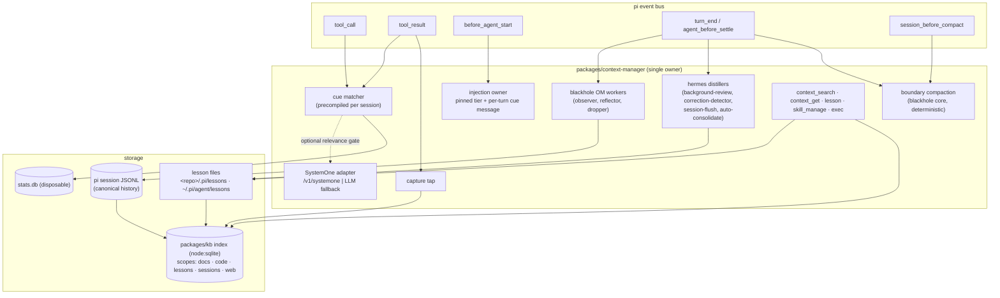

# Design: unify-context-manager

## Context

See `proposal.md` (Why) and `docs/research/unified-context-manager-exploration.md`
for the measurements referenced below.

State today (pi 0.87.1, this host):

| Plane | License | LOC | Engine | Hooks it owns |
|---|---|---:|---|---|
| pi-hermes-memory 0.9.9 | MIT | ~17.0k | better-sqlite3 | before_agent_start, message_end, session_before_compact, turn_end, tool_result, resources_discover |
| pi-blackhole 0.5.6 | MIT | ~32.7k | JSONL `custom` entries | context, session_before_compact, turn_end, agent_start/end, `AgentSession.compact` monkeypatch |
| context-mode 1.0.169 | Elastic-2.0 | compiled only | better-sqlite3 + MCP child | tool_call, tool_result, before_agent_start, context, session_before_compact, turn_end, before_provider_response |
| kb + kb-extension | ours | ~8.1k | node:sqlite | before_agent_start, tool_call, tool_result, turn_start |

Constraints:
- pi dispatches handlers in load order. `before_agent_start` replacing
  `systemPrompt` invalidates the prompt cache, and hermes, context-mode and kb all
  do this today.
- pi 0.87 added actionable `turn_end` / `agent_before_settle` boundaries that
  accept `CompactionEntryDraft`, `CustomMessageEntryDraft` and
  `ContextEditEntryDraft` entries plus `continue: true`. It also exports
  `findCutPoint`, `shouldCompact` and `estimateTokens`, but not
  `prepareCompaction`.
- Subagent fan-out is already bounded by `maxConcurrentSubagents` (default 2),
  the admission gate in `packages/extension/src/subagent-fanout-admission.ts`,
  and the heap coupling in `packages/shared/src/heap-limits.ts`.

## Goals / Non-Goals

**Goals**
- Exactly one extension subscribes to each context-relevant pi hook.
- Five model-facing tools and one per-turn injection block, with the pinned tier
  kept byte-stable.
- One index engine (node:sqlite via `packages/kb`) and no native SQLite addon.
- Lessons reach the model when their situation recurs, not when the model
  remembers to search.
- Existing knowledge is importable, but only through triage and review.

**Non-Goals**
- Porting or vendoring any context-mode source.
- Merging the hermes and blackhole distillation pipelines (an explicit user
  decision; they stay separate inside the package).
- Deleting existing hermes, blackhole or context-mode stores.
- Replacing pi-web-access's fetching and extraction.
- Making System-1 models a default dependency.

## Architecture

## Decisions

### D1: Fork hermes + blackhole; clean-room only for context-mode
**Why:** Both are MIT. Owning the code removes the "shim over a pre-1.0
third-party store" risk that dominated the predecessor design (its D3).
context-mode is Elastic-2.0, compiled-only, and its useful 97% is the sandbox,
whose behaviour is small enough to re-specify.

**How:**
- Upstream copyright notices are kept in `packages/context-manager/NOTICE`.
- Each forked module carries a header naming its upstream path and version.
- Dropped at fork time: `pi-base/settings` + config (~8.2k), `changelog/`, TUI
  commands, `extension-root-migration.ts`, `project-memory-migration.ts`.

**Alternatives:**
- Keep wrapping (predecessor): rejected, the shim stays forever.
- Upstream PRs: still pursued opportunistically, but not on the critical path.

### D2: One owner per hook; the pinned tier is byte-stable
- The injection owner uses `systemPromptOptions` sections. The pinned block
  (≤ ~2 KB: standing preferences, `kind: preference` + `delivery: pinned`)
  changes only when a pinned lesson changes, which keeps the provider prompt
  cache warm.
- Everything per-turn goes into a `before_agent_start` `message`, never into
  `systemPrompt`.

**Alternative:** per-turn `systemPrompt` rewrite (today's behaviour). Rejected:
it busts the cache every turn.

### D3: Compaction on the boundary API; the monkeypatch is retired
- On `turn_end` / `agent_before_settle`, when `shouldCompact` holds and no tool
  call is unpaired, the handler computes blackhole's deterministic summary. It
  picks `firstKeptEntryId` via `findCutPoint` and returns
  `{ entries: [...event.entries, CompactionEntryDraft], continue: true }`.
- A continuation guard prevents loops: at most one compaction per boundary, and
  none when the previous boundary already compacted.
- `session_before_compact` (manual and overflow compaction) returns the same
  deterministic summary as `compaction`.
- blackhole's existing `projectAppendOnlyContext` replay moves to the `context`
  hook, which is now owned solely by the manager.

**Alternative:** keep `om/inline-compaction.ts` (it recognises the pi 0.81/0.84
shapes and fails closed). Rejected: a private-API patch whose job pi 0.87 now
does publicly.

**Consequence:** the pi peer floor becomes 0.87.0.

### D4: Lessons are files; the index and stats can be rebuilt
Lesson files:
- Path: `<id>.md`.
- Frontmatter: `id, kind (preference|convention|gotcha|failure-fix|guard),
  scope (global|project), card (≤200 ch), severity (hint|warn|block),
  delivery (cue|pinned|pull), triggers[], provenance{sessionId, created, source}`.
- Body: the full text.

Locations and identity:
- Project scope lives in `<repo>/.pi/lessons/` (team-shared, reviewed through
  git).
- Global scope lives in `~/.pi/agent/lessons/`.
- Project identity = `git rev-parse --git-common-dir`, falling back to
  `realpath(cwd)`.

Writes and indexing:
- Writes use atomic temp-file + rename per file, so there is no shared-file lock
  and no reconcile step.
- kb indexes lessons through `kb-frontmatter-structural-indexing` (typed
  filters on kind/scope/severity).
- `stats.db` holds `fired`, `lastFired` and `followed` only, and is safe to
  delete.

**Alternatives:**
- L1, SQLite as canonical: not diffable or shareable.
- L3, an append-only JSONL log: append atomicity problems plus stats noise.
- Keeping hermes' monolithic markdown: evidence against it is 80 recovery files,
  a 375-LOC lease coordinator and a reconcile command.

### D5: Cue delivery: vocabulary, channels, firing policy
- **Triggers:** `path(glob)`, `command(pattern)`, `error(pattern)`,
  `tool(name, argPattern?)`, `symbol(name)`, `prompt(terms)`,
  `event(session_start|post_compact|model|before_settle)` and
  `behaviour(grep-without-kb|repeat-failure|reread-after-compact)`.
- **Channels:**
  - A: `tool_result.content` append (default, next to the cause, cache-safe).
  - B: `tool_call` block with a reason (only `severity: block`, and only on
    `command`/`tool` triggers).
  - C: a per-turn `before_agent_start` message (`prompt` triggers).
  - D: a boundary custom message with `continue` (`before_settle` checklists).
  - E: the compaction summary carries still-relevant cards.
- **Firing policy:**
  - silent by default;
  - each lesson fires at most once per session per compaction epoch;
  - at most 2 cards / ~600 chars per turn;
  - matchers are compiled at `session_start`.
  - `behaviour(grep-without-kb)` fires only when the target path is inside an
    indexed root (fixes the observed false positive on third-party
    `node_modules`).
- **Precision guard (from spike 2):** triggers are written explicitly by the
  agent through `lesson`, never derived from prose. A replay validator rejects
  any trigger that would have fired in more than 3% of recent sessions.

### D6: Five tools + deactivated aliases
- **`context_search(query, scope?)`:** runs kb retrieval per scope and fuses
  across scopes with Reciprocal Rank Fusion. The `docs` scope keeps kb's
  current ranking and lanes unchanged.
- **`context_get(ref)`:** covers the section, neighbours, `#N` session expand
  and lesson body.
- **`lesson(action: add|update|retire, …)`:** validates triggers with the replay
  gate and runs the PII/secret scrub before a project-scope write.
- **`skill_manage`:** forked from hermes with a trimmed description.
- **`exec`:** see D7.
- **Old names:** registered and then removed from the active set with
  `pi.setActiveTools`, so calls from stale prompts still resolve. They are
  removed after one release.

### D7: `exec`: a clean-room sandbox
The contract is written from observed behaviour:
- runs code in a language runtime, or runs over a file bound to a variable;
- returns only stdout, capped;
- supports timeout and background detachment;
- `intent` + output above a threshold indexes the output into scope
  `sessions/exec` and returns section titles.

It is implemented on `child_process` with no dependency on context-mode. The
`curl`/HTTP flood guard becomes a `guard` lesson (severity `block`, trigger
`command`), not hard-coded logic. That is the same mechanism the bake-off
showed is missing today (5 of 12 reference lessons were re-hits of that block).

### D8: Web tap
- The manager's `tool_result` handler receives results from `fetch_content`,
  `web_search` and `source_check` (pi-web-access).
- It chunks the extracted markdown into scope `web`, keyed by URL + fetch time.
- The web tool's output is returned to the model unchanged.
- Indexed web content is treated as untrusted: the `add-untrusted-content-guard`
  scanner runs before indexing when present.

### D9: Session index keeps a copy
- One node:sqlite FTS table set stores message text, as the user chose, for
  speed.
- It is fed incrementally from pi JSONL and lives in the shared index DB.
- It replaces hermes' better-sqlite3 `sessions.db`, which is left on disk,
  unread after cutover.

### D10: The lesson miner
- **Stage 1 (deterministic):** `packages/session-distiller` `run()` with
  `--n 2` default. Windows are rendered compactly (≤ ~1k tokens: the failing
  call, the error head, the fixing call, and the user's correction).
- **Triage:** `SystemOne.predict` (D11) over the steps `is_lesson`, `kind`,
  `scope`, `cue` (a choice over deterministically extracted candidates),
  `sensitive` and `same_as`. Each step is routed separately (D11 routing).
- **Cascade:** `is_lesson` runs first. `kind`, `scope`, `cue` and `sensitive`
  run only on windows that pass its threshold. `same_as` runs only on accepted
  cards. Steps routed to the same backend are batched into one call per
  window, so latency scales with the number of distinct backends, not steps.
- **Card writing:** parallel subagents admitted by `maxConcurrentSubagents`,
  each handling a batch of about 20 windows. Card writing and verify each have
  their own model setting, separate from triage.
- **Gates:**
  - the trigger replay gate;
  - semantic dedupe (BM25 candidate pairs → `same_as` decision);
  - PII/secret scrub;
  - verify (tool-using subagents on the shortlist, asking whether the lesson
    is still true).
- **Output:**
  - staged files;
  - auto-accept above a confidence threshold, review the rest in the plugin;
  - every triage decision and review outcome is appended to a labelled dataset
    (`~/.pi/agent/context/triage-labels.jsonl`), one record per step, carrying
    the step, the backend and pinned model version that answered it, the
    answer distribution and confidence, and the later review outcome. This
    allows per-step comparison of backends, so one step can move to System-1
    once it measures well enough.

`/lessons import-hermes` feeds the 812 existing entries through the same
triage. Status-type entries are archived to the `sessions` scope instead of
becoming lessons.

### D11: The System-1 adapter
- Interface: `SystemOne.predict(state, questions)` with the `choice`, `score`
  and `noul` primitives.
- Implementations:
  - HTTP `/v1/systemone`, covering a remote endpoint or a dashboard-managed
    local server (Von or Laya via uv or Docker, on a port other than 8000);
  - in-process `laya-ts`;
  - `LlmSystemOne`, which asks the selected LLM for the same structured answers.
- **Fallback rule:** no System-1 endpoint configured → `LlmSystemOne`. This is
  a configuration switch, not a per-item one. It applies per step (below).
- **Per-step routing:** each triage step has its own route: an LLM model, a
  System-1 endpoint + model, or a deterministic rule optionally followed by a
  model (e.g. `sensitive`: PII regex first). Each step has its own threshold.
  The bake-off supports this; no single backend won every step:
  - `is_lesson`: LLM 0.95 AUC vs best System-1 0.71;
  - `kind`: LLM 0.54 vs Laya 0.20;
  - `scope` on real lessons: Laya 0.92 vs LLM 0.58 (only 12 lessons, weak);
  - `cue` on real lessons: LLM 0.92 vs Laya 0.58;
  - `sensitive` and `same_as`: unmeasured.
- **Step-level fallback:** a step with no route uses the default triage LLM
  (`LlmSystemOne`). Decided by configuration, never per item. With nothing
  configured, every step runs on the default LLM.
- **Settings UI:** one primary + fallback chain per step, reusing the
  blackhole `ChainEditor` pattern (`blackhole-model-picker-chains`); defaults
  keep everything on one LLM.
- **Query shape:** System-1 backends are queried with decomposed, observable
  atomic `noul`s (with `true`/`false` descriptions) over a structured JSON
  state, never one abstract judgement. The method study measured this:
  - Von: 0.43 → 0.71 AUC zero-shot with decomposition.
  - Laya: 0.62 → 0.71 with structure plus the `typed-decisions` checkpoint.
  - Aggregation weights stay in code. A logistic regression over the atomic
    answers is re-evaluated once the labelled dataset holds enough positives;
    at n=50 it overfit, and at n=78 it still did not win.
- **Question type per step:** `noul` (default), `atomic nouls`, or `score`.
  A `score` question must use anchored, observable levels (e.g. 1 routine step
  ... 4 tool quirk / guard block / project rule, 5 standing user rule); an
  unanchored "how reusable, 1–5" scale is rejected. The score-primitive study
  (78 windows) measured:
  - generic score: 0.41–0.44 AUC on every backend, worse than random;
  - anchored score: Von 0.71 via P(level ≥ 3), tying 11 atomic nouls
    (0.70) at ~50 ms instead of ~470 ms; Laya 0.51–0.55 and Laya
    typed-decisions 0.57–0.64, both below their best `noul` (Laya
    typed-decisions abstract `noul` 0.785);
  - LLM: probability 0.945 vs anchored level 0.921.
  Prefilter verdict unchanged: at recall ≥ 0.9 the best System-1 setup keeps
  55–57 of 78 windows, the LLM 34.
- **Bake-off (50 windows, reference `claude-opus-5`):** `is_lesson` AUC was
  Von 0.425, Laya 0.616 and LLM 0.951. At recall ≥ 0.9, Von and Laya keep 45–50
  of 50 windows, so they cannot pre-filter. The System-1 tier is therefore
  opt-in, with two intended uses:
  - after fine-tuning on the D10 labelled dataset;
  - as the runtime cue relevance gate (one `noul` per matched trigger, ~55 ms
    for 1 question on MPS), whose accuracy is still unmeasured.

### D12: A single dashboard plugin
- `packages/context-manager-plugin` merges the settings of hermes-memory-plugin,
  blackhole-plugin and kb-plugin into one settings section.
- It adds a lessons browser and review queue, miner jobs, the System-1
  configuration (mode, URL/key, managed install status) and a store-hygiene
  view that is read-only for the old stores.

## Risks / Trade-offs

| Risk | Mitigation |
|---|---|
| We own ~30k forked LOC | Drop the ~12k listed in D1. Behavioural tests replace the dropped upstream CI. Each forked module carries its upstream header so fixes can be cherry-picked. |
| Tool rename breaks prompts, skills and doctrine | Aliases stay registered-but-inactive for one release. The doctrine update is part of the cutover phase. |
| Cue false positives teach the model to ignore cards | Explicit triggers, the replay gate (df ≤ 3%), per-lesson `followed` precision with automatic demotion, strict budgets and a silent default. |
| Lesson files in the repo and web content as a prompt-injection path | Lesson writes go through `lesson` and PR review. Cards are length-capped and delivered in delimited blocks. Web content passes the untrusted-content scanner before indexing. `security-hardening` is applied per phase. |
| The matcher adds hot-path latency to every tool call | Globs and regexes are precompiled. The budget is measured in the lessons phase (`performance-optimization`). The System-1 relevance gate runs only after a trigger has matched. |
| The boundary API is new (pi 0.87) | Pin the floor. Contract tests against a real `AgentSession` with a fake provider cover compaction, continuation and cancellation. |
| Mid-migration double ownership (old packages still installed) | The manager detects the old packages at `session_start` and refuses to register the overlapping hooks, with a clear message, until they are removed. |
| Team-shared lessons leak personal data | A PII/secret scrub gates writes to project scope. The miner's `sensitive` check is only advisory. |
| System-1 expectations are too high | Opt-in only. The bake-off numbers are documented in D11. |

## Migration Plan

1. Phases 1–5 ship behind a `contextManager.enabled` flag. While it is off, the
   package registers nothing. While it is on and the old packages are present,
   the overlap refusal from Risks applies.
2. The operator runs `/lessons import-hermes` and `/lessons mine --project` in
   dry-run, reviews the staged lessons and accepts them.
3. Cutover (phase 6):
   - remove `npm:pi-hermes-memory`, `npm:pi-blackhole` and `npm:context-mode`
     from `~/.pi/agent/settings.json` (a dashboard action with confirmation);
   - enable the manager;
   - reload the sessions.
4. **Rollback:** reinstall the three packages and disable the flag. No old store
   was modified. Lesson files and the new index stay on disk, inert.
5. After one release, the aliases are removed and the old stores can be
   offered for operator-initiated deletion (dry-run first).

## Open Questions

- The label volume needed before a fine-tuned Laya/Von is worth re-testing
  against the LLM baseline. This doesn't change the architecture.
- Jev evaluation needs a TypeSafe key. It is an optional backend behind the
  same adapter.
- Tuning the MAP card-writing prompt and batch size. A quality spike is
  planned before phase 5.
- Precision of `prompt` triggers for USER-style preferences. The spike is
  planned inside phase 3.
